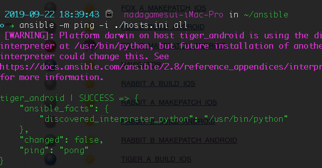
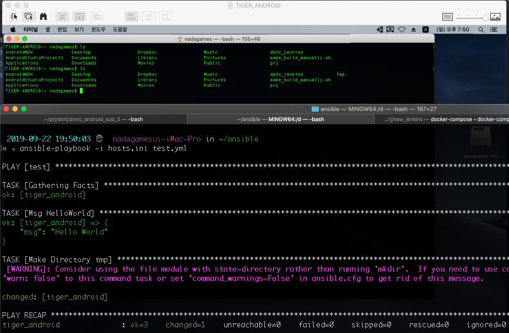

## What is Ansible

* python
* SSH 이용 ( agent 프로그램 불필요 )

## How To Install

* 이하 관리하려는 머신을 `Host`, 관리 당하는 대상을 `Client`라 칭함
* `Host` 에서 `pip install ansible`을 이용해서 `Ansible` 설치
    > Mac에서 설치 할 땐 `sudo pip install ansible`
*  `Client`는 `Host`에서 `SSH Public Key`를 가져와야 한다.
    * 일반적으로 $HOME/.ssh/id_rsa.pub 인데, 만약 없다면 `Host`에서 다음 커맨드를 이용해서 생성하자. `ssh-keygen -t rsa -b 2048`
    * `Host`에서 공개키를 `Client`에 전송, 2개의 커맨드중 사용할 수 있는 것으로 수행
        1. ssh-copy-id -i ~/.ssh/id_rsa.pub remote-host
        2. scp  id_rsa.pub myid@remote-host:/home/myid/
    * `Client`에선 다음 커맨드들을 수행해서 등록해주자.
        * cat id_rsa.pub >> ~/.ssh/authorized_keys
        * chmod 700 ~/.ssh
        * chmod 600 ~/.ssh/authorized_keys
* 연결확인
    * `Host`의 루트에 `ansible` 폴더를 만들고 이하에 `hosts.ini` 파일을 생성하고 내용을 다음과 같이 넣는다.
        *  tiger_android ansible_host=192.168.0.187 ansible_user=nadagames
        * `ansible_host`: `Client`의 IP주소
        * `ansible_user`: `Client`의 유저 계정 이름
    * `ansible -m ping -i ./hosts.ini all` 커맨드로 확인
        
        > !! `Dog(Windows)`에서도 해봤지만 계속 연결 실패가 나왔음

## Components

* `Ansible`에는 `inventory`, `playbook`, `module` 의 구성으로 되어 있고, 각각(1) 어디서, (2) 무엇을, (3) 어떻게 수행할지를 정의한다. 

* `Inventory`는 `Ansible`에 의해 제어되어 Infrastructure as a Code의 대상이 될 `Client`들의 목록을 정의하는 파일이다. 위에서 작성했던 `hosts.ini` 파일이 바로 `Inventory`이다. 
    * 하나의 `Client`를 추가 할 땐 다음과 같은 형식으로 추가 한다. 자세한건 [메뉴얼](https://docs.ansible.com/ansible/latest/user_guide/intro_inventory.html) 을 참조
        ```
        [name] ansible_host=[ip] ansible_user:[accountname] [etc]
        ```
    * `Client`들을 그룹화 하는것도 가능 하다.
        ```
        tiger_android ansible_host=192.168.0.187 ansible_user=nadagames
        tiger_ios ansible_host=192.168.0.147 ansible_user=nadagames
        dog ansible_host=192.168.0.210 ansible_user=nadagames

        [tiger]
        tiger_android
        tiger_ios
        [windows]
        dog
        ```
* `Playbook`은 `yaml` 포맷으로 되어 있는 파일로서, `Inventory`에 정의된 `Client`에서 무엇을 할지를 정의한다. `Inventory`를 통해 어디에서 작업을 수행할지를 명시하고, `Playbook`을 통해 무엇을 할지를 정의한다. 
    ```yaml
    #test.yml
    - name: test
      hosts: all 
      tasks:
        - name: Msg HelloWorld
        debug: 
            msg: "Hello World"
        - name: Make Directory tmp
        command: mkdir tmp
    ```
    * `name`은 현재 `playbook`의 이름
    * `hosts`는 `playbook`을 수행할 `inventory`에 있는 `Client`에 대한 설정
        * 만약 `all`로 하면, 모든 `Client`에 대해서 수행 하겠다는 의미.
        * 각 `Client` 들의 이름을 입력 할 수도 있고, `Group`을 넣는것도 가능
            > hosts: tiger_android, hosts: tiger
    * `tasks`는 수행 할 작업 `module` 들의 모음이다.
        * `name`은 현재 `task`의 이름
        * `module`은 작업을 어떻게 수행할지를 의미 한다. 사용할 수 있는 `module`리스트는 [메뉴얼](https://docs.ansible.com/ansible/latest/modules/modules_by_category.html)을 참조
            * `debug`는 특수 `module`이다.
            * `command`는 명령어 입력을 위한 `module`이다.
    * 위 예제 `playbook`을 실행 시키기 위해서 다음과 같은 명령어를 입력한다.
        `ansible-playbook -i hosts.ini test.yml`
        


    


