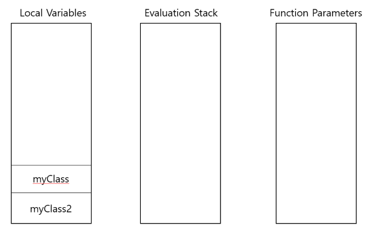
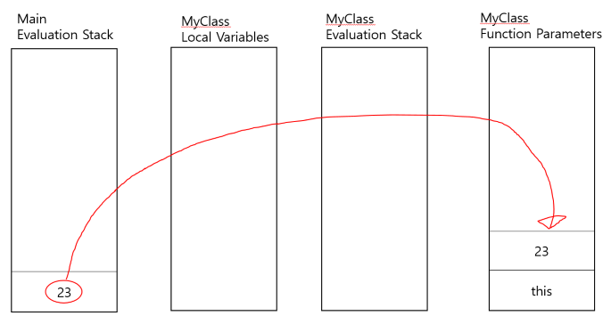
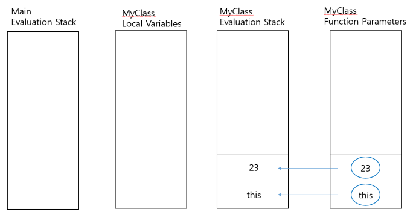
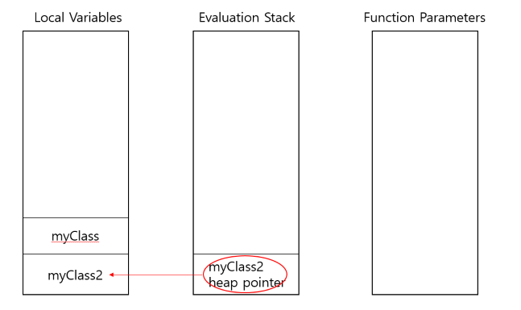
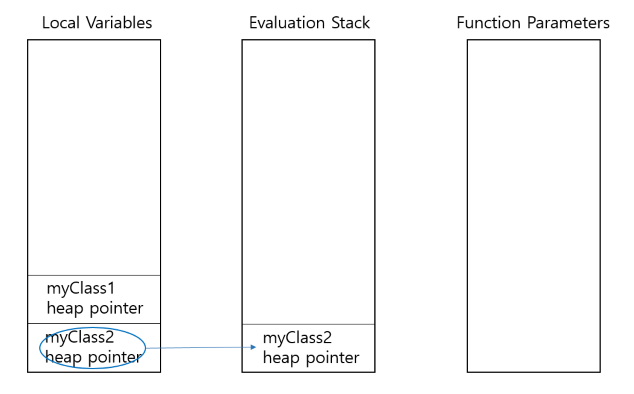
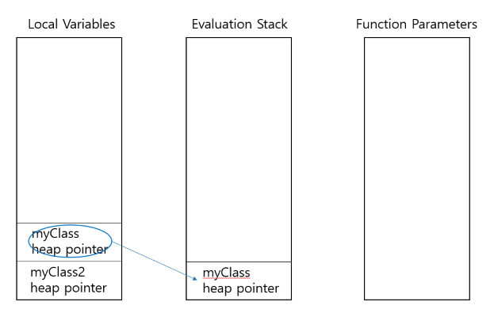
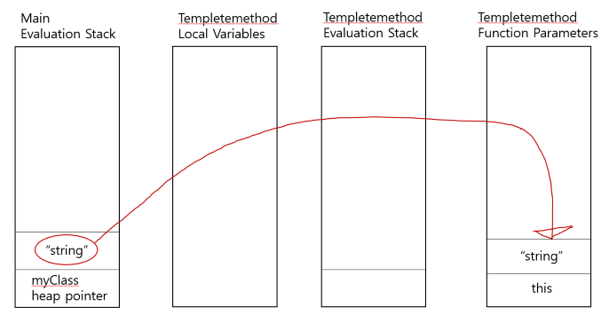
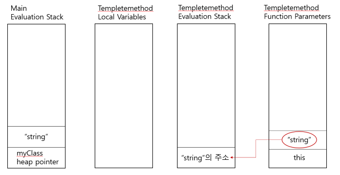

# Architecture of Common Language Runtime

* .NET Framework의 CLR : C#, F#, Visual Basic .NET 등 다양한 언어의 프로그램 실행을 처리하는 virtual machine 구성요소
* 메모리 관리, 보안 처리, 예외 처리, 가비지 컬렉션, 쓰레드 관리 같은 다양한 서비스 제공
* CLR은 VES를 구현함
* VES(Virtual Execution System) : 관리되는 코드를 실행하기 위한 환경을 제공하는 CLI(Common Language Infrastructure) 의 런타임 시스템
  * CIL 명령어 세트를 실행하는 데 필요한 자원을 제공
* CIL을 기계어로 변환하는 실행 환경
  


## Architecture of CLR


* `Base Class Library Support` : 여러 .NET 프로그래밍 언어에 대한 기본 클래스 라이브러리 지원
  * ex) Collections, I/O, XML, DataType definitions 등
  * System.Ojbect, System.Math*
* `Thread Support` : 멀티 쓰레드 프로그래밍을 관리하기 위한 쓰레드 지원
  * System.Threading 클래스는 기본 클래스로 사용됨
* `COM Marshaller` : COM 응용 프로그램의 COM 구성 요소와의 통신은 COM Marshaller를 사용하여 제공
  * COM(Component Object Model) : MS가 개발한 소프트웨어 구성 요소들의 응용 프로그램 이진 인터페이스
  * 마셜링(Marshalling) : 객체의 메모리 구조를 저장이나 전송을 위해서 적당한 자료형태로 변형
* `Type Checker` : Common Type System(CTS)와 Common Language Specification(CLS)를 사용하여 타입 체크
  * 타입 안정성을 담당
  * CTS : 상호운용성을 위한 데이터의 기본적인 특징 정의, .NET 언어가 지원해야 할 타입과 연산자 집합
    * value type / reference type
  * CLS : 모든 .NET 언어가 최소한 지원해야 할 CTS 부분 집합
* `Exception Manager` : 예외를 만든 .NET 언어에 관계 없이 예외를 처리
  * 특정 응용 프로그램의 경우 catch 블록이 발생하면 실행되고 없으면 응용프로그램 종료
* `Security Engine` : 코드, 폴더, 컴퓨터 레벨 등 다양한 레벨에서 보안 사용 권한 처리
  * 하드디스크 ,IL 코드의 리소스 접근 제한
* `Debug Engine` : 디버그 엔진을 사용하여 런타임 중에 디버깅 할 수 있음
  * ICorDebug 인터페이스 : 디버깅 되는 응용 프로그램의 코드를 추적하는데 사용됨
* `JIT Compiler` : Microsoft Intermediate Language(MSIL)를 JIT 컴파일러가 실행되는 환경에 특정한 컴퓨터 코드로 변환
  * 컴파일된 MSIL은 필요할 경우 나중을 위해 저장
* `Code Manager` : .NET Framework에서 개발된 코드를 관리
  * IL code 는 `Managed code`라고도 함, CLR은 이 코드를 관리함
  * 프로그램 실행동안 코드를 관리, 객체의 메모리 할당
  * 코드는 언어별 컴파일러에 의해 중간 언어로 변환된 다음 JIT 컴파일러에 의해 기계어 코드로 변환
* `Garbage Collector` : 가비지 콜렉터를 사용하여 자동으로 메모리 관리
* `CLR Loader` : 모듈, 리소스, 어셈블리 등이 CLR 로더에 의해 로드됨
  * 초기화 시간이 더 빨라지도록, 소비되는 리소스가 적어지도록 로더는 실제로 필요한 경우 필요에 따라 모듈을 로드함

* .NET 에서는 function parameters와 local variables의 메모리가 스택과 분리되어 있음
  * parameter나 variable을 사용하기 위해선 evaluation stack으로 값을 로드해야함
* * *
```cs
namespace ConsoleApp1 {
    public class Program {
        public static void Main(string[] args) {
            var myClass2 = new MyClass(23);
            MyClass myClass = new MyClass();

            myClass2.Method();
            myClass.Method();

            myClass.TempleteMethod("string");
            myClass.TempleteMethod(16);
        }
    }

    class MyClass {
        public MyClass() {
            Console.WriteLine("default");
        }

        public MyClass(int a) {
            Console.WriteLine(a);
        }

        public void Method() {
            Console.WriteLine("Hello");
        }

        public void TempleteMethod<T>(T val) {
            Console.WriteLine(val.ToString());
        }
    }
}
```

```
.namespace ConsoleApp1
{
  .class public auto ansi beforefieldinit Program
  	extends [mscorlib]System.Object
  {

    // method line 1
    .method public static hidebysig 
           default void Main (string[] args)  cil managed 
    {
        // Method begins at RVA 0x2050
	.entrypoint
	// Code size 51 (0x33)
	.maxstack 2
	.locals init (
		class ConsoleApp1.MyClass	V_0,
		class ConsoleApp1.MyClass	V_1)
	IL_0000:  nop 
	IL_0001:  ldc.i4.s 0x17
	IL_0003:  newobj instance void class ConsoleApp1.MyClass::'.ctor'(int32)
	IL_0008:  stloc.0 
	IL_0009:  newobj instance void class ConsoleApp1.MyClass::'.ctor'()
	IL_000e:  stloc.1 
	IL_000f:  ldloc.0 
	IL_0010:  callvirt instance void class ConsoleApp1.MyClass::Method()
	IL_0015:  nop 
	IL_0016:  ldloc.1 
	IL_0017:  callvirt instance void class ConsoleApp1.MyClass::Method()
	IL_001c:  nop 
	IL_001d:  ldloc.1 
	IL_001e:  ldstr "string"
	IL_0023:  callvirt instance void class ConsoleApp1.MyClass::TempleteMethod<string> (!!0)
	IL_0028:  nop 
	IL_0029:  ldloc.1 
	IL_002a:  ldc.i4.s 0x10
	IL_002c:  callvirt instance void class ConsoleApp1.MyClass::TempleteMethod<int32> (!!0)
	IL_0031:  nop 
	IL_0032:  ret 
    } // end of method Program::Main

    // method line 2
    .method public hidebysig specialname rtspecialname 
           instance default void '.ctor' ()  cil managed 
    {
        // Method begins at RVA 0x208f
	// Code size 8 (0x8)
	.maxstack 8
	IL_0000:  ldarg.0 
	IL_0001:  call instance void object::'.ctor'()
	IL_0006:  nop 
	IL_0007:  ret 
    } // end of method Program::.ctor

  } // end of class ConsoleApp1.Program
}

.namespace ConsoleApp1
{
  .class private auto ansi beforefieldinit MyClass
  	extends [mscorlib]System.Object
  {

    // method line 3
    .method public hidebysig specialname rtspecialname 
           instance default void '.ctor' ()  cil managed 
    {
        // Method begins at RVA 0x2098
	// Code size 20 (0x14)
	.maxstack 8
	IL_0000:  ldarg.0 
	IL_0001:  call instance void object::'.ctor'()
	IL_0006:  nop 
	IL_0007:  nop 
	IL_0008:  ldstr "default"
	IL_000d:  call void class [mscorlib]System.Console::WriteLine(string)
	IL_0012:  nop 
	IL_0013:  ret 
    } // end of method MyClass::.ctor

    // method line 4
    .method public hidebysig specialname rtspecialname 
           instance default void '.ctor' (int32 a)  cil managed 
    {
        // Method begins at RVA 0x20ad
	// Code size 16 (0x10)
	.maxstack 8
	IL_0000:  ldarg.0 
	IL_0001:  call instance void object::'.ctor'()
	IL_0006:  nop 
	IL_0007:  nop 
	IL_0008:  ldarg.1 
	IL_0009:  call void class [mscorlib]System.Console::WriteLine(int32)
	IL_000e:  nop 
	IL_000f:  ret 
    } // end of method MyClass::.ctor

    // method line 5
    .method public hidebysig 
           instance default void Method ()  cil managed 
    {
        // Method begins at RVA 0x20be
	// Code size 13 (0xd)
	.maxstack 8
	IL_0000:  nop 
	IL_0001:  ldstr "Hello"
	IL_0006:  call void class [mscorlib]System.Console::WriteLine(string)
	IL_000b:  nop 
	IL_000c:  ret 
    } // end of method MyClass::Method

    // method line 6
    .method public hidebysig 
           instance default void TempleteMethod<T> (!!T val)  cil managed 
    {
        // Method begins at RVA 0x20cc
	// Code size 21 (0x15)
	.maxstack 8
	IL_0000:  nop 
	IL_0001:  ldarga.s 1
	IL_0003:  constrained. !!0
	IL_0009:  callvirt instance string object::ToString()
	IL_000e:  call void class [mscorlib]System.Console::WriteLine(string)
	IL_0013:  nop 
	IL_0014:  ret 
    } // end of method MyClass::TempleteMethod

  } // end of class ConsoleApp1.MyClass
}
```
* 초기 상태



```
var myClass2 = new MyClass(23);

[Main]
  IL_0001:  ldc.i4.s 0x17
  IL_0003:  newobj instance void class ConsoleApp1.MyClass::'.ctor'(int32)

[MyClass]
  IL_0000:  ldarg.0 
  IL_0001:  call instance void object::'.ctor'()
  IL_0006:  nop 
  IL_0007:  nop 
  IL_0008:  ldarg.1 
  IL_0009:  call void class [mscorlib]System.Console::WriteLine(int32)
  IL_000e:  nop 
  IL_000f:  ret 
```







```
myClass2.Method();
myClass.Method();

[Main]
  IL_000e:  stloc.1 
  IL_000f:  ldloc.0 
  IL_0010:  callvirt instance void class ConsoleApp1.MyClass::Method()
  IL_0015:  nop 
  IL_0016:  ldloc.1 
  IL_0017:  callvirt instance void class ConsoleApp1.MyClass::Method()
```




```
myClass.TempleteMethod("string");

[Main]
  IL_001d:  ldloc.1 
  IL_001e:  ldstr "string"
  IL_0023:  callvirt instance void class ConsoleApp1.MyClass::TempleteMethod<string> (!!0)

[TempleteMethod]
  IL_0000:  nop 
  IL_0001:  ldarga.s 1
  IL_0003:  constrained. !!0
  IL_0009:  callvirt instance string object::ToString()
  IL_000e:  call void class [mscorlib]System.Console::WriteLine(string)
  IL_0013:  nop 
  IL_0014:  ret 
```




### 명령어 설명

* `.method` : 메소드 정의의 시작
* `.entrypoint` : 응용프로그램의 시작점임을 알림
* `.maxstack` : 메서드가 사용할 스택 슬롯의 수
* `.locals` : 변수 선언, init은 변수가 해당 유형의 기본값으로 초기화되어야한다고 지정
* `newobj` : 초기화되지 않은 객체를 할당하고 ctor 호출
  * 새 개체에 대한 참조를 스택으로 푸시
* `ldloc` : 로컬 변수 값을 스택에 복사
  * `ldloc.(idx)` : 로컬변수 (idx) 를 스택에 복사
* `stloc` : 스택에서 값을 빼서 로컬 변수에 넣음
  * `stloc.(idx)` : 스택에서 빼서 로컬변수 (idx) 에 넣음
* `ldarg` : argument를 스택에 푸시
  * `ldarg.(num)` : num 번째 인수를 스택에 푸시
* `ldarga` : 인수의 주소를 가져옴

* `.ctor()` : 생성자

* `ldstr` : 문자열을 스택에 푸시
* `ldc.<type>` : 숫자 상수를 스택에 푸시
  * `ldc.i4.8` : int32로써 8을 스택에 푸시
* `call` : static 메서드 호출
* `callvirt` : virtual and instance 메서드 호출

* [mscorlib]System.Console : `mscorlib`어셈블리에 선언된 System.Console

* `ret` : 호출자에게 실행을 반환, entry point method의 경우 응용 프로그램 끝냄