## 코드서명

* 파일의 무결성을 검증하고 서명자(개발자)를 확인하는 역할을 함
* `code signature 구조체` : iOS 바이너리 파일의 무결성을 검증하고 서명자를 확인하는 작업에 이용

## iOS 코드 서명

* Apple 앱스토어에서 설치한 앱이나 테스트하기 위해 별도로 빌드한 앱은 코드 서명을 해야 iOS 기기에서 실행 가능
* 코드 서명은 Apple에서 발급한 인증서로 진행되어야함
* Apple의 인증서가 아닌 Apple이 발급한 `개발자 인증서`로 코드 서명한 앱을 기기에 설치할 때는 `프로비저닝 프로파일(provisioning profile)` 이 반드시 필요
  * 프로비저닝 프로파일에 명시된 기기에 프로비저닝 프로파일을 설치해야 Apple의 인증서로 코드 서명된 앱이 아니더라도 기기에서 실행할 수 있음

## 프로비저닝 프로파일

* 기기에서 앱을 실행하고 특정 서비스를 사용하고자 할 때 사용하는 파일
* Xcode에서 자동 생성하거나 Apple Developer Program에서 생성할 수 있음

## 프로비저닝 프로파일의 내용

* 빌드된 앱(.ipa 파일) 내부에서 찾을 수 있음
* Payload 디렉터리 안에 `embedded.mobileprovision` : 프로비저닝 프로파일
  * ex) Payload/globaldma.app/embedded.mobileprovision
* 명령어로도 확인 가능 : security cms -D -i embedded.mobileprovision
* 인증서, 기기목록, Entitlements항목, 유효 기간 등 명시
* 실행 환경이 프로비저닝 프로파일에 명시된 자격조건과 맞지 않으면 앱 실행 X

* windows에서 확인 : .ipa 파일 압축 풀기

## 인증서

* 프로비저닝 프로파일 내 `DeveloperCertificates`항목에 base64로 인코딩되어 있는 문자열
  
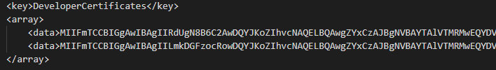

### 인증서 정보 확인

* `openssl` 명령어는 base64로 인코딩된 데이터를 제대로 해석하지 못함
* `openssl` 명령어가 해석할 수 있는 PEM(Privacy-Enhanced Mail) 파일 포맷에 맞추기 위해 해당 문자열을 복사하여 상단에 -----BEGIN CERTIFICATE-----를 추가하고 하단에 -----END CERTIFICATE-----를 추가하여 파일로 저장
* PEM(Privacy-Enhanced Mail) 파일 포맷 : 여러 가지 암호화 기술을 사용함으로써 기밀성과, 메시지의 인증 및 무결성을 유지하는 파일 포맷
  
## Entitlements 

* 어떤 서비스를 사용할 수 있는지에 대한 자격 증명 명시
* `array`는 Xcode 빌드 설정의 `Capabilities`탭에서 무엇을 선택했느냐에 따라 달라짐
  
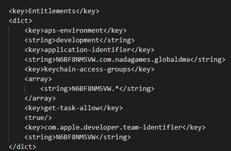

* `aps-environment` : notification push 환경 관련
* `get-task-allow` : `true` = 디버그용 빌드 
  
## 유효기간

* `ExpirationDate`항목에서 확인 가능
* 이 항목에 명시된 유효기간을 지나면 앱 실행X
  
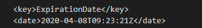

## 기기목록

* `ProvisionedDevices` : 실행가능한 기기 목록 확인 가능
* 앱은 이 목록에 있는 기기에서망 실행 가능
* Ad Hoc등 모든 기기에서 실행 가능한 프로비저닝 프로파일에는 `ProvisionsAllDevices` 항목이 `true`

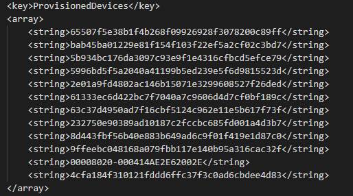

## 바이너리 파일의 무결성 검증

* 서명된 앱의 Mach-O 바이너리 파일에는 코드 서명과 관련된 구조체가 있음
* 이 구조체를 이용하여 Mach-O 바이너리 파일의 무결성 검증

### Mach-O 바이너리 파일

* iOS와 macOS 계열에서 사용하는 실행 파일 포맷
* .ipa 파일 내부에는 Mach-O 바이너리 파일 존재
* Payload 디렉터리 안에 Info.plist 을 열면 `CFBundleExecutable` 항목 확인 가능
  * `CFBundleExecutable` : 앱이 실행될 때 가장 먼저 실행되는 Mach-O 바이너리 파일
  
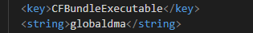

  * ex) Payload/globaldma.app/globaldma

### Mach-O 바이너리 파일 구조

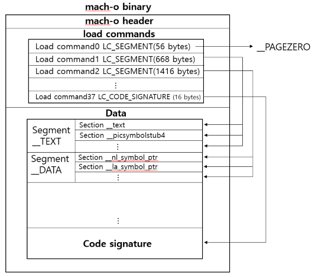

* `LoadCommand` : segment들의 위치, 동적 라이브러리 이름, 심볼 테이블 위치 등 많은 정보가 담겨 있음
  * `LC_CODE_SIGNATURE` : 코드 서명과 관련
* __PAGEZERO : 가상 주소에 있으며 어떤 종류의 보호 기능도 없음, 디스크의 파일에 영역이 없음
* __TEXT : 읽기 또는 실행을 위해서만 액세스 할 수 있는 데이터가 들어 있음
* __DATA : 쓸 수 있는 데이터를 포함
* __LINKEDIT : 동적 연결을 설정하는 데 사용되는 데이터가 들어 있음

### Mach Header

* `Magic Number` : 해당 파일이 Mach-O 인지 아닌지 식별
* `flag` : Mach-O 파일 포맷의 부가 기능들 중 어떤 것을 사용하는지 나타냄

#### LC_CODE_SIGNATURE

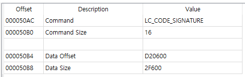

* `data Offset` : 코드 서명 정보와 관련된 구조체 `CodeSignature`의 offset

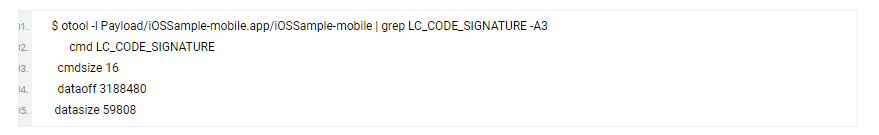

* `otool` 명령어를 통해 `LC_CODE_SIGNATURE`에 대한 정보 얻을 수 있음
* `otool` : 실행파일, 오브젝트파일, 라이브러리 등의 정보를 보여줌
  * `-l` : 로드 커맨드 영역을 표시

#### `CodeSignature` 구조체 설명

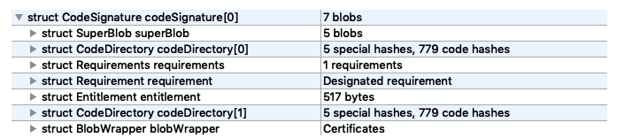

* `CodeDirectory` : 특정 파일과 실행 바이너리 파일 조각들의 해시값이 담겨 있음
  
  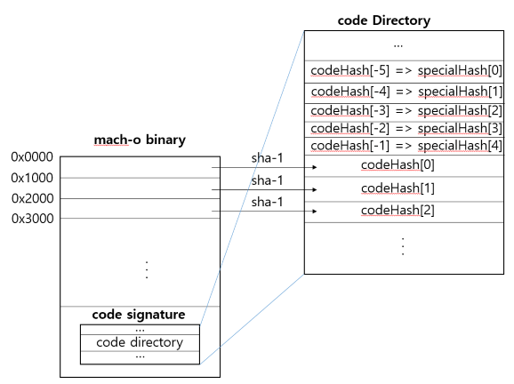

  * `codeHash` : 바이너리 파일을 pageSize(0x1000) 만큼 나눈 부분들에 대한 해시값
    * 코드를 수정하면 수정한 코드가 포함된 페이지의 해시값이 달라짐
    * `codeHash`에 저장되어 있는 값과 다르기 때문에 코드가 수정됨을 알 수 있음
  
  * `specialHash` 종류

  |index|contains|
  |---|:---|
  |0|Entitlement(bound in code signature)|
  |1|Application specific(largely unused)|
  |2|Resource Directory(_CodeResources)|
  |3|Internal requirements|
  |4|Bound Info.plist(Manifest)|

* `shasum` 명령어를 사용해 파일의 sha-1 해시값 확인 가능
  * ex) Entitlement 항목을 전부 복사해 따로 파일에 저장(entitlement.txt)
  * shasum entitlement.txt
    * specialHash[0]값과 비교

* Entitlement : CodeSignature 구조체 안에서 찾을 수 있음
* Applcation Specific : 아직 사용되지 않음
* Resource Directory : ipa 내 _CodeSignature/CodeResources 파일을 가리킴
* Internal requirements : 파일 내에 존재하는 `Requirements` 부분
  * `Requirement` : 코드 서명을 검증하기 위한 규칙을 나타냄
  * ex) `requirement`를 통해 앱 내에서 사용하는 모든 플러그인이 애플의 서명을 얻었는지 확인하는 절차를 거칠 수 있음
  
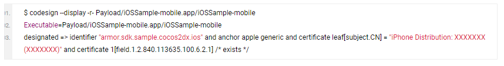

* `codesign` : 코드 서명을 작성, 확인 및 표시에 사용
  * `--display` : 주어진 경로에 대한 정보 표시
  * `-r-` : 표준 출력
* Bound Info.plist : .app 디렉터리 내 `Info.plist`파일
  * `Info.plist` : 앱 이름, 앱 버전, 앱 아이콘 파일 경로 등 앱에 대한 기본 정보 포함
  
### BlobWrapper

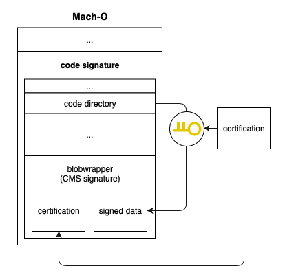

* `BlobWrapper` 안에는 CMS(Cryptographic Message Syntax)서명이 있음
* `CodeDirectory`를 서명한 데이터와 데이터를 서명한 인증서를 포함하고 있음
* `CodeDirectory`의 내용을 변경하면 동일한 인증서로 다시 서명해도 CMS 서명이 달라짐
* 코드를 변경한 후 `CodeDirectory`의 내용을 변경된 코드에 맞춰서 수정해도 CMS 데이터는 키를 가지고 있는 서명자 이외에는 변경할 수 없음
* CMS 서명을 검증하면 앱의 무결성 보장

### 전자 서명의 검증

* 전자 서명 : 암호화된 해시 + 인증서
* 앱의 코드와 데이터 -> 해시1
* 인증서에 있는 공개키를 사용해 암호화된 해시를 해독 -> 해시2
* 해시 1과 2를 비교하여 검증

