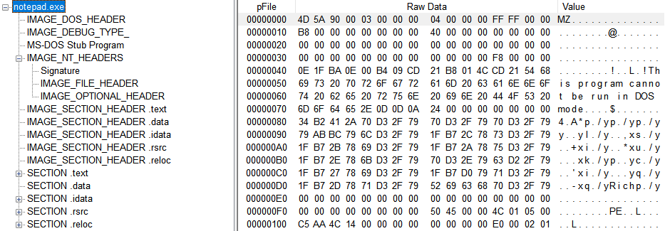
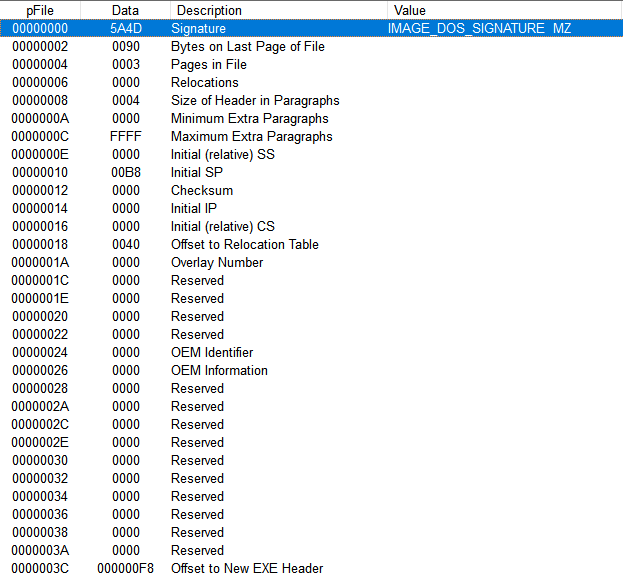
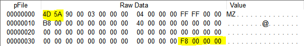
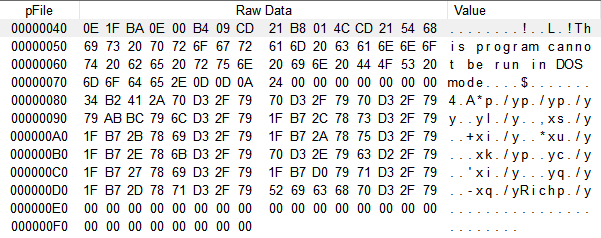
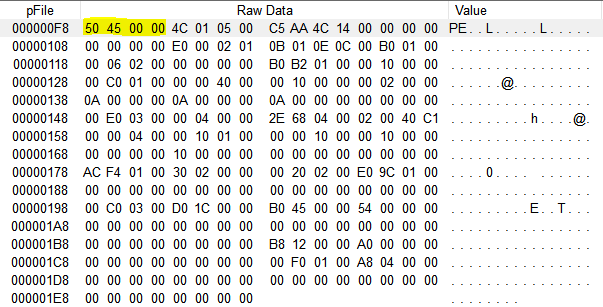
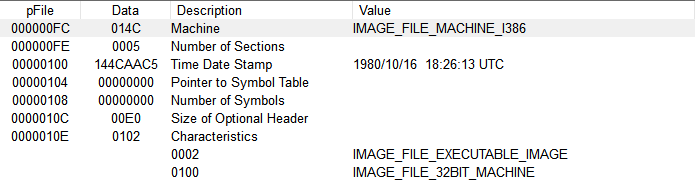
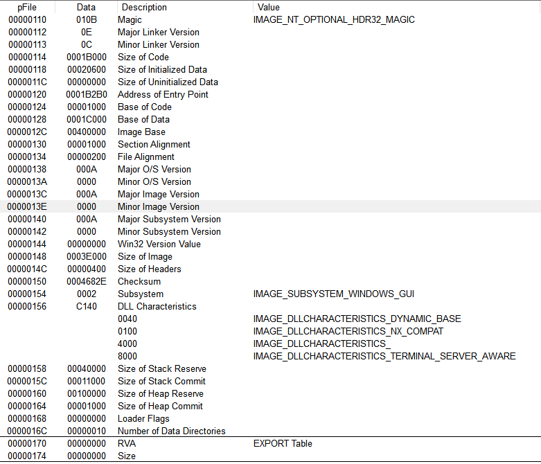
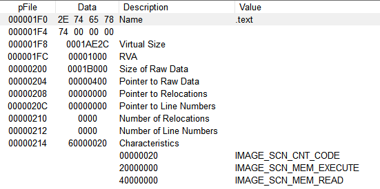

# PortableExecutable

+ `하나의 실행파일을 다양한 운영체제에서 실행할 수 있다는 의미`로 ‘이식 가능한 실행파일(PE)’라는 이름이 붙었다.

## 전체 구조



### 1. IMAGE_DOS_HEADER



```c
[구조체]

typedef struct _IMAGE_DOS_HEADER {      // DOS .EXE header
    WORD   e_magic;                     // Magic number
    WORD   e_cblp;                      // Bytes on last page of file
    WORD   e_cp;                        // Pages in file
    WORD   e_crlc;                      // Relocations
    WORD   e_cparhdr;                   // Size of header in paragraphs
    WORD   e_minalloc;                  // Minimum extra paragraphs needed
    WORD   e_maxalloc;                  // Maximum extra paragraphs needed
    WORD   e_ss;                        // Initial (relative) SS value
    WORD   e_sp;                        // Initial SP value
    WORD   e_csum;                      // Checksum
    WORD   e_ip;                        // Initial IP value
    WORD   e_cs;                        // Initial (relative) CS value
    WORD   e_lfarlc;                    // File address of relocation table
    WORD   e_ovno;                      // Overlay number
    WORD   e_res[4];                    // Reserved words
    WORD   e_oemid;                     // OEM identifier (for e_oeminfo)
    WORD   e_oeminfo;                   // OEM information; e_oemid specific
    WORD   e_res2[10];                  // Reserved words
    LONG   e_lfanew;                    // File address of new exe header
} IMAGE_DOS_HEADER, *PIMAGE_DOS_HEADER;
```



#### `1-1. e_magic`

+ 도스 헤더의 시작을 알리는 코드이다.
+ PE 파일이 맞는지 체크할 때 사용한다.
+ MZ는 DOS의 설계자인 마크 즈비코프스키(Mark Zbikowski)에서 이름을 따온 것이다.

#### `1-2. e_lfanew`

+ IMAGE_NT_HEADERS의 주소값을 갖는다.

### 2. MS-DOS Stub Program



+ `도스 모드에서 해당 프로그램이 실행되는것을 막기 위한 용도`이다.
+ 16비트 환경에서만 사용되는 영역이다.

### 3. IMAGE_NT_HEADER



```c
[구조체]

typedef struct _IMAGE_NT_HEADERS {
    DWORD Signature;
    IMAGE_FILE_HEADER FileHeader;
    IMAGE_OPTIONAL_HEADER32 OptionalHeader;
} IMAGE_NT_HEADERS32, *PIMAGE_NT_HEADERS32;
```

#### 3-1. Signature

+ `PE 파일이 맞는지 체크할때 사용`한다.

#### 3-2. IMAGE_FILE_HEADER



```c
[구조체]

typedef struct _IMAGE_FILE_HEADER {
    WORD    Machine;
    WORD    NumberOfSections;
    DWORD   TimeDateStamp;
    DWORD   PointerToSymbolTable;
    DWORD   NumberOfSymbols;
    WORD    SizeOfOptionalHeader;
    WORD    Characteristics;
} IMAGE_FILE_HEADER, *PIMAGE_FILE_HEADER;
```

##### `3-2-1. Machine`

+ 해당 파일이 `어떤 CPU에서 실행될 수 있는지 판단`한다.
+ IMAGE_FILE_MACHINE_I386이라는 의미는 Intel x86 CPU와 호환이 된다는 의미한다.

##### `3-2-2. Number Of Sections`

+ PE 파일을 구성하는 `섹션의 수`를 나타낸다.
+ 0005로 되어있는것으로 보아 섹션이 5개로 구성되어있는것을 알 수 있다.

##### `3-2-3. Time Date Stamp`

+ 해당 파일이 `만들어진 시간`을 나타낸다.

##### `3-2-4. Size of Optional Header`

+ `IMAGE_OPTIONAL_HEADER32의 크기`를 나타낸다.
+ 00E0은 10진수로 224 바이트를 갖는다.

##### `3-2-5. Characteristics`

+ `파일의 형식`을 나타낸다.
+ IMAGE_FILE_EXECUTABLE_IMAGE - 실행 할 수 있는 파일이다.
+ IMAGE_FILE_32BIT_MACHINE - 32비트 머신을 필요로 한다.

#### 3-3. IMAGE_OPTION_HEADER



```C
[구조체]

typedef struct _IMAGE_DATA_DIRECTORY {
    DWORD   VirtualAddress;
    DWORD   Size;
} IMAGE_DATA_DIRECTORY, *PIMAGE_DATA_DIRECTORY;
 
typedef struct _IMAGE_OPTIONAL_HEADER {
    WORD    Magic;
    BYTE    MajorLinkerVersion;
    BYTE    MinorLinkerVersion;
    DWORD   SizeOfCode;
    DWORD   SizeOfInitializedData;
    DWORD   SizeOfUninitializedData;
    DWORD   AddressOfEntryPoint;
    DWORD   BaseOfCode;
    DWORD   BaseOfData;
    DWORD   ImageBase;
    DWORD   SectionAlignment;
    DWORD   FileAlignment;
    WORD    MajorOperatingSystemVersion;
    WORD    MinorOperatingSystemVersion;
    WORD    MajorImageVersion;
    WORD    MinorImageVersion;
    WORD    MajorSubsystemVersion;
    WORD    MinorSubsystemVersion;
    DWORD   Win32VersionValue;
    DWORD   SizeOfImage;
    DWORD   SizeOfHeaders;
    DWORD   CheckSum;
    WORD    Subsystem;
    WORD    DllCharacteristics;
    DWORD   SizeOfStackReserve;
    DWORD   SizeOfStackCommit;
    DWORD   SizeOfHeapReserve;
    DWORD   SizeOfHeapCommit;
    DWORD   LoaderFlags;
    DWORD   NumberOfRvaAndSizes;
    IMAGE_DATA_DIRECTORY DataDirectory[IMAGE_NUMBEROF_DIRECTORY_ENTRIES];
} IMAGE_OPTIONAL_HEADER32, *PIMAGE_OPTIONAL_HEADER32;
```

##### `3-3-1. Magic`

+ `구조체의 크기`를 나타낸다.
+ 010B로 32비트의 구조체를 나타낸다.

##### `3-3-2. SizeOfCode`

+ `코드 영역(.text 섹션)의 전체 크기`를 나타낸다.

##### `3-3-3. ImageBase`

+ PE 파일이 메모리에 `로드될때의 시작 주소`를 나타낸다.

##### `3-3-4. AddressOfEntryPoint`

+ 프로그램이 메모리에서 `실행되는 시작지점`을 나타낸다.

##### `3-3-5. BaseOfCode`

+ `코드영역이 시작되는 주소`를 나타낸다.

##### `3-3-6. SectionAlignment`

+ 메모리에서 `섹션의 최소 크기`를 나타낸다.
+ 섹션의 크기는 항상 SectionAlignment의 배수가 되어야 한다.

##### `3-3-7. SizeOfImage`

+ 메모리에 `로딩되었을때 파일의 전체크기`를 나타낸다.

##### `3-3-8. SizeOfHeaders`

+ 헤더들(DOS_HEADER, DOS_STUB, NT_HEADER, SECTION_HEADER)의 `크기의 합`을 나타낸다.


### 4. IMAGE_SECTION_HEADER



```c
[구조체]

typedef struct _IMAGE_SECTION_HEADER {
    BYTE    Name[IMAGE_SIZEOF_SHORT_NAME];
    union {
            DWORD   PhysicalAddress;
            DWORD   VirtualSize;
    } Misc;
    DWORD   VirtualAddress;
    DWORD   SizeOfRawData;
    DWORD   PointerToRawData;
    DWORD   PointerToRelocations;
    DWORD   PointerToLinenumbers;
    WORD    NumberOfRelocations;
    WORD    NumberOfLinenumbers;
    DWORD   Characteristics;
} IMAGE_SECTION_HEADER, *PIMAGE_SECTION_HEADER;
```

+ `섹션에 대한 정보를 관리`한다.

#### `4-1. VirtualSize`

+ 메모리에 로드되고나서 `섹션의 크기`를 나타낸다.

#### `4-2. RVA`

+ `상대 가상 주소 (Relative Virtual Address)`
+ IMGAE_OPTION_HEADER의 `image_base값을 기준으로 상대주소`를 나타낼때 사용한다. 

#### `4-3. VirtualAddress`

+ 메모리에 로드되고나서 `가상 주소`를 나타낸다.
+ 실제 섹션의 주소는 image_base + VirtualAddress이다.

#### `4-4. Characteristics`

+ 섹션의 `속성`을 나타낸다.

|속성|설명|
|:---|:---|
|IMAGE_SCN_CNT_CODE|코드로 채워진 섹션|
|IMAGE_SCN_CNT_INITIALIZED_DATA|데이터가 초기화된 섹션|
|IMAGE_SCN_CNT_UNINITIALIZED_DATA|데이터가 비초기화된 섹션|
|IMAGE_SCN_MEM_EXECUTE|실행 가능한 섹션|
|IMAGE_SCN_MEM_READ|읽기가 가능한 섹션|
|IMAGE_SCN_MEM_WRITE|쓰기가 가능한 섹션|
|||

