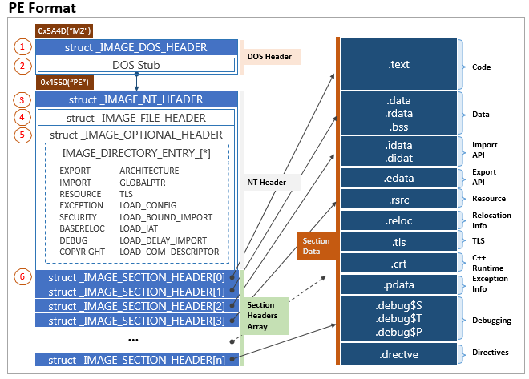

# Dot Net Anywhere

* .NET CIL 코드 실행 환경을 구현
* PE 파일 실행가능

* 참고
  * [Common Language Runtine](../Eunji/CLR.md)
  * [Portable Executable](../Gijung/PortableExecutable.md)



* [Evaluation Stack](http://etutorials.org/Programming/programming+microsoft+visual+c+sharp+2005/Part+IV+Debugging/Chapter+11+MSIL+Programming/Evaluation+Stack/)
  * MSIL의 핵심 구조
  * 응용프로그램의 뷰어로, 함수 파라미터, 로컬 변수, 임시 객체 등을 볼 수 있다.
  * 별도의 저장소에 저장되며, 메모리는 함수 파라미터와 로컬 변수에 예약되어 있다.
  * `load` 명령을 통해 함수 파라미터와 로컬 변수의 데이터를 스택으로 가져올 수 있으며, `store`명령으로 스택의 값을 메모리에 저장할 수 있다.

* mini-dna 예제 실행 순서 [List](https://en.wikipedia.org/wiki/List_of_CIL_instructions)
  * call : `CIL_CALL`
  * ldc.i4.s : `CIL_LDC_I4_S`
  * stloc.0 : `CIL_STLOC_0`
  * br.s : `CIL_BR_S`
  * ldloc.0 : `CIL_LDLOC_0`
  * ret : `CIL_RET`

  * ldc.i4.s : `CIL_LDC_I4_S`
  * add : `CIL_ADD`
  * stloc.0 : `CIL_STLOC_0`
  * br.s : `CIL_BR_S`
  * ldloc.0 : `CIL_LDLOC_0`
  * ret : `CIL_RET`

```c
// dna.c
int main(int argc, char **argp) {
	tCLIFile *pCLIFile;
	char *pFileName;
	U32 i;
	I32 retValue;

	if (argc < 2) {
		ShowUsage();
	}

	// Read any flags passed in
	for (i=1; i < (U32)argc; i++) {
		if (argp[i][0] == '-') {
			U32 j;

			for (j=1; ; j++) {
				switch (argp[i][j]) {
					case 0:
						goto doneArgs;
					case 'v':
						logLevel++;
						break;
					default:
						Crash("Invalid argument: -%c", argp[i][1]);
				}
			}
doneArgs:;
		} else {
			break;
		}
	}

	JIT_Execute_Init();
	MetaData_Init();
	Type_Init();
	Heap_Init();
	Finalizer_Init();
	Socket_Init();

#ifdef DIAG_OPCODE_TIMES
#ifdef WIN32
	{
		HANDLE hProcess = GetCurrentProcess();
		SetProcessAffinityMask(hProcess, 1);
	}
#endif
	memset(opcodeTimes, 0, sizeof(opcodeTimes));
#endif

#ifdef DIAG_OPCODE_USE
	memset(opcodeNumUses, 0, sizeof(opcodeNumUses));
#endif

	pFileName = argp[i];

	pCLIFile = CLIFile_Load(pFileName);

	retValue = CLIFile_Execute(pCLIFile, argc - i, argp + i);

	//Crash("FINISHED!!!");

	return retValue;
}

// CLIFile.c
tCLIFile* CLIFile_Load(char *pFileName) {
	void *pRawFile;
	tCLIFile *pRet;
	tFilesLoaded *pNewFile;

	pRawFile = LoadFileFromDisk(pFileName);

	if (pRawFile == NULL) {
		Crash("Cannot load file: %s", pFileName);
	}

	log_f(1, "\nLoading file: %s\n", pFileName);

	pRet = LoadPEFile(pRawFile);
	pRet->pFileName = (char*)mallocForever((U32)strlen(pFileName) + 1);
	strcpy(pRet->pFileName, pFileName);

	// Record that we've loaded this file
	pNewFile = TMALLOCFOREVER(tFilesLoaded);
	pNewFile->pCLIFile = pRet;
	pNewFile->pNext = pFilesLoaded;
	pFilesLoaded = pNewFile;

	return pRet;
}
static tCLIFile* LoadPEFile(void *pData) {
	tCLIFile *pRet = TMALLOC(tCLIFile);

	unsigned char *pMSDOSHeader = (unsigned char*)&(((unsigned char*)pData)[0]);
	unsigned char *pPEHeader;
	unsigned char *pPEOptionalHeader;
	unsigned char *pPESectionHeaders;
	unsigned char *pCLIHeader;
	unsigned char *pRawMetaData;

	int i;
	unsigned int lfanew;	// IMAGE_NT_HEADERS의 주소값
	unsigned short machine;	// IMAGE_FILE_HEADER의 주소값
	int numSections;	// 섹션 개수
	unsigned int imageBase;	// PE 파일이 메모리에 `로드될때의 시작 주소`
	int fileAlignment;	// 파일에서 섹션의 최소 단위
	unsigned int cliHeaderRVA, cliHeaderSize;	// `DataDirectory` 배열. 크기는 16
	unsigned int metaDataRVA, metaDataSize;
	tMetaData *pMetaData;

	pRet->pRVA = RVA();
	pRet->pMetaData = pMetaData = MetaData();

	lfanew = *(unsigned int*)&(pMSDOSHeader[0x3c]);
	pPEHeader = pMSDOSHeader + lfanew + 4;
	pPEOptionalHeader = pPEHeader + 20;
	pPESectionHeaders = pPEOptionalHeader + 224;

	machine = *(unsigned short*)&(pPEHeader[0]);
	if (machine != DOT_NET_MACHINE) {
		return NULL;
	}
	numSections = *(unsigned short*)&(pPEHeader[2]);

	imageBase = *(unsigned int*)&(pPEOptionalHeader[28]);
	fileAlignment = *(int*)&(pPEOptionalHeader[36]);

	for (i=0; i<numSections; i++) {
		unsigned char *pSection = pPESectionHeaders + i * 40;
		RVA_Create(pRet->pRVA, pData, pSection);
	}

	cliHeaderRVA = *(unsigned int*)&(pPEOptionalHeader[208]);
	cliHeaderSize = *(unsigned int*)&(pPEOptionalHeader[212]);

	pCLIHeader = RVA_FindData(pRet->pRVA, cliHeaderRVA);

	metaDataRVA = *(unsigned int*)&(pCLIHeader[8]);
	metaDataSize = *(unsigned int*)&(pCLIHeader[12]);
	pRet->entryPoint = *(unsigned int*)&(pCLIHeader[20]);
	pRawMetaData = RVA_FindData(pRet->pRVA, metaDataRVA);

	// Load all metadata
	{
		unsigned int versionLen = *(unsigned int*)&(pRawMetaData[12]);
		unsigned int ofs, numberOfStreams;
		void *pTableStream = NULL;
		unsigned int tableStreamSize;
		pRet->pVersion = &(pRawMetaData[16]);
		log_f(1, "CLI version: %s\n", pRet->pVersion);
		ofs = 16 + versionLen;
		numberOfStreams = *(unsigned short*)&(pRawMetaData[ofs + 2]);
		ofs += 4;

		for (i=0; i<(signed)numberOfStreams; i++) {
			unsigned int streamOffset = *(unsigned int*)&pRawMetaData[ofs];
			unsigned int streamSize = *(unsigned int*)&pRawMetaData[ofs+4];
			unsigned char *pStreamName = &pRawMetaData[ofs+8];
			void *pStream = pRawMetaData + streamOffset;
			ofs += (unsigned int)((strlen(pStreamName)+4) & (~0x3)) + 8;
			if (strcasecmp(pStreamName, "#Strings") == 0) {
				MetaData_LoadStrings(pMetaData, pStream, streamSize);
			} else if (strcasecmp(pStreamName, "#US") == 0) {
				MetaData_LoadUserStrings(pMetaData, pStream, streamSize);
			} else if (strcasecmp(pStreamName, "#Blob") == 0) {
				MetaData_LoadBlobs(pMetaData, pStream, streamSize);
			} else if (strcasecmp(pStreamName, "#GUID") == 0) {
				MetaData_LoadGUIDs(pMetaData, pStream, streamSize);
			} else if (strcasecmp(pStreamName, "#~") == 0) {
				pTableStream = pStream;
				tableStreamSize = streamSize;
			}
		}
		// Must load tables last
		if (pTableStream != NULL) {
			MetaData_LoadTables(pMetaData, pRet->pRVA, pTableStream, tableStreamSize);
		}
	}

	// Mark all generic definition types and methods as such
	for (i=pMetaData->tables.numRows[MD_TABLE_GENERICPARAM]; i>0; i--) {
		tMD_GenericParam *pGenericParam;
		IDX_TABLE ownerIdx;

		pGenericParam = (tMD_GenericParam*)MetaData_GetTableRow
			(pMetaData, MAKE_TABLE_INDEX(MD_TABLE_GENERICPARAM, i));
		ownerIdx = pGenericParam->owner;
		switch (TABLE_ID(ownerIdx)) {
			case MD_TABLE_TYPEDEF:
				{
					tMD_TypeDef *pTypeDef = (tMD_TypeDef*)MetaData_GetTableRow(pMetaData, ownerIdx);
					pTypeDef->isGenericDefinition = 1;
				}
				break;
			case MD_TABLE_METHODDEF:
				{
					tMD_MethodDef *pMethodDef = (tMD_MethodDef*)MetaData_GetTableRow(pMetaData, ownerIdx);
					pMethodDef->isGenericDefinition = 1;
				}
				break;
			default:
				Crash("Wrong generic parameter owner: 0x%08x", ownerIdx);
		}
	}

	// Mark all nested classes as such
	for (i=pMetaData->tables.numRows[MD_TABLE_NESTEDCLASS]; i>0; i--) {
		tMD_NestedClass *pNested;
		tMD_TypeDef *pParent, *pChild;

		pNested = (tMD_NestedClass*)MetaData_GetTableRow(pMetaData, MAKE_TABLE_INDEX(MD_TABLE_NESTEDCLASS, i));
		pParent = (tMD_TypeDef*)MetaData_GetTableRow(pMetaData, pNested->enclosingClass);
		pChild = (tMD_TypeDef*)MetaData_GetTableRow(pMetaData, pNested->nestedClass);
		pChild->pNestedIn = pParent;
	}

	return pRet;
}
I32 CLIFile_Execute(tCLIFile *pThis, int argc, char **argp) {
	tThread *pThread;
	HEAP_PTR args;
	int i;

	// Create a string array for the program arguments
	// Don't include the argument that is the program name.
	argc--;
	argp++;
	args = SystemArray_NewVector(types[TYPE_SYSTEM_ARRAY_STRING], argc);
	Heap_MakeUndeletable(args);
	for (i = 0; i < argc; i++) {
		HEAP_PTR arg = SystemString_FromCharPtrASCII(argp[i]);
		SystemArray_StoreElement(args, i, (PTR)&arg);
	}

	// Create the main application thread
	pThread = Thread();
	Thread_SetEntryPoint(pThread, pThis->pMetaData, pThis->entryPoint, (PTR)&args, sizeof(void*));

	return Thread_Execute();
}

// Thread.c
I32 Thread_Execute() {
	tThread *pThread, *pPrevThread;
	U32 status;

	pThread = pAllThreads;
	// Set the initial thread to the RUNNING state.
	pThread->state = THREADSTATE_RUNNING;
	// Set the initial CurrentThread
	pCurrentThread = pThread;

	for (;;) {
		U32 minSleepTime = 0xffffffff;
		I32 threadExitValue;

		status = JIT_Execute(pThread, 100);
		switch (status) {
		case THREAD_STATUS_EXIT:
			threadExitValue = pThread->threadExitValue;
			log_f(1, "Thread ID#%d exited. Return value: %d\n", (int)pThread->threadID, (int)threadExitValue);
			// Remove the current thread from the running threads list.
			// Note that this list may have changed since before the call to JIT_Execute().
			{
				tThread **ppThread = &pAllThreads;
				while (*ppThread != pThread) {
					ppThread = &((*ppThread)->pNextThread);
				}
				*ppThread = (*ppThread)->pNextThread;
			}
			// Delete the current thread
			Thread_Delete(pThread);
			// If there are no more threads left running, then exit application (by returning)
			// Threads that are unstarted or background do not stop the exit
			{
				tThread *pThread = pAllThreads;
				U32 canExit = 1;
				while (pThread != NULL) {
					if ((!(pThread->state & THREADSTATE_BACKGROUND)) && ((pThread->state & (~THREADSTATE_BACKGROUND)) != THREADSTATE_UNSTARTED)) {
						canExit = 0;
						break;
					}
					pThread = pThread->pNextThread;
				}
				if (canExit) {
					return threadExitValue;
				}
			}
			pThread = pAllThreads; // This is not really correct, but it'll work for the time being
			break;
		case THREAD_STATUS_RUNNING:
		case THREAD_STATUS_LOCK_EXIT:
			// Nothing to do
			break;
		case THREAD_STATUS_ASYNC:
			pThread->pAsync->startTime = msTime();
			break;		
		}

		// Move on to the next thread.
		// Find the next thread that isn't sleeping or blocked on IO
		pPrevThread = pThread;
		for (;;) {
			pThread = pThread->pNextThread;
			if (pThread == NULL) {
				pThread = pAllThreads;
			}
			// Set the CurrentThread correctly
			pCurrentThread = pThread;
			if ((pThread->state & (~THREADSTATE_BACKGROUND)) != 0) {
				// Thread is not running
				continue;
			}
			if (pThread->pAsync != NULL) {
				// Discover if whatever is being waited for is finished
				tAsyncCall *pAsync = pThread->pAsync;
				if (pAsync->sleepTime >= 0) {
					// This is a sleep
					U64 nowTime = msTime();
					I32 msSleepRemaining = pAsync->sleepTime - (I32)(nowTime - pAsync->startTime);
					if (msSleepRemaining <= 0) {
						// Sleep is finished
						break;
					}
					// Sleep is not finished, so continue to next thread
					if ((U32)msSleepRemaining < minSleepTime) {
						minSleepTime = msSleepRemaining;
					}
				} else {
					// This is blocking IO, or a lock
					tMethodState *pMethodState = pThread->pCurrentMethodState;
					PTR pThis;
					U32 thisOfs;
					U32 unblocked;

					if (METHOD_ISSTATIC(pMethodState->pMethod)) {
						pThis = NULL;
						thisOfs = 0;
					} else {
						pThis = *(PTR*)pMethodState->pParamsLocals;
						thisOfs = 4;
					}
					unblocked = pAsync->checkFn(pThis, pMethodState->pParamsLocals + thisOfs, pMethodState->pEvalStack, pAsync);
					if (unblocked) {
						// The IO has unblocked, and the return value is ready.
						// So delete the async object.
						// TODO: The async->state object needs to be deleted somehow (maybe)
						free(pAsync);
						// And remove it from the thread
						pThread->pAsync = NULL;
						break;
					}
					minSleepTime = 5;
				}
			} else {
				// Thread is ready to run
				break;
			}
			if (pThread == pPrevThread) {
				// When it gets here, it means that all threads are currently blocked.
				//printf("All blocked; sleep(%d)\n", minSleepTime);
				SleepMS(minSleepTime);
			}
		}
	}

}

// JIT_Execute.c
U32 JIT_Execute(tThread *pThread, U32 numInst) {
	tJITted *pJIT;
	tMethodState *pCurrentMethodState;	// 현재 실행 대상인 메소드
	PTR pParamsLocals;			// 현재 메소드의 파라미터 스택

	// Local copies of thread state variables, to speed up execution
	// Pointer to next op-code
	U32 *pOps;
	register U32 *pCurOp;
	// Pointer to eval-stack position
	register PTR pCurEvalStack;
	PTR pTempPtr;

	U32 op;
	// General purpose variables
	//I32 i32Value;
	U32 u32Value; //, u32Value2;
	//U64 u64Value;
	//double dValue;
	//float fValue;
	//uConvDouble convDouble;
	U32 ofs;
	HEAP_PTR heapPtr;
	PTR pMem;
	
	if (pThread == NULL) {...}

	LOAD_METHOD_STATE();

	GO_NEXT();

noCode:
	Crash("No code for op-code");

JIT_LOAD_PARAMLOCAL_ADDR_start:
	OPCODE_USE(JIT_LOAD_PARAMLOCAL_ADDR);
	{
		U32 ofs = GET_OP();
		PTR pMem = pParamsLocals + ofs;
		PUSH_PTR(pMem);
	}

JIT_LOADINDIRECT_I8_start:
JIT_LOADINDIRECT_I16_start:
JIT_LOADINDIRECT_I32_start:
JIT_LOADINDIRECT_U8_start:
JIT_LOADINDIRECT_U16_start:
JIT_LOADINDIRECT_U32_start:
JIT_LOADINDIRECT_R32_start:
JIT_LOADINDIRECT_REF_start:
	OPCODE_USE(JIT_LOADINDIRECT_U32);
	{
		PTR pMem = POP_PTR();
		U32 value = *(U32*)pMem;
		PUSH_U32(value);
	}

JIT_RETURN_start:
	OPCODE_USE(JIT_RETURN);
	//printf("Returned from %s() to %s()\n", pCurrentMethodState->pMethod->name, (pCurrentMethodState->pCaller)?pCurrentMethodState->pCaller->pMethod->name:"<none>");
	if (pCurrentMethodState->pCaller == NULL) {
		// End of thread!
		if (pCurrentMethodState->pMethod->pReturnType == types[TYPE_SYSTEM_INT32]) {
			// If function returned an int32, then make it the thread exit-value
			pThread->threadExitValue = (I32)POP_U32();
		}
		return THREAD_STATUS_EXIT;
	}
	// Make u32Value the number of bytes of the return value from the function
	if (pCurrentMethodState->pMethod->pReturnType != NULL) {
		u32Value = pCurrentMethodState->pMethod->pReturnType->stackSize;
	} else if (pCurrentMethodState->isInternalNewObjCall) {
		u32Value = sizeof(void*);
	} else {
		u32Value = 0;
	}
	pMem = pCurrentMethodState->pEvalStack;
	{
		tMethodState *pOldMethodState = pCurrentMethodState;
		pThread->pCurrentMethodState = pCurrentMethodState->pCaller;
		LOAD_METHOD_STATE();
		// Copy return value to callers evaluation stack
		if (u32Value > 0) {
			memmove(pCurEvalStack, pMem, u32Value);
			pCurEvalStack += u32Value;
		}
		// Delete the current method state and go back to callers method state
		MethodState_Delete(pThread, &pOldMethodState);
	}
	if (pCurrentMethodState->pNextDelegate == NULL) {
		GO_NEXT();
	}
	// Fall-through if more delegate methods to invoke
JIT_RETURN_end:

JIT_DEREF_CALLVIRT_start:
	op = JIT_DEREF_CALLVIRT;
	goto allCallStart;
JIT_BOX_CALLVIRT_start:
	op = JIT_BOX_CALLVIRT;
	goto allCallStart;
JIT_CALL_PTR_start: // Note that JIT_CALL_PTR cannot be virtual
	op = JIT_CALL_PTR;
	goto allCallStart;
JIT_CALLVIRT_O_start:
	op = JIT_CALLVIRT_O;
	goto allCallStart;
JIT_CALL_O_start:
	op = JIT_CALL_O;
	goto allCallStart;
JIT_CALL_INTERFACE_start:
	op = JIT_CALL_INTERFACE;
allCallStart:
	OPCODE_USE(JIT_CALL_O);
	{
		tMD_MethodDef *pCallMethod;
		tMethodState *pCallMethodState;
		tMD_TypeDef *pBoxCallType;

		if (op == JIT_BOX_CALLVIRT) {
			pBoxCallType = (tMD_TypeDef*)GET_OP();
		}

		pCallMethod = (tMD_MethodDef*)GET_OP();
		heapPtr = NULL;

		if (op == JIT_BOX_CALLVIRT) {
			// Need to de-ref and box the value-type before calling the function
			// TODO: Will this work on value-types that are not 4 bytes long?
			pMem = pCurEvalStack - pCallMethod->parameterStackSize;
			heapPtr = Heap_Box(pBoxCallType, *(PTR*)pMem);
			*(HEAP_PTR*)pMem = heapPtr;
		} else if (op == JIT_DEREF_CALLVIRT) {
			pMem = pCurEvalStack - pCallMethod->parameterStackSize;
			*(HEAP_PTR*)pMem = **(HEAP_PTR**)pMem;
		}

		// If it's a virtual call then find the real correct method to call
		if (op == JIT_CALLVIRT_O || op == JIT_BOX_CALLVIRT || op == JIT_DEREF_CALLVIRT) {
			tMD_TypeDef *pThisType;
			// Get the actual object that is becoming 'this'
			if (heapPtr == NULL) {
				heapPtr = *(HEAP_PTR*)(pCurEvalStack - pCallMethod->parameterStackSize);
			}
			if (heapPtr == NULL) {
				//Crash("NULL 'this' in Virtual call: %s", Sys_GetMethodDesc(pCallMethod));
				THROW(types[TYPE_SYSTEM_NULLREFERENCEEXCEPTION]);
			}
			pThisType = Heap_GetType(heapPtr);
			if (METHOD_ISVIRTUAL(pCallMethod)) {
				pCallMethod = pThisType->pVTable[pCallMethod->vTableOfs];
			}
		} else if (op == JIT_CALL_INTERFACE) {
			tMD_TypeDef *pInterface, *pThisType;
			U32 vIndex;
			I32 i;

			pInterface = pCallMethod->pParentType;
			// Get the actual object that is becoming 'this'
			heapPtr = *(HEAP_PTR*)(pCurEvalStack - pCallMethod->parameterStackSize);
			pThisType = Heap_GetType(heapPtr);
			// Find the interface mapping on the 'this' type.
			vIndex = 0xffffffff;
			// This must be searched backwards so if an interface is implemented more than
			// once in the type hierarchy, the most recent definition gets called
			for (i=(I32)pThisType->numInterfaces-1; i >= 0; i--) {
				if (pThisType->pInterfaceMaps[i].pInterface == pInterface) {
					// Found the right interface map
					if (pThisType->pInterfaceMaps[i].pVTableLookup != NULL) {
						vIndex = pThisType->pInterfaceMaps[i].pVTableLookup[pCallMethod->vTableOfs];
						break;
					}
					pCallMethod = pThisType->pInterfaceMaps[i].ppMethodVLookup[pCallMethod->vTableOfs];
					goto callMethodSet;
				}
			}
			Assert(vIndex != 0xffffffff);
			pCallMethod = pThisType->pVTable[vIndex];
		}
callMethodSet:
		//printf("Calling method: %s\n", Sys_GetMethodDesc(pCallMethod));
		// Set up the new method state for the called method
		pCallMethodState = MethodState_Direct(pThread, pCallMethod, pCurrentMethodState, 0);
		// Set up the parameter stack for the method being called
		pTempPtr = pCurEvalStack;
		CreateParameters(pCallMethodState->pParamsLocals, pCallMethod, &/*pCurEvalStack*/pTempPtr, NULL);
		pCurEvalStack = pTempPtr;
		// Set up the local variables for the new method state
		CHANGE_METHOD_STATE(pCallMethodState);
	}

JIT_ADD_I32I32_start:
	OPCODE_USE(JIT_ADD_I32I32);
	BINARY_OP(I32, I32, I32, +);

JIT_SUB_I32I32_start:
	OPCODE_USE(JIT_SUB_I32I32);
	BINARY_OP(I32, I32, I32, -);

JIT_NEG_I32_start:
	OPCODE_USE(JIT_NEG_I32);
	UNARY_OP(I32, -);

JIT_THROW_start:
	op = JIT_THROW;
throwStart:
	OPCODE_USE(JIT_THROW);
	{
		U32 i;
		tExceptionHeader *pCatch;
		tMethodState *pCatchMethodState;
		tMD_TypeDef *pExType;

		// Get the exception object
		if (op == JIT_RETHROW) {
			heapPtr = pThread->pCurrentExceptionObject;
		} else {
			heapPtr = POP_O();
throwHeapPtr:
			pThread->pCurrentExceptionObject = heapPtr;
		}
		SAVE_METHOD_STATE();
		pExType = Heap_GetType(heapPtr);
		// Find any catch exception clauses; look in the complete call stack
		pCatch = NULL;
		pCatchMethodState = pCurrentMethodState;
		for(;;) {
			for (i=0; i<pCatchMethodState->pMethod->pJITted->numExceptionHandlers; i++) {
				tExceptionHeader *pEx = &pCatchMethodState->pMethod->pJITted->pExceptionHeaders[i];
				if (pEx->flags == COR_ILEXCEPTION_CLAUSE_EXCEPTION &&
					pCatchMethodState->ipOffset - 1 >= pEx->tryStart &&
					pCatchMethodState->ipOffset - 1 < pEx->tryEnd &&
					Type_IsDerivedFromOrSame(pEx->u.pCatchTypeDef, pExType)) {
					
					// Found the correct catch clause to jump to
					pCatch = pEx;
					break;
				}
			}
			if (pCatch != NULL) {
				// Found a suitable exception handler
				break;
			}
			pCatchMethodState = pCatchMethodState->pCaller;
			if (pCatchMethodState == NULL) {
				Crash("Unhandled exception in %s.%s(): %s.%s",
					pCurrentMethodState->pMethod->pParentType->name,
					pCurrentMethodState->pMethod->name, pExType->nameSpace, pExType->name);
			}
		}
		// Unwind the stack down to the exception handler's stack frame (MethodState)
		// Run all finally clauses during unwinding
		pThread->pCatchMethodState = pCatchMethodState;
		pThread->pCatchExceptionHandler = pCatch;
		// Have to use the pThread->pCatchMethodState, as we could be getting here from END_FINALLY
		while (pCurrentMethodState != pThread->pCatchMethodState) {
			tMethodState *pPrevState;

finallyUnwindStack:
			for (i=pThread->nextFinallyUnwindStack; i<pCurrentMethodState->pMethod->pJITted->numExceptionHandlers; i++) {
				tExceptionHeader *pEx;

				pEx = &pCurrentMethodState->pMethod->pJITted->pExceptionHeaders[i];
				if (pEx->flags == COR_ILEXCEPTION_CLAUSE_FINALLY &&
					pCurrentMethodState->ipOffset - 1 >= pEx->tryStart &&
					pCurrentMethodState->ipOffset - 1 < pEx->tryEnd) {

					// Found a finally handler
					POP_ALL();
					CHANGE_METHOD_STATE(pCurrentMethodState);
					pCurrentMethodState->ipOffset = pEx->handlerStart;
					// Keep track of which finally clause should be executed next
					pThread->nextFinallyUnwindStack = i + 1;
					goto throwEnd;
				}
			}

			pPrevState = pCurrentMethodState->pCaller;
			MethodState_Delete(pThread, &pCurrentMethodState);
			pCurrentMethodState = pPrevState;
			// Reset the stack unwind tracker
			pThread->nextFinallyUnwindStack = 0;
		}
		// Set the IP to the catch handler
		pCurrentMethodState->ipOffset = pThread->pCatchExceptionHandler->handlerStart;
		// Set the current method state
		LOAD_METHOD_STATE();
		// Push onto this stack-frame's evaluation stack the opject thrown
		POP_ALL();
		PUSH_O(pThread->pCurrentExceptionObject);
	}
throwEnd:
JIT_THROW_end:
JIT_RETHROW_end:
	GO_NEXT_CHECK();

JIT_LEAVE_start:
	OPCODE_USE(JIT_LEAVE);
	{
		U32 i;
		tExceptionHeader *pFinally;

		// Find any finally exception clauses
		pFinally = NULL;
		for (i=0; i<pJIT->numExceptionHandlers; i++) {
			if (pJIT->pExceptionHeaders[i].flags == COR_ILEXCEPTION_CLAUSE_FINALLY &&
				pCurrentMethodState->ipOffset - 1 >= pJIT->pExceptionHeaders[i].tryStart &&
				pCurrentMethodState->ipOffset - 1 < pJIT->pExceptionHeaders[i].tryEnd) {
				// Found the correct finally clause to jump to
				pFinally = &pJIT->pExceptionHeaders[i];
				break;
			}
		}
		POP_ALL();
		ofs = GET_OP();
		if (pFinally != NULL) {
			// Jump to 'finally' section
			pCurOp = pOps + pFinally->handlerStart;
			pCurrentMethodState->pOpEndFinally = pOps + ofs;
		} else {
			// just branch
			pCurOp = pOps + ofs;
		}
	}
JIT_LEAVE_end:
	GO_NEXT_CHECK();

JIT_END_FINALLY_start:
	OPCODE_USE(JIT_END_FINALLY);
	if (pThread->nextFinallyUnwindStack > 0) {
		// unwinding stack, so jump back to unwind code
		goto finallyUnwindStack;
	} else {
		// Just empty the evaluation stack and continue on to the next opcode
		// (finally blocks are always after catch blocks, so execution can just continue)
		POP_ALL();
		// And jump to the correct instruction, as specified in the leave instruction
		pCurOp = pCurrentMethodState->pOpEndFinally;
	}

done:
	SAVE_METHOD_STATE();

	return THREAD_STATUS_RUNNING;
```