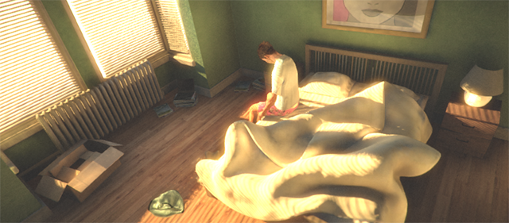
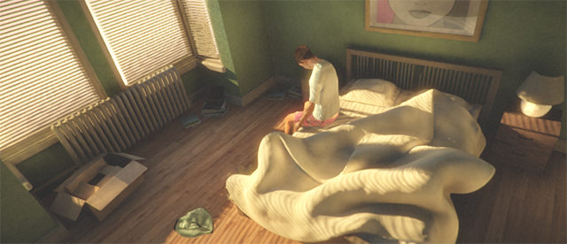

# Preparing Unity Render Settings

## Rendering ColorSpace

+ PlayerSettings -> OtherSettings ->  Rendering -> ColorSpace를 Linear로 변경하여 적용한다.
+ 최종 결과에 많은 영향을 끼치므로 최우선적으로 어떤 ColorSpace를 사용할지 결정해야한다.

```
Gamma와 Linear을 다른점
- Textur는 Gamma Color Space에 저장.
- Shader는 Linear Color Space에 저장.
- Linear가 Gamma 보다 사실적인 묘사에 적당하다.
- Gamma Color Space만을 지원하는 Platform도 있는 경우가 있다.
```

## Rendering Path

+ Edit -> ProjectSettings -> Graphics -> RenderingPath
+ 다양한 동적 조명을 효율적으로 사용하도록 도와준다.
+ 콘텐츠와 타겟 플랫폼, 하드웨어에 따라 사용할 경로를 선택해야 한다.

```
Forward - 조명 및 그림자의 정확도가 가장 높은 렌더링 경로로, 실시간 광원이 많은 경우에 가장 적합하다.

Deffered - 일반적인 렌더링 경로로, Unity 그래픽스 기능(노멀 맵, 픽셀당 광원, 섀도우 등)을 모두 지원한다.

Legacy Deffered - Deffered와 비슷하지만 물리기반 Standard Shader를 지원하지 않는다.

Legacy Vertext Lit - 조명 정확도가 가장 낮은 렌더링 경로로, 실시간 섀도우를 지원하지 않는다.
```

## High Dynamic Range (HDR) Camera

+ 카메라가 0~1 범위 외의 픽셀 값을 수용 할 수 있도록 도와주는 기능이다.
+ Camera의 Inspacetor 창에서 `Allow HDR`을 이용하여 활성화한다. 

## HDR Lightmap encoding (optional)

+ 인코딩할때의 라이트맵 처리를 변경 할 수 있다.
+ PalyerSettings -> OtherSettings -> LightmapEncoding에서 적용 할 수 있다.

```
Normal Quality - RGBM 인코딩을 지원한다.
High Quality   - HDR 라이트맵을 지원한다.

RGBM이란?
- RGB 채널에 색상을 저장하고 알파 채널에 배율 (M)을 저장합니다.
```

## Tonemapper for your Scene

+ HDR Lighting을 적절하게 활용을 하려면 톤매퍼가 필요하다.
+ Assets -> Create -> Post-Processing Profile -> Color Grading 활성화 -> Tonemapper 설정 가능.

```
톤 매핑 이란?
- HDR 이미지를 표준의 low dynamic range (LDR) 이미지로 변환하여 표시한다.
```

`톤 매핑 미적용`
`톤 매핑 적용`