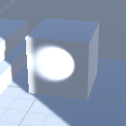
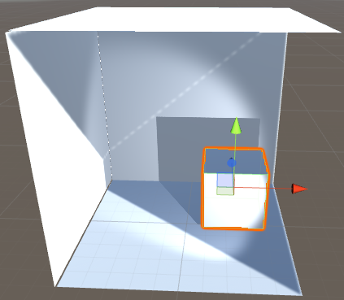
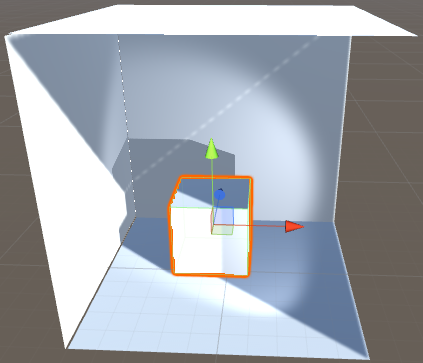

# Lightinh Strategy

## 일반적인 조명 설정
+ `Basic realtime` - Specular Highlight은 볼 수 있지만 Indirect Lighting은 볼 수 없다.
+ `Baked` - Specular Highlight 및 동적 객체에 대한 그림자를 볼 수 없다.
+ `Mixed Lighting` - Baked와 비슷하지만, Specular Highlight와 동적 객체에 대한 그림자를 볼 수 있다.
+ `Realtime Light and GI` - Specular Highlight, Indirect Lighting 반응을 볼 수 있으며, 조명은 모두 움직이며 업데이트 할 수 있다.
+ `Guns Blazing all options enabled` - 각 조명의 설정에 따라 위의 모든 설정들을 조합 할 수 있다. 

```
Specular Highlight
- 빛에 의해 물체에 나타나는 강조 표시(동그라미의 형태로 표시된다).

Indirect Light
- 빛이 표면에 부딪혀 나온 빛.

GI(Global Illumination)란?
- 3D 공간에서 빛이 면에 부딪혀서 어떻게 이동하는 지를 시물레이션 하는 것이다.
```

`Specular Highlight`



`Indirect Light`


## Basic Realtime lighting + Ambient (with no Realtime GI or Baked GI)

```
플랫폼 - Console, PC

장점 - 모든 빛과 그림자가 실시간이기 때문에 움직임 적용이 가능하다.
     - 사전 계산이나 bake 할 필요가 없기때문에 빠른 적용이 가능하다. 
    - 동적 및 정적 객체에 상관없이 동일하게 사용 가능하다.

단점 - Global Illumination 및 Indirect Light 없이는 시각적으로 훌륭한 
      결과물을 내지 못한다.
    - Hemisphere occlusion이 없다.
```

```
Hemisphere occlusion
- 반구체의 면에서 모든 방향으로 방사되는 빛의 노출을 계산한 기술?
```




## All baked lighting + Light Probe

```
플랫폼 - Mobile, VR, Console, 저사양 PC

장점 - 정적 객체를 위한 모든 Bake된 조명들은 
      Ambient Occlusion과 Indirect Light을 생산한다.
    - Area 조명은 bake를 제공한다.
    - 런타임 효율성이 가장 좋다.

단점 - Scene이 변경되는 경우 Light rebuild가 필요하다.
    - Specular highlights가 없다.
    - 동적 객체로부터 그림자가 없다.
    - Scene에 사용된 라이트맵 텍스쳐의 양에 따라 런타임 메모리에 영향을 줄 수 있다.
```

```
Amibent Lighting (주변광)
- 동일한 밝기의 빛이 장면 안의 모든 표면에서 일정하게 반사되는 것.

Ambient Occlusion
- 장면의 각 지점들이 Ambient Lighting에 노출되는 방식을 계산한 쉐이딩/렌더링 기술. 
```

## Mixed lighting with Shadowmask + Light Probe

```
플랫폼 - VR, Console, PC

장점 - Mixed 조명에서 동적 객체는 실시간으로 Specular highlight와 그림자를 
      얻을 수 있지만, 정적 객체는 시각적으로 더 나은 Bake된 그림자 마스크를 얻을 수 있다.

단점 - 객체당 최대 4개의 그림자 마스크를 가질 수 있다.
    - 실시간 조명을 그리기 위해 런타임 상에서 비용이 추가적으로 든다.
    - 특정 설정에서 성능에 큰 영향을 줄 수 있으므로 주의가 필요하다.
```

```
Shadowmask Mode
- Edit > Project Settings > Quality > Shadows > ShadowmaskMode
- Shadowmask : 그림자를 드리우는 정적 게임 오브젝트는 항상 베이크된 그림자를 사용.
- Distance Shadowmask : Shadow Distance 까지는 실시간 그림자를 사용하고, 
                        더 먼 거리에는 베이크된 섀도우를 사용.
```

## Realtime lighting with Realtime GI + Light Probe

```
플랫폼 - Console, PC

장점 - 실시간으로 빠르게 Indirect Lighting을 적용 할 수 있다.
    - 동적 및 정적 객체의 실시간 Specular Highlight와 그림자를 확인 할 수 있다. 
    - Baked 조명보다 적은 메모리로 간접광 효과를 줄 수 있다.

단점 - 정적 객체를 위한 그림자가 없다.
    - 특정 설정에서 성능에 큰 영향을 줄 수 있으므로 주의가 필요하다.
    - 너무 많은 정적 조명에 UV 설정이 최적화 되지 않은 경우 조명 생성 시간이 
      오래 걸릴 수 있다.
```

## Guns blazing, all option enabled

```
플랫폼 - Console, PC

장점 - 완벽한 조명 기능 세트이다.

단점 - UV 제작 및 베이킹 시간때문에 작업 흐름에 부담이 증가될 수 있다.
```