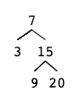

# Problem

Implement an iterator over a binary search tree (BST). Your iterator will be initialized with the root node of a BST.

Calling next() will return the next smallest number in the BST.

#### Example 1:



```swift
BSTIterator iterator = new BSTIterator(root);
iterator.next();    // return 3
iterator.next();    // return 7
iterator.hasNext(); // return true
iterator.next();    // return 9
iterator.hasNext(); // return true
iterator.next();    // return 15
iterator.hasNext(); // return true
iterator.next();    // return 20
iterator.hasNext(); // return false
```

#### Note:

* `next()` and `hasNext()` should run in average O(1) time and uses O(h) memory, where h is the height of the tree.
* You may assume that `next()` call will always be valid, that is, there will be at least a next smallest number in the BST when `next()` is called.

# My Answer
  
* 작은 순서로 탐색하는것은 BST의 `In-order탐색`이다, [Binary Tree Inorder Traversal](binary_tree_inorder_traversal.md) 
* `BSTIterator`의 생성자에서, `Queue(m_q)`를 구성한다.
* `next()`에선 `m_q.poll()` 하면된다.
* `hasNext()`에선 `m_q`가 비어 있지만 않으면 `true`이다.

```java
/**
 * Definition for a binary tree node.
 * public class TreeNode {
 *     int val;
 *     TreeNode left;
 *     TreeNode right;
 *     TreeNode(int x) { val = x; }
 * }
 */
class BSTIterator {
    Queue<Integer> m_q;
    
    public BSTIterator(TreeNode root) {
        m_q = new LinkedList<>();
        Stack<TreeNode> s = new Stack<>();
        TreeNode curr = root;
        
        while(curr != null || !s.isEmpty()) {
            while(curr != null ) {                
                s.push(curr);
                curr = curr.left;
            }
            
            curr = s.pop();
            m_q.add(curr.val);
            
            curr = curr.right;
        }            
    }
    
    /** @return the next smallest number */
    public int next() {
        return m_q.poll();
    }
    
    /** @return whether we have a next smallest number */
    public boolean hasNext() {
        return !m_q.isEmpty();
    }
}

/**
 * Your BSTIterator object will be instantiated and called as such:
 * BSTIterator obj = new BSTIterator(root);
 * int param_1 = obj.next();
 * boolean param_2 = obj.hasNext();
 */
```

# Fastest Answer

```java
/**
 * Definition for a binary tree node.
 * public class TreeNode {
 *     int val;
 *     TreeNode left;
 *     TreeNode right;
 *     TreeNode(int x) { val = x; }
 * }
 */
class BSTIterator {

    TreeNode nxt;
    
    public BSTIterator(TreeNode root) {
        nxt = root;
    }
    
    /** @return the next smallest number */
    public int next() {
        TreeNode res = null;
        
        while (nxt != null) {
            if (nxt.left != null) {
                TreeNode pre = nxt.left;
                while (pre.right != null && pre.right != nxt) {
                    pre = pre.right;
                }
                
                if (pre.right == null) {
                    pre.right = nxt;
                    nxt = nxt.left;
                } else {
                    pre.right = null;
                    res = nxt;
                    nxt = nxt.right;
                    break;
                }
                
            } else {
                res = nxt;
                nxt = nxt.right;
                break;
            }
        }
        
        return res.val;
    }
    
    /** @return whether we have a next smallest number */
    public boolean hasNext() {
        return nxt != null;
    }
}

/**
 * Your BSTIterator object will be instantiated and called as such:
 * BSTIterator obj = new BSTIterator(root);
 * int param_1 = obj.next();
 * boolean param_2 = obj.hasNext();
 */
```

