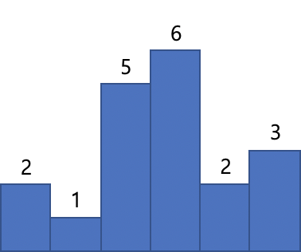

# Problem

Given n non-negative integers representing the histogram's bar height where the width of each bar is 1, find the area of largest rectangle in the histogram.



Above is a histogram where width of each bar is 1, given height = [2,1,5,6,2,3].


The largest rectangle is shown in the shaded area, which has area = 10 unit.

#### Example :

```swift
Input: [2,1,5,6,2,3]
Output: 10
```

# My Answer

* 재귀를 이용해서 해결
* `backTracking` 함수의 파라미터로 기준이 되는 `index` 를 넘긴다.
* `backTracking` 함수에서는 `start` index에 해당 하는 `pivot`을 기준으로 좌,우의 값을 비교 해서 같거나 클때 `count`를 증가 시킨다.
* `while(prev >= 0 || next < length ) {` 구문 이후 최종 계산된 `count`와 `pivot`의 곱을 통해 현재 기준값으로 나올수 있는 최대 값을 구하고,
* 재귀를 통해 그 다음 `index`에 해당 하는 값을 구해서 `Max` 비교 한다.
* 모든 원소에 대해서 수행하기 때문에, 연산량이 많다.
  
```java
class Solution {
    public int largestRectangleArea(int[] heights) {
        return backTracking(heights, 0);
    }
    
    int backTracking(int[] heights, int start ){
        if ( heights.length <= start) {
            return 0;
        }
        
        int pivot = heights[start];
        int count = 1;
        int prev = start -1;
        int next = start + 1;
        int length = heights.length;
        
        while(prev >= 0 || next < length ) {
            if ( prev >= 0 ) {
                if ( heights[prev] >= pivot ) {
                    count++;
                    prev--; 
                } else {
                    prev = -1;
                }                
            }
            
            if ( next < length ) {
                if( heights[next] >= pivot ) {
                    count++;
                    next++;
                } else {
                    next = length;
                }
            }            
        }
       
        int total = pivot * count;
        int next_total = backTracking(heights, start +1);
        
        return Math.max(total, next_total);        
    }
}
```

# Fastest Answer

```java
class Solution {
    public int largestRectangleArea(int[] heights) {
        if (heights == null || heights.length == 0) {
            return 0;
        }
        return lra(heights, 0, heights.length);
    }

    private int lra(int[] heights, int start, int end) {
        if (end - start == 1) {
            return heights[start];
        }
        //start index에 해당 하는 값을 기준으로 최소 값을 구한다.
        //start ~ end 사이 값들을 비교하면서, 요소들이 오름차순으로만 구성되어 있는지, 내림차순으로만 구성 되어 있는지, 아니면 뒤죽박죽 섞여 있는지 체크한다.
        boolean ascd = true;
        boolean desc = true;
        int min = heights[start];
        for (int i = start + 1; i < end; i++) {
            if (heights[i] < min) {
                min = heights[i];
            }
            if (heights[i] < heights[i-1]) {
                ascd = false;
            } else if (heights[i] > heights[i-1]) {
                desc = false;
            }
        }
        int max = min * (end - start);  //위 반복문에 의해서 결정된 min값과 end-start의 곱이 곧 start 기준에 나올수 있는 최대 값이다.
        
        if (ascd) { //오름 차순으로되어 있다면, start + 1 ~ end 까지 최대 값을 구해서 비교
            for (int i = start + 1; i < end; i++) {
                if (heights[i] == heights[i-1]) continue;
                int tmp = heights[i] * (end - i);
                if (tmp > max) {
                    max = tmp;
                }
            }
        } else if (desc) { //내림 차순으로되어 있다면, 뒤쪽부터 작은 수 이기 때문에, end-2 ~ start 까지 최대 값을 구해서 비교
            for (int i = end - 2; i >= start; i--) {
                if (heights[i] == heights[i+1]) continue;
                int tmp = heights[i] * (i - start + 1);
                if (tmp > max) {
                    max = tmp;
                }
            }
        } else {
            boolean getStart = false;
            for (int i = start; i < end; i++) {
                if (!getStart) {
                    if (heights[i] == min) continue;
                    start = i;
                    getStart = true;
                } else {
                    if (heights[i] != min) continue;
                    int tmp = lra(heights, start, i);
                    if (tmp > max) {
                        max = tmp;
                    }
                    getStart = false;
                }
            }
            if (getStart) {
                int tmp = lra(heights, start, end);
                if (tmp > max) {
                    max = tmp;
                }
            }
        }
        return max;
    }
}
```

