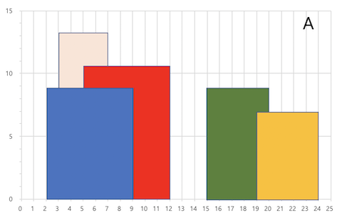
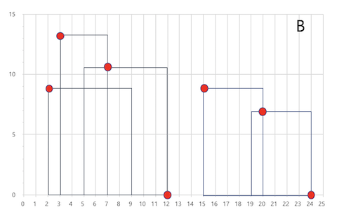

# Problem

A city's skyline is the outer contour of the silhouette formed by all the buildings in that city when viewed from a distance. Now suppose you are given the locations and height of all the buildings as shown on a cityscape photo (Figure A), write a program to output the skyline formed by these buildings collectively (Figure B).

 

Buildings Skyline Contour
The geometric information of each building is represented by a triplet of integers `[Li, Ri, Hi]`, where `Li` and `Ri` are the x coordinates of the left and right edge of the ith building, respectively, and `Hi` is its height. It is guaranteed that `0 ≤ Li, Ri ≤ INT_MAX`, `0 < Hi ≤ INT_MAX`, and `Ri - Li > 0`. You may assume all buildings are perfect rectangles grounded on an absolutely flat surface at height 0.

For instance, the dimensions of all buildings in Figure A are recorded as: `[ [2 9 10], [3 7 15], [5 12 12], [15 20 10], [19 24 8] ]` .

The output is a list of "key points" (red dots in Figure B) in the format of `[ [x1,y1], [x2, y2], [x3, y3], ... ]` that uniquely defines a skyline. A key point is the left endpoint of a horizontal line segment. Note that the last key point, where the rightmost building ends, is merely used to mark the termination of the skyline, and always has zero height. Also, the ground in between any two adjacent buildings should be considered part of the skyline contour.

For instance, the skyline in Figure B should be represented as:`[ [2 10], [3 15], [7 12], [12 0], [15 10], [20 8], [24, 0] ]`.

#### Notes

* The number of buildings in any input list is guaranteed to be in the range `[0, 10000]`
* The input list is already solted in ascending order by the left x position `Li`
* The output list must be sorted by the x position
* There must be no consecutive horizontal lines of equal height in the output skyline. For instance, `[...[2 3], [4 5], [7 5], [11 5], [12 7]...]` is not acceptable; the three lines of height 5 should be merged into one in the final output as such: `[...[2 3], [4 5], [12 7], ...]`


# My Answer

* `Binary Search Tree`는 `Parent Node` 보다 작은수가 왼쪽 큰 수가 오른쪽으로 위치한다.
* 작은 수에서 큰수로 반복 돌면서 좌, 우를 재귀로 구성.
  
```java
/**
 * Definition for a binary tree node.
 * public class TreeNode {
 *     int val;
 *     TreeNode left;
 *     TreeNode right;
 *     TreeNode(int x) { val = x; }
 * }
 */
class Solution {
    public List<TreeNode> generateTrees(int n) {
        if ( n < 1 ) {
            return new ArrayList<TreeNode>();
        }
        
        return generator(1, n);
    }
    
    List<TreeNode> generator(int low, int high ) {
        List<TreeNode> result = new ArrayList<TreeNode>();
        if ( low > high ) {            
            result.add(null);
            return result;
        }
        
        for(int n=low; n <= high; n++) {
            List<TreeNode> left_tree = generator(low, n -1);
            List<TreeNode> right_tree = generator(n+1, high);
            
            for(TreeNode l : left_tree) {
                for(TreeNode r : right_tree ) {
                    TreeNode root = new TreeNode(n);
                    root.left = l;
                    root.right = r;
                    result.add(root);
                }
            }
        }
        
        return result;
    }
}
```

