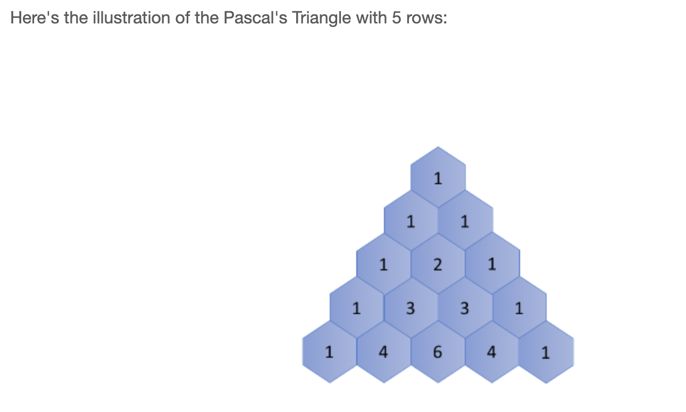

#### Definition

문제를 풀기 위한 접근방법중 하나로서, 함수 자기자신을 서브루틴 처럼 호출 하는 방식

#### Keywod

`base case` : 추가적인 재귀호출없이 바로 결과를 연산해 내는 case, 재귀 호출의 가장 마지막 단계를 수행하는 호출.

`recurrence relation` : 문제의 결과와 하위 문제들의 관계, `base case`에 도달 하기 위한 규칙


#### Example

`Pascal's Triangle`이 재귀 호출의 기본적인 예시가 될 수 있다.
`Pascal's Triangle`은 삼각형 모양을 이루게 하는 숫자의 배열인데, 각 로우의 첫번째와 마지막번째의 숫자는 항상 1이고, 그 사이에있는 숫자들은 이전 로우의 바로 위에 있는 숫자와 그 앞 숫자의 합이다.




##### recurrence relation

`Pascal's Triangle`에서 `i`번째 로우의 `j`번째에 있는 숫자를 산출해 내는 함수 `f(i,j)`가 있다고 하자.
이때 다음의 수식을 이용해서 `recurrence relation`을 표현 할 수 있다.

```c
f(i, j) = f(i - 1, j - 1) + f(i - 1, j)
```

##### base case

우측끝 과 좌측끝에 해당하는것들이 `base case`이다. 다음과 같은 수식이 된다.

```c
f(i,j) = 1 where j = 1 or j = i
```

#### Memoization

재귀를 하다보면 `중복 연산`을 하게 되는 경우가 발생한다. 예를 들어 `Fibonacci number`같은 경우 다음과 같은 수식으로 구할 수 있다.
```c
f(0) = 0, f(1) = 1
n! = f(n) = f(n-1) + f(n-2)
```
그래서 다음 예시로 `중복 연산`이 발생한다는것을 알 수 있다.

```
f(4) = f(3) + f(2) = (f(2) + f(1)) + f(2)
```
위 식 처럼 `f(2)`에 대한 연산이 2번 발생한다. 이렇게 되면 우린 이미 `f(2)`에 대한 연산을 한번 했는데, 한번 더 함으로써
불필요한 연산을 더 하게 된다. 위 예시는 `4`에 대한 예시라서 그렇지 만약 숫자가 더 커지면 `중복 연산`은 미친듯이 많이 발생한다.

`중복 연산`을 방지하기 위해선 한번 연산했던것에 대한 저장이 필요하다. 그것을 해결하기 위한 방법중 하나로 `Memoization`을 도입한다.
`Memoization`은 중간 결과값을 메모리에 저장하고 있는것으로 특정 `Input`에 의한 값을 저장 함으로써 다음에 동일한 `Input`이 왔을땐 연산을 하기 보단 저장해 놨던 값을
반환 하는 식으로 처리 한다.

```c
if ( n is cached ) {
    return cached result
}
return f(n-1) + f(n-2)
```


