# NSArray

## 배열 생성 함수

`array`

+ `비어있는 배열`을 만들 수 있도록 하는 함수.

```objc
NSArray * a = [NSArray array];

NSLog(@"%@",a);
```

`arrayWithObject`

+ `하나의 오브젝트를 생성한 배열`을 만들 수 있도록 하는 함수.

```objc
NSArray * a = [NSArray arrayWithObject:@"test"];

NSLog(@"%@",a);
```

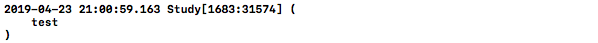

`arrayWithObjects`

+ `여러개의 오브젝트를 생성한 배열`을 만들 수 있도록 하는 함수.

```objc
NSArray * a = [NSArray arrayWithObjects:@"test_1", @"test_2", nil];

NSLog(@"%@",a);
```

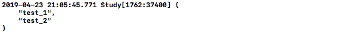

`arrayWithArray`

+ `배열을 이용하여 배열`을 만들 수 있도록 하는 함수.

```objc
NSArray *a = [NSArray arrayWithObjects:@"test_1", @"test_2", nil];
NSArray *b = [NSArray arrayWithArray:a];

NSLog(@"%@",b);
```

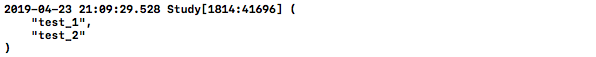

`arrayWithContentsOfFile`

+ `plist 파일을 읽어와서 배열을 생성` 할 수 있도록 하는 함수.

```objc
// 배열을 텍스트형태로 저장.
NSArray *a = [NSArray arrayWithObjects: @"I", @"seem", @"to", @"be", @"a", @"verb", nil];
[a writeToFile: @"/Volumes/SL-BG1/ReadTest.txt" atomically: YES];

// 텍스트에 저장된 내용을 배열로 불러옴.
NSArray *b = [NSArray arrayWithContentsOfFile:@"/Volumes/SL-BG1/ReadTest.txt"];

NSLog(@"%@",b);
```

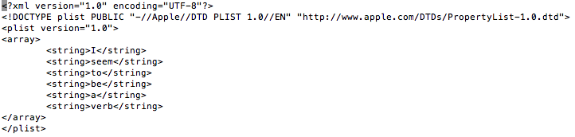
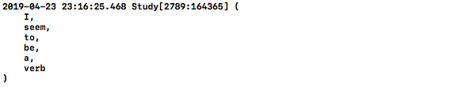

`arrayWithContentsOfURL`

+ `특정 URL에 파일을 읽어와서 배열을 생성` 할 수 있도록 하는 함수.

```objc
NSURL *url = [NSURL URLWithString:@"https://eezytutorials.com/ios/sample-files/sample-array-plist.plist"];
NSArray *a = [NSArray arrayWithContentsOfURL:url];

NSLog(@"%@",a);
```

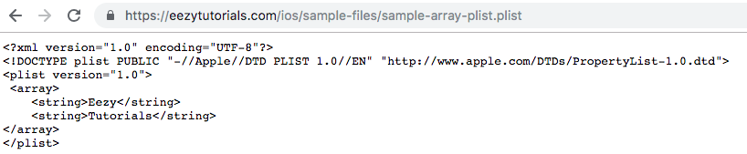
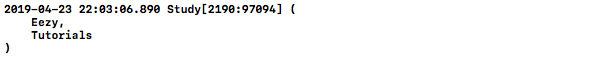

`arrayWithObjects:count`

+ 주어진 배열에서 `원하는 Count만큼만 복사해서 배열을 생성` 할 수 있도록 하는 함수.

```objc
NSString *str_array[3]; // 주어진 배열
    str_array[0] = @"A";
    str_array[1] = @"B";
    str_array[2] = @"C";

NSArray *a = [NSArray arrayWithObjects:str_array count:2];
    
NSLog(@"%@", a);
```

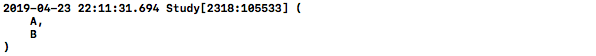

## 배열 초기화 함수

`init`

+ 새롭게 할당된 `배열을 초기화`하는 함수.
+ [[NSArray alloc]init] 대신에 `[NSArray array]를 쓰는 것을 추천`.

```objc
NSArray *a = [[NSArray alloc]init];
```

`initWithArray`

+ `주어진 배열을 이용하여 배열을 초기화`하는 함수.
+ [[NSArray alloc]initWithArray:] 대신에 `[NSArray arrayWithArray:]를 쓰는 것을 추천`. 

```objc
NSArray *a = [NSArray arrayWithObjects:@"test_1", @"test_2", nil];  // 주어진 배열

NSArray *b = [[NSArray alloc]initWithArray:a];
NSLog(@"%@", b);
```

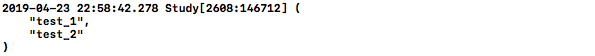

`initWithContentsOfFile`

+ `주어진 파일을 이용하여 배열을 초기화`하는 함수.
+ [[NSArray alloc]initWithContentsOfFile:] 대신 `[NSArray arrayWithContentsOfFile:] 사용하는 것을 추천`.

```objc
NSArray *a = [[NSArray alloc]initWithContentsOfFile:@"/Volumes/SL-BG1/ReadTest.txt"];

NSLog(@"%@",a);
```


`initWithContentsOfURL`

+ 주어진 `URL 주소에 있는 파일을 이용하여 배열을 초기화`하는 함수.
+ [[NSArray alloc]initWithContentsOfURL:] 대신에 `[NSArray arrayWithContentsOfURL:] 사용하는 것을 추천`.

```objc
NSURL *url = [NSURL URLWithString:@"https://eezytutorials.com/ios/sample-files/sample-array-plist.plist"];
NSArray *a = [[NSArray alloc]initWithContentsOfURL:url];

NSLog(@"%@",a);
```


`initWithObjects`

+ `매개변수로 등록된 오브젝트들을 이용하여 배열을 초기화`하는 함수.
+ [[NSArray alloc]initWithObjects:] 대신 `[NSArray arrayWithObjects:] 사용을 추천`.

```objc
NSArray *a =  [[NSArray alloc] initWithObjects:@"test_1", @"test_2", nil];

NSLog(@"%@",a);
```


`initWithObjects:count:`

+ 주어진 배열에서 `입력받은 count까지의 오브젝트들로 배열을 초기화`하는 함수.
+ [[NSArray alloc]initWithObjects:count:] 대신 `[NSArray arrayWithObjects:count:] 사용을 추천`.

```objc
NSString *str_array[3]; // 주어진 배열
    str_array[0] = @"A";
    str_array[1] = @"B";
    str_array[2] = @"C";

NSArray *a = [[NSArray alloc] initWithObjects:str_array count:2];
    
NSLog(@"%@", a);
```


## Querying an Array

`containsObject:`

+ 주어진 오브젝트가 `배열에 존재하는지 판단`하는 함수.

```objc
NSArray *a =  [NSArray arrayWithObjects:@"A", @"B", nil];
    
if ([a containsObject:@"A"]) {
   NSLog(@"Exist");
} else {
    NSLog(@"Not Exist");
}
```


`count`

+ 배열의 `오브젝트들 개수를 반환`하는 함수

```objc
NSArray *a =  [NSArray arrayWithObjects:@"A", @"B", nil];
    
NSLog(@"Count: %d", [a count]);
```

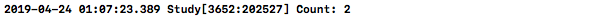

`firstObject`

+ 배열의 `첫번째 오브젝트를 반한`하는 함수.

```objc
NSArray *a =  [NSArray arrayWithObjects:@"A", @"B", nil];
    
NSLog(@"First Object: %@", [a firstObject]);
```

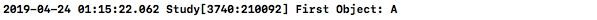

`lastObject`

+ 배열의 `마지막 오브젝트를 반한`하는 함수.

```objc
NSArray *a =  [NSArray arrayWithObjects:@"A", @"B", nil];
    
NSLog(@"Last Object: %@", [a lastObject]);
```

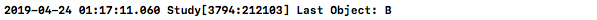

`objectAtIndex`

+ `지정한 인덱스에 위치한 오브젝트를 반환`하는 함수.

```objc
NSArray *a =  [NSArray arrayWithObjects:@"A", @"B", nil];
    
NSLog(@"Object at index 0: %@", [a objectAtIndex:0]);
```

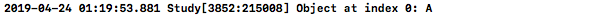

`objectsAtIndexes`

+ `IndexSet에 지정된 범위의 오브젝트들을 반환`하는 함수.

```objc
NSArray *a =  [NSArray arrayWithObjects:@"A", @"B", @"C",nil];
    
a = [a objectsAtIndexes:[NSIndexSet indexSetWithIndexesInRange:NSMakeRange(1, 2)]];

NSLog(@"%@", a);
```

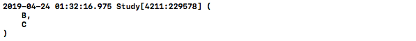

`objectEnumerator`

+ 배열의 각각의 `오브젝트들에 접근 할 수 있도록 Enumerator 오브젝트를 반환`하는 함수.

```objc
NSArray *a =  [NSArray arrayWithObjects:@"A", @"B", @"C",nil];
    
NSEnumerator *enumerator = [a objectEnumerator];
id anObject;
while (anObject = [enumerator nextObject]) {    // anObject가 null일때까지 Loop
    NSLog(@"%@", anObject);
}
```

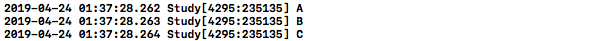

`reverseObjectEnumerator`

+ `거꾸로 오브젝트들에 접근 할 수 있도록 Enumerator 오브젝트를 반환`하는 함수.

```objc
NSArray *a =  [NSArray arrayWithObjects:@"A", @"B", @"C",nil];
    
NSEnumerator *enumerator = [a reverseObjectEnumerator];
id anObject;
while (anObject = [enumerator nextObject]) {
    NSLog(@"%@", anObject);
}
```

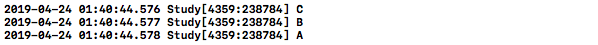

## Finding Objects in an Array

`indexOfObject`

+ 배열에서 주어진 `오브젝트와 동일한 가장 작은 index를 반환`하는 함수.

```objc
NSArray *a =  [NSArray arrayWithObjects:@"B", @"A", @"A",nil];
    
NSLog(@"Index of A is %d",[a indexOfObject:@"A"]);
```

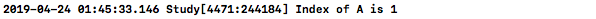

`indexOfObject:inRange`

+ `지정된 범위안`에서 `주어진 오브젝트와 동일한 가장 작은 index를 반환`하는 함수.

```objc
NSArray *a =  [NSArray arrayWithObjects:@"A", @"K", @"B", @"A", @"A",nil];
    
NSRange range = NSMakeRange(1, 4);  // 지정된 범위

NSLog(@"Index of A in range 1,4 is %d",[a indexOfObject:@"A" inRange:range]);
```

