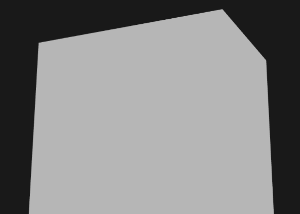

# Anti-aliasing

* aliasing(계단현상)을 부드럽게 처리해주는 기술

* aliasing(계단현상) 예


## 종류

* 슈퍼샘플링(Super sampling anti-aliasing,SSAA) : 고해상도로 렌더링한 후 원래 해상도로 줄임
  * 그래픽품질은 가장 뛰어나지만 고성능 요구
* 멀티샘플링(Multi Sampling Anti-Aliasing,MSAA) : 픽셀당 여러개의 샘플링을 취하는 방법
  * 보편적으로 사용되는 방식

## 멀티샘플링

* 픽셀 중앙의 점 대신 샘플 지점을 이용해 색을 결정하는 방법
* 컬러버퍼의 크기가 픽셀당 사용하는 샘플 수 만큼 증가
* 샘플 지점이 많아지면 더 정밀하게 렌더링 가능
  


* 멀티샘플링X(픽셀의 중심을 이용해 색을 결정하는 방법)


* 멀티샘플링(샘플 지점을 이용해 색을 결정하는 방법)


# MSAA in OpenGL

* 픽셀 당 하나 이상의 색상 값을 저장할 수 있는 색상 버퍼 사용 : `다중 샘플 버퍼(멀티 샘플 버퍼)`
  * 대부분 윈도우 시스템은 기본 색상 버퍼 대신 멀티 샘플 버퍼 제공
* ```glfwWindowHint(GLFW_SAMPLES, N);``` : N개의 샘플이 포함된 색상 버퍼가 있는 렌더링 창 생성
  * 버퍼의 크기가 N씩 증가
* ```glEnable(GL_MULTISAMPLE);``` : 멀티샘플링 활성화
* 실제 멀티 샘플링 알고리즘은 래스터 라이저에 구현되어 있음

# Off-screen MSAA

* 프레임버퍼를 사용해 멀티 샘플 버퍼 생성
* 멀티 샘플링된 프레임 버퍼에 대한 렌더링은 자동으로 진행
  * 프레임 버퍼가 바인딩 되어있는 동안 래스터라이저는 모든 멀티 샘플 작업을 처리
* 멀티 샘플 버퍼는 버퍼를 쉐이더에서 샘플링 할 수 없음
* 렌더링 가능한 버퍼(텍스처 or 렌더 버퍼) 추가
* 멀티 샘플 지점 저장을 지원하는 텍스처를 생성하기 위해 `glTexImage2DMultisample` 사용
```
// GL_TEXTURE_2D_MULTISAMPLE 을 텍스처 타겟으로 사용
glBindTexture(GL_TEXTURE_2D_MULTISAMPLE, tex);
// 텍스처 생성
glTexImage2DMultisample(GL_TEXTURE_2D_MULTISAMPLE, samples, GL_RGB, width, height, GL_TRUE); 
glBindTexture(GL_TEXTURE_2D_MULTISAMPLE, 0); 
```

```void glTexImage2DMultisample(GLenum target, GLsizei samples, GLenum internalformat, GLsizei width, GLsizei height, GLboolean fixedsamplelocations);```
  * `fixedsamplelocations` : `GL_TRUE` 면 이미지는 동일한 샘플 위치와 각 텍셀에 대해 동일한 수의 샘플을 사용

* 멀티 샘플링된 텍스처를 프레임 버퍼에 붙임
```
glFramebufferTexture2D(GL_FRAMEBUFFER, GL_COLOR_ATTACHMENT0, GL_TEXTURE_2D_MULTISAMPLE, tex, 0);
```
* 바인드된 프레임 버퍼에는 텍스처 샘플 형식으로 멀티 샘플링된 컬러 버퍼가 포함됨
  
```void glFramebufferTexture2D(	GLenum target, GLenum attachment, GLenum textarget, GLuint texture, GLint level);```
  * `target` : 프레임 버퍼 타겟
  * `attachment` : 텍스처 이미지를 붙일 포인터
  * `textarget` : 텍스처 타겟
  * `textrue` : 붙일 텍스처
  * `level` : 밉맵 레벨

* 멀티 샘플 렌더 버퍼 생성
```
// 렌더 버퍼의 메모리 저장소 지정(4개의 샘플 설정)
glRenderbufferStorageMultisample(GL_RENDERBUFFER, 4, GL_DEPTH24_STENCIL8, width, height); 
```

* 멀티 샘플링된 이미지는 일반 이미지보다 정보가 많으므로 원래 해상도로 맞춰야함
  
```
glBindFramebuffer(GL_READ_FRAMEBUFFER, multisampledFBO); 
glBindFramebuffer(GL_DRAW_FRAMEBUFFER, 0); 
// READ_BUFFER를 DRAW_BUFFER에 복사
glBlitFramebuffer(0, 0, width, height, 0, 0, width, height, GL_COLOR_BUFFER_BIT, GL_NEAREST); 
```

* 다중 샘플 프레임 버퍼의 결과를 post-processing에 사용가능
* fragment shader에서 멀티 샘플 텍스처를 직접 사용할 수는 없음
* 멀티 샘플 버퍼를 일반 2D 텍스처로 분해
 * 중간 프레임 버퍼로 동작하는 새로운 FBO 생성

# Fragment Shader

```cpp
#version 330 core
out vec4 FragColor;

in vec2 TexCoords;

uniform sampler2D screenTexture;

void main() {
    vec3 col = texture(screenTexture, TexCoords).rgb;
    float grayscale = 0.2126 * col.r + 0.7152 * col.g + 0.0722 * col.b;
    FragColor = vec4(vec3(grayscale), 1.0);
}
```

# Source Codes

```cpp
#include <glad/glad.h>
#include <GLFW/glfw3.h>
#include <stb_image.h>

#include <glm/glm.hpp>
#include <glm/gtc/matrix_transform.hpp>
#include <glm/gtc/type_ptr.hpp>

#include <learnopengl/filesystem.h>
#include <learnopengl/shader.h>
#include <learnopengl/camera.h>
#include <learnopengl/model.h>

#include <iostream>

void framebuffer_size_callback(GLFWwindow* window, int width, int height);
void mouse_callback(GLFWwindow* window, double xpos, double ypos);
void scroll_callback(GLFWwindow* window, double xoffset, double yoffset);
void processInput(GLFWwindow *window);

// settings
const unsigned int SCR_WIDTH = 1280;
const unsigned int SCR_HEIGHT = 720;

// camera
Camera camera(glm::vec3(0.0f, 0.0f, 3.0f));
float lastX = (float)SCR_WIDTH / 2.0;
float lastY = (float)SCR_HEIGHT / 2.0;
bool firstMouse = true;

// timing
float deltaTime = 0.0f;
float lastFrame = 0.0f;

int main() {
    // glfw: initialize and configure
    // ------------------------------
    glfwInit();
    glfwWindowHint(GLFW_CONTEXT_VERSION_MAJOR, 3);
    glfwWindowHint(GLFW_CONTEXT_VERSION_MINOR, 3);
    glfwWindowHint(GLFW_OPENGL_PROFILE, GLFW_OPENGL_CORE_PROFILE);

#ifdef __APPLE__
    glfwWindowHint(GLFW_OPENGL_FORWARD_COMPAT, GL_TRUE); // uncomment this statement to fix compilation on OS X
#endif

    // glfw window creation
    // --------------------
    GLFWwindow* window = glfwCreateWindow(SCR_WIDTH, SCR_HEIGHT, "LearnOpenGL", NULL, NULL);
    if (window == NULL)
    {
        std::cout << "Failed to create GLFW window" << std::endl;
        glfwTerminate();
        return -1;
    }
    glfwMakeContextCurrent(window);
    glfwSetFramebufferSizeCallback(window, framebuffer_size_callback);
    glfwSetCursorPosCallback(window, mouse_callback);
    glfwSetScrollCallback(window, scroll_callback);

    // tell GLFW to capture our mouse
    glfwSetInputMode(window, GLFW_CURSOR, GLFW_CURSOR_DISABLED);

    // glad: load all OpenGL function pointers
    // ---------------------------------------
    if (!gladLoadGLLoader((GLADloadproc)glfwGetProcAddress))
    {
        std::cout << "Failed to initialize GLAD" << std::endl;
        return -1;
    }

    // configure global opengl state
    // -----------------------------
    glEnable(GL_DEPTH_TEST);

    // build and compile shaders
    // -------------------------
    Shader shader("11.anti_aliasing.vs", "11.anti_aliasing.fs");
    Shader screenShader("11.aa_post.vs", "11.aa_post.fs");

    // set up vertex data (and buffer(s)) and configure vertex attributes
    // ------------------------------------------------------------------
    float cubeVertices[] = {
        // positions       
        -0.5f, -0.5f, -0.5f,
         0.5f, -0.5f, -0.5f,
         0.5f,  0.5f, -0.5f,
         0.5f,  0.5f, -0.5f,
        -0.5f,  0.5f, -0.5f,
        -0.5f, -0.5f, -0.5f,

        -0.5f, -0.5f,  0.5f,
         0.5f, -0.5f,  0.5f,
         0.5f,  0.5f,  0.5f,
         0.5f,  0.5f,  0.5f,
        -0.5f,  0.5f,  0.5f,
        -0.5f, -0.5f,  0.5f,

        -0.5f,  0.5f,  0.5f,
        -0.5f,  0.5f, -0.5f,
        -0.5f, -0.5f, -0.5f,
        -0.5f, -0.5f, -0.5f,
        -0.5f, -0.5f,  0.5f,
        -0.5f,  0.5f,  0.5f,

         0.5f,  0.5f,  0.5f,
         0.5f,  0.5f, -0.5f,
         0.5f, -0.5f, -0.5f,
         0.5f, -0.5f, -0.5f,
         0.5f, -0.5f,  0.5f,
         0.5f,  0.5f,  0.5f,

        -0.5f, -0.5f, -0.5f,
         0.5f, -0.5f, -0.5f,
         0.5f, -0.5f,  0.5f,
         0.5f, -0.5f,  0.5f,
        -0.5f, -0.5f,  0.5f,
        -0.5f, -0.5f, -0.5f,

        -0.5f,  0.5f, -0.5f,
         0.5f,  0.5f, -0.5f,
         0.5f,  0.5f,  0.5f,
         0.5f,  0.5f,  0.5f,
        -0.5f,  0.5f,  0.5f,
        -0.5f,  0.5f, -0.5f
    };
    float quadVertices[] = {   // vertex attributes for a quad that fills the entire screen in Normalized Device Coordinates.
        // positions   // texCoords
        -1.0f,  1.0f,  0.0f, 1.0f,
        -1.0f, -1.0f,  0.0f, 0.0f,
         1.0f, -1.0f,  1.0f, 0.0f,

        -1.0f,  1.0f,  0.0f, 1.0f,
         1.0f, -1.0f,  1.0f, 0.0f,
         1.0f,  1.0f,  1.0f, 1.0f
    };
    // setup cube VAO
    unsigned int cubeVAO, cubeVBO;
    glGenVertexArrays(1, &cubeVAO);
    glGenBuffers(1, &cubeVBO);
    glBindVertexArray(cubeVAO);
    glBindBuffer(GL_ARRAY_BUFFER, cubeVBO);
    glBufferData(GL_ARRAY_BUFFER, sizeof(cubeVertices), &cubeVertices, GL_STATIC_DRAW);
    glEnableVertexAttribArray(0);
    glVertexAttribPointer(0, 3, GL_FLOAT, GL_FALSE, 3 * sizeof(float), (void*)0);
    // setup screen VAO
    unsigned int quadVAO, quadVBO;
    glGenVertexArrays(1, &quadVAO);
    glGenBuffers(1, &quadVBO);
    glBindVertexArray(quadVAO);
    glBindBuffer(GL_ARRAY_BUFFER, quadVBO);
    glBufferData(GL_ARRAY_BUFFER, sizeof(quadVertices), &quadVertices, GL_STATIC_DRAW);
    glEnableVertexAttribArray(0);
    glVertexAttribPointer(0, 2, GL_FLOAT, GL_FALSE, 4 * sizeof(float), (void*)0);
    glEnableVertexAttribArray(1);
    glVertexAttribPointer(1, 2, GL_FLOAT, GL_FALSE, 4 * sizeof(float), (void*)(2 * sizeof(float)));


    // MSAA framebuffer 설정
    // ---------------------------------------------------------------------
    unsigned int framebuffer;
    glGenFramebuffers(1, &framebuffer);                 // 프레임버퍼 생성
    glBindFramebuffer(GL_FRAMEBUFFER, framebuffer);     // 프레임버퍼 바인딩
    
    // 멀티 샘플링을 지원하는 텍스처 생성
    unsigned int textureColorBufferMultiSampled;
    glGenTextures(1, &textureColorBufferMultiSampled);
    glBindTexture(GL_TEXTURE_2D_MULTISAMPLE, textureColorBufferMultiSampled);
    // 샘플의 수는 4개
    // 동일한 샘플 위치와 각 텍셀에 대해 동일한 수의 샘플을 사용 
    glTexImage2DMultisample(GL_TEXTURE_2D_MULTISAMPLE, 4, GL_RGB, SCR_WIDTH, SCR_HEIGHT, GL_TRUE);
    // 프레임버퍼에 멀티 샘플링된 텍스처 첨부
    glBindTexture(GL_TEXTURE_2D_MULTISAMPLE, 0);
    glFramebufferTexture2D(GL_FRAMEBUFFER, GL_COLOR_ATTACHMENT0, GL_TEXTURE_2D_MULTISAMPLE, textureColorBufferMultiSampled, 0);

    // 깊이 버퍼와 스텐실 버퍼를 위해 렌더 버퍼를 생성
    unsigned int rbo;
    glGenRenderbuffers(1, &rbo);
    glBindRenderbuffer(GL_RENDERBUFFER, rbo);
    // 샘플의 수 4개
    glRenderbufferStorageMultisample(GL_RENDERBUFFER, 4, GL_DEPTH24_STENCIL8, SCR_WIDTH, SCR_HEIGHT);
    // 프레임버퍼에 렌더버퍼 첨부
    glBindRenderbuffer(GL_RENDERBUFFER, 0);
    glFramebufferRenderbuffer(GL_FRAMEBUFFER, GL_DEPTH_STENCIL_ATTACHMENT, GL_RENDERBUFFER, rbo);

    if (glCheckFramebufferStatus(GL_FRAMEBUFFER) != GL_FRAMEBUFFER_COMPLETE)
        cout << "ERROR::FRAMEBUFFER:: Framebuffer is not complete!" << endl;
    glBindFramebuffer(GL_FRAMEBUFFER, 0);

    // post-processing 용 프레임버퍼 생성
    unsigned int intermediateFBO;
    glGenFramebuffers(1, &intermediateFBO);
    glBindFramebuffer(GL_FRAMEBUFFER, intermediateFBO);
    
    // 2D 텍스처 생성
    unsigned int screenTexture;
    glGenTextures(1, &screenTexture);
    glBindTexture(GL_TEXTURE_2D, screenTexture);
    glTexImage2D(GL_TEXTURE_2D, 0, GL_RGB, SCR_WIDTH, SCR_HEIGHT, 0, GL_RGB, GL_UNSIGNED_BYTE, NULL);
    glTexParameteri(GL_TEXTURE_2D, GL_TEXTURE_MIN_FILTER, GL_LINEAR);
    glTexParameteri(GL_TEXTURE_2D, GL_TEXTURE_MAG_FILTER, GL_LINEAR);
    glFramebufferTexture2D(GL_FRAMEBUFFER, GL_COLOR_ATTACHMENT0, GL_TEXTURE_2D, screenTexture, 0);

    if (glCheckFramebufferStatus(GL_FRAMEBUFFER) != GL_FRAMEBUFFER_COMPLETE)
        cout << "ERROR::FRAMEBUFFER:: Intermediate framebuffer is not complete!" << endl;
    glBindFramebuffer(GL_FRAMEBUFFER, 0);

    // shader configuration
    // --------------------
    shader.use();
    // 0번 텍스처로 설정
    screenShader.setInt("screenTexture", 0);

    // render loop
    // -----------
    while (!glfwWindowShouldClose(window))
    {
        // per-frame time logic
        // --------------------
        float currentFrame = glfwGetTime();
        deltaTime = currentFrame - lastFrame;
        lastFrame = currentFrame;

        // input
        // -----
        processInput(window);

        // render
        // ------
        glClearColor(0.1f, 0.1f, 0.1f, 1.0f);
        glClear(GL_COLOR_BUFFER_BIT | GL_DEPTH_BUFFER_BIT);

        // MSAA용 프레임 버퍼 바인딩
        // ----------------------------------------------------
        glBindFramebuffer(GL_FRAMEBUFFER, framebuffer);
        glClearColor(0.1f, 0.1f, 0.1f, 1.0f);
        glClear(GL_COLOR_BUFFER_BIT | GL_DEPTH_BUFFER_BIT);
        glEnable(GL_DEPTH_TEST);

        // set transformation matrices		
        shader.use();
        glm::mat4 projection = glm::perspective(glm::radians(camera.Zoom), (float)SCR_WIDTH / (float)SCR_HEIGHT, 0.1f, 1000.0f);
        shader.setMat4("projection", projection);
        shader.setMat4("view", camera.GetViewMatrix());
        shader.setMat4("model", glm::mat4(1.0f));

        glBindVertexArray(cubeVAO);
        glDrawArrays(GL_TRIANGLES, 0, 36);

        // MSAA용 프레임버퍼의 내용을 post-processing 용 프레임버퍼로 복사
        glBindFramebuffer(GL_READ_FRAMEBUFFER, framebuffer);
        glBindFramebuffer(GL_DRAW_FRAMEBUFFER, intermediateFBO);
        glBlitFramebuffer(0, 0, SCR_WIDTH, SCR_HEIGHT, 0, 0, SCR_WIDTH, SCR_HEIGHT, GL_COLOR_BUFFER_BIT, GL_NEAREST);

        // 씬 클리어
        glBindFramebuffer(GL_FRAMEBUFFER, 0);
        glClearColor(1.0f, 1.0f, 1.0f, 1.0f);
        glClear(GL_COLOR_BUFFER_BIT);
        glDisable(GL_DEPTH_TEST);

        screenShader.use();
        glBindVertexArray(quadVAO);
        glActiveTexture(GL_TEXTURE0);
        // post-processing 용 프레임버퍼 텍스처 바인딩
        glBindTexture(GL_TEXTURE_2D, screenTexture); 
        glDrawArrays(GL_TRIANGLES, 0, 6);

        // glfw: swap buffers and poll IO events (keys pressed/released, mouse moved etc.)
        // -------------------------------------------------------------------------------
        glfwSwapBuffers(window);
        glfwPollEvents();
    }

    glfwTerminate();
    return 0;
}
```

# Result

