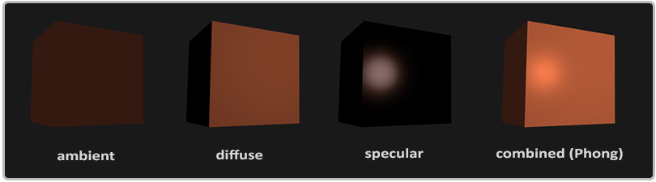
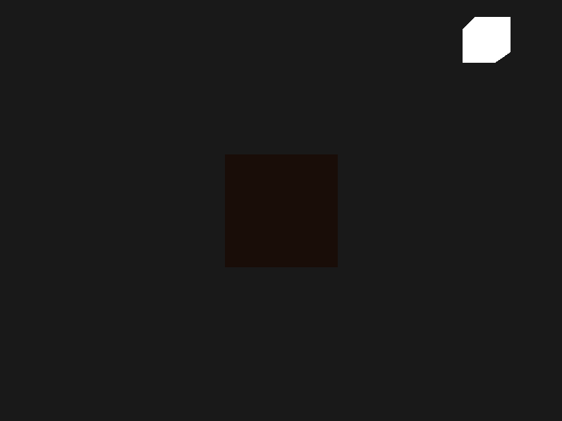
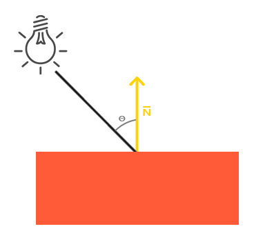
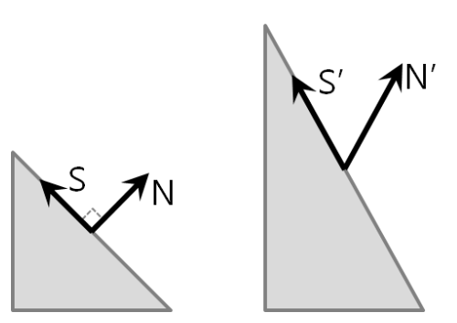
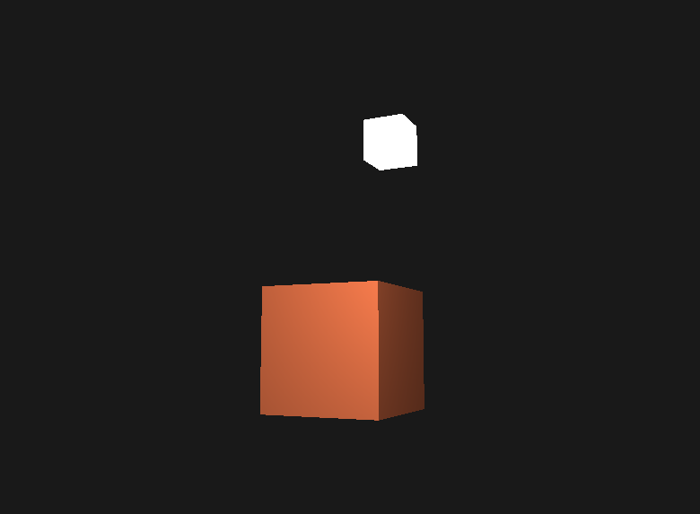

# 기본 조명



* `Ambient lighting` : 주변광
  * 아무리 어두워도 일반적으로 world 어딘가에는 조명이 존재
* `Diffuse lighting` : 분산광
  * 물체의 표면에서 분산된 빛
* `Specular lighting` : 반사광

# Ambient lighting

* 빛은 일반적으로 하나의 광원으로부터 오는것이 아니라 주변에 산재되있는 많은 광원으로부터 옴
* 빛의 산란을 표현한 알고리즘 : `global illumination`
  * 비용이 많이 들고 매우 복잡함
* `ambient lighting` : 최종 컬러에 작은 상수 값(컬러)를 곱해 항상 퍼지는 빛이 있는 것처럼 보이게 만듦

```cpp
[fragment shader]

void main() {
    float ambientStrength = 0.1;
    vec3 ambient = ambientStrength * lightColor;

    vec3 result = ambient * objectColor;
    FragColor = vec4(result, 1.0);
} 
```



* 빛 오브젝트는 다른 쉐이더 사용
* `ambient lighting`이 적용되어서 완전히 어둡지는 않음

# Diffuse lighting



* 빛의 방향에 따라 다르게 빛나는 fragment를 만들 수 있음
* `Lambert's Cosine Law`를 이용해 fragment에서의 빛의 양을 계산
  * cf) Lambert's Cosine Law : Lambertian surface의 법선 방향으로 방사된 빛의 광도를 I0, 각 θ방향으로 방사된 빛의 강도(또는 광도)를 Iθ라고 하면 `Iθ＝I0*cosθ`의 관계가 성립된다는 법칙
* `법선벡터`와 `광원과 fragment의 위치 사이의 방향 벡터`가 필요

# Normal Vector

* 법선 벡터를 world space로 변환할 때는 `model 행렬`이 아닌 `법선 행렬`을 사용함



* `법선 행렬` : model 행렬의 역행렬에 대한 전치 행렬

```cpp
Normal = mat3(transpose(inverse(model))) * aNormal;  
```

```
S·N = 0
S´ = MS                 ------ 모델뷰 행렬에 의해 변환
N´ = KN                 ------ K값을 구해야함(법선 행렬)
S´·N´ = 0               ------ S´과N´는 수직이어야함
(MS)·(KN) = 0
(MS)T*(KN) = 0	        ------ 벡터의 내적의 결과는 첫번째 벡터의 전치에 의한 단순곱과 같음
(ST*MT)*(KN) = 0
ST*MT*K*N = 0
ST(MT*K)N = 0
S·N = ST * N = 0
(MT*K) = I  	        ----- I : 단위행렬
K = (MT)-I
K = (M-I)T              ----- 역행렬에 대한 전치 행렬
```

* 역행렬로 변환하는 것은 비용이 많이 드는 연산이기 때문에 CPU에서 법선 행렬을 계산하고 uniform을 통해 shader로 전달


# Shader Codes

## Object Vertex shader

```cpp
#version 330 core
layout (location = 0) in vec3 aPos;
layout (location = 1) in vec3 aNormal;  // 법선 벡터 좌표

out vec3 FragPos;       // 실제 fragment의 world 좌표를 fragment shader에 전달하기 위한 변수
out vec3 Normal;        // 법선 벡터를 fragment shader에 전달하기 위한 변수

uniform mat4 model;
uniform mat4 view;
uniform mat4 projection;

void main() {
    // 모든 빛의 계산은 world space에서 이루어지므로 world 좌표 변환만 수행
    FragPos = vec3(model * vec4(aPos, 1.0));
    Normal = aNormal;  
    
    gl_Position = projection * view * vec4(FragPos, 1.0);
}
```

## Object Fragment shader

```cpp
#version 330 core
out vec4 FragColor;

in vec3 Normal;  
in vec3 FragPos;  
  
uniform vec3 lightPos; 
uniform vec3 lightColor;
uniform vec3 objectColor;

void main() {
    // ambient
    float ambientStrength = 0.1;
    vec3 ambient = ambientStrength * lightColor;
  	
    // diffuse
    //----- diffuse term = Kd * lightColor * max(N·L, 0); 
    // 빛을 계산할땐 벡터의 크기를 생각하지 않으므로(방향이 중요) 정규화 
    vec3 norm = normalize(Normal);
    vec3 lightDir = normalize(lightPos - FragPos);  // 광원과 오브젝트 사이의 방향벡터
    float diff = max(dot(norm, lightDir), 0.0);     // 음의 값을 가지는 컬러는 정의 X
    vec3 diffuse = diff * lightColor;
    vec3 result = (ambient + diffuse) * objectColor;    // 최종 컬러 결정
    FragColor = vec4(result, 1.0);
} 
```

# Source Codes

```cpp
#include <glad/glad.h>
#include <GLFW/glfw3.h>

#include <glm/glm.hpp>
#include <glm/gtc/matrix_transform.hpp>
#include <glm/gtc/type_ptr.hpp>

#include <learnopengl/filesystem.h>
#include <learnopengl/shader_m.h>
#include <learnopengl/camera.h>

#include <iostream>

void framebuffer_size_callback(GLFWwindow* window, int width, int height);
void mouse_callback(GLFWwindow* window, double xpos, double ypos);
void scroll_callback(GLFWwindow* window, double xoffset, double yoffset);
void processInput(GLFWwindow *window);

// settings
const unsigned int SCR_WIDTH = 800;
const unsigned int SCR_HEIGHT = 600;

// camera
Camera camera(glm::vec3(0.0f, 0.0f, 3.0f));
float lastX = SCR_WIDTH / 2.0f;
float lastY = SCR_HEIGHT / 2.0f;
bool firstMouse = true;

// timing
float deltaTime = 0.0f;	
float lastFrame = 0.0f;

// lighting
glm::vec3 lightPos(1.2f, 1.0f, 2.0f);

int main() {
    // glfw: initialize and configure
    // ------------------------------
    glfwInit();
    glfwWindowHint(GLFW_CONTEXT_VERSION_MAJOR, 3);
    glfwWindowHint(GLFW_CONTEXT_VERSION_MINOR, 3);
    glfwWindowHint(GLFW_OPENGL_PROFILE, GLFW_OPENGL_CORE_PROFILE);

#ifdef __APPLE__
    glfwWindowHint(GLFW_OPENGL_FORWARD_COMPAT, GL_TRUE); // uncomment this statement to fix compilation on OS X
#endif

    // glfw window creation
    // --------------------
    GLFWwindow* window = glfwCreateWindow(SCR_WIDTH, SCR_HEIGHT, "LearnOpenGL", NULL, NULL);
    if (window == NULL) {
        std::cout << "Failed to create GLFW window" << std::endl;
        glfwTerminate();
        return -1;
    }
    glfwMakeContextCurrent(window);
    glfwSetFramebufferSizeCallback(window, framebuffer_size_callback);
    glfwSetCursorPosCallback(window, mouse_callback);
    glfwSetScrollCallback(window, scroll_callback);

    // tell GLFW to capture our mouse
    glfwSetInputMode(window, GLFW_CURSOR, GLFW_CURSOR_DISABLED);

    // glad: load all OpenGL function pointers
    // ---------------------------------------
    if (!gladLoadGLLoader((GLADloadproc)glfwGetProcAddress)) {
        std::cout << "Failed to initialize GLAD" << std::endl;
        return -1;
    }

    // configure global opengl state
    // -----------------------------
    glEnable(GL_DEPTH_TEST);

    // build and compile our shader zprogram
    // ------------------------------------
    Shader lightingShader("2.1.basic_lighting.vs", "2.1.basic_lighting.fs");
    Shader lampShader("2.1.lamp.vs", "2.1.lamp.fs");

    // 노말벡터 좌표도 설정
    // ------------------------------------------------------------------
    float vertices[] = {
        -0.5f, -0.5f, -0.5f,  0.0f,  0.0f, -1.0f,
         0.5f, -0.5f, -0.5f,  0.0f,  0.0f, -1.0f,
         0.5f,  0.5f, -0.5f,  0.0f,  0.0f, -1.0f,
         0.5f,  0.5f, -0.5f,  0.0f,  0.0f, -1.0f,
        -0.5f,  0.5f, -0.5f,  0.0f,  0.0f, -1.0f,
        -0.5f, -0.5f, -0.5f,  0.0f,  0.0f, -1.0f,

        -0.5f, -0.5f,  0.5f,  0.0f,  0.0f,  1.0f,
         0.5f, -0.5f,  0.5f,  0.0f,  0.0f,  1.0f,
         0.5f,  0.5f,  0.5f,  0.0f,  0.0f,  1.0f,
         0.5f,  0.5f,  0.5f,  0.0f,  0.0f,  1.0f,
        -0.5f,  0.5f,  0.5f,  0.0f,  0.0f,  1.0f,
        -0.5f, -0.5f,  0.5f,  0.0f,  0.0f,  1.0f,

        -0.5f,  0.5f,  0.5f, -1.0f,  0.0f,  0.0f,
        -0.5f,  0.5f, -0.5f, -1.0f,  0.0f,  0.0f,
        -0.5f, -0.5f, -0.5f, -1.0f,  0.0f,  0.0f,
        -0.5f, -0.5f, -0.5f, -1.0f,  0.0f,  0.0f,
        -0.5f, -0.5f,  0.5f, -1.0f,  0.0f,  0.0f,
        -0.5f,  0.5f,  0.5f, -1.0f,  0.0f,  0.0f,

         0.5f,  0.5f,  0.5f,  1.0f,  0.0f,  0.0f,
         0.5f,  0.5f, -0.5f,  1.0f,  0.0f,  0.0f,
         0.5f, -0.5f, -0.5f,  1.0f,  0.0f,  0.0f,
         0.5f, -0.5f, -0.5f,  1.0f,  0.0f,  0.0f,
         0.5f, -0.5f,  0.5f,  1.0f,  0.0f,  0.0f,
         0.5f,  0.5f,  0.5f,  1.0f,  0.0f,  0.0f,

        -0.5f, -0.5f, -0.5f,  0.0f, -1.0f,  0.0f,
         0.5f, -0.5f, -0.5f,  0.0f, -1.0f,  0.0f,
         0.5f, -0.5f,  0.5f,  0.0f, -1.0f,  0.0f,
         0.5f, -0.5f,  0.5f,  0.0f, -1.0f,  0.0f,
        -0.5f, -0.5f,  0.5f,  0.0f, -1.0f,  0.0f,
        -0.5f, -0.5f, -0.5f,  0.0f, -1.0f,  0.0f,

        -0.5f,  0.5f, -0.5f,  0.0f,  1.0f,  0.0f,
         0.5f,  0.5f, -0.5f,  0.0f,  1.0f,  0.0f,
         0.5f,  0.5f,  0.5f,  0.0f,  1.0f,  0.0f,
         0.5f,  0.5f,  0.5f,  0.0f,  1.0f,  0.0f,
        -0.5f,  0.5f,  0.5f,  0.0f,  1.0f,  0.0f,
        -0.5f,  0.5f, -0.5f,  0.0f,  1.0f,  0.0f
    };
    // 오브젝트 VAO 설정
    unsigned int VBO, cubeVAO;
    glGenVertexArrays(1, &cubeVAO);
    glGenBuffers(1, &VBO);

    glBindBuffer(GL_ARRAY_BUFFER, VBO);
    glBufferData(GL_ARRAY_BUFFER, sizeof(vertices), vertices, GL_STATIC_DRAW);

    glBindVertexArray(cubeVAO);

    // 위치 attribute
    glVertexAttribPointer(0, 3, GL_FLOAT, GL_FALSE, 6 * sizeof(float), (void*)0);
    glEnableVertexAttribArray(0);
    // 노말벡터 attribute
    glVertexAttribPointer(1, 3, GL_FLOAT, GL_FALSE, 6 * sizeof(float), (void*)(3 * sizeof(float)));
    glEnableVertexAttribArray(1);


    // 광원 오브젝트 VAO 설정 ( 같은 VBO 사용 )
    unsigned int lightVAO;
    glGenVertexArrays(1, &lightVAO);
    glBindVertexArray(lightVAO);

    glBindBuffer(GL_ARRAY_BUFFER, VBO);
    // lamp shader에서는 추가된 법선 벡터를 사용하지 않으므로 stride 값만 변경
    // 비효율적으로 보일 수 있으나 이미 GPU안에 저장되어 있기 때문에 새로운 데이터를 저장할 필요가 없음, 새로운 VBO를 할당하는 것보다 효율적
    glVertexAttribPointer(0, 3, GL_FLOAT, GL_FALSE, 6 * sizeof(float), (void*)0);
    glEnableVertexAttribArray(0);


    // render loop
    // -----------
    while (!glfwWindowShouldClose(window))
    {
        // per-frame time logic
        // --------------------
        float currentFrame = glfwGetTime();
        deltaTime = currentFrame - lastFrame;
        lastFrame = currentFrame;

        // input
        // -----
        processInput(window);

        // render
        // ------
        glClearColor(0.1f, 0.1f, 0.1f, 1.0f);
        glClear(GL_COLOR_BUFFER_BIT | GL_DEPTH_BUFFER_BIT);

        // 오브젝트 셋팅
        // ---------------------------------------------------------------------
        lightingShader.use();
        lightingShader.setVec3("objectColor", 1.0f, 0.5f, 0.31f);   // object 컬러 셋팅
        lightingShader.setVec3("lightColor", 1.0f, 1.0f, 1.0f);     // 광원 컬러 셋팅
        lightingShader.setVec3("lightPos", lightPos);               // 광원 위치 셋팅

        // view/projection 변환
        glm::mat4 projection = glm::perspective(glm::radians(camera.Zoom), (float)SCR_WIDTH / (float)SCR_HEIGHT, 0.1f, 100.0f);
        glm::mat4 view = camera.GetViewMatrix();
        lightingShader.setMat4("projection", projection);
        lightingShader.setMat4("view", view);

        // world 변환
        glm::mat4 model = glm::mat4(1.0f);
        lightingShader.setMat4("model", model);

        // render the cube
        glBindVertexArray(cubeVAO);
        glDrawArrays(GL_TRIANGLES, 0, 36);


        // 광원 셋팅
        // ---------------------------------------------------------------------
        lampShader.use();
        lampShader.setMat4("projection", projection);
        lampShader.setMat4("view", view);
        model = glm::mat4(1.0f);
        model = glm::translate(model, lightPos);
        model = glm::scale(model, glm::vec3(0.2f)); // a smaller cube
        lampShader.setMat4("model", model);

        glBindVertexArray(lightVAO);
        glDrawArrays(GL_TRIANGLES, 0, 36);

        glfwSwapBuffers(window);
        glfwPollEvents();
    }

    glDeleteVertexArrays(1, &cubeVAO);
    glDeleteVertexArrays(1, &lightVAO);
    glDeleteBuffers(1, &VBO);

    glfwTerminate();
    return 0;
}

void processInput(GLFWwindow *window) {
    if (glfwGetKey(window, GLFW_KEY_ESCAPE) == GLFW_PRESS)
        glfwSetWindowShouldClose(window, true);

    if (glfwGetKey(window, GLFW_KEY_W) == GLFW_PRESS)
        camera.ProcessKeyboard(FORWARD, deltaTime);
    if (glfwGetKey(window, GLFW_KEY_S) == GLFW_PRESS)
        camera.ProcessKeyboard(BACKWARD, deltaTime);
    if (glfwGetKey(window, GLFW_KEY_A) == GLFW_PRESS)
        camera.ProcessKeyboard(LEFT, deltaTime);
    if (glfwGetKey(window, GLFW_KEY_D) == GLFW_PRESS)
        camera.ProcessKeyboard(RIGHT, deltaTime);
}

void framebuffer_size_callback(GLFWwindow* window, int width, int height) {
    glViewport(0, 0, width, height);
}

void mouse_callback(GLFWwindow* window, double xpos, double ypos) {
    if (firstMouse) {
        lastX = xpos;
        lastY = ypos;
        firstMouse = false;
    }

    float xoffset = xpos - lastX;
    float yoffset = lastY - ypos; // reversed since y-coordinates go from bottom to top

    lastX = xpos;
    lastY = ypos;

    camera.ProcessMouseMovement(xoffset, yoffset);
}

void scroll_callback(GLFWwindow* window, double xoffset, double yoffset) {
    camera.ProcessMouseScroll(yoffset);
}
```

# Result

