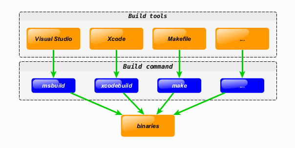
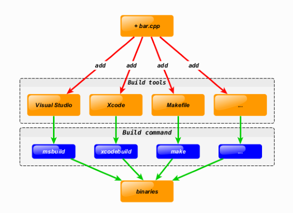
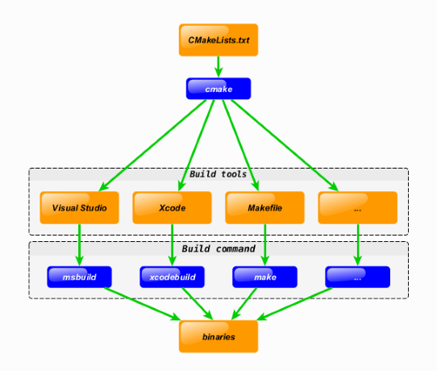
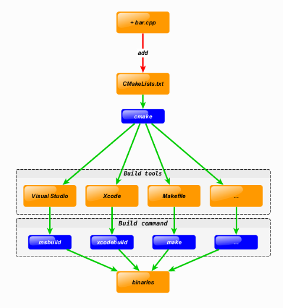

# CMAKE

* 빌드, 테스트 및 패키징하도록 설계된 오픈소스, 크로스 플랫폼 제품군
* 정의된 `CMAKE` 스크립트를 기반으로 소스 코드 파일 모음을 사용자가 선택한 프로젝트/솔루션 파일로 생성할 수 있는 도구
* `Makefile`보다 추상화된 기술 문법, Build Step을 기술하면, Makefile을 자동으로 생성
  * 일종의 Meta-Makefile
  * 범용 IDE에서 프로젝트 설정 파일로 사용할 수 있음
  * CMAKE 스크립트 : 일반적으로 `CMakeLists.txt`에 기술 

* ex) 다른 플랫폼/IDE에서 공유되는 C++코드가 있는 교차 플랫폼 프로젝트가 있다

* `bar.cpp` 소스파일 하나 추가하려면 수동으로 추가해야함

* `CMAKE` 사용

* `CMAKE` 사용 : `bar.cpp` 소스파일 추가

## visual studio 솔루션 생성

* `CMakeLists.txt` 경로로 이동

ex) `cd \LearnOpenGL\LearnOpenGL`

* cmake -G "(VS이름)" -B /설치경로
  
ex) `cmake -G "Visual Studio 15 2017" -B ./Build`
