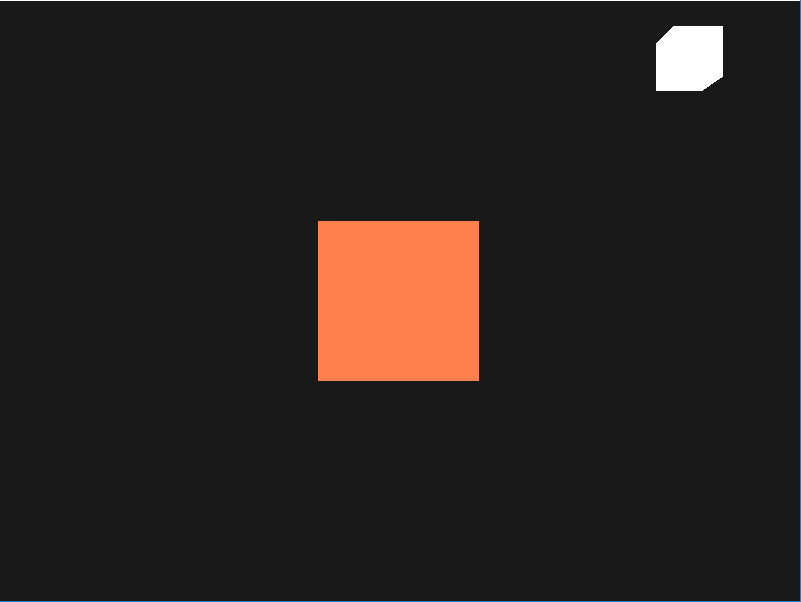

# Result

* 광원과 물체를 표현



# Color

* 실생활에서 보는 색 : 실제 사물이 가지고 있는 색이 아닌 반사된 색
* OpenGL에서의 색( 오브젝트에서 반사된 색 ) : 광원의 색 * 오브젝트의 색
* 흰색 빛 사용
* red,green,blue값을 반사시킴
```cpp
glm::vec3 lightColor(1.0f, 1.0f, 1.0f);
glm::vec3 toyColor(1.0f, 0.5f, 0.31f);
glm::vec3 result = lightColor * toyColor; // = (1.0f, 0.5f, 0.31f);
```

* 녹색 빛 사용
* green값만 반사됨(red, blue 인식 X)
```cpp
glm::vec3 lightColor(0.0f, 1.0f, 0.0f);
glm::vec3 toyColor(1.0f, 0.5f, 0.31f);
glm::vec3 result = lightColor * toyColor; // = (0.0f, 0.5f, 0.0f);
```

# Shader Codes

## Object

### Vertex shader

```cpp
#version 330 core
layout (location = 0) in vec3 aPos;

uniform mat4 model;
uniform mat4 view;
uniform mat4 projection;

void main() {
	gl_Position = projection * view * model * vec4(aPos, 1.0);
}
```

### Fragment shader

```cpp
#version 330 core
out vec4 FragColor;
  
uniform vec3 objectColor;   // 물체의 색
uniform vec3 lightColor;    // 광원의 색

void main() {
    FragColor = vec4(lightColor * objectColor, 1.0);
}
```

## Lighting

### Vertex shader

```cpp
#version 330 core
layout (location = 0) in vec3 aPos;

uniform mat4 model;
uniform mat4 view;
uniform mat4 projection;

void main() {
	gl_Position = projection * view * model * vec4(aPos, 1.0);
}
```

### Fragment shader

```cpp
#version 330 core
out vec4 FragColor;

void main() {
    FragColor = vec4(1.0); // set alle 4 vector values to 1.0
}
```

# Source Codes

```cpp
#include <glad/glad.h>
#include <GLFW/glfw3.h>

#include <glm/glm.hpp>
#include <glm/gtc/matrix_transform.hpp>
#include <glm/gtc/type_ptr.hpp>

#include <learnopengl/filesystem.h>
#include <learnopengl/shader_m.h>
#include <learnopengl/camera.h>

#include <iostream>

void framebuffer_size_callback(GLFWwindow* window, int width, int height);
void mouse_callback(GLFWwindow* window, double xpos, double ypos);
void scroll_callback(GLFWwindow* window, double xoffset, double yoffset);
void processInput(GLFWwindow *window);

// settings
const unsigned int SCR_WIDTH = 800;
const unsigned int SCR_HEIGHT = 600;

// camera
Camera camera(glm::vec3(0.0f, 0.0f, 5.0f));
float lastX = SCR_WIDTH / 2.0f;
float lastY = SCR_HEIGHT / 2.0f;
bool firstMouse = true;

// timing
float deltaTime = 0.0f;
float lastFrame = 0.0f;

// 광원의 위치
// ----------------------------------------
glm::vec3 lightPos(1.2f, 1.0f, 2.0f);

int main() {
    glfwInit();
    glfwWindowHint(GLFW_CONTEXT_VERSION_MAJOR, 3);
    glfwWindowHint(GLFW_CONTEXT_VERSION_MINOR, 3);
    glfwWindowHint(GLFW_OPENGL_PROFILE, GLFW_OPENGL_CORE_PROFILE);

#ifdef __APPLE__
    glfwWindowHint(GLFW_OPENGL_FORWARD_COMPAT, GL_TRUE); // uncomment this statement to fix compilation on OS X
#endif

    GLFWwindow* window = glfwCreateWindow(SCR_WIDTH, SCR_HEIGHT, "LearnOpenGL", NULL, NULL);
    if (window == NULL) {
        std::cout << "Failed to create GLFW window" << std::endl;
        glfwTerminate();
        return -1;
    }
    glfwMakeContextCurrent(window);
    glfwSetFramebufferSizeCallback(window, framebuffer_size_callback);
    glfwSetCursorPosCallback(window, mouse_callback);
    glfwSetScrollCallback(window, scroll_callback);

    // tell GLFW to capture our mouse
    glfwSetInputMode(window, GLFW_CURSOR, GLFW_CURSOR_DISABLED);

    // glad: load all OpenGL function pointers
    // ---------------------------------------
    if (!gladLoadGLLoader((GLADloadproc)glfwGetProcAddress)) {
        std::cout << "Failed to initialize GLAD" << std::endl;
        return -1;
    }

    glEnable(GL_DEPTH_TEST);

	// 셰이더 컴파일 및 링킹
	// ------------------------------------------------------
    Shader lightingShader("1.colors.vs", "1.colors.fs");
    Shader lampShader("1.lamp.vs", "1.lamp.fs");

    float vertices[] = {
        -0.5f, -0.5f, -0.5f, 
         0.5f, -0.5f, -0.5f,  
         0.5f,  0.5f, -0.5f,  
         0.5f,  0.5f, -0.5f,  
        -0.5f,  0.5f, -0.5f, 
        -0.5f, -0.5f, -0.5f, 

        -0.5f, -0.5f,  0.5f, 
         0.5f, -0.5f,  0.5f,  
         0.5f,  0.5f,  0.5f,  
         0.5f,  0.5f,  0.5f,  
        -0.5f,  0.5f,  0.5f, 
        -0.5f, -0.5f,  0.5f, 

        -0.5f,  0.5f,  0.5f, 
        -0.5f,  0.5f, -0.5f, 
        -0.5f, -0.5f, -0.5f, 
        -0.5f, -0.5f, -0.5f, 
        -0.5f, -0.5f,  0.5f, 
        -0.5f,  0.5f,  0.5f, 

         0.5f,  0.5f,  0.5f,  
         0.5f,  0.5f, -0.5f,  
         0.5f, -0.5f, -0.5f,  
         0.5f, -0.5f, -0.5f,  
         0.5f, -0.5f,  0.5f,  
         0.5f,  0.5f,  0.5f,  

        -0.5f, -0.5f, -0.5f, 
         0.5f, -0.5f, -0.5f,  
         0.5f, -0.5f,  0.5f,  
         0.5f, -0.5f,  0.5f,  
        -0.5f, -0.5f,  0.5f, 
        -0.5f, -0.5f, -0.5f, 

        -0.5f,  0.5f, -0.5f, 
         0.5f,  0.5f, -0.5f,  
         0.5f,  0.5f,  0.5f,  
         0.5f,  0.5f,  0.5f,  
        -0.5f,  0.5f,  0.5f, 
        -0.5f,  0.5f, -0.5f, 
    };
    // 오브젝트에 관한 VBO, VAO 셋팅
    unsigned int VBO, cubeVAO;
    glGenVertexArrays(1, &cubeVAO);
    glGenBuffers(1, &VBO);

    glBindBuffer(GL_ARRAY_BUFFER, VBO);
    glBufferData(GL_ARRAY_BUFFER, sizeof(vertices), vertices, GL_STATIC_DRAW);

    glBindVertexArray(cubeVAO);

    // position attribute
    glVertexAttribPointer(0, 3, GL_FLOAT, GL_FALSE, 3 * sizeof(float), (void*)0);
    glEnableVertexAttribArray(0);

    // 빛 오브젝트에 관한 VAO 셋팅 ( 3D 큐브를 사용할 것이므로 VBO는 같은 데이터를 씀 )
    unsigned int lightVAO;
    glGenVertexArrays(1, &lightVAO);
    glBindVertexArray(lightVAO);

    // 이미 바인딩되어 있음
    //glBindBuffer(GL_ARRAY_BUFFER, VBO);

    glVertexAttribPointer(0, 3, GL_FLOAT, GL_FALSE, 3 * sizeof(float), (void*)0);
    glEnableVertexAttribArray(0);

    // render loop
    // -----------
    while (!glfwWindowShouldClose(window)) {
        float currentFrame = glfwGetTime();
        deltaTime = currentFrame - lastFrame;
        lastFrame = currentFrame;

        // input
        // -----
        processInput(window);

        glClearColor(0.1f, 0.1f, 0.1f, 1.0f);
        glClear(GL_COLOR_BUFFER_BIT | GL_DEPTH_BUFFER_BIT);

        // uniform변수 셋팅이나 draw함수 전에 항상 shader 활성화
        // 오브젝트 셋팅
        // -----------------------------------------------------------
        lightingShader.use();
        lightingShader.setVec3("objectColor", 1.0f, 0.5f, 0.31f);
        lightingShader.setVec3("lightColor",  1.0f, 1.0f, 1.0f);

        // view/projection 변환
        // -----------------------------------------------------------
        glm::mat4 projection = glm::perspective(glm::radians(camera.Zoom), (float)SCR_WIDTH / (float)SCR_HEIGHT, 0.1f, 100.0f);
        glm::mat4 view = camera.GetViewMatrix();
        lightingShader.setMat4("projection", projection);
        lightingShader.setMat4("view", view);

        // world 변환
        // -----------------------------------------------------------
        glm::mat4 model = glm::mat4(1.0f);
        lightingShader.setMat4("model", model);

        // render the cube
        glBindVertexArray(cubeVAO);
        glDrawArrays(GL_TRIANGLES, 0, 36);

        // 빛 shader 활성화
        // 빛 오브젝트 셋팅
        // -----------------------------------------------------------
        lampShader.use();
        lampShader.setMat4("projection", projection);
        lampShader.setMat4("view", view);
        model = glm::mat4(1.0f);
        model = glm::translate(model, lightPos);    // 광원의 위치로 이동시킴(1.2f, 1.0f, 2.0f)
        model = glm::scale(model, glm::vec3(0.2f)); // 작게 만듦
        lampShader.setMat4("model", model);

        glBindVertexArray(lightVAO);
        glDrawArrays(GL_TRIANGLES, 0, 36);

        glfwSwapBuffers(window);
        glfwPollEvents();
    }

    glDeleteVertexArrays(1, &cubeVAO);
    glDeleteVertexArrays(1, &lightVAO);
    glDeleteBuffers(1, &VBO);

    glfwTerminate();
    return 0;
}

void processInput(GLFWwindow *window) {
    if (glfwGetKey(window, GLFW_KEY_ESCAPE) == GLFW_PRESS)
        glfwSetWindowShouldClose(window, true);

    if (glfwGetKey(window, GLFW_KEY_W) == GLFW_PRESS)
        camera.ProcessKeyboard(FORWARD, deltaTime);
    if (glfwGetKey(window, GLFW_KEY_S) == GLFW_PRESS)
        camera.ProcessKeyboard(BACKWARD, deltaTime);
    if (glfwGetKey(window, GLFW_KEY_A) == GLFW_PRESS)
        camera.ProcessKeyboard(LEFT, deltaTime);
    if (glfwGetKey(window, GLFW_KEY_D) == GLFW_PRESS)
        camera.ProcessKeyboard(RIGHT, deltaTime);
}

void framebuffer_size_callback(GLFWwindow* window, int width, int height) {
    glViewport(0, 0, width, height);
}

void mouse_callback(GLFWwindow* window, double xpos, double ypos) {
    if (firstMouse) {
        lastX = xpos;
        lastY = ypos;
        firstMouse = false;
    }

    float xoffset = xpos - lastX;
    float yoffset = lastY - ypos; // reversed since y-coordinates go from bottom to top

    lastX = xpos;
    lastY = ypos;

    camera.ProcessMouseMovement(xoffset, yoffset);
}

void scroll_callback(GLFWwindow* window, double xoffset, double yoffset) {
    camera.ProcessMouseScroll(yoffset);
}
```
