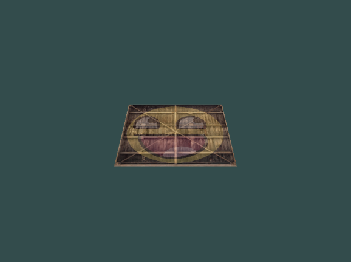
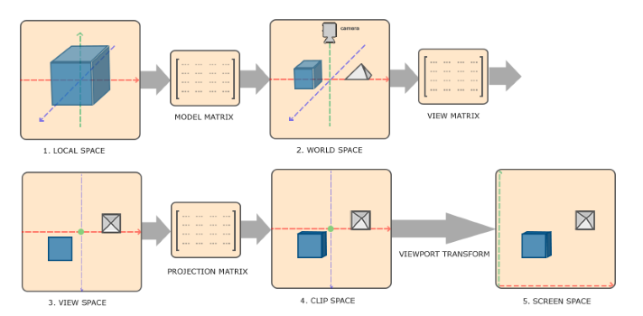
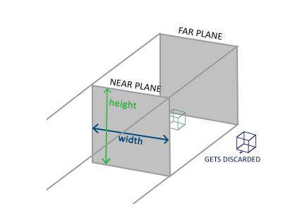
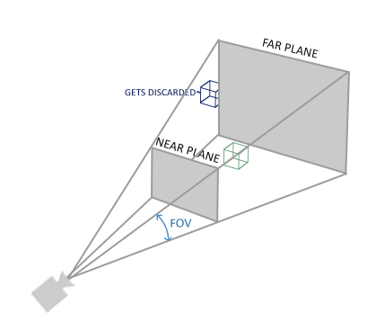
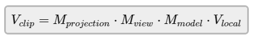
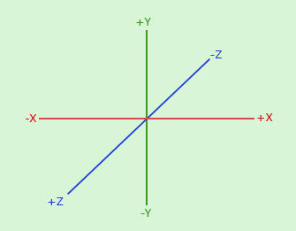

# Abstracts

* 변환을 사용해보자

# Results



# 좌표 시스템

  * Local space ( Object space )
  * World space
  * View space ( Eye Space )
  * Clip space
  * Screen space



* Local 좌표 : 오브젝트의 원점을 기준으로한 좌표, 오브젝트의 처음 좌표
* World 좌표 : World의 원점을 기준으로 하는 좌표
* View space 좌표 : 카메라나 사람의 시점에서 보이는 좌표
* Clip 좌표 : -1.0 ~ 1.0 사이의 화면 위에 그려질 좌표
* Screen 좌표 : viewport 변환(glViewport함수를 통해 정의된 좌표 범위로 변환)을 통해 변환된 좌표
  * rasterizer로 보내져 fragment로 변환됨

## Local space

* 오브젝트에 대한 좌표 공간
* 모델의 모든 vertex는 오브젝트를 기준으로 local space에 존재

## World space

* 원점이 (0,0,0)인 world를 중심으로 한 좌표 공간
* 모든 vertex들의 좌표는 world를 기준으로 함
* `model`행렬을 사용하여 local space에서 world space로 오브젝트의 좌표를 변환

## View space

* View space는 일반적으로 OpenGL에서 카메라의 관점에서 바라보는 공간
* world space 좌표를 카메라 관점 좌표로 변환했을 때의 결과
* 이동/회전의 조합을 사용해 물체를 카메라 앞으로 변환시킴, 조합된 변환은 일반적으로 view matrix에 저장
* `view`행렬은 world 좌표를 view 공간으로 변환

## Clip space

* vertex shader 실행의 마지막에 OpenGL은 지정된 범위에서 벗어난 좌표를 clip 시킴
* vertex 좌표를 view에서 clip space로 변환하기 위해 좌표의 범위를 지정(ex 각 축에 대해 -1000 ~ 1000)하는 `project matrix` 정의
* projection 행렬은 지정된 범위에 있는 좌표들을 NDC(-1.0, 1.0)로 변환
* projection 행려이 생성하는 view box를 절두체(frustum)라고 함
* projection(투영) : 지정된 범위에서 NDC로 변환하는 과정
* perspective division : 위치벡터의 x,y,z 요소를 w요소로 나눔
  * 4D clip space 좌표를 3D NDC 좌표로 변환
  * vertex shader의 실행 마지막 단계에서 자동으로 수행
* projection 행렬은 view 좌표를 clip 좌표로 변환하기 위해 다른 형식을 받음
  * 정사영(orthographic) projection 행렬과 원근(perspective) projection 행렬 중 하나를 생성
  * 각 형식은 고유한 절두체를 가짐

### Orthographic projection



* orthographic projection 행렬을 생성할 때 눈에 보이는 절두체의 너비, 높이, 길이를 정의
  * 가까운(near) 평면, 먼(far) 평면도 정의
  * 가까운 평면 앞에 있는 좌표들과 먼 평면 뒤에 있는 좌표들은 모두 클립됨
  * orthographic 절두체는 절두체 내부에 있는 모든 좌표를 NDC로 직접 매핑, w 요소를 건드리지 않음
`glm::ortho(0.0f, 800.0f, 0.0f, 600.0f, 0.1f, 100.0f);`

* 1,2 파라미터 : 절두체의 왼쪽, 오른쪽 좌표
* 3,4 파라미터 : 절두체의 맨 밑과 맨 위 좌표
* 5,6 파라미터 : 가까운 평면과 먼 평면의 거리

### Perspective projection



* vertex의 w값을 조작
  * 시점으로부터 vertex 좌표가 멀어질수록 w 요소가 증가함
  * clip space로 변환된 좌표는 -w ~ w 범위를 가짐
* OpenGL은 vertex shader의 최종 출력으로 -1.0 ~ 1.0 좌표만 사용하므로 perspective division은 clip space 좌표에 적용

`glm::mat4 proj = glm::perspective(glm::radians(45.0f), (float)width/(float)height, 0.1f, 100.0f);`

* 눈에 보이는 공간을 정의하는 절두체 생성
* 1 파라미터 : fov(field of view) - view space가 얼마나 큰가
* 2 파라미터 : 화면 비율
* 3,4 파라미터 : 가까운 평면과 먼 평면의 거리

# 변환 행렬



* 행렬곱은 오른쪽에서 왼쪽
* vertex는 vertex shader의 gl_Position에 할당
  * 그 이후 OpenGL은 perspective division과 clipping 자동으로 수행
* `viewport 변환` : glViewPort함수를 이용해 NDC좌표를 screen 좌표에 매핑

# 오른손 좌표계

* OpenGL은 오른손좌표계를 사용함



# Vertex Shader

```cpp
#version 330 core
layout (location = 0) in vec3 aPos;
layout (location = 1) in vec2 aTexCoord;

out vec2 TexCoord;

uniform mat4 model;
uniform mat4 view;
uniform mat4 projection;

void main() {
	gl_Position = projection * view * model * vec4(aPos, 1.0);
	TexCoord = vec2(aTexCoord.x, aTexCoord.y);
}
```

# Source Codes

```cpp
#include <glad/glad.h>
#include <GLFW/glfw3.h>
#include <stb_image.h>

#include <glm/glm.hpp>
#include <glm/gtc/matrix_transform.hpp>
#include <glm/gtc/type_ptr.hpp>

#include <learnopengl/filesystem.h>
#include <learnopengl/shader_m.h>

#include <iostream>

void framebuffer_size_callback(GLFWwindow* window, int width, int height);
void processInput(GLFWwindow *window);

// settings
const unsigned int SCR_WIDTH = 800;
const unsigned int SCR_HEIGHT = 600;

int main() {
    // glfw: initialize and configure
    // ------------------------------
    glfwInit();
    glfwWindowHint(GLFW_CONTEXT_VERSION_MAJOR, 3);
    glfwWindowHint(GLFW_CONTEXT_VERSION_MINOR, 3);
    glfwWindowHint(GLFW_OPENGL_PROFILE, GLFW_OPENGL_CORE_PROFILE);

#ifdef __APPLE__
    glfwWindowHint(GLFW_OPENGL_FORWARD_COMPAT, GL_TRUE); // uncomment this statement to fix compilation on OS X
#endif

    GLFWwindow* window = glfwCreateWindow(SCR_WIDTH, SCR_HEIGHT, "LearnOpenGL", NULL, NULL);
    if (window == NULL) {
        std::cout << "Failed to create GLFW window" << std::endl;
        glfwTerminate();
        return -1;
    }
    glfwMakeContextCurrent(window);
    glfwSetFramebufferSizeCallback(window, framebuffer_size_callback);

    if (!gladLoadGLLoader((GLADloadproc)glfwGetProcAddress)) {
        std::cout << "Failed to initialize GLAD" << std::endl;
        return -1;
    }

    Shader ourShader("6.1.coordinate_systems.vs", "6.1.coordinate_systems.fs");

    float vertices[] = {
        // positions          // texture coords
         0.5f,  0.5f, 0.0f,   1.0f, 1.0f, // top right
         0.5f, -0.5f, 0.0f,   1.0f, 0.0f, // bottom right
        -0.5f, -0.5f, 0.0f,   0.0f, 0.0f, // bottom left
        -0.5f,  0.5f, 0.0f,   0.0f, 1.0f  // top left 
    };
    unsigned int indices[] = {
        0, 1, 3, // first triangle
        1, 2, 3  // second triangle
    };
    unsigned int VBO, VAO, EBO;
    glGenVertexArrays(1, &VAO);
    glGenBuffers(1, &VBO);
    glGenBuffers(1, &EBO);

    glBindVertexArray(VAO);

    glBindBuffer(GL_ARRAY_BUFFER, VBO);
    glBufferData(GL_ARRAY_BUFFER, sizeof(vertices), vertices, GL_STATIC_DRAW);

    glBindBuffer(GL_ELEMENT_ARRAY_BUFFER, EBO);
    glBufferData(GL_ELEMENT_ARRAY_BUFFER, sizeof(indices), indices, GL_STATIC_DRAW);

    // position attribute
    glVertexAttribPointer(0, 3, GL_FLOAT, GL_FALSE, 5 * sizeof(float), (void*)0);
    glEnableVertexAttribArray(0);
    // texture coord attribute
    glVertexAttribPointer(1, 2, GL_FLOAT, GL_FALSE, 5 * sizeof(float), (void*)(3 * sizeof(float)));
    glEnableVertexAttribArray(1);


    // load and create a texture 
    // -------------------------
    unsigned int texture1, texture2;
    // texture 1
    // ---------
    glGenTextures(1, &texture1);
    glBindTexture(GL_TEXTURE_2D, texture1);
    // set the texture wrapping parameters
    glTexParameteri(GL_TEXTURE_2D, GL_TEXTURE_WRAP_S, GL_REPEAT);
    glTexParameteri(GL_TEXTURE_2D, GL_TEXTURE_WRAP_T, GL_REPEAT);
    // set texture filtering parameters
    glTexParameteri(GL_TEXTURE_2D, GL_TEXTURE_MIN_FILTER, GL_LINEAR);
    glTexParameteri(GL_TEXTURE_2D, GL_TEXTURE_MAG_FILTER, GL_LINEAR);
    // load image, create texture and generate mipmaps
    int width, height, nrChannels;
    stbi_set_flip_vertically_on_load(true); // tell stb_image.h to flip loaded texture's on the y-axis.
    unsigned char *data = stbi_load(FileSystem::getPath("resources/textures/container.jpg").c_str(), &width, &height, &nrChannels, 0);
    if (data) {
        glTexImage2D(GL_TEXTURE_2D, 0, GL_RGB, width, height, 0, GL_RGB, GL_UNSIGNED_BYTE, data);
        glGenerateMipmap(GL_TEXTURE_2D);
    } else {
        std::cout << "Failed to load texture" << std::endl;
    }
    stbi_image_free(data);
    // texture 2
    // ---------
    glGenTextures(1, &texture2);
    glBindTexture(GL_TEXTURE_2D, texture2);
    // set the texture wrapping parameters
    glTexParameteri(GL_TEXTURE_2D, GL_TEXTURE_WRAP_S, GL_REPEAT);	
    glTexParameteri(GL_TEXTURE_2D, GL_TEXTURE_WRAP_T, GL_REPEAT);
    // set texture filtering parameters
    glTexParameteri(GL_TEXTURE_2D, GL_TEXTURE_MIN_FILTER, GL_LINEAR);
    glTexParameteri(GL_TEXTURE_2D, GL_TEXTURE_MAG_FILTER, GL_LINEAR);
    // load image, create texture and generate mipmaps
    data = stbi_load(FileSystem::getPath("resources/textures/awesomeface.png").c_str(), &width, &height, &nrChannels, 0);
    if (data) {
        // note that the awesomeface.png has transparency and thus an alpha channel, so make sure to tell OpenGL the data type is of GL_RGBA
        glTexImage2D(GL_TEXTURE_2D, 0, GL_RGB, width, height, 0, GL_RGBA, GL_UNSIGNED_BYTE, data);
        glGenerateMipmap(GL_TEXTURE_2D);
    } else {
        std::cout << "Failed to load texture" << std::endl;
    }
    stbi_image_free(data);

    ourShader.use();
    ourShader.setInt("texture1", 0);
    ourShader.setInt("texture2", 1);


    // render loop
    // -----------
    while (!glfwWindowShouldClose(window)) {
        processInput(window);

        glClearColor(0.2f, 0.3f, 0.3f, 1.0f);
        glClear(GL_COLOR_BUFFER_BIT);

        // bind textures on corresponding texture units
        glActiveTexture(GL_TEXTURE0);
        glBindTexture(GL_TEXTURE_2D, texture1);
        glActiveTexture(GL_TEXTURE1);
        glBindTexture(GL_TEXTURE_2D, texture2);
  
        // activate shader
        ourShader.use();
      
        // 변환 설정
        // 변환 행렬은 자주 변하기 때문에 일반적으로 렌더링 루프 안에서 수행
        // --------------------------------------------------------
        glm::mat4 model         = glm::mat4(1.0f); // 초기화
        glm::mat4 view          = glm::mat4(1.0f); // 초기화
        glm::mat4 projection    = glm::mat4(1.0f); // 초기화
        // x축으로 회전
        model = glm::rotate(model, glm::radians(-55.0f), glm::vec3(1.0f, 0.0f, 0.0f));
        // 물체를 뒤로 이동 ( 카메라를 뒤로 이동하는 것과 같음 )
        view  = glm::translate(view, glm::vec3(0.0f, 0.0f, -3.0f));
        // 원근 적용
        projection = glm::perspective(glm::radians(45.0f), (float)SCR_WIDTH / (float)SCR_HEIGHT, 0.1f, 100.0f);
        // uniform 변수 값 설정
        unsigned int modelLoc = glGetUniformLocation(ourShader.ID, "model");
        unsigned int viewLoc  = glGetUniformLocation(ourShader.ID, "view");

        glUniformMatrix4fv(modelLoc, 1, GL_FALSE, glm::value_ptr(model));
        glUniformMatrix4fv(viewLoc, 1, GL_FALSE, &view[0][0]);
        // projection 행렬은 거의 변하지 않으므로 루프 외부에서 한번만 설정하는 것이 좋음
        ourShader.setMat4("projection", projection);

        glBindVertexArray(VAO);
        glDrawElements(GL_TRIANGLES, 6, GL_UNSIGNED_INT, 0);

        glfwSwapBuffers(window);
        glfwPollEvents();
    }

    glDeleteVertexArrays(1, &VAO);
    glDeleteBuffers(1, &VBO);
    glDeleteBuffers(1, &EBO);

    glfwTerminate();
    return 0;
}

void processInput(GLFWwindow *window) {
    if (glfwGetKey(window, GLFW_KEY_ESCAPE) == GLFW_PRESS)
        glfwSetWindowShouldClose(window, true);
}

void framebuffer_size_callback(GLFWwindow* window, int width, int height) {
    // make sure the viewport matches the new window dimensions; note that width and 
    // height will be significantly larger than specified on retina displays.
    glViewport(0, 0, width, height);
}
```