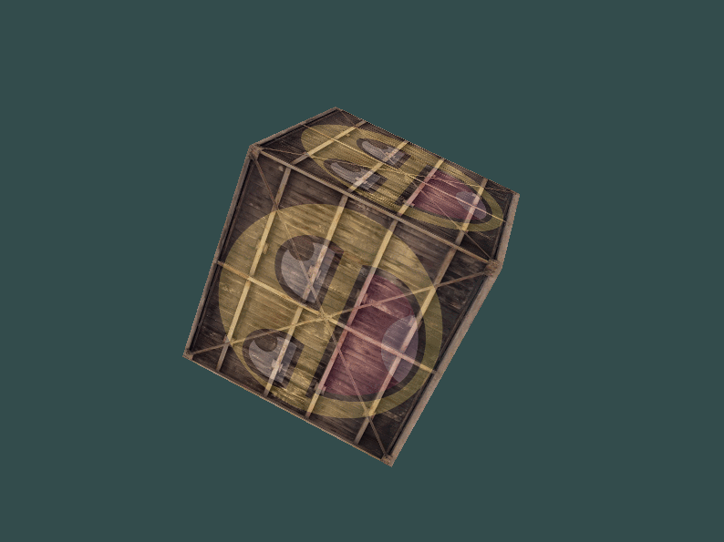

# Abstracts

* 정육면체를 회전시켜보자

# Result



* * *

# Z-버퍼

* 정육면체를 렌더링하기 위해 총 36개의 vertex 필요
  * 6개의 면 * 2개의 삼각형 * 3개의 vertex
* OpenGL은 삼각형 단위로 그리기 때문에 다른 픽셀이 어떠한 위치에 그려져 있어도 그 위에 픽셀을 그림
* `z-buffer`를 사용해 OpenGL이 픽셀위에 그릴것인지 아닌지 결정
  * OpenGL이 depth-testing을 할 수 있도록 구성 가능
* Z-버퍼 = 깊이 버퍼
* `GLFW`가 자동으로 버퍼 생성
* depth testing : 깊이는 각 fragment의 z값을 저장하고 fragment가 출력되기를 원할때마다 OpenGL은 해당 깊이 값과 z-버퍼를 비교하여 현재 fragment가 다른 fragment의 뒤에 있다면 폐기, 앞에 있다면 덮어 씌움
  * OpenGL에 의해 자동으로 수행되지만 OpenGL에게 depth testing을 사용할 것이라고 알려야함
  * `glEnable(GL_DEPTH_TEST);`

* cf) `glEnable`, `glDisable` 함수를 사용해 OpenGL에서 특정 기능에 대한 사용 여부 결정 가능

* 깊이 버퍼를 사용한다면 루프가 돌 때마다 깊이 버퍼를 비워줘야함( 이전 프레임의 깊이 정보가 그대로 버퍼에 남아 있음 )
  * `glClear(GL_COLOR_BUFFER_BIT | GL_DEPTH_BUFFER_BIT);`

# Source Codes

```cpp
#include <glad/glad.h>
#include <GLFW/glfw3.h>
#include <stb_image.h>

#include <glm/glm.hpp>
#include <glm/gtc/matrix_transform.hpp>
#include <glm/gtc/type_ptr.hpp>

#include <learnopengl/filesystem.h>
#include <learnopengl/shader_m.h>

#include <iostream>

void framebuffer_size_callback(GLFWwindow* window, int width, int height);
void processInput(GLFWwindow *window);

// settings
const unsigned int SCR_WIDTH = 800;
const unsigned int SCR_HEIGHT = 600;

int main()
{
    // glfw: initialize and configure
    // ------------------------------
    glfwInit();
    glfwWindowHint(GLFW_CONTEXT_VERSION_MAJOR, 3);
    glfwWindowHint(GLFW_CONTEXT_VERSION_MINOR, 3);
    glfwWindowHint(GLFW_OPENGL_PROFILE, GLFW_OPENGL_CORE_PROFILE);

#ifdef __APPLE__
    glfwWindowHint(GLFW_OPENGL_FORWARD_COMPAT, GL_TRUE); // uncomment this statement to fix compilation on OS X
#endif

    GLFWwindow* window = glfwCreateWindow(SCR_WIDTH, SCR_HEIGHT, "LearnOpenGL", NULL, NULL);
    if (window == NULL) {
        std::cout << "Failed to create GLFW window" << std::endl;
        glfwTerminate();
        return -1;
    }
    glfwMakeContextCurrent(window);
    glfwSetFramebufferSizeCallback(window, framebuffer_size_callback);

    if (!gladLoadGLLoader((GLADloadproc)glfwGetProcAddress)) {
        std::cout << "Failed to initialize GLAD" << std::endl;
        return -1;
    }

    // 깊이 버퍼 사용 설정
    // -----------------------------------------------------------
    glEnable(GL_DEPTH_TEST);

    Shader ourShader("6.2.coordinate_systems.vs", "6.2.coordinate_systems.fs");

    // set up vertex data (and buffer(s)) and configure vertex attributes
    // ------------------------------------------------------------------
    float vertices[] = {
        -0.5f, -0.5f, -0.5f,  0.0f, 0.0f,
         0.5f, -0.5f, -0.5f,  1.0f, 0.0f,
         0.5f,  0.5f, -0.5f,  1.0f, 1.0f,
         0.5f,  0.5f, -0.5f,  1.0f, 1.0f,
        -0.5f,  0.5f, -0.5f,  0.0f, 1.0f,
        -0.5f, -0.5f, -0.5f,  0.0f, 0.0f,

        -0.5f, -0.5f,  0.5f,  0.0f, 0.0f,
         0.5f, -0.5f,  0.5f,  1.0f, 0.0f,
         0.5f,  0.5f,  0.5f,  1.0f, 1.0f,
         0.5f,  0.5f,  0.5f,  1.0f, 1.0f,
        -0.5f,  0.5f,  0.5f,  0.0f, 1.0f,
        -0.5f, -0.5f,  0.5f,  0.0f, 0.0f,

        -0.5f,  0.5f,  0.5f,  1.0f, 0.0f,
        -0.5f,  0.5f, -0.5f,  1.0f, 1.0f,
        -0.5f, -0.5f, -0.5f,  0.0f, 1.0f,
        -0.5f, -0.5f, -0.5f,  0.0f, 1.0f,
        -0.5f, -0.5f,  0.5f,  0.0f, 0.0f,
        -0.5f,  0.5f,  0.5f,  1.0f, 0.0f,

         0.5f,  0.5f,  0.5f,  1.0f, 0.0f,
         0.5f,  0.5f, -0.5f,  1.0f, 1.0f,
         0.5f, -0.5f, -0.5f,  0.0f, 1.0f,
         0.5f, -0.5f, -0.5f,  0.0f, 1.0f,
         0.5f, -0.5f,  0.5f,  0.0f, 0.0f,
         0.5f,  0.5f,  0.5f,  1.0f, 0.0f,

        -0.5f, -0.5f, -0.5f,  0.0f, 1.0f,
         0.5f, -0.5f, -0.5f,  1.0f, 1.0f,
         0.5f, -0.5f,  0.5f,  1.0f, 0.0f,
         0.5f, -0.5f,  0.5f,  1.0f, 0.0f,
        -0.5f, -0.5f,  0.5f,  0.0f, 0.0f,
        -0.5f, -0.5f, -0.5f,  0.0f, 1.0f,

        -0.5f,  0.5f, -0.5f,  0.0f, 1.0f,
         0.5f,  0.5f, -0.5f,  1.0f, 1.0f,
         0.5f,  0.5f,  0.5f,  1.0f, 0.0f,
         0.5f,  0.5f,  0.5f,  1.0f, 0.0f,
        -0.5f,  0.5f,  0.5f,  0.0f, 0.0f,
        -0.5f,  0.5f, -0.5f,  0.0f, 1.0f
    };
    unsigned int VBO, VAO;
    glGenVertexArrays(1, &VAO);
    glGenBuffers(1, &VBO);

    glBindVertexArray(VAO);

    glBindBuffer(GL_ARRAY_BUFFER, VBO);
    glBufferData(GL_ARRAY_BUFFER, sizeof(vertices), vertices, GL_STATIC_DRAW);

    // position attribute
    glVertexAttribPointer(0, 3, GL_FLOAT, GL_FALSE, 5 * sizeof(float), (void*)0);
    glEnableVertexAttribArray(0);
    // texture coord attribute
    glVertexAttribPointer(1, 2, GL_FLOAT, GL_FALSE, 5 * sizeof(float), (void*)(3 * sizeof(float)));
    glEnableVertexAttribArray(1);


    // load and create a texture 
    // -------------------------
    unsigned int texture1, texture2;
    // texture 1
    // ---------
    glGenTextures(1, &texture1);
    glBindTexture(GL_TEXTURE_2D, texture1);
    // set the texture wrapping parameters
    glTexParameteri(GL_TEXTURE_2D, GL_TEXTURE_WRAP_S, GL_REPEAT);
    glTexParameteri(GL_TEXTURE_2D, GL_TEXTURE_WRAP_T, GL_REPEAT);
    // set texture filtering parameters
    glTexParameteri(GL_TEXTURE_2D, GL_TEXTURE_MIN_FILTER, GL_LINEAR);
    glTexParameteri(GL_TEXTURE_2D, GL_TEXTURE_MAG_FILTER, GL_LINEAR);
    // load image, create texture and generate mipmaps
    int width, height, nrChannels;
    stbi_set_flip_vertically_on_load(true); // tell stb_image.h to flip loaded texture's on the y-axis.
    unsigned char *data = stbi_load(FileSystem::getPath("resources/textures/container.jpg").c_str(), &width, &height, &nrChannels, 0);
    if (data) {
        glTexImage2D(GL_TEXTURE_2D, 0, GL_RGB, width, height, 0, GL_RGB, GL_UNSIGNED_BYTE, data);
        glGenerateMipmap(GL_TEXTURE_2D);
    } else {
        std::cout << "Failed to load texture" << std::endl;
    }
    stbi_image_free(data);

    // texture 2
    // ---------
    glGenTextures(1, &texture2);
    glBindTexture(GL_TEXTURE_2D, texture2);
    // set the texture wrapping parameters
    glTexParameteri(GL_TEXTURE_2D, GL_TEXTURE_WRAP_S, GL_REPEAT);
    glTexParameteri(GL_TEXTURE_2D, GL_TEXTURE_WRAP_T, GL_REPEAT);
    // set texture filtering parameters
    glTexParameteri(GL_TEXTURE_2D, GL_TEXTURE_MIN_FILTER, GL_LINEAR);
    glTexParameteri(GL_TEXTURE_2D, GL_TEXTURE_MAG_FILTER, GL_LINEAR);
    // load image, create texture and generate mipmaps
    data = stbi_load(FileSystem::getPath("resources/textures/awesomeface.png").c_str(), &width, &height, &nrChannels, 0);
    if (data) {
        // note that the awesomeface.png has transparency and thus an alpha channel, so make sure to tell OpenGL the data type is of GL_RGBA
        glTexImage2D(GL_TEXTURE_2D, 0, GL_RGB, width, height, 0, GL_RGBA, GL_UNSIGNED_BYTE, data);
        glGenerateMipmap(GL_TEXTURE_2D);
    } else {
        std::cout << "Failed to load texture" << std::endl;
    }
    stbi_image_free(data);

    ourShader.use();
    ourShader.setInt("texture1", 0);
    ourShader.setInt("texture2", 1);


    // render loop
    // -----------
    while (!glfwWindowShouldClose(window)) {
        // input
        // -----
        processInput(window);

        glClearColor(0.2f, 0.3f, 0.3f, 1.0f);
        // 깊이 버퍼도 비움
        // -----------------------------------------------------------
        glClear(GL_COLOR_BUFFER_BIT | GL_DEPTH_BUFFER_BIT);

        // bind textures on corresponding texture units
        glActiveTexture(GL_TEXTURE0);
        glBindTexture(GL_TEXTURE_2D, texture1);
        glActiveTexture(GL_TEXTURE1);
        glBindTexture(GL_TEXTURE_2D, texture2);

        // activate shader
        ourShader.use();

        // 변환 설정
        // -----------------------------------------------------------
        glm::mat4 model         = glm::mat4(1.0f); 
        glm::mat4 view          = glm::mat4(1.0f);
        glm::mat4 projection    = glm::mat4(1.0f);
        // 시간에 따라 회전
        model = glm::rotate(model, (float)glfwGetTime(), glm::vec3(0.5f, 1.0f, 0.0f));
        view  = glm::translate(view, glm::vec3(0.0f, 0.0f, -3.0f));
        projection = glm::perspective(glm::radians(45.0f), (float)SCR_WIDTH / (float)SCR_HEIGHT, 0.1f, 100.0f);

        unsigned int modelLoc = glGetUniformLocation(ourShader.ID, "model");
        unsigned int viewLoc  = glGetUniformLocation(ourShader.ID, "view");

        glUniformMatrix4fv(modelLoc, 1, GL_FALSE, glm::value_ptr(model));
        glUniformMatrix4fv(viewLoc, 1, GL_FALSE, &view[0][0]);
        ourShader.setMat4("projection", projection);

        // render box
        glBindVertexArray(VAO);
        glDrawArrays(GL_TRIANGLES, 0, 36);

        glfwSwapBuffers(window);
        glfwPollEvents();
    }

    glDeleteVertexArrays(1, &VAO);
    glDeleteBuffers(1, &VBO);

    glfwTerminate();
    return 0;
}

void processInput(GLFWwindow *window) {
    if (glfwGetKey(window, GLFW_KEY_ESCAPE) == GLFW_PRESS)
        glfwSetWindowShouldClose(window, true);
}

void framebuffer_size_callback(GLFWwindow* window, int width, int height) {
    // make sure the viewport matches the new window dimensions; note that width and 
    // height will be significantly larger than specified on retina displays.
    glViewport(0, 0, width, height);
}
```
