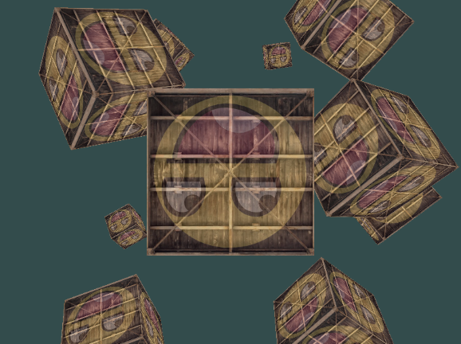

# Abstracts

많은 정육면체를 그려보자

# Results



# Vertex Shader

```cpp
#version 330 core
layout (location = 0) in vec3 aPos;
layout (location = 1) in vec2 aTexCoord;

out vec2 TexCoord;

uniform mat4 model;
uniform mat4 view;
uniform mat4 projection;

void main() {
    gl_Position = projection * view * model * vec4(aPos, 1.0f);
    TexCoord = vec2(aTexCoord.x, 1.0 - aTexCoord.y);
}
```

# Source Codes

```cpp
#include <glad/glad.h>
#include <GLFW/glfw3.h>
#include <stb_image.h>

#include <glm/glm.hpp>
#include <glm/gtc/matrix_transform.hpp>
#include <glm/gtc/type_ptr.hpp>

#include <learnopengl/filesystem.h>
#include <learnopengl/shader_m.h>

#include <iostream>

void framebuffer_size_callback(GLFWwindow* window, int width, int height);
void processInput(GLFWwindow *window);

// settings
const unsigned int SCR_WIDTH = 800;
const unsigned int SCR_HEIGHT = 600;

int main() {
    glfwInit();
    glfwWindowHint(GLFW_CONTEXT_VERSION_MAJOR, 3);
    glfwWindowHint(GLFW_CONTEXT_VERSION_MINOR, 3);
    glfwWindowHint(GLFW_OPENGL_PROFILE, GLFW_OPENGL_CORE_PROFILE);

#ifdef __APPLE__
    glfwWindowHint(GLFW_OPENGL_FORWARD_COMPAT, GL_TRUE); // uncomment this statement to fix compilation on OS X
#endif

    GLFWwindow* window = glfwCreateWindow(SCR_WIDTH, SCR_HEIGHT, "LearnOpenGL", NULL, NULL);
    if (window == NULL) {
        std::cout << "Failed to create GLFW window" << std::endl;
        glfwTerminate();
        return -1;
    }
    glfwMakeContextCurrent(window);
    glfwSetFramebufferSizeCallback(window, framebuffer_size_callback);

    if (!gladLoadGLLoader((GLADloadproc)glfwGetProcAddress)) {
        std::cout << "Failed to initialize GLAD" << std::endl;
        return -1;
    }

    // 깊이 버퍼 사용
    // ------------------------------------------------------------------
    glEnable(GL_DEPTH_TEST);

    Shader ourShader("6.3.coordinate_systems.vs", "6.3.coordinate_systems.fs");

    // set up vertex data (and buffer(s)) and configure vertex attributes
    // ------------------------------------------------------------------
    float vertices[] = {
        -0.5f, -0.5f, -0.5f,  0.0f, 0.0f,
         0.5f, -0.5f, -0.5f,  1.0f, 0.0f,
         0.5f,  0.5f, -0.5f,  1.0f, 1.0f,
         0.5f,  0.5f, -0.5f,  1.0f, 1.0f,
        -0.5f,  0.5f, -0.5f,  0.0f, 1.0f,
        -0.5f, -0.5f, -0.5f,  0.0f, 0.0f,

        -0.5f, -0.5f,  0.5f,  0.0f, 0.0f,
         0.5f, -0.5f,  0.5f,  1.0f, 0.0f,
         0.5f,  0.5f,  0.5f,  1.0f, 1.0f,
         0.5f,  0.5f,  0.5f,  1.0f, 1.0f,
        -0.5f,  0.5f,  0.5f,  0.0f, 1.0f,
        -0.5f, -0.5f,  0.5f,  0.0f, 0.0f,

        -0.5f,  0.5f,  0.5f,  1.0f, 0.0f,
        -0.5f,  0.5f, -0.5f,  1.0f, 1.0f,
        -0.5f, -0.5f, -0.5f,  0.0f, 1.0f,
        -0.5f, -0.5f, -0.5f,  0.0f, 1.0f,
        -0.5f, -0.5f,  0.5f,  0.0f, 0.0f,
        -0.5f,  0.5f,  0.5f,  1.0f, 0.0f,

         0.5f,  0.5f,  0.5f,  1.0f, 0.0f,
         0.5f,  0.5f, -0.5f,  1.0f, 1.0f,
         0.5f, -0.5f, -0.5f,  0.0f, 1.0f,
         0.5f, -0.5f, -0.5f,  0.0f, 1.0f,
         0.5f, -0.5f,  0.5f,  0.0f, 0.0f,
         0.5f,  0.5f,  0.5f,  1.0f, 0.0f,

        -0.5f, -0.5f, -0.5f,  0.0f, 1.0f,
         0.5f, -0.5f, -0.5f,  1.0f, 1.0f,
         0.5f, -0.5f,  0.5f,  1.0f, 0.0f,
         0.5f, -0.5f,  0.5f,  1.0f, 0.0f,
        -0.5f, -0.5f,  0.5f,  0.0f, 0.0f,
        -0.5f, -0.5f, -0.5f,  0.0f, 1.0f,

        -0.5f,  0.5f, -0.5f,  0.0f, 1.0f,
         0.5f,  0.5f, -0.5f,  1.0f, 1.0f,
         0.5f,  0.5f,  0.5f,  1.0f, 0.0f,
         0.5f,  0.5f,  0.5f,  1.0f, 0.0f,
        -0.5f,  0.5f,  0.5f,  0.0f, 0.0f,
        -0.5f,  0.5f, -0.5f,  0.0f, 1.0f
    };
    // 정육면체의 world space 좌표 구성
    // 같은 오브젝트는 model 행렬만 변경해 world space에서 여러개 표현 가능
    glm::vec3 cubePositions[] = {
        glm::vec3( 0.0f,  0.0f,  0.0f),
        glm::vec3( 2.0f,  5.0f, -15.0f),
        glm::vec3(-1.5f, -2.2f, -2.5f),
        glm::vec3(-3.8f, -2.0f, -12.3f),
        glm::vec3( 2.4f, -0.4f, -3.5f),
        glm::vec3(-1.7f,  3.0f, -7.5f),
        glm::vec3( 1.3f, -2.0f, -2.5f),
        glm::vec3( 1.5f,  2.0f, -2.5f),
        glm::vec3( 1.5f,  0.2f, -1.5f),
        glm::vec3(-1.3f,  1.0f, -1.5f)
    };
    unsigned int VBO, VAO;
    glGenVertexArrays(1, &VAO);
    glGenBuffers(1, &VBO);

    glBindVertexArray(VAO);

    glBindBuffer(GL_ARRAY_BUFFER, VBO);
    glBufferData(GL_ARRAY_BUFFER, sizeof(vertices), vertices, GL_STATIC_DRAW);

    // position attribute
    glVertexAttribPointer(0, 3, GL_FLOAT, GL_FALSE, 5 * sizeof(float), (void*)0);
    glEnableVertexAttribArray(0);
    // texture coord attribute
    glVertexAttribPointer(1, 2, GL_FLOAT, GL_FALSE, 5 * sizeof(float), (void*)(3 * sizeof(float)));
    glEnableVertexAttribArray(1);


    // load and create a texture 
    // -------------------------
    unsigned int texture1, texture2;
    // texture 1
    // ---------
    glGenTextures(1, &texture1);
    glBindTexture(GL_TEXTURE_2D, texture1);
    // set the texture wrapping parameters
    glTexParameteri(GL_TEXTURE_2D, GL_TEXTURE_WRAP_S, GL_REPEAT);
    glTexParameteri(GL_TEXTURE_2D, GL_TEXTURE_WRAP_T, GL_REPEAT);
    // set texture filtering parameters
    glTexParameteri(GL_TEXTURE_2D, GL_TEXTURE_MIN_FILTER, GL_LINEAR);
    glTexParameteri(GL_TEXTURE_2D, GL_TEXTURE_MAG_FILTER, GL_LINEAR);
    // load image, create texture and generate mipmaps
    int width, height, nrChannels;
    stbi_set_flip_vertically_on_load(true); // tell stb_image.h to flip loaded texture's on the y-axis.
    unsigned char *data = stbi_load(FileSystem::getPath("resources/textures/container.jpg").c_str(), &width, &height, &nrChannels, 0);
    if (data) {
        glTexImage2D(GL_TEXTURE_2D, 0, GL_RGB, width, height, 0, GL_RGB, GL_UNSIGNED_BYTE, data);
        glGenerateMipmap(GL_TEXTURE_2D);
    } else {
        std::cout << "Failed to load texture" << std::endl;
    }
    stbi_image_free(data);

    // texture 2
    // ---------
    glGenTextures(1, &texture2);
    glBindTexture(GL_TEXTURE_2D, texture2);
    // set the texture wrapping parameters
    glTexParameteri(GL_TEXTURE_2D, GL_TEXTURE_WRAP_S, GL_REPEAT);
    glTexParameteri(GL_TEXTURE_2D, GL_TEXTURE_WRAP_T, GL_REPEAT);
    // set texture filtering parameters
    glTexParameteri(GL_TEXTURE_2D, GL_TEXTURE_MIN_FILTER, GL_LINEAR);
    glTexParameteri(GL_TEXTURE_2D, GL_TEXTURE_MAG_FILTER, GL_LINEAR);
    // load image, create texture and generate mipmaps
    data = stbi_load(FileSystem::getPath("resources/textures/awesomeface.png").c_str(), &width, &height, &nrChannels, 0);
    if (data) {
        // note that the awesomeface.png has transparency and thus an alpha channel, so make sure to tell OpenGL the data type is of GL_RGBA
        glTexImage2D(GL_TEXTURE_2D, 0, GL_RGB, width, height, 0, GL_RGBA, GL_UNSIGNED_BYTE, data);
        glGenerateMipmap(GL_TEXTURE_2D);
    } else {
        std::cout << "Failed to load texture" << std::endl;
    }
    stbi_image_free(data);

    ourShader.use();
    ourShader.setInt("texture1", 0);
    ourShader.setInt("texture2", 1);


    // render loop
    // -----------
    while (!glfwWindowShouldClose(window)) {
        // input
        // -----
        processInput(window);

        glClearColor(0.2f, 0.3f, 0.3f, 1.0f);
        // 깊이 버퍼도 비워줌
        glClear(GL_COLOR_BUFFER_BIT | GL_DEPTH_BUFFER_BIT); 

        glActiveTexture(GL_TEXTURE0);
        glBindTexture(GL_TEXTURE_2D, texture1);
        glActiveTexture(GL_TEXTURE1);
        glBindTexture(GL_TEXTURE_2D, texture2);

        ourShader.use();

        // 변환 설정
        // view, projection 행렬은 변경하지 않음
        // ---------------------------------------------------------------------
        glm::mat4 view          = glm::mat4(1.0f); 
        glm::mat4 projection    = glm::mat4(1.0f);
        projection = glm::perspective(glm::radians(45.0f), (float)SCR_WIDTH / (float)SCR_HEIGHT, 0.1f, 100.0f);
        view       = glm::translate(view, glm::vec3(0.0f, 0.0f, -3.0f));

        ourShader.setMat4("projection", projection);
        ourShader.setMat4("view", view);

        glBindVertexArray(VAO);
        // 다른 model 행렬을 사용해 정육면체 10개 그림
        // ---------------------------------------------------------------------
        for (unsigned int i = 0; i < 10; i++) {
            // model 행렬 셋팅 ( 원점을 기준으로 회전 적용 후 정의해놓은 위치로 이동 )
            glm::mat4 model = glm::mat4(1.0f);
            model = glm::translate(model, cubePositions[i]);
            float angle = 20.0f * i;
            model = glm::rotate(model, glm::radians(angle), glm::vec3(1.0f, 0.3f, 0.5f));
            ourShader.setMat4("model", model);

            glDrawArrays(GL_TRIANGLES, 0, 36);
        }

        glfwSwapBuffers(window);
        glfwPollEvents();
    }

    glDeleteVertexArrays(1, &VAO);
    glDeleteBuffers(1, &VBO);

    glfwTerminate();
    return 0;
}

void processInput(GLFWwindow *window) {
    if (glfwGetKey(window, GLFW_KEY_ESCAPE) == GLFW_PRESS)
        glfwSetWindowShouldClose(window, true);
}

void framebuffer_size_callback(GLFWwindow* window, int width, int height) {
    // make sure the viewport matches the new window dimensions; note that width and 
    // height will be significantly larger than specified on retina displays.
    glViewport(0, 0, width, height);
}
```