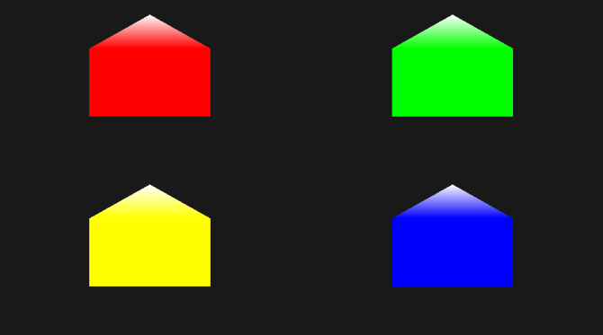
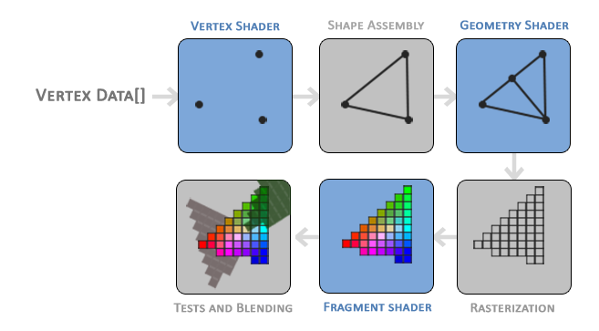
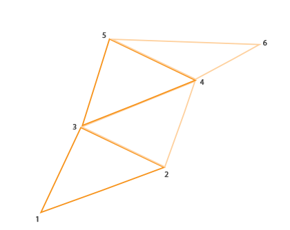

# Result



# Geometry Shader



* vertex shader와 fragment shader 사이의 선택적인 shader 단계
* vertex들을 원래 주어진 vertex들보다 더 많은 vertex를 생성하는 다른 도형으로 변환시킬 수 있음
 
```cpp
#version 330 core
layout (points) in;                             // 입력 타입 선언
layout (line_strip, max_vertices = 2) out;      // 출력 타입 선언

void main() {    
    gl_Position = gl_in[0].gl_Position + vec4(-0.1, 0.0, 0.0, 0.0); 
    EmitVertex();

    gl_Position = gl_in[0].gl_Position + vec4( 0.1, 0.0, 0.0, 0.0);
    EmitVertex();
    
    EndPrimitive();
}  
```

## 입력 유형

* vertex shader에서 받을 primitive type 입력의 유형을 선언
* `in` 키워드 앞에 `layout` 지정자를 선언
* `layout` 지정자 종류(괄호안의 숫자는 vertex 개수)
  * `points` : `GL_POINTS`(1)
  * `lines` : `GL_LINES` or `GL_LINE_STRIP`(2)
  * `lines_adjacency` : `GL_LINES_ADJACENCY` or `GL_LINE_STRIP_ADJACENCY`(4)
  * `triangles` : `GL_TRIANGLES` or `GL_TRIANGLE_STRIP` or `GL_TRIANGLE_FAN`(3)
  * `triangles_adjacency` : `GL_TRIANGLES_ADJACENCY` or `GL_TRIANGLE_STRIP_ADJACENCY`(6)
* vertex shader의 출력을 가져오기 위해 `gl_in`이라는 내장 변수 사용
  * 대부분의 primitive type 도형들은 하나 이상의 vertex로 이루어져 있고 geometry shader는 primitive type 도형의 모든 vertex를 얻으므로 배열로 선언
```cpp
in gl_Vertex {
    vec4  gl_Position;
    float gl_PointSize;
    float gl_ClipDistance[];
} gl_in[];  
```
* `EmitVertex()` : gl_Position에 설정된 벡터가 primitive type에 추가됨
* `EndPrimitive()` : 추가된 모든 vertex들이 지정된 출력 primitive 타입으로 결합됨
  
## 출력 유형

* geometry shader가 출력할 primitive type 유형 설정
* `out` 키워드 앞에 `layout` 지정자를 선언
* `layout` 지정자 종류
  * `points`
  * `line_strip`
  * `triangle_strip`
* geometry shader는 출력할 vertex의 최대 갯수도 설정
  * 이 숫자를 넘으면 OpenGL은 추가적인 vertex들은 그리지 않음
  * `out` 키워드 앞에 `layout` 식별자 안에서 최대 갯수 설정
  * ex) max_vertices = 2
* cf) `triangle_strip` : 인접한 vertex를 이용해 삼각형을 그림



## Geometry shader compile

```cpp
// shader 생성
geometryShader = glCreateShader(GL_GEOMETRY_SHADER);
glShaderSource(geometryShader, 1, &gShaderCode, NULL);
// shader 컴파일
glCompileShader(geometryShader);  

// program shader에 geometry shader 붙임
glAttachShader(program, geometryShader);
// 링킹
glLinkProgram(program); 

# Shader Codes

## Vertex Shader

```cpp
#version 330 core
layout (location = 0) in vec2 aPos;
layout (location = 1) in vec3 aColor;

// geometry shader로 컬러값 보내기 위해 변수 선언
out VS_OUT {
    vec3 color;
} vs_out;
// out vec3 vColor; // 구조체가 아니어도 상관없음

void main() {
    vs_out.color = aColor;  // 입력받은 컬러값으로 설정
    gl_Position = vec4(aPos.x, aPos.y, 0.0, 1.0); 
}
```

## Geometry Shader

```cpp
#version 330 core
layout (points) in;     // vertex shader에서 primitive 타입 점으로 받음
layout (triangle_strip, max_vertices = 5) out;  // fragment shader에 primitive 타입 triangle_strip으로 설정, 최대 vertex 갯수는 5개

// vertex shader에서 받을 입력 변수 선언
// geometry shader는 입력으로 받은 vertex들 위에서 동작하기 때문에 vertex shader로부터 받은 입력은 항상 배열로 나타냄(하나의 vertext만 가지고 있어도 배열로 나타냄)
in VS_OUT {
    vec3 color;
} gs_in[];
// in vec3 vColor[];  // vertex shader에서 선언한 형식으로 따라가면됨

// fragment로 출력할 color 벡터 선언
out vec3 fColor;

void build_house(vec4 position) {    
    fColor = gs_in[0].color;
    gl_Position = position + vec4(-0.2, -0.2, 0.0, 0.0); // 1:bottom-left
    // vertex를 primitive type에 추가할땐 fColor에 마지막으로 저장된 값을 fragment shader 실행시 사용   
    EmitVertex();   
    gl_Position = position + vec4( 0.2, -0.2, 0.0, 0.0); // 2:bottom-right
    EmitVertex();
    gl_Position = position + vec4(-0.2,  0.2, 0.0, 0.0); // 3:top-left
    EmitVertex();
    gl_Position = position + vec4( 0.2,  0.2, 0.0, 0.0); // 4:top-right
    EmitVertex();
    gl_Position = position + vec4( 0.0,  0.4, 0.0, 0.0); // 5:top
    // 마지막 꼭대기 점은 흰색으로 저장
    fColor = vec3(1.0, 1.0, 1.0);
    EmitVertex();
    EndPrimitive();
}

void main() {    
    build_house(gl_in[0].gl_Position);
}
```

# Source Codes

```cpp
#include <glad/glad.h>
#include <GLFW/glfw3.h>

#include <learnopengl/filesystem.h>
#include <learnopengl/shader.h>

#include <iostream>

void framebuffer_size_callback(GLFWwindow* window, int width, int height);

// settings
const unsigned int SCR_WIDTH = 1280;
const unsigned int SCR_HEIGHT = 720;

int main() {
    // glfw: initialize and configure
    // ------------------------------
    glfwInit();
    glfwWindowHint(GLFW_CONTEXT_VERSION_MAJOR, 3);
    glfwWindowHint(GLFW_CONTEXT_VERSION_MINOR, 3);
    glfwWindowHint(GLFW_OPENGL_PROFILE, GLFW_OPENGL_CORE_PROFILE);

#ifdef __APPLE__
    glfwWindowHint(GLFW_OPENGL_FORWARD_COMPAT, GL_TRUE); // uncomment this statement to fix compilation on OS X
#endif

    // glfw window creation
    // --------------------
    GLFWwindow* window = glfwCreateWindow(SCR_WIDTH, SCR_HEIGHT, "LearnOpenGL", NULL, NULL);
    if (window == NULL) {
        std::cout << "Failed to create GLFW window" << std::endl;
        glfwTerminate();
        return -1;
    }
    glfwMakeContextCurrent(window);

    // glad: load all OpenGL function pointers
    // ---------------------------------------
    if (!gladLoadGLLoader((GLADloadproc)glfwGetProcAddress)) {
        std::cout << "Failed to initialize GLAD" << std::endl;
        return -1;
    }

    // configure global opengl state
    // -----------------------------
    glEnable(GL_DEPTH_TEST);

    // build and compile shaders
    // -------------------------
    Shader shader("9.1.geometry_shader.vs", "9.1.geometry_shader.fs", "9.1.geometry_shader.gs");

    // set up vertex data (and buffer(s)) and configure vertex attributes
    // ------------------------------------------------------------------
    float points[] = {
        // vertex     // color
        -0.5f,  0.5f, 1.0f, 0.0f, 0.0f, // top-left
         0.5f,  0.5f, 0.0f, 1.0f, 0.0f, // top-right
         0.5f, -0.5f, 0.0f, 0.0f, 1.0f, // bottom-right
        -0.5f, -0.5f, 1.0f, 1.0f, 0.0f  // bottom-left
    };
    unsigned int VBO, VAO;
    glGenBuffers(1, &VBO);
    glGenVertexArrays(1, &VAO);
    glBindVertexArray(VAO);
    glBindBuffer(GL_ARRAY_BUFFER, VBO);
    glBufferData(GL_ARRAY_BUFFER, sizeof(points), &points, GL_STATIC_DRAW);
    glEnableVertexAttribArray(0);
    glVertexAttribPointer(0, 2, GL_FLOAT, GL_FALSE, 5 * sizeof(float), 0);
    glEnableVertexAttribArray(1);
    glVertexAttribPointer(1, 3, GL_FLOAT, GL_FALSE, 5 * sizeof(float), (void*)(2 * sizeof(float)));
    glBindVertexArray(0);

    // render loop
    // -----------
    while (!glfwWindowShouldClose(window)) {
        // render
        // ------
        glClearColor(0.1f, 0.1f, 0.1f, 1.0f);
        glClear(GL_COLOR_BUFFER_BIT | GL_DEPTH_BUFFER_BIT);

        // draw points
        shader.use();
        glBindVertexArray(VAO);
        glDrawArrays(GL_POINTS, 0, 4);

        // glfw: swap buffers and poll IO events (keys pressed/released, mouse moved etc.)
        // -------------------------------------------------------------------------------
        glfwSwapBuffers(window);
        glfwPollEvents();
    }

    // optional: de-allocate all resources once they've outlived their purpose:
    // ------------------------------------------------------------------------
    glDeleteVertexArrays(1, &VAO);
    glDeleteBuffers(1, &VBO);

    glfwTerminate();
    return 0;
}
```