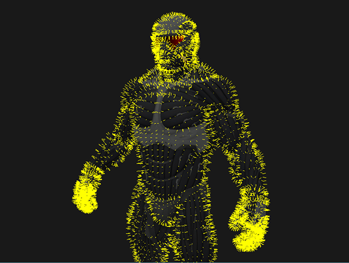

# Result



# Shader Codes

## Vertex Shader Codes

```cpp
#version 330 core
layout (location = 0) in vec3 aPos;
layout (location = 1) in vec3 aNormal;

// geometry shader로 보낼 normal 값
out VS_OUT {
    vec3 normal;
} vs_out;

uniform mat4 projection;
uniform mat4 view;
uniform mat4 model;

void main() {
    // 법선 행렬을 구함
    mat3 normalMatrix = mat3(transpose(inverse(view * model)));
    // 법선 벡터 변환
    vs_out.normal = vec3(projection * vec4(normalMatrix * aNormal, 0.0));
    gl_Position = projection * view * model * vec4(aPos, 1.0); 
}
```

## Geometry Shader Codes

```cpp
#version 330 core
layout (triangles) in;  // 삼각형을 입력으로 받음
layout (line_strip, max_vertices = 6) out;  // 라인 타입 출력으로 사용(최대 6개의 점)

in VS_OUT {
    vec3 normal;
} gs_in[];

const float MAGNITUDE = 0.2;

void GenerateLine(int index) {
    gl_Position = gl_in[index].gl_Position;
    EmitVertex();
    // 노멀 벡터 방향으로 MAGNITUDE만큼 떨어진 좌표
    gl_Position = gl_in[index].gl_Position + vec4(gs_in[index].normal, 0.0) * MAGNITUDE;
    EmitVertex();
    EndPrimitive();
}

void main() {
    GenerateLine(0); // first vertex normal
    GenerateLine(1); // second vertex normal
    GenerateLine(2); // third vertex normal
}
```

## Fragment Shader Codes

```cpp
#version 330 core
out vec4 FragColor;

void main() {
    FragColor = vec4(1.0, 1.0, 0.0, 1.0);
}
```

# Source Codes

```cpp
#include <glad/glad.h>
#include <GLFW/glfw3.h>
#include <stb_image.h>

#include <glm/glm.hpp>
#include <glm/gtc/matrix_transform.hpp>
#include <glm/gtc/type_ptr.hpp>

#include <learnopengl/filesystem.h>
#include <learnopengl/shader.h>
#include <learnopengl/camera.h>
#include <learnopengl/model.h>

#include <iostream>

void framebuffer_size_callback(GLFWwindow* window, int width, int height);
void mouse_callback(GLFWwindow* window, double xpos, double ypos);
void scroll_callback(GLFWwindow* window, double xoffset, double yoffset);
void processInput(GLFWwindow *window);

// settings
const unsigned int SCR_WIDTH = 1280;
const unsigned int SCR_HEIGHT = 720;

// camera
Camera camera(glm::vec3(0.0f, 0.0f, 3.0f));
float lastX = (float)SCR_WIDTH / 2.0;
float lastY = (float)SCR_HEIGHT / 2.0;
bool firstMouse = true;

// timing
float deltaTime = 0.0f;
float lastFrame = 0.0f;

int main() {
    // glfw: initialize and configure
    // ------------------------------
    glfwInit();
    glfwWindowHint(GLFW_CONTEXT_VERSION_MAJOR, 3);
    glfwWindowHint(GLFW_CONTEXT_VERSION_MINOR, 3);
    glfwWindowHint(GLFW_OPENGL_PROFILE, GLFW_OPENGL_CORE_PROFILE);

#ifdef __APPLE__
    glfwWindowHint(GLFW_OPENGL_FORWARD_COMPAT, GL_TRUE); // uncomment this statement to fix compilation on OS X
#endif

    // glfw window creation
    // --------------------
    GLFWwindow* window = glfwCreateWindow(SCR_WIDTH, SCR_HEIGHT, "LearnOpenGL", NULL, NULL);
    if (window == NULL) {
        std::cout << "Failed to create GLFW window" << std::endl;
        glfwTerminate();
        return -1;
    }
    glfwMakeContextCurrent(window);
    glfwSetFramebufferSizeCallback(window, framebuffer_size_callback);
    glfwSetCursorPosCallback(window, mouse_callback);
    glfwSetScrollCallback(window, scroll_callback);

    // tell GLFW to capture our mouse
    glfwSetInputMode(window, GLFW_CURSOR, GLFW_CURSOR_DISABLED);

    // glad: load all OpenGL function pointers
    // ---------------------------------------
    if (!gladLoadGLLoader((GLADloadproc)glfwGetProcAddress)) {
        std::cout << "Failed to initialize GLAD" << std::endl;
        return -1;
    }

    // configure global opengl state
    // -----------------------------
    glEnable(GL_DEPTH_TEST);

    // build and compile shaders
    // -------------------------
    Shader shader("9.3.default.vs", "9.3.default.fs");
    Shader normalShader("9.3.normal_visualization.vs", "9.3.normal_visualization.fs", "9.3.normal_visualization.gs");

    // load models
    // -----------
    Model nanosuit(FileSystem::getPath("resources/objects/nanosuit/nanosuit.obj"));

    // render loop
    // -----------
    while (!glfwWindowShouldClose(window)) {
        // per-frame time logic
        // --------------------
        float currentFrame = glfwGetTime();
        deltaTime = currentFrame - lastFrame;
        lastFrame = currentFrame;

        // input
        // -----
        processInput(window);

        // render
        // ------
        glClearColor(0.1f, 0.1f, 0.1f, 1.0f);
        glClear(GL_COLOR_BUFFER_BIT | GL_DEPTH_BUFFER_BIT);

        // configure transformation matrices
        glm::mat4 projection = glm::perspective(glm::radians(45.0f), (float)SCR_WIDTH / (float)SCR_HEIGHT, 1.0f, 100.0f);
        glm::mat4 view = camera.GetViewMatrix();;
        glm::mat4 model = glm::mat4(1.0f);
        shader.use();
        shader.setMat4("projection", projection);
        shader.setMat4("view", view);
        shader.setMat4("model", model);

        // 모델을 그림
        nanosuit.Draw(shader);

        // 노멀 벡터를 그림
        normalShader.use();
        normalShader.setMat4("projection", projection);
        normalShader.setMat4("view", view);
        normalShader.setMat4("model", model);

        nanosuit.Draw(normalShader);

        // glfw: swap buffers and poll IO events (keys pressed/released, mouse moved etc.)
        // -------------------------------------------------------------------------------
        glfwSwapBuffers(window);
        glfwPollEvents();
    }

    glfwTerminate();
    return 0;
}

// process all input: query GLFW whether relevant keys are pressed/released this frame and react accordingly
// ---------------------------------------------------------------------------------------------------------
void processInput(GLFWwindow *window)
{
    if (glfwGetKey(window, GLFW_KEY_ESCAPE) == GLFW_PRESS)
        glfwSetWindowShouldClose(window, true);

    if (glfwGetKey(window, GLFW_KEY_W) == GLFW_PRESS)
        camera.ProcessKeyboard(FORWARD, deltaTime);
    if (glfwGetKey(window, GLFW_KEY_S) == GLFW_PRESS)
        camera.ProcessKeyboard(BACKWARD, deltaTime);
    if (glfwGetKey(window, GLFW_KEY_A) == GLFW_PRESS)
        camera.ProcessKeyboard(LEFT, deltaTime);
    if (glfwGetKey(window, GLFW_KEY_D) == GLFW_PRESS)
        camera.ProcessKeyboard(RIGHT, deltaTime);
}

// glfw: whenever the window size changed (by OS or user resize) this callback function executes
// ---------------------------------------------------------------------------------------------
void framebuffer_size_callback(GLFWwindow* window, int width, int height)
{
    // make sure the viewport matches the new window dimensions; note that width and 
    // height will be significantly larger than specified on retina displays.
    glViewport(0, 0, width, height);
}

// glfw: whenever the mouse moves, this callback is called
// -------------------------------------------------------
void mouse_callback(GLFWwindow* window, double xpos, double ypos)
{
    if (firstMouse)
    {
        lastX = xpos;
        lastY = ypos;
        firstMouse = false;
    }

    float xoffset = xpos - lastX;
    float yoffset = lastY - ypos; // reversed since y-coordinates go from bottom to top

    lastX = xpos;
    lastY = ypos;

    camera.ProcessMouseMovement(xoffset, yoffset);
}

// glfw: whenever the mouse scroll wheel scrolls, this callback is called
// ----------------------------------------------------------------------
void scroll_callback(GLFWwindow* window, double xoffset, double yoffset)
{
    camera.ProcessMouseScroll(yoffset);
}

```