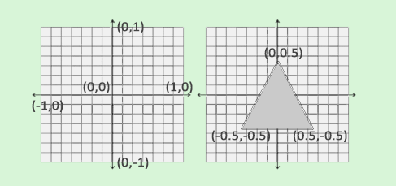
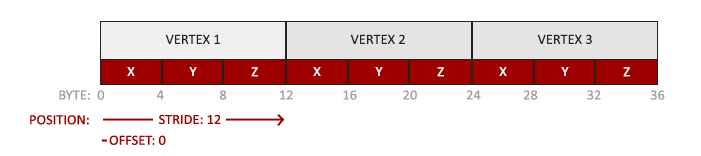
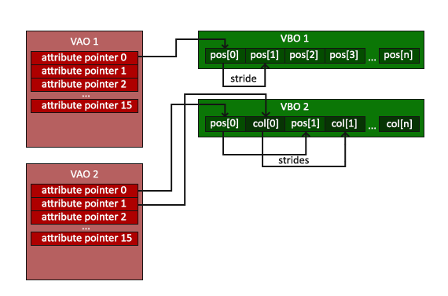

# graphics pipeline


* 파란색으로 칠해진 부분은 작성한 쉐이더를 주입할 수 있는 부분
  
* `vertex shader` : 3D 좌표를 다른 3D 좌표로 변환
* `primitive assembly` : primitive 구성
* `geometry shader` : 새로운 primitive를 형셩
* `rasterization` : 결과 primitives를 최종 화면의 적절한 픽셀과 매핑, fragment가 도출됨
  * `fragment` : 하나의 픽셀을 렌더링하기 위해 필요한 모든 데이터
* `fragment shader` : 픽셀의 최종 컬러를 계산
* `alpha test and blending` : fragment의 해당 깊이와 값을 체크, fragment shader에서 픽셀 출력 색이 계산되었더라도 최종 픽셀 컬러는 여러개의 삼각형을 렌더링할 때 완전히 다른 색이 될 수 있음

* OpenGL에서는 최소한 `vertex shader`와 `fragment shader`는 작성하기를 요구


# Vertex 입력

* OpenGL은 3D 좌표가 3개의 축(x,y,z)에서 값이 모두 -1.0와 1.0 사이에 있어야만 처리
  * NDC(normalized device coordinates)범위 안에 있는 좌표가 화면에 보이게 됨



* 화면 위쪽 - y축 양수
* (0,0) - 화면 중앙
* NDC좌표는 `glViewport()`함수에 제공한 데이터를 사용해 screen-space coordinates로 변환됨

```cpp
float vertices[] = {
    -0.5f, -0.5f, 0.0f,
     0.5f, -0.5f, 0.0f,
     0.0f,  0.5f, 0.0f
}; 
```
* 하나의 삼각형을 렌더링하기 위해 3D 위치를 가지고 있는 3개의 정점들 명시
* `vertex shader`에게 정점 데이터 전달
  1. `GPU에게 정점 데이터를 저장할 공간의 메모리를 할당`하고 
  2. `OpenGL이 어떻게 메모리를 해석할 것인지 구성`하고 
  3. `데이터를 어떻게 그래픽카드에 전달`할 것인지에 대해 명시
* `vertex shader`는 알려준 만큼의 정점들을 메모리에서 처리

* `vertex buffer objects(VBO)` : 많은 양의 정점들을 GPU 메모리상에 저장할 수 있음
  * OpenGL 객체
  * CPU에서 그래픽카드로 데이터를 전송 하는 것은 비교적 느림
  * 정점데이터가 저장된 그래픽카드의 메모리를 관리

## Vertex shader

* GLSL(OpenGL Shading Language)를 통해 vertex shader를 작성하고 컴파일해야함

```cpp
// 버전 선언(OpenGL 3.3, core profile 기능 사용)
#version 330 core
// 모든 입력 정점 속성을 선언
// 버텍스 속성의 위치를 0으로 설정
layout (location = 0) in vec3 aPos;

void main()
{
    // gl_Position : built-in variable
    gl_Position = vec4(aPos.x, aPos.y, aPos.z, 1.0);
}
```

* OpenGL 3.3 이상 버전부터 GLSL 버전은 OpenGL 버전과 맞아야함
  * ex) GLSL 420버전은 OpenGL 4.2버전과 맞음
* vertex shader의 입력데이터는 일반적으로 NDC영역에 포함되지 않는 값들이기 때문에 OpenGL이 표시할 수 있는 영역 내의 좌표로 변환해야함
  
* OpenGL이 shader를 사용하기 위해서는 런타임시에 shader 소스코드를 동적으로 컴파일해야함
```cpp
// ID를 참조하여 shader 객체 생성
unsigned int vertexShader;
vertexShader = glCreateShader(GL_VERTEX_SHADER);

// shader 소스코드를 shader 객체에 첨부한 후 shader를 컴파일
glShaderSource(vertexShader, 1, &vertexShaderSource, NULL);
glCompileShader(vertexShader);
```
* ```GLuint glCreateShader(GLenum shaderType);```
  * 파라미터로 생성할 shader의 유형을 입력
  * `GL_VERTEX_SHADER` : vertex shader 생성
  * `GL_FRAGMENT_SHADER` : fragment shader 생성
* ```void glShaderSource(GLuint shader,GLsizei count,const GLchar **string,const GLint *length);```
  * `shader` : shader 객체
  * `count` : vertex shader의 문자열 갯수
  * `string` : vertex shader의 실제 소스코드
  * `length` : string의 길이 배열

## Fragment shader
```cpp
#version 330 core
// 출력 변수 선언
out vec4 FragColor;

void main()
{
    FragColor = vec4(1.0f, 0.5f, 0.2f, 1.0f);
} 
```
* fragment shader는 오직 하나의 출력 변수를 필요로함
* 최종 컬러를 정의

## Shader program

* 컴파일된 shader들을 사용하기 위해 shader들을 `shader program` 객체로 `연결`시켜야함
* 오브젝트를 렌더링할 때 shader program을 활성화시킴
* 활성화된 shader program안의 shader들은 렌더링 명령이 호출될 때 사용
* Shader들을 program에 연결할 때 각 `shader들의 출력 값`을 `다음 shader의 입력값으로 연결`
  * 출력값과 입력값이 일치하지 않으면 연결 오류 발생

```cpp
unsigned int shaderProgram;
// program 생성
shaderProgram = glCreateProgram();

// shader를 붙이고 연결
glAttachShader(shaderProgram, vertexShader);
glAttachShader(shaderProgram, fragmentShader);
glLinkProgram(shaderProgram);

// shader 객체 제거(필요 없음)
glDeleteShader(vertexShader);
glDeleteShader(fragmentShader);  

// program 활성화
// glUseProgram 함수 호출 이후의 모든 shader와 렌더링 명령은 이 program 객체를 사용
glUseProgram(shaderProgram);
```

## 정점 속성 연결(Linking Vertex Attributes)

* 렌더링하기 전에 OpenGL이 정점데이터를 어떻게 해석해야하는지 구성



* vertex buffer 데이터
* 위치데이터는 4바이트 실수형
* 각 위치는 3가지 값으로 구성
* 각 3개 값의 집합들 사이에 공백은 없음
* 데이터의 첫번째 값은 버퍼의 시작 지점에 있음

```cpp
glVertexAttribPointer(0, 3, GL_FLOAT, GL_FALSE, 3 * sizeof(float), (void*)0);
// vertex 속성 location 전달, vertex 속성을 사용할 수 있게함
glEnableVertexAttribArray(0);  
```
* `glVertexAttribPointer`를 사용해 OpenGP에게 vertex 속성에 대한 데이터를 어떻게 해석해야 하는지 알려줌
```cpp
void glVertexAttribPointer(GLuint index, GLint size, GLenum type, GLboolean normalized, GLsizei stride, const GLvoid * pointer);
```
* `index` : 설정할 vertex 속성을 지정
  * vertex shader에서 `layout (location = 0)`코드를 사용해 position vertex 속성의 위치를 지정
* `size` : vertex 속성의 크기
* `type` : 데이터 타입
* `normalized` : 데이터를 정규화할 것인지 지정
  * ex) GL_TRUE로 설정하면 0(부호를 가진 데이터는 -`)와 1 사이에 있지 않은 값들의 데이터들이 그 사이의 값으로 매핑됨
* `stride` : 연이은 vertex 속성 세트들 사이의 공백을 알려줌
  * 이 배열이 빽빽히 채워져 있다(다음 vertex 속성 값 사이에 공백이 없음)는 것을 알고 있다면 stride를 0으로 지정하여 OpenGL이 stride를 지정하게 할 수 있음
* `pointer` : 버퍼에서 데이터가 시작하는 위치의 offset

* 각 vertex 속성은 VBO에 의해 관리되는 메모리로부터 데이터를 받음
* 미리 정의된 VBO가 바인딩되어 있으므로 vertex 속성 0이 해당 vertex 정점과 연결됨

* OpenGL이 오프젝트를 그릴때는 다음과 같은 형식을 취함

```cpp
// 0. 정점 배열을 OpenGL에서 사용하기 위해 버퍼에 복사
glBindBuffer(GL_ARRAY_BUFFER, VBO);
glBufferData(GL_ARRAY_BUFFER, sizeof(vertices), vertices, GL_STATIC_DRAW);
// 1. 그런 다음 vertex 속성 포인터를 설정
glVertexAttribPointer(0, 3, GL_FLOAT, GL_FALSE, 3 * sizeof(float), (void*)0);
glEnableVertexAttribArray(0);  
// 2. 오브젝트를 그리고 싶을 때 우리가 생성한 shader program을 사용
glUseProgram(shaderProgram);
// 3. 이제 오브젝트를 그립니다. 
someOpenGLFunctionThatDrawsOurTriangle();   
```

## Vertex Array Object(VAO)

* vertex 속성 구성을 저장
* 여러가지 오브젝트들을 그리고 싶을 때 먼저 모든 VAO(+ 필요한 VBO와 속성 포인터들)를 생성하고 구성
* VBO와 같이 바인딩될 수 있으며, 이후의 vertex 속성 호출은 VAO 내에 저장됨
* vertex 속성 포인터를 구성할 때 한번만 호출하기만 하면 되고, 오브젝트를 그려야할 때마다 해당 VAO를 바인딩, 오브젝트를 그린 후 VAO를 다시 언바인딩
* Core OpenGL은 정점 입력과 관련해 VAO를 사용하도록 요구, VAO를 바인딩하는데 실패하면 OpenGL은 그리기를 거부할 수 있음

* 저장하는 항목
* `glEnableVertexAttribArray` 함수나 `glDisableVertexAttribArray` 함수의 호출
* `glVertexAttribPointer` 함수를 통한 Vertex 속성의 구성
* `glVertexAttribPointer` 함수를 통해 vertex 속성과 연결된 Vertex buffer objects(VBOs)



```cpp
unsigned int VAO;
glGenVertexArrays(1, &VAO);

// 초기화 코드 (한번만 실행됩니다(오브젝트가 자주 변경되지 않는 한))
// 1. Vertex Array Object 바인딩
glBindVertexArray(VAO);
// 2. OpenGL이 사용하기 위해 vertex 리스트를 복사
glBindBuffer(GL_ARRAY_BUFFER, VBO);
glBufferData(GL_ARRAY_BUFFER, sizeof(vertices), vertices, GL_STATIC_DRAW);
// 3. 그런 다음 vertex 속성 포인터를 세팅
glVertexAttribPointer(0, 3, GL_FLOAT, GL_FALSE, 3 * sizeof(float), (void*)0);
glEnableVertexAttribArray(0);  

  
[...]

// 드로잉 코드 (렌더링 루프 내부)
// 4. 오브젝트를 그립니다.
glUseProgram(shaderProgram);
glBindVertexArray(VAO);
someOpenGLFunctionThatDrawsOurTriangle();   
```

# source codes

```cpp
#include <glad/glad.h>
#include <GLFW/glfw3.h>

#include <iostream>

void framebuffer_size_callback(GLFWwindow* window, int width, int height);
void processInput(GLFWwindow *window);

// settings
const unsigned int SCR_WIDTH = 800;
const unsigned int SCR_HEIGHT = 600;

const char *vertexShaderSource = "#version 330 core\n"
    "layout (location = 0) in vec3 aPos;\n"
    "void main()\n"
    "{\n"
    "   gl_Position = vec4(aPos.x, aPos.y, aPos.z, 1.0);\n"
    "}\0";
const char *fragmentShaderSource = "#version 330 core\n"
    "out vec4 FragColor;\n"
    "void main()\n"
    "{\n"
    "   FragColor = vec4(1.0f, 0.5f, 0.2f, 1.0f);\n"
    "}\n\0";

int main()
{
    // glfw: initialize and configure
    // ------------------------------
    glfwInit();
    glfwWindowHint(GLFW_CONTEXT_VERSION_MAJOR, 3);
    glfwWindowHint(GLFW_CONTEXT_VERSION_MINOR, 3);
    glfwWindowHint(GLFW_OPENGL_PROFILE, GLFW_OPENGL_CORE_PROFILE);

#ifdef __APPLE__
    glfwWindowHint(GLFW_OPENGL_FORWARD_COMPAT, GL_TRUE); // uncomment this statement to fix compilation on OS X
#endif

    // glfw window creation
    // --------------------
    GLFWwindow* window = glfwCreateWindow(SCR_WIDTH, SCR_HEIGHT, "LearnOpenGL", NULL, NULL);
    if (window == NULL)
    {
        std::cout << "Failed to create GLFW window" << std::endl;
        glfwTerminate();
        return -1;
    }
    glfwMakeContextCurrent(window);
    glfwSetFramebufferSizeCallback(window, framebuffer_size_callback);

    // glad: load all OpenGL function pointers
    // ---------------------------------------
    if (!gladLoadGLLoader((GLADloadproc)glfwGetProcAddress))
    {
        std::cout << "Failed to initialize GLAD" << std::endl;
        return -1;
    }


    // build and compile our shader program
    // ------------------------------------
    // vertex shader
    int vertexShader = glCreateShader(GL_VERTEX_SHADER);
    glShaderSource(vertexShader, 1, &vertexShaderSource, NULL);
    glCompileShader(vertexShader);
    // 쉐이더 컴파일 에러 체크
    int success;
    char infoLog[512];
    // 컴파일 성공했는지 확인
    glGetShaderiv(vertexShader, GL_COMPILE_STATUS, &success);
    if (!success)
    {
        // 에러메시지 확인
        glGetShaderInfoLog(vertexShader, 512, NULL, infoLog);
        std::cout << "ERROR::SHADER::VERTEX::COMPILATION_FAILED\n" << infoLog << std::endl;
    }
    // fragment shader
    int fragmentShader = glCreateShader(GL_FRAGMENT_SHADER);
    glShaderSource(fragmentShader, 1, &fragmentShaderSource, NULL);
    glCompileShader(fragmentShader);
    // 쉐이더 컴파일 에러 체크
    glGetShaderiv(fragmentShader, GL_COMPILE_STATUS, &success);
       // 컴파일 성공했는지 확인
    if (!success)
    {
        glGetShaderInfoLog(fragmentShader, 512, NULL, infoLog);
        std::cout << "ERROR::SHADER::FRAGMENT::COMPILATION_FAILED\n" << infoLog << std::endl;
    }
    // 쉐이더들 연결
    int shaderProgram = glCreateProgram();
    glAttachShader(shaderProgram, vertexShader);
    glAttachShader(shaderProgram, fragmentShader);
    glLinkProgram(shaderProgram);
    // 연결 여부 확인
    glGetProgramiv(shaderProgram, GL_LINK_STATUS, &success);
    if (!success) {
        glGetProgramInfoLog(shaderProgram, 512, NULL, infoLog);
        std::cout << "ERROR::SHADER::PROGRAM::LINKING_FAILED\n" << infoLog << std::endl;
    }
    // 쉐이더 객체 삭제
    glDeleteShader(vertexShader);
    glDeleteShader(fragmentShader);

    // vertex data(and buffers)를 셋팅하고 vertex attributes 설정
    //------------------------------------------------------------------
    // 하나의 삼각형 렌더링을 위해 3D 위치를 가지고 있는 3개의 정점들 명시
    float vertices[] = {
        -0.5f, -0.5f, 0.0f, // left  
         0.5f, -0.5f, 0.0f, // right 
         0.0f,  0.5f, 0.0f  // top   
    }; 

    unsigned int VBO, VAO;

    // 버퍼 ID 생성
    glGenVertexArrays(1, &VAO);
    glGenBuffers(1, &VBO);

    // VAO를 먼저 바인딩하고, 버텍스 버퍼를 바인딩하고 셋팅.
    // 그 후에 버텍스 속성 설정
    glBindVertexArray(VAO);

    // 생성된 버퍼를 GL_ARRAY_BUFFER 버퍼 유형으로 바인딩
    // 이 시점부터 호출하는 GL_ARRAY_BUFFER를 타겟으로 하는 
    // 모든 버퍼는 현재 바인딩된 버퍼(VBO)를 사용
    glBindBuffer(GL_ARRAY_BUFFER, VBO);
   
    // 미리 정의된 정점 데이터를 버퍼의 메모리에 복사
    glBufferData(GL_ARRAY_BUFFER, sizeof(vertices), vertices, GL_STATIC_DRAW);

    glVertexAttribPointer(0, 3, GL_FLOAT, GL_FALSE, 3 * sizeof(float), (void*)0);
    glEnableVertexAttribArray(0);

    // VBO 바인딩을 해체
    glBindBuffer(GL_ARRAY_BUFFER, 0); 

    // VAO 바인딩을 해제
    glBindVertexArray(0); 


    // uncomment this call to draw in wireframe polygons.
    //glPolygonMode(GL_FRONT_AND_BACK, GL_LINE);

    // render loop
    // -----------
    while (!glfwWindowShouldClose(window))
    {
        // input
        // -----
        processInput(window);

        // render
        // ------
        glClearColor(0.2f, 0.3f, 0.3f, 1.0f);
        glClear(GL_COLOR_BUFFER_BIT);

        // draw our first triangle
        glUseProgram(shaderProgram);
        glBindVertexArray(VAO); // 단일 VAO만 있기 때문에 매번 바인딩 할 필요 없음
        glDrawArrays(GL_TRIANGLES, 0, 3);
        // glBindVertexArray(0); // no need to unbind it every time 
 
        glfwSwapBuffers(window);
        glfwPollEvents();
    }

    // optional: 자원 할당 해제
    glDeleteVertexArrays(1, &VAO);
    glDeleteBuffers(1, &VBO);

    // glfw: terminate, clearing all previously allocated GLFW resources.
    glfwTerminate();
    return 0;
}

void processInput(GLFWwindow *window)
{
    if (glfwGetKey(window, GLFW_KEY_ESCAPE) == GLFW_PRESS)
        glfwSetWindowShouldClose(window, true);
}

void framebuffer_size_callback(GLFWwindow* window, int width, int height)
{
    glViewport(0, 0, width, height);
}
```

```cpp
void glBufferData(GLenum target, GLsizeiptr size, cons GLvoid * data, GLenum usage);
```
* `target` : 데이터를 복사하여 집어넣을 버퍼의 유형
* `size` : 버퍼에 저장할 데이터의 크기(바이트 단위)
  * 간단하게 `sizeof` 써도 무방
* `data` : 보낼 실제 데이터
* `usage` : 그래픽 카드가 주어진 데이터를 관리하는 방법
    
|usage|description|
|---|:---|
|GL_STATIC_DRAW|데이터가 거의 변하지 않음|
|GL_DYNAMIC_DRAW|데이터가 자주 변경됨|
|GL_STREAM_DRAW| 데이터가 그려질때마다 변경됨|

* `GL_DYNAMIC_DRAW`,`GL_STREAM_DRAW`로 설정하면 그래픽카드가 빠르게 쓸 수 있는 메모리에 데이터를 저장

# Result


