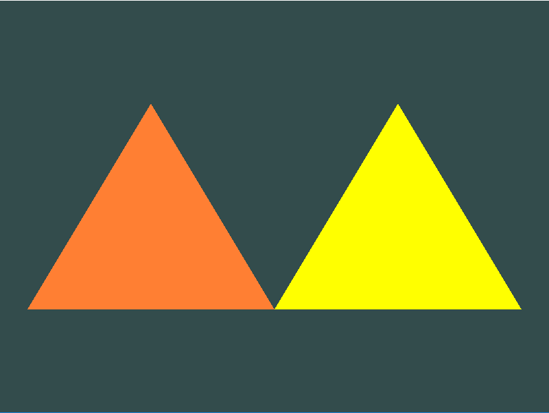

# Abstracts

fragment shader 두개를 사용해 다른 색의 삼각형 2개를 그려보자

# Source Codes

```cpp
#include <glad/glad.h>
#include <GLFW/glfw3.h>

#include <iostream>

void framebuffer_size_callback(GLFWwindow* window, int width, int height);
void processInput(GLFWwindow *window);

// settings
const unsigned int SCR_WIDTH = 800;
const unsigned int SCR_HEIGHT = 600;

const char *vertexShaderSource = "#version 330 core\n"
"layout (location = 0) in vec3 aPos;\n"
"void main()\n"
"{\n"
"   gl_Position = vec4(aPos.x, aPos.y, aPos.z, 1.0);\n"
"}\0";

//-----------------------------------------------------------------
// fragment 2개 구현
//-----------------------------------------------------------------
const char *fragmentShaderSource1 = "#version 330 core\n"
"out vec4 FragColor;\n"
"void main()\n"
"{\n"
"   FragColor = vec4(1.0f, 0.5f, 0.2f, 1.0f);\n"        // 오렌지색
"}\n\0";

const char *fragmentShaderSource2 = "#version 330 core\n"
"out vec4 FragColor;\n"
"void main()\n"
"{\n"
"   FragColor = vec4(1.0f, 1.0f, 0.0f, 1.0f);\n"        // 노란색
"}\n\0";
//------------------------------끝-----------------------------------

int main() {
	// glfw: initialize and configure
	// ------------------------------
	glfwInit();
	glfwWindowHint(GLFW_CONTEXT_VERSION_MAJOR, 3);
	glfwWindowHint(GLFW_CONTEXT_VERSION_MINOR, 3);
	glfwWindowHint(GLFW_OPENGL_PROFILE, GLFW_OPENGL_CORE_PROFILE);

#ifdef __APPLE__
	glfwWindowHint(GLFW_OPENGL_FORWARD_COMPAT, GL_TRUE); // uncomment this statement to fix compilation on OS X
#endif

	// glfw window creation
	// --------------------
	GLFWwindow* window = glfwCreateWindow(SCR_WIDTH, SCR_HEIGHT, "LearnOpenGL", NULL, NULL);
	if (window == NULL) {
		std::cout << "Failed to create GLFW window" << std::endl;
		glfwTerminate();
		return -1;
	}
	glfwMakeContextCurrent(window);
	glfwSetFramebufferSizeCallback(window, framebuffer_size_callback);

	// glad: load all OpenGL function pointers
	// ---------------------------------------
	if (!gladLoadGLLoader((GLADloadproc)glfwGetProcAddress)) {
		std::cout << "Failed to initialize GLAD" << std::endl;
		return -1;
	}


	// build and compile our shader program
	// ------------------------------------
	// vertex shader
	int vertexShader = glCreateShader(GL_VERTEX_SHADER);
	glShaderSource(vertexShader, 1, &vertexShaderSource, NULL);
	glCompileShader(vertexShader);
	// 쉐이더 컴파일 에러 체크
	int success;
	char infoLog[512];
	// 컴파일 성공했는지 확인
	glGetShaderiv(vertexShader, GL_COMPILE_STATUS, &success);
	if (!success) {
		// 에러메시지 확인
		glGetShaderInfoLog(vertexShader, 512, NULL, infoLog);
		std::cout << "ERROR::SHADER::VERTEX::COMPILATION_FAILED\n" << infoLog << std::endl;
	}

        //-----------------------------------------------------------------
        // fragment shader 생성
        //-----------------------------------------------------------------
	// 오렌지색
	int OrangeFragmentShader = glCreateShader(GL_FRAGMENT_SHADER);
	glShaderSource(OrangeFragmentShader, 1, &fragmentShaderSource1, NULL);
	glCompileShader(OrangeFragmentShader);
	// 쉐이더 컴파일 에러 체크
	glGetShaderiv(OrangeFragmentShader, GL_COMPILE_STATUS, &success);
	// 컴파일 성공했는지 확인
	if (!success) {
		glGetShaderInfoLog(OrangeFragmentShader, 512, NULL, infoLog);
		std::cout << "ERROR::SHADER::FRAGMENT::COMPILATION_FAILED\n" << infoLog << std::endl;
	}

	// 노란색
	int YellowFragmentShader = glCreateShader(GL_FRAGMENT_SHADER);
	glShaderSource(YellowFragmentShader, 1, &fragmentShaderSource2, NULL);
	glCompileShader(YellowFragmentShader);
	// 쉐이더 컴파일 에러 체크
	glGetShaderiv(YellowFragmentShader, GL_COMPILE_STATUS, &success);
	// 컴파일 성공했는지 확인
	if (!success) {
		glGetShaderInfoLog(YellowFragmentShader, 512, NULL, infoLog);
		std::cout << "ERROR::SHADER::FRAGMENT::COMPILATION_FAILED\n" << infoLog << std::endl;
	}
        //------------------------------끝-----------------------------------

	//-----------------------------------------------------------------
        // 쉐이더 연결
        //-----------------------------------------------------------------
        // 오렌지색
	int OrangeShaderProgram = glCreateProgram();
	glAttachShader(OrangeShaderProgram, vertexShader);
	glAttachShader(OrangeShaderProgram, OrangeFragmentShader);
	glLinkProgram(OrangeShaderProgram);
	// 연결 여부 확인
	glGetProgramiv(OrangeShaderProgram, GL_LINK_STATUS, &success);
	if (!success) {
		glGetProgramInfoLog(OrangeShaderProgram, 512, NULL, infoLog);
		std::cout << "ERROR::SHADER::PROGRAM::LINKING_FAILED\n" << infoLog << std::endl;
	}

        // 노란색
	int YellowShaderProgram = glCreateProgram();
	glAttachShader(YellowShaderProgram, vertexShader);
	glAttachShader(YellowShaderProgram, YellowFragmentShader);
	glLinkProgram(YellowShaderProgram);
	// 연결 여부 확인
	glGetProgramiv(YellowShaderProgram, GL_LINK_STATUS, &success);
	if (!success) {
		glGetProgramInfoLog(OrangeShaderProgram, 512, NULL, infoLog);
		std::cout << "ERROR::SHADER::PROGRAM::LINKING_FAILED\n" << infoLog << std::endl;
	}

        //--------------------------------끝---------------------------------

	// 쉐이더 객체 삭제
	glDeleteShader(vertexShader);
	glDeleteShader(OrangeFragmentShader);
	glDeleteShader(YellowFragmentShader);

	//------------------------------------------------------------------
	// 하나의 삼각형 렌더링을 위해 3D 위치를 가지고 있는 3개의 정점들 명시
        //------------------------------------------------------------------
	float vertices[] = {
		// first triangle
		-0.9f, -0.5f, 0.0f,  // left 
		-0.0f, -0.5f, 0.0f,  // right
		-0.45f, 0.5f, 0.0f,  // top 
	};

	float vertices2[] = {
	0.0f, -0.5f, 0.0f,  // left
	0.9f, -0.5f, 0.0f,  // right
	0.45f, 0.5f, 0.0f   // top 
	};
        //--------------------------------끝---------------------------------

	unsigned int VBO, VAO;
	unsigned int VBO2, VAO2;

	// 버퍼 ID 생성
	glGenVertexArrays(1, &VAO);
	glGenBuffers(1, &VBO);

	glGenVertexArrays(1, &VAO2);
	glGenBuffers(1, &VBO2);

        // 첫번째 VAO 셋팅
	glBindVertexArray(VAO);
	glBindBuffer(GL_ARRAY_BUFFER, VBO);
	glBufferData(GL_ARRAY_BUFFER, sizeof(vertices), vertices, GL_STATIC_DRAW);
	glVertexAttribPointer(0, 3, GL_FLOAT, GL_FALSE, 3 * sizeof(float), (void*)0);
	glEnableVertexAttribArray(0);

        // 두번째 VAO 셋팅
	glBindVertexArray(VAO2);
	glBindBuffer(GL_ARRAY_BUFFER, VBO2);
	glBufferData(GL_ARRAY_BUFFER, sizeof(vertices2), vertices2, GL_STATIC_DRAW);
	glVertexAttribPointer(0, 3, GL_FLOAT, GL_FALSE, 3 * sizeof(float), (void*)0);
	glEnableVertexAttribArray(0);

	glBindBuffer(GL_ARRAY_BUFFER, 0);
	glBindVertexArray(0);

	// render loop
	// -----------
	while (!glfwWindowShouldClose(window)) {
		// input
		// -----
		processInput(window);

		// render
		// ------
		glClearColor(0.2f, 0.3f, 0.3f, 1.0f);
		glClear(GL_COLOR_BUFFER_BIT);

		// 오렌지색 셰이더를 이용
		glUseProgram(OrangeShaderProgram);
		glBindVertexArray(VAO); 
		glDrawArrays(GL_TRIANGLES, 0, 3);

		// 노란색 셰이더를 이용
		glUseProgram(YellowShaderProgram);
		glBindVertexArray(VAO2); 
		glDrawArrays(GL_TRIANGLES, 0, 3);

		glfwSwapBuffers(window);
		glfwPollEvents();
	}

	glDeleteVertexArrays(1, &VAO);
	glDeleteBuffers(1, &VBO);

	glDeleteVertexArrays(1, &VAO2);
	glDeleteBuffers(1, &VBO2);

	glfwTerminate();
	return 0;
}

void processInput(GLFWwindow *window) {
	if (glfwGetKey(window, GLFW_KEY_ESCAPE) == GLFW_PRESS)
		glfwSetWindowShouldClose(window, true);
}

void framebuffer_size_callback(GLFWwindow* window, int width, int height) {
	glViewport(0, 0, width, height);
}
```

# Result

