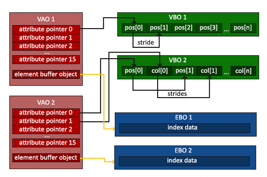
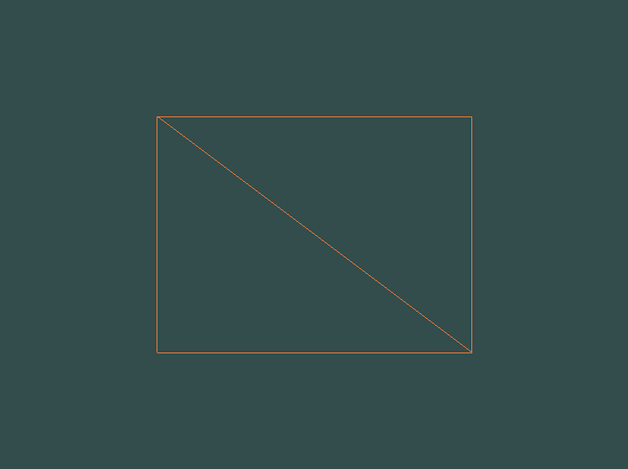

## Element Buffer Objects(EBO)

* OpenGL이 어떠한 정점들을 그려야할 지 결정할 수 있는 인덱스들을 저장
* `indexed drawing`이라고도 불림

```cpp
// 2개의 삼각형을 이용해 사각형을 그림
float vertices[] = {
    // 첫 번째 삼각형
     0.5f,  0.5f, 0.0f,  // 우측 상단
     0.5f, -0.5f, 0.0f,  // 우측 하단
    -0.5f,  0.5f, 0.0f,  // 좌측 상단 
    // second triangle
     0.5f, -0.5f, 0.0f,  // 우측 하단
    -0.5f, -0.5f, 0.0f,  // 좌측 하단
    -0.5f,  0.5f, 0.0f   // 좌측 상단
}; 
```
* 중복된 정점이 존재함, 오버헤드 발생

```cpp
// 고유한 정점들을 지정하고, 사각형을 그릴 정점들의 인덱스를 지정
float vertices[] = {
     0.5f,  0.5f, 0.0f,  // 우측 상단
     0.5f, -0.5f, 0.0f,  // 우측 하단
    -0.5f, -0.5f, 0.0f,  // 좌측 하단
    -0.5f,  0.5f, 0.0f   // 좌측 상단
};
unsigned int indices[] = {  // 0부터 시작한다는 것을 명심하세요!
    0, 1, 3,   // 첫 번째 삼각형
    1, 2, 3    // 두 번째 삼각형
}; 

unsigned int EBO;
glGenBuffers(1, &EBO);

// EBO를 바인딩하고 인덱스들을 버퍼에 복사함
glBindBuffer(GL_ELEMENT_ARRAY_BUFFER, EBO);
glBufferData(GL_ELEMENT_ARRAY_BUFFER, sizeof(indices), indices, GL_STATIC_DRAW);

glBindBuffer(GL_ELEMENT_ARRAY_BUFFER, EBO);
// 인덱스 버퍼로 부터 삼각형을 그리겠다.
// 현재 바인딩된 EBO의 인덱스를 사용하여 그리게 됨
glDrawElements(GL_TRIANGLES, 6, GL_UNSIGNED_INT, 0);
```

`void glDrawElements(GLenum mode, GLsizei count, GLenum type,const GLvoid * indices);`

* `mode` : 그리기를 원하는 모드 지정
* `count` : 그리고 싶은 요소의 갯수 지정
* `type` : 인덱스의 타입
* `indices` : EBO에서의 Offset
  


* VAO는 EBO바인딩도 저장함
* VAO를 바인딩하면 자동으로 내부에 있는 EBO도 바인딩됨
  
# Source codes

```cpp
#include <glad/glad.h>
#include <GLFW/glfw3.h>

#include <iostream>

void framebuffer_size_callback(GLFWwindow* window, int width, int height);
void processInput(GLFWwindow *window);

// settings
const unsigned int SCR_WIDTH = 800;
const unsigned int SCR_HEIGHT = 600;

const char *vertexShaderSource = "#version 330 core\n"
    "layout (location = 0) in vec3 aPos;\n"
    "void main()\n"
    "{\n"
    "   gl_Position = vec4(aPos.x, aPos.y, aPos.z, 1.0);\n"
    "}\0";
const char *fragmentShaderSource = "#version 330 core\n"
    "out vec4 FragColor;\n"
    "void main()\n"
    "{\n"
    "   FragColor = vec4(1.0f, 0.5f, 0.2f, 1.0f);\n"
    "}\n\0";

int main()
{
    // glfw: initialize and configure
    // ------------------------------
    glfwInit();
    glfwWindowHint(GLFW_CONTEXT_VERSION_MAJOR, 3);
    glfwWindowHint(GLFW_CONTEXT_VERSION_MINOR, 3);
    glfwWindowHint(GLFW_OPENGL_PROFILE, GLFW_OPENGL_CORE_PROFILE);

#ifdef __APPLE__
    glfwWindowHint(GLFW_OPENGL_FORWARD_COMPAT, GL_TRUE); // uncomment this statement to fix compilation on OS X
#endif

    // glfw window creation
    // --------------------
    GLFWwindow* window = glfwCreateWindow(SCR_WIDTH, SCR_HEIGHT, "LearnOpenGL", NULL, NULL);
    if (window == NULL)
    {
        std::cout << "Failed to create GLFW window" << std::endl;
        glfwTerminate();
        return -1;
    }
    glfwMakeContextCurrent(window);
    glfwSetFramebufferSizeCallback(window, framebuffer_size_callback);

    // glad: load all OpenGL function pointers
    // ---------------------------------------
    if (!gladLoadGLLoader((GLADloadproc)glfwGetProcAddress))
    {
        std::cout << "Failed to initialize GLAD" << std::endl;
        return -1;
    }


    // build and compile our shader program
    // ------------------------------------
    // vertex shader
    int vertexShader = glCreateShader(GL_VERTEX_SHADER);
    glShaderSource(vertexShader, 1, &vertexShaderSource, NULL);
    glCompileShader(vertexShader);
    // check for shader compile errors
    int success;
    char infoLog[512];
    glGetShaderiv(vertexShader, GL_COMPILE_STATUS, &success);
    if (!success)
    {
        glGetShaderInfoLog(vertexShader, 512, NULL, infoLog);
        std::cout << "ERROR::SHADER::VERTEX::COMPILATION_FAILED\n" << infoLog << std::endl;
    }
    // fragment shader
    int fragmentShader = glCreateShader(GL_FRAGMENT_SHADER);
    glShaderSource(fragmentShader, 1, &fragmentShaderSource, NULL);
    glCompileShader(fragmentShader);
    // check for shader compile errors
    glGetShaderiv(fragmentShader, GL_COMPILE_STATUS, &success);
    if (!success)
    {
        glGetShaderInfoLog(fragmentShader, 512, NULL, infoLog);
        std::cout << "ERROR::SHADER::FRAGMENT::COMPILATION_FAILED\n" << infoLog << std::endl;
    }
    // link shaders
    int shaderProgram = glCreateProgram();
    glAttachShader(shaderProgram, vertexShader);
    glAttachShader(shaderProgram, fragmentShader);
    glLinkProgram(shaderProgram);
    // check for linking errors
    glGetProgramiv(shaderProgram, GL_LINK_STATUS, &success);
    if (!success) {
        glGetProgramInfoLog(shaderProgram, 512, NULL, infoLog);
        std::cout << "ERROR::SHADER::PROGRAM::LINKING_FAILED\n" << infoLog << std::endl;
    }
    glDeleteShader(vertexShader);
    glDeleteShader(fragmentShader);

    // set up vertex data (and buffer(s)) and configure vertex attributes
    // ------------------------------------------------------------------
    float vertices[] = {
         0.5f,  0.5f, 0.0f,  // top right
         0.5f, -0.5f, 0.0f,  // bottom right
        -0.5f, -0.5f, 0.0f,  // bottom left
        -0.5f,  0.5f, 0.0f   // top left 
    };
    // 인덱스 배열
    unsigned int indices[] = {  // 0번부터 시작해야한다.
        0, 1, 3,  // first Triangle
        1, 2, 3   // second Triangle
    };
    unsigned int VBO, VAO, EBO;
    glGenVertexArrays(1, &VAO);
    glGenBuffers(1, &VBO);
    // 인덱스 버퍼 생성
    glGenBuffers(1, &EBO);

    glBindVertexArray(VAO);

    glBindBuffer(GL_ARRAY_BUFFER, VBO);
    glBufferData(GL_ARRAY_BUFFER, sizeof(vertices), vertices, GL_STATIC_DRAW);

    // 인덱스 버퍼 데이터 메모리에 복사
    glBindBuffer(GL_ELEMENT_ARRAY_BUFFER, EBO);
    glBufferData(GL_ELEMENT_ARRAY_BUFFER, sizeof(indices), indices, GL_STATIC_DRAW);

    glVertexAttribPointer(0, 3, GL_FLOAT, GL_FALSE, 3 * sizeof(float), (void*)0);
    glEnableVertexAttribArray(0);

    glBindBuffer(GL_ARRAY_BUFFER, 0); 

    // VAO가 활성화되어 있는 동안엔 EBO 바인딩을 해제하면 안됨
    //glBindBuffer(GL_ELEMENT_ARRAY_BUFFER, 0);

    glBindVertexArray(0); 

    // uncomment this call to draw in wireframe polygons.
    glPolygonMode(GL_FRONT_AND_BACK, GL_LINE);

    glBindVertexArray(VAO);
    // render loop
    // -----------
    while (!glfwWindowShouldClose(window))
    {
        // input
        // -----
        processInput(window);

        // render
        // ------
        glClearColor(0.2f, 0.3f, 0.3f, 1.0f);
        glClear(GL_COLOR_BUFFER_BIT);

        // draw our first triangle
        glUseProgram(shaderProgram);
        //glBindVertexArray(VAO);   // VAO가 하나이므로 매번 바인딩할 필요 없음
        //glDrawArrays(GL_TRIANGLES, 0, 6);
        glDrawElements(GL_TRIANGLES, 6, GL_UNSIGNED_INT, 0);    // 인덱스 버퍼를 이용해 그림
        // glBindVertexArray(0); // 매번 언바인딩할 필요 없음
 
        glfwSwapBuffers(window);
        glfwPollEvents();
    }

    glDeleteVertexArrays(1, &VAO);
    glDeleteBuffers(1, &VBO);
    glDeleteBuffers(1, &EBO);

    glfwTerminate();
    return 0;
}

void processInput(GLFWwindow *window)
{
    if (glfwGetKey(window, GLFW_KEY_ESCAPE) == GLFW_PRESS)
        glfwSetWindowShouldClose(window, true);
}

void framebuffer_size_callback(GLFWwindow* window, int width, int height)
{
    glViewport(0, 0, width, height);
}
```

`lgPolygonMode(GLenum face, GLenum mode)`
* OpenGL이 primitive를 어떻게 그릴것인지 설정할 수 있음
* 재설정하기 전까지 그려짐
* `face` : 상태를 적용할 면
* `mode` : face에 대해 표현할 방법 설정

# Result

