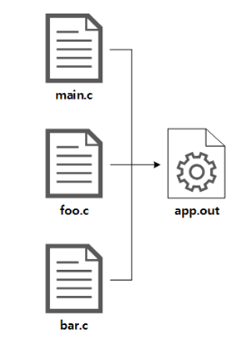
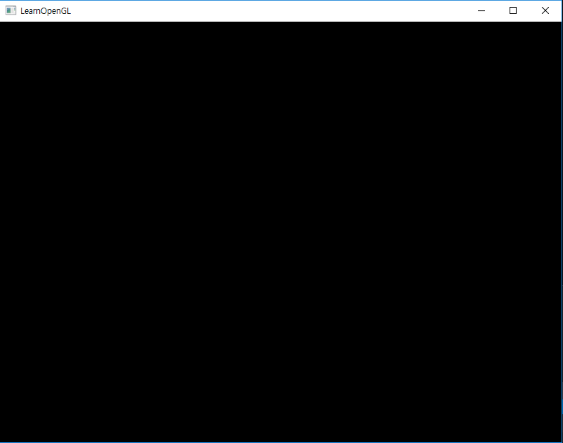

# CMAKE

* 정의된 `CMAKE` 스크립트를 기반으로 소스 코드 파일 모음을 사용자가 선택한 프로젝트/솔루션 파일로 생성할 수 있는 도구
* `Makefile`보다 추상화된 기술 문법, Build Step을 기술하면, Makefile을 자동으로 생성
  * 일종의 Meta-Makefile
  * 범용 IDE에서 프로젝트 설정 파일로 사용할 수 있음



* main.c는 foo.c와 bar.c에서 정의된 함수를 호출하는 의존성 존재


* CMD 옵션
  * cmake -G "(VS이름)" -B/설치경로
  
    ```cmake -G "Visual Studio 15 2017" -B/Build```

# glad

* Multi-Language GL/GLES/EGL/GLX/WGL Loader-Generator
* 크로노스 SVN의 공식 사양을 기반으로 로더를 생성
* 오픈 소스 라이브러리
* 런타임시 OpenGL 기능에 대한 포인터, 코어 및 확장 기능을 로드하는 라이브러리


# GLFW

* C로 작성된 라이브러리
* OpenGL 컨텍스트를 만들고, Window 매개변수를 정의, 필요한 모든 사용자 입력을 처리할 수 있음

# Hello_Window.cpp

```cpp
// glad는 glfw보다 먼저 포함되어야함
#include <glad/glad.h>
#include <GLFW/glfw3.h>

#include <iostream>

void framebuffer_size_callback(GLFWwindow* window, int width, int height);
void processInput(GLFWwindow *window);

// settings
const unsigned int SCR_WIDTH = 800;
const unsigned int SCR_HEIGHT = 600;

int main()
{
    // glfw: initialize and configure
    // ------------------------------
    glfwInit();     // GLFW 초기화
    glfwWindowHint(GLFW_CONTEXT_VERSION_MAJOR, 3);  // OpenGL 3.3 사용
    glfwWindowHint(GLFW_CONTEXT_VERSION_MINOR, 3);
    glfwWindowHint(GLFW_OPENGL_PROFILE, GLFW_OPENGL_CORE_PROFILE);  // 3.2 이하의 함수는 사용 X

#ifdef __APPLE__
    glfwWindowHint(GLFW_OPENGL_FORWARD_COMPAT, GL_TRUE); // uncomment this statement to fix compilation on OS X
#endif

    // glfw window creation
    // --------------------
    GLFWwindow* window = glfwCreateWindow(SCR_WIDTH, SCR_HEIGHT, "LearnOpenGL", NULL, NULL);       // 새 창을 열고, OpenGL 컨텍스트를 생성
    if (window == NULL)
    {
        std::cout << "Failed to create GLFW window" << std::endl;
        glfwTerminate();    // 할당된 모든 자원 정리, 삭제
        return -1;
    }
    glfwMakeContextCurrent(window);   // 지정된 윈도우의 컨텍스트를 호출 스레드의 현재 상태로 만듦  
    glfwSetFramebufferSizeCallback(window, framebuffer_size_callback);  // 지정된 윈도우에 대한 프레임 버퍼 크기 조정 콜백 설정

    // glad: load all OpenGL function pointers
    // ---------------------------------------
    if (!gladLoadGLLoader((GLADloadproc)glfwGetProcAddress))
    {
        std::cout << "Failed to initialize GLAD" << std::endl;
        return -1;
    }    

    // render loop : 프로그램이 명시적으로 중지하라는 메시지를 받기 전까지 계속 이미지를 그리고 사용자 입력을 처리하도록 루프문 만듦
    // -----------
    while (!glfwWindowShouldClose(window))  // 윈도우의 close flag 확인
    {
        // input
        // -----
        processInput(window);

        // glfw: swap buffers and poll IO events (keys pressed/released, mouse moved etc.)
        // -------------------------------------------------------------------------------
        glfwSwapBuffers(window);    // 컬러 버퍼 교체
        glfwPollEvents();           // 이벤트가 발생했는지 확인, 윈도우 상태 업데이트
    }

    // glfw: terminate, clearing all previously allocated GLFW resources.
    // ------------------------------------------------------------------
    glfwTerminate();
    return 0;
}

// process all input: query GLFW whether relevant keys are pressed/released this frame and react accordingly
// ---------------------------------------------------------------------------------------------------------
void processInput(GLFWwindow *window)
{
    // glfwGetKey : 지정된 키의 마지막 상태 반환
    if(glfwGetKey(window, GLFW_KEY_ESCAPE) == GLFW_PRESS)
        glfwSetWindowShouldClose(window, true);
}

// glfw: whenever the window size changed (by OS or user resize) this callback function executes
// ---------------------------------------------------------------------------------------------
void framebuffer_size_callback(GLFWwindow* window, int width, int height)
{
    // make sure the viewport matches the new window dimensions; note that width and 
    // height will be significantly larger than specified on retina displays.
    glViewport(0, 0, width, height);    // OpenGL에게 렌더링 윈도우 사이즈 알려줌
}

```

* GLFW 헤더 전에 GLAD 헤더를 포함시켜야함
* GLAD 용 include 파일에는 GL/gl.h와 같은 OpenGL헤더가 포함되어 있으므로 OpenGL을 필요로 하는 다른 헤더 파일보다 먼저 GLAD가 포함되어야함

* `glfwInit()` : GLFW 초기화
* `glfwWindowHint(int hint, int value)` : GLFW 구성
  * hint : 구성하고자 하는 옵션, _GLFW 로 시작
  * value : 옵션 값

```glfwWindowHint(GLFW_OPENGL_PROFILE, GLFW_OPENGL_CORE_PROFILE);```
* OpenGL 프로파일 설정
* `GLFW_OPENGL_CORE_PROFILE` : 3.2 이하의 함수는 사용 X
* `GLFW_OPENGL_ANY_PROFILE ` : 3.2 이하의 함수 사용

* `GLFWwindow` : 모든 window 데이터 가지고 있음

```
GLFWwindow* glfwCreateWindow(int width,int height, const char * title,
GLFWmonitor * monitor, GLFWwindow * share)
```
* title : 창 이름
* monitor : 전체 화면 모드에 사용할 모니터, 윈도우 모드에서는 NULL
* share : 자원을 공유할 window

```void glfwMakeContextCurrent(GLFWwindow * window)```
* 호출중인 스레드에서 지정된 윈도우의 OpenGL 컨텍스트를 최신 상태로 만듦
* 컨텍스트는 한번에 하나의 스레드에서만 현재 상태로 만들 수 있음
* 각 스레드는 한번에 하나의 현재 컨텍스트만 가질 수 있음

```gladLoadGLLoader((GLADloadproc)glfwGetProcAddress)```

* GLAD 초기화
* OS마다 다른 OpenGL 함수 포인터의 주소를 로드하기 위해 GLAD 함수를 거침
* GLFW는 컴파일할 환경인 OS에 따라 함수를 정의하는 `glfwGetProcAddress` 제공
* glad가 로드되고나면 생성한 context와 지원되는 모든 OpenGL 코어 및 확장 기능에 접근 할 수 있음

```int glfwGetKey(GLFWwindow * window, int key)```

* 지정된 키의 마지막 상태 반환
* 반환값 : GLFW_PRESS / GLFW_RELEASE

```void glfwSetWindowShouldClose(GLFWwindow * window, int value)```

* 지정된 윈도우의 close flag 설정

* 컬러 버퍼 : GLFW 창 안의 각 픽셀들에 대한 컬러 값을 가지고 있는 큰 버퍼
  * 이미지를 그리고 화면에 출력하는 기능

```glfwPollEvents()```
* 이벤트를 처리하면 해당 이벤트와 연관된 입력 콜백이 호출됨

```glViewport(GLint x, GLint y, GLsizei width, GLsizei height)```

* x,y : 윈도우의 왼쪽 아래 좌표
* width, height : 너비, 높이 (픽셀로 설정)
* 뷰포트 변환 : 투영 변환된 이미지를 윈도우의 어디쯤에 출력할 것인지 지정

# Result

