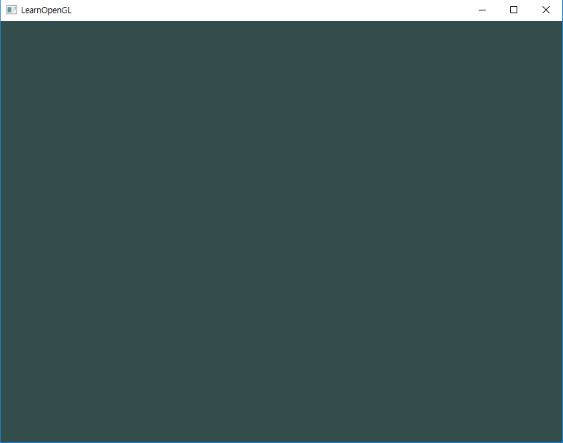

# Abstract

화면을 특정색으로 지워보자

# Source Code

```cpp
#include <glad/glad.h>
#include <GLFW/glfw3.h>

#include <iostream>

void framebuffer_size_callback(GLFWwindow* window, int width, int height);
void processInput(GLFWwindow *window);

// settings
const unsigned int SCR_WIDTH = 800;
const unsigned int SCR_HEIGHT = 600;

int main()
{
    // glfw: initialize and configure
    // ------------------------------
    glfwInit();
    glfwWindowHint(GLFW_CONTEXT_VERSION_MAJOR, 3);
    glfwWindowHint(GLFW_CONTEXT_VERSION_MINOR, 3);
    glfwWindowHint(GLFW_OPENGL_PROFILE, GLFW_OPENGL_CORE_PROFILE);

#ifdef __APPLE__
    glfwWindowHint(GLFW_OPENGL_FORWARD_COMPAT, GL_TRUE); // uncomment this statement to fix compilation on OS X
#endif

    // glfw window creation
    // --------------------
    GLFWwindow* window = glfwCreateWindow(SCR_WIDTH, SCR_HEIGHT, "LearnOpenGL", NULL, NULL);
    if (window == NULL)
    {
        std::cout << "Failed to create GLFW window" << std::endl;
        glfwTerminate();
        return -1;
    }
    glfwMakeContextCurrent(window);
    glfwSetFramebufferSizeCallback(window, framebuffer_size_callback);

    // glad: load all OpenGL function pointers
    // ---------------------------------------
    if (!gladLoadGLLoader((GLADloadproc)glfwGetProcAddress))
    {
        std::cout << "Failed to initialize GLAD" << std::endl;
        return -1;
    }    

    // render loop
    // -----------
    while (!glfwWindowShouldClose(window))
    {
        // input
        // -----
        processInput(window);

        // render
        // ------
        glClearColor(0.2f, 0.3f, 0.3f, 1.0f);
        glClear(GL_COLOR_BUFFER_BIT);

        // glfw: swap buffers and poll IO events (keys pressed/released, mouse moved etc.)
        // -------------------------------------------------------------------------------
        glfwSwapBuffers(window);
        glfwPollEvents();
    }

    // glfw: terminate, clearing all previously allocated GLFW resources.
    // ------------------------------------------------------------------
    glfwTerminate();
    return 0;
}

// process all input: query GLFW whether relevant keys are pressed/released this frame and react accordingly
// ---------------------------------------------------------------------------------------------------------
void processInput(GLFWwindow *window)
{
    if(glfwGetKey(window, GLFW_KEY_ESCAPE) == GLFW_PRESS)
        glfwSetWindowShouldClose(window, true);
}

// glfw: whenever the window size changed (by OS or user resize) this callback function executes
// ---------------------------------------------------------------------------------------------
void framebuffer_size_callback(GLFWwindow* window, int width, int height)
{
    // make sure the viewport matches the new window dimensions; note that width and 
    // height will be significantly larger than specified on retina displays.
    glViewport(0, 0, width, height);
}
```

```void glClearColor(GLfloat red, GLfloat green, GLfloat blue, GLfloat alpha)```
* 컬러 버퍼를 지울때 사용할 값 지정
* 초기값은 0
* 범위 : [0,1]

```void glClear(GLbitfield mask)```
* 버퍼들을 미리 설정된 값으로 지움
* mask : 지워질 버퍼를 지정하는 여러 값들이 비트 OR 된 값
* OR 연산자를 이용해 여러개의 버퍼 지울 수 있음

|GLbitfield|Description|
|---|:---|
|GL_COLOR_BUFFER_BIT|컬러 버퍼|
|GL_DEPTH_BUFFER_BIT|깊이 버퍼|
|GL_STENCIL_BUFFER_BIT|스텐실 버퍼|
|GL_ACCUM_BUFFER_BIT|누적 버퍼|

* 스텐실 버퍼 : 특정 조건에 따라 픽셀을 쓸지 말지 결정
* 누적 버퍼 : 확장된 범위의 컬러 버퍼
  * 픽셀 조각의 크기를 조정한 후 기존 픽셀 값에 추가
  * 여러 이미지를 통합하기 위해 설계
  * 누적 버퍼에 직접 렌더링 할 수 없음
  * 컬러 버퍼로 렌더링 한 후 glAccum()을 이용해 해당 이미지를 누적 버퍼에 축적
  * 앤티 앨리어싱, 모션 블러 등의 효과 만들수 있음
# Result

