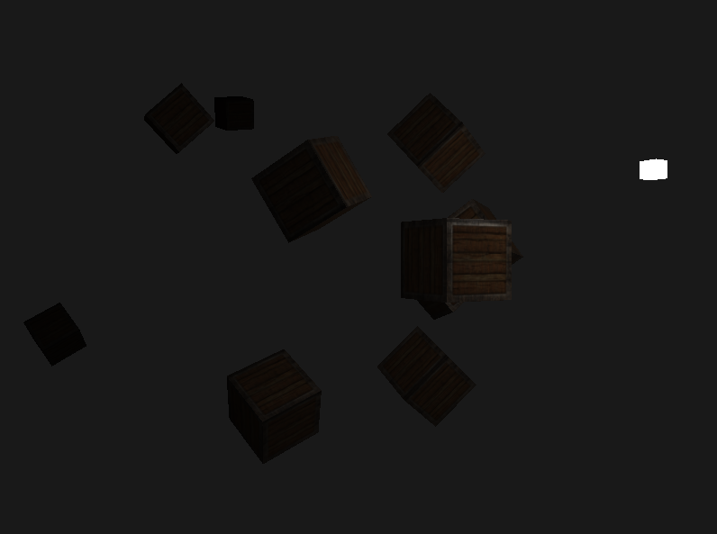
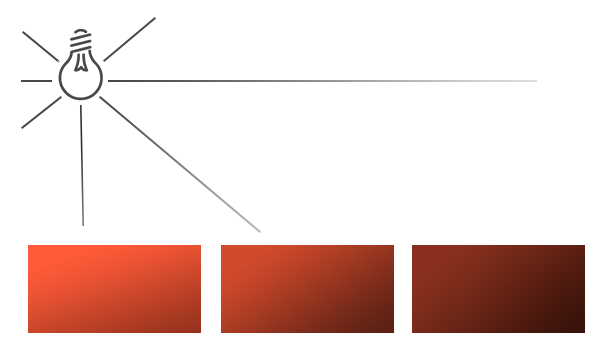
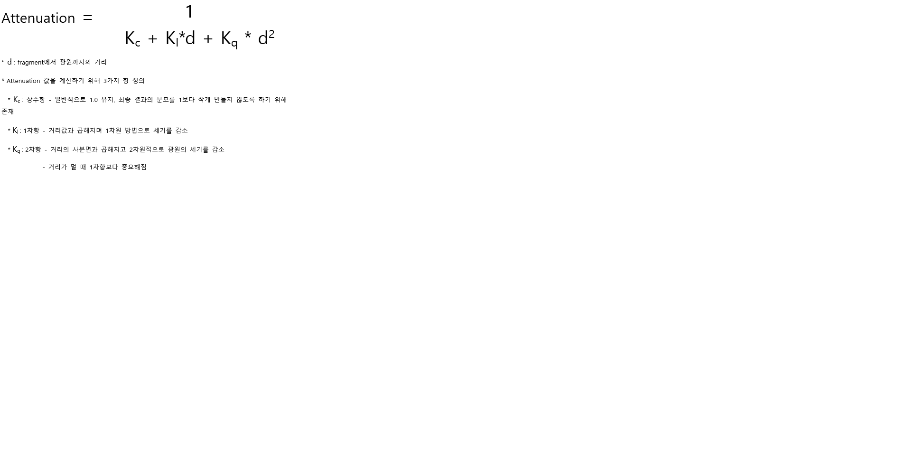
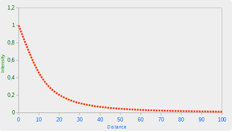
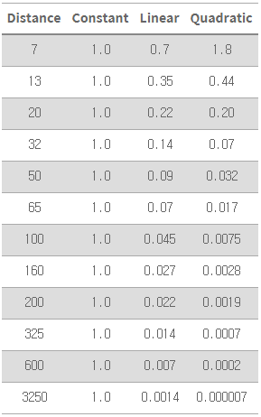

# Result



# Point light

* world에 위치를 가지는 광원
* 모든 방향으로 빛을 밝히고 거리에 따라 밝기가 달라짐(희미해짐)
  * ex) 전구, 횃불



## Attenuation(감쇠)

* 광선이 지나가는 거리에 따라 빛의 세기를 줄임

* 공식 : 광원과 fragment 사이의 거리를 기반으로 하는 attenuation 값 계산



* 가까운 범위에 있을때는 상당히 밝고 거리에 따라 빠르게 어두워지다가 어두워지는 속도가 점점 느려짐



* `Ogre3D's wiki`에 정의된 상수값



* 거리가 멀수록 Linear, Quadratic 값이 작아짐

# Object Shader Codes

```cpp
#version 330 core
out vec4 FragColor;

struct Material {
    sampler2D diffuse;
    sampler2D specular;    
    float shininess;
}; 

struct Light {
    // Point Light은 위치값을 가짐
    vec3 position;  
  
    vec3 ambient;
    vec3 diffuse;
    vec3 specular;
	
    // Attenuation을 구현하기 위해 필요한 상수값
    float constant;
    float linear;
    float quadratic;
};

in vec3 FragPos;  
in vec3 Normal;  
in vec2 TexCoords;
  
uniform vec3 viewPos;
uniform Material material;
uniform Light light;

void main() {
    // ambient
    vec3 ambient = light.ambient * texture(material.diffuse, TexCoords).rgb;
  	
    // diffuse 
    vec3 norm = normalize(Normal);
    vec3 lightDir = normalize(light.position - FragPos);
    float diff = max(dot(norm, lightDir), 0.0);
    vec3 diffuse = light.diffuse * diff * texture(material.diffuse, TexCoords).rgb;  
    
    // specular
    vec3 viewDir = normalize(viewPos - FragPos);
    vec3 reflectDir = reflect(-lightDir, norm);  
    float spec = pow(max(dot(viewDir, reflectDir), 0.0), material.shininess);
    vec3 specular = light.specular * spec * texture(material.specular, TexCoords).rgb;  
    
    // 공식을 기반으로 attenuation 값 계산
    // GLSL의 length함수를 이용해 fragment와 광원사이의 거리를 얻음
    float distance    = length(light.position - FragPos);
    float attenuation = 1.0 / (light.constant + light.linear * distance + light.quadratic * (distance * distance));    

    // attenuation 값을 빛 컴포넌트에 곱해줌
    ambient  *= attenuation;  
    diffuse   *= attenuation;
    specular *= attenuation;   
        
    vec3 result = ambient + diffuse + specular;
    FragColor = vec4(result, 1.0);
} 
```

# Source Codes

```cpp
#include <glad/glad.h>
#include <GLFW/glfw3.h>
#include <stb_image.h>

#include <glm/glm.hpp>
#include <glm/gtc/matrix_transform.hpp>
#include <glm/gtc/type_ptr.hpp>

#include <learnopengl/filesystem.h>
#include <learnopengl/shader_m.h>
#include <learnopengl/camera.h>

#include <iostream>

void framebuffer_size_callback(GLFWwindow* window, int width, int height);
void mouse_callback(GLFWwindow* window, double xpos, double ypos);
void scroll_callback(GLFWwindow* window, double xoffset, double yoffset);
void processInput(GLFWwindow *window);
unsigned int loadTexture(const char *path);

// settings
const unsigned int SCR_WIDTH = 800;
const unsigned int SCR_HEIGHT = 600;

// camera
Camera camera(glm::vec3(0.0f, 0.0f, 3.0f));
float lastX = SCR_WIDTH / 2.0f;
float lastY = SCR_HEIGHT / 2.0f;
bool firstMouse = true;

// timing
float deltaTime = 0.0f;
float lastFrame = 0.0f;

// point light position
// ---------------------------------------------------------------
glm::vec3 lightPos(1.2f, 1.0f, 2.0f);

int main() {
    // glfw: initialize and configure
    // ------------------------------
    glfwInit();
    glfwWindowHint(GLFW_CONTEXT_VERSION_MAJOR, 3);
    glfwWindowHint(GLFW_CONTEXT_VERSION_MINOR, 3);
    glfwWindowHint(GLFW_OPENGL_PROFILE, GLFW_OPENGL_CORE_PROFILE);

#ifdef __APPLE__
        glfwWindowHint(GLFW_OPENGL_FORWARD_COMPAT, GL_TRUE);
#endif

    // glfw window creation
    // --------------------
    GLFWwindow* window = glfwCreateWindow(SCR_WIDTH, SCR_HEIGHT, "LearnOpenGL", NULL, NULL);
    if (window == NULL) {
        std::cout << "Failed to create GLFW window" << std::endl;
        glfwTerminate();
        return -1;
    }
    glfwMakeContextCurrent(window);
    glfwSetFramebufferSizeCallback(window, framebuffer_size_callback);
    glfwSetCursorPosCallback(window, mouse_callback);
    glfwSetScrollCallback(window, scroll_callback);

    // tell GLFW to capture our mouse
    glfwSetInputMode(window, GLFW_CURSOR, GLFW_CURSOR_DISABLED);

    // glad: load all OpenGL function pointers
    // ---------------------------------------
    if (!gladLoadGLLoader((GLADloadproc)glfwGetProcAddress)) {
        std::cout << "Failed to initialize GLAD" << std::endl;
        return -1;
    }

    // configure global opengl state
    // -----------------------------
    glEnable(GL_DEPTH_TEST);

    // build and compile our shader zprogram
    // ------------------------------------
    Shader lightingShader("5.2.light_casters.vs", "5.2.light_casters.fs");
    Shader lampShader("5.2.lamp.vs", "5.2.lamp.fs");

    // set up vertex data (and buffer(s)) and configure vertex attributes
    // ------------------------------------------------------------------
    float vertices[] = {
        // positions          // normals           // texture coords
        -0.5f, -0.5f, -0.5f,  0.0f,  0.0f, -1.0f,  0.0f,  0.0f,
         0.5f, -0.5f, -0.5f,  0.0f,  0.0f, -1.0f,  1.0f,  0.0f,
         0.5f,  0.5f, -0.5f,  0.0f,  0.0f, -1.0f,  1.0f,  1.0f,
         0.5f,  0.5f, -0.5f,  0.0f,  0.0f, -1.0f,  1.0f,  1.0f,
        -0.5f,  0.5f, -0.5f,  0.0f,  0.0f, -1.0f,  0.0f,  1.0f,
        -0.5f, -0.5f, -0.5f,  0.0f,  0.0f, -1.0f,  0.0f,  0.0f,

        -0.5f, -0.5f,  0.5f,  0.0f,  0.0f,  1.0f,  0.0f,  0.0f,
         0.5f, -0.5f,  0.5f,  0.0f,  0.0f,  1.0f,  1.0f,  0.0f,
         0.5f,  0.5f,  0.5f,  0.0f,  0.0f,  1.0f,  1.0f,  1.0f,
         0.5f,  0.5f,  0.5f,  0.0f,  0.0f,  1.0f,  1.0f,  1.0f,
        -0.5f,  0.5f,  0.5f,  0.0f,  0.0f,  1.0f,  0.0f,  1.0f,
        -0.5f, -0.5f,  0.5f,  0.0f,  0.0f,  1.0f,  0.0f,  0.0f,

        -0.5f,  0.5f,  0.5f, -1.0f,  0.0f,  0.0f,  1.0f,  0.0f,
        -0.5f,  0.5f, -0.5f, -1.0f,  0.0f,  0.0f,  1.0f,  1.0f,
        -0.5f, -0.5f, -0.5f, -1.0f,  0.0f,  0.0f,  0.0f,  1.0f,
        -0.5f, -0.5f, -0.5f, -1.0f,  0.0f,  0.0f,  0.0f,  1.0f,
        -0.5f, -0.5f,  0.5f, -1.0f,  0.0f,  0.0f,  0.0f,  0.0f,
        -0.5f,  0.5f,  0.5f, -1.0f,  0.0f,  0.0f,  1.0f,  0.0f,

         0.5f,  0.5f,  0.5f,  1.0f,  0.0f,  0.0f,  1.0f,  0.0f,
         0.5f,  0.5f, -0.5f,  1.0f,  0.0f,  0.0f,  1.0f,  1.0f,
         0.5f, -0.5f, -0.5f,  1.0f,  0.0f,  0.0f,  0.0f,  1.0f,
         0.5f, -0.5f, -0.5f,  1.0f,  0.0f,  0.0f,  0.0f,  1.0f,
         0.5f, -0.5f,  0.5f,  1.0f,  0.0f,  0.0f,  0.0f,  0.0f,
         0.5f,  0.5f,  0.5f,  1.0f,  0.0f,  0.0f,  1.0f,  0.0f,

        -0.5f, -0.5f, -0.5f,  0.0f, -1.0f,  0.0f,  0.0f,  1.0f,
         0.5f, -0.5f, -0.5f,  0.0f, -1.0f,  0.0f,  1.0f,  1.0f,
         0.5f, -0.5f,  0.5f,  0.0f, -1.0f,  0.0f,  1.0f,  0.0f,
         0.5f, -0.5f,  0.5f,  0.0f, -1.0f,  0.0f,  1.0f,  0.0f,
        -0.5f, -0.5f,  0.5f,  0.0f, -1.0f,  0.0f,  0.0f,  0.0f,
        -0.5f, -0.5f, -0.5f,  0.0f, -1.0f,  0.0f,  0.0f,  1.0f,

        -0.5f,  0.5f, -0.5f,  0.0f,  1.0f,  0.0f,  0.0f,  1.0f,
         0.5f,  0.5f, -0.5f,  0.0f,  1.0f,  0.0f,  1.0f,  1.0f,
         0.5f,  0.5f,  0.5f,  0.0f,  1.0f,  0.0f,  1.0f,  0.0f,
         0.5f,  0.5f,  0.5f,  0.0f,  1.0f,  0.0f,  1.0f,  0.0f,
        -0.5f,  0.5f,  0.5f,  0.0f,  1.0f,  0.0f,  0.0f,  0.0f,
        -0.5f,  0.5f, -0.5f,  0.0f,  1.0f,  0.0f,  0.0f,  1.0f
    };
    // positions all containers
    glm::vec3 cubePositions[] = {
        glm::vec3( 0.0f,  0.0f,  0.0f),
        glm::vec3( 2.0f,  5.0f, -15.0f),
        glm::vec3(-1.5f, -2.2f, -2.5f),
        glm::vec3(-3.8f, -2.0f, -12.3f),
        glm::vec3( 2.4f, -0.4f, -3.5f),
        glm::vec3(-1.7f,  3.0f, -7.5f),
        glm::vec3( 1.3f, -2.0f, -2.5f),
        glm::vec3( 1.5f,  2.0f, -2.5f),
        glm::vec3( 1.5f,  0.2f, -1.5f),
        glm::vec3(-1.3f,  1.0f, -1.5f)
    };
    // object VAO 설정
    unsigned int VBO, cubeVAO;
    glGenVertexArrays(1, &cubeVAO);
    glGenBuffers(1, &VBO);

    // VBO도 설정
    glBindBuffer(GL_ARRAY_BUFFER, VBO);
    glBufferData(GL_ARRAY_BUFFER, sizeof(vertices), vertices, GL_STATIC_DRAW);

    glBindVertexArray(cubeVAO);
    glVertexAttribPointer(0, 3, GL_FLOAT, GL_FALSE, 8 * sizeof(float), (void*)0);
    glEnableVertexAttribArray(0);
    glVertexAttribPointer(1, 3, GL_FLOAT, GL_FALSE, 8 * sizeof(float), (void*)(3 * sizeof(float)));
    glEnableVertexAttribArray(1);
    glVertexAttribPointer(2, 2, GL_FLOAT, GL_FALSE, 8 * sizeof(float), (void*)(6 * sizeof(float)));
    glEnableVertexAttribArray(2);

    // point light VAO 설정
    unsigned int lightVAO;
    glGenVertexArrays(1, &lightVAO);
    glBindVertexArray(lightVAO);

    glBindBuffer(GL_ARRAY_BUFFER, VBO);
    // note that we update the lamp's position attribute's stride to reflect the updated buffer data
    glVertexAttribPointer(0, 3, GL_FLOAT, GL_FALSE, 8 * sizeof(float), (void*)0);
    glEnableVertexAttribArray(0);

    unsigned int diffuseMap = loadTexture(FileSystem::getPath("resources/textures/container2.png").c_str());
    unsigned int specularMap = loadTexture(FileSystem::getPath("resources/textures/container2_specular.png").c_str());

    lightingShader.use();
    lightingShader.setInt("material.diffuse", 0);
    lightingShader.setInt("material.specular", 1);

    while (!glfwWindowShouldClose(window)) {
        // per-frame time logic
        // --------------------
        float currentFrame = glfwGetTime();
        deltaTime = currentFrame - lastFrame;
        lastFrame = currentFrame;

        // input
        // -----
        processInput(window);

        // render
        // ------
        glClearColor(0.1f, 0.1f, 0.1f, 1.0f);
        glClear(GL_COLOR_BUFFER_BIT | GL_DEPTH_BUFFER_BIT);

        lightingShader.use();
        lightingShader.setVec3("light.position", lightPos);
        lightingShader.setVec3("viewPos", camera.Position);

        // light properties
        lightingShader.setVec3("light.ambient", 0.2f, 0.2f, 0.2f);
        lightingShader.setVec3("light.diffuse", 0.5f, 0.5f, 0.5f);
        lightingShader.setVec3("light.specular", 1.0f, 1.0f, 1.0f);
        // 상수값 설정 (빛이 커버할 거리는 50이라고 생각)
        lightingShader.setFloat("light.constant", 1.0f);
        lightingShader.setFloat("light.linear", 0.09f);
        lightingShader.setFloat("light.quadratic", 0.032f);

        // material properties
        lightingShader.setFloat("material.shininess", 32.0f);

        // view/projection transformations
        glm::mat4 projection = glm::perspective(glm::radians(camera.Zoom), (float)SCR_WIDTH / (float)SCR_HEIGHT, 0.1f, 100.0f);
        glm::mat4 view = camera.GetViewMatrix();
        lightingShader.setMat4("projection", projection);
        lightingShader.setMat4("view", view);

        // world transformation
        glm::mat4 model = glm::mat4(1.0f);
        lightingShader.setMat4("model", model);

        // bind diffuse map
        glActiveTexture(GL_TEXTURE0);
        glBindTexture(GL_TEXTURE_2D, diffuseMap);
        // bind specular map
        glActiveTexture(GL_TEXTURE1);
        glBindTexture(GL_TEXTURE_2D, specularMap);

        // render containers
        glBindVertexArray(cubeVAO);
        for (unsigned int i = 0; i < 10; i++)
        {
            // calculate the model matrix for each object and pass it to shader before drawing
            glm::mat4 model = glm::mat4(1.0f);
            model = glm::translate(model, cubePositions[i]);
            float angle = 20.0f * i;
            model = glm::rotate(model, glm::radians(angle), glm::vec3(1.0f, 0.3f, 0.5f));
            lightingShader.setMat4("model", model);

            glDrawArrays(GL_TRIANGLES, 0, 36);
        }


         // also draw the lamp object
         lampShader.use();
         lampShader.setMat4("projection", projection);
         lampShader.setMat4("view", view);
         model = glm::mat4(1.0f);
         model = glm::translate(model, lightPos);
         model = glm::scale(model, glm::vec3(0.2f)); // a smaller cube
         lampShader.setMat4("model", model);

         glBindVertexArray(lightVAO);
         glDrawArrays(GL_TRIANGLES, 0, 36);

        glfwSwapBuffers(window);
        glfwPollEvents();
    }

    glDeleteVertexArrays(1, &cubeVAO);
    glDeleteVertexArrays(1, &lightVAO);
    glDeleteBuffers(1, &VBO);

    glfwTerminate();
    return 0;
}

void processInput(GLFWwindow *window) {
    if (glfwGetKey(window, GLFW_KEY_ESCAPE) == GLFW_PRESS)
        glfwSetWindowShouldClose(window, true);

    if (glfwGetKey(window, GLFW_KEY_W) == GLFW_PRESS)
        camera.ProcessKeyboard(FORWARD, deltaTime);
    if (glfwGetKey(window, GLFW_KEY_S) == GLFW_PRESS)
        camera.ProcessKeyboard(BACKWARD, deltaTime);
    if (glfwGetKey(window, GLFW_KEY_A) == GLFW_PRESS)
        camera.ProcessKeyboard(LEFT, deltaTime);
    if (glfwGetKey(window, GLFW_KEY_D) == GLFW_PRESS)
        camera.ProcessKeyboard(RIGHT, deltaTime);
}

void framebuffer_size_callback(GLFWwindow* window, int width, int height) {
    glViewport(0, 0, width, height);
}

void mouse_callback(GLFWwindow* window, double xpos, double ypos) {
    if (firstMouse) {
        lastX = xpos;
        lastY = ypos;
        firstMouse = false;
    }

    float xoffset = xpos - lastX;
    float yoffset = lastY - ypos; // reversed since y-coordinates go from bottom to top

    lastX = xpos;
    lastY = ypos;

    camera.ProcessMouseMovement(xoffset, yoffset);
}

void scroll_callback(GLFWwindow* window, double xoffset, double yoffset) {
    camera.ProcessMouseScroll(yoffset);
}

unsigned int loadTexture(char const * path) {
    unsigned int textureID;
    glGenTextures(1, &textureID);

    int width, height, nrComponents;
    unsigned char *data = stbi_load(path, &width, &height, &nrComponents, 0);
    if (data) {
        GLenum format;
        if (nrComponents == 1)
            format = GL_RED;
        else if (nrComponents == 3)
            format = GL_RGB;
        else if (nrComponents == 4)
            format = GL_RGBA;

        glBindTexture(GL_TEXTURE_2D, textureID);
        glTexImage2D(GL_TEXTURE_2D, 0, format, width, height, 0, format, GL_UNSIGNED_BYTE, data);
        glGenerateMipmap(GL_TEXTURE_2D);

        glTexParameteri(GL_TEXTURE_2D, GL_TEXTURE_WRAP_S, GL_REPEAT);
        glTexParameteri(GL_TEXTURE_2D, GL_TEXTURE_WRAP_T, GL_REPEAT);
        glTexParameteri(GL_TEXTURE_2D, GL_TEXTURE_MIN_FILTER, GL_LINEAR_MIPMAP_LINEAR);
        glTexParameteri(GL_TEXTURE_2D, GL_TEXTURE_MAG_FILTER, GL_LINEAR);

        stbi_image_free(data);
    } else {
        std::cout << "Texture failed to load at path: " << path << std::endl;
        stbi_image_free(data);
    }

    return textureID;
}

```