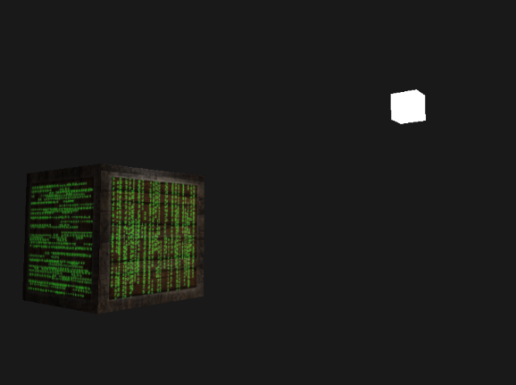

# Emission map

* emission값을 저장한 텍스처
* emission값은 오브젝트가 광원을 자체적으로 가지고 있다면 그 빛을 방출하는 컬러
  * 빛의 상황과 관계없이 빛날 수 있음
* ex) 로봇의 눈이 빛남
* `Fullbright map`,`Glow Map`라고도 함

# Shader Codes

## Object Vertex Shader

```cpp
#version 330 core
layout (location = 0) in vec3 aPos;
layout (location = 1) in vec3 aNormal;
layout (location = 2) in vec2 aTexCoords;

out vec3 FragPos;               // object 월드 좌표
out vec3 Normal;                // 노멀 벡터
out vec2 TexCoords;             // 텍스처 좌표

uniform mat4 model;
uniform mat4 view;
uniform mat4 projection;

void main() {
    FragPos = vec3(model * vec4(aPos, 1.0));
    Normal = mat3(transpose(inverse(model))) * aNormal;  
    TexCoords = aTexCoords;
    
    gl_Position = projection * view * vec4(FragPos, 1.0);
}
```

## Object Fragment Shader

```cpp
#version 330 core
out vec4 FragColor;

struct Material {
    sampler2D diffuse;
    sampler2D specular;    
    sampler2D emission;
    float shininess;
}; 

struct Light {
    vec3 position;

    vec3 ambient;
    vec3 diffuse;
    vec3 specular;
};

in vec3 FragPos;  
in vec3 Normal;  
in vec2 TexCoords;
  
uniform vec3 viewPos;
uniform Material material;
uniform Light light;

void main() {
    // ambient
    vec3 ambient = light.ambient * texture(material.diffuse, TexCoords).rgb;
  	
    // diffuse 
    vec3 norm = normalize(Normal);
    vec3 lightDir = normalize(light.position - FragPos);
    float diff = max(dot(norm, lightDir), 0.0);
    vec3 diffuse = light.diffuse * diff * texture(material.diffuse, TexCoords).rgb;  
    
    // specular
    vec3 viewDir = normalize(viewPos - FragPos);
    vec3 reflectDir = reflect(-lightDir, norm);  
    float spec = pow(max(dot(viewDir, reflectDir), 0.0), material.shininess);
    vec3 specular = light.specular * spec * texture(material.specular, TexCoords).rgb;  
    
    // emission
    vec3 emission = texture(material.emission, TexCoords).rgb;
        
    vec3 result = ambient + diffuse + specular + emission;
    FragColor = vec4(result, 1.0);
} 
```

# Source Codes

```cpp
#include <glad/glad.h>
#include <GLFW/glfw3.h>
#include <stb_image.h>

#include <glm/glm.hpp>
#include <glm/gtc/matrix_transform.hpp>
#include <glm/gtc/type_ptr.hpp>

#include <learnopengl/filesystem.h>
#include <learnopengl/shader_m.h>
#include <learnopengl/camera.h>

#include <iostream>

void framebuffer_size_callback(GLFWwindow* window, int width, int height);
void mouse_callback(GLFWwindow* window, double xpos, double ypos);
void scroll_callback(GLFWwindow* window, double xoffset, double yoffset);
void processInput(GLFWwindow *window);
unsigned int loadTexture(const char *path);

// settings
const unsigned int SCR_WIDTH = 800;
const unsigned int SCR_HEIGHT = 600;

// camera
Camera camera(glm::vec3(0.0f, 0.0f, 7.0f));
float lastX = SCR_WIDTH / 2.0f;
float lastY = SCR_HEIGHT / 2.0f;
bool firstMouse = true;

// timing
float deltaTime = 0.0f;
float lastFrame = 0.0f;

// lighting
glm::vec3 lightPos(1.2f, 1.0f, 2.0f);

int main() {
    // glfw: initialize and configure
    // ------------------------------
    glfwInit();
    glfwWindowHint(GLFW_CONTEXT_VERSION_MAJOR, 3);
    glfwWindowHint(GLFW_CONTEXT_VERSION_MINOR, 3);
    glfwWindowHint(GLFW_OPENGL_PROFILE, GLFW_OPENGL_CORE_PROFILE);

#ifdef __APPLE__
    glfwWindowHint(GLFW_OPENGL_FORWARD_COMPAT, GL_TRUE); // uncomment this statement to fix compilation on OS X
#endif

    // glfw window creation
    // --------------------
    GLFWwindow* window = glfwCreateWindow(SCR_WIDTH, SCR_HEIGHT, "LearnOpenGL", NULL, NULL);
    if (window == NULL) {
        std::cout << "Failed to create GLFW window" << std::endl;
        glfwTerminate();
        return -1;
    }
    glfwMakeContextCurrent(window);
    glfwSetFramebufferSizeCallback(window, framebuffer_size_callback);
    glfwSetCursorPosCallback(window, mouse_callback);
    glfwSetScrollCallback(window, scroll_callback);

    // tell GLFW to capture our mouse
    glfwSetInputMode(window, GLFW_CURSOR, GLFW_CURSOR_DISABLED);

    // glad: load all OpenGL function pointers
    // ---------------------------------------
    if (!gladLoadGLLoader((GLADloadproc)glfwGetProcAddress)) {
        std::cout << "Failed to initialize GLAD" << std::endl;
        return -1;
    }

    // configure global opengl state
    // -----------------------------
    glEnable(GL_DEPTH_TEST);

    // build and compile our shader zprogram
    // ------------------------------------
    Shader lightingShader("4.3.lighting_maps.vs", "4.3.lighting_maps.fs");
    Shader lampShader("4.3.lamp.vs", "4.3.lamp.fs");

    // set up vertex data (and buffer(s)) and configure vertex attributes
    // ------------------------------------------------------------------
    float vertices[] = {
        // positions          // normals           // texture coords
        -0.5f, -0.5f, -0.5f,  0.0f,  0.0f, -1.0f,  0.0f,  0.0f,
         0.5f, -0.5f, -0.5f,  0.0f,  0.0f, -1.0f,  1.0f,  0.0f,
         0.5f,  0.5f, -0.5f,  0.0f,  0.0f, -1.0f,  1.0f,  1.0f,
         0.5f,  0.5f, -0.5f,  0.0f,  0.0f, -1.0f,  1.0f,  1.0f,
        -0.5f,  0.5f, -0.5f,  0.0f,  0.0f, -1.0f,  0.0f,  1.0f,
        -0.5f, -0.5f, -0.5f,  0.0f,  0.0f, -1.0f,  0.0f,  0.0f,

        -0.5f, -0.5f,  0.5f,  0.0f,  0.0f,  1.0f,  0.0f,  0.0f,
         0.5f, -0.5f,  0.5f,  0.0f,  0.0f,  1.0f,  1.0f,  0.0f,
         0.5f,  0.5f,  0.5f,  0.0f,  0.0f,  1.0f,  1.0f,  1.0f,
         0.5f,  0.5f,  0.5f,  0.0f,  0.0f,  1.0f,  1.0f,  1.0f,
        -0.5f,  0.5f,  0.5f,  0.0f,  0.0f,  1.0f,  0.0f,  1.0f,
        -0.5f, -0.5f,  0.5f,  0.0f,  0.0f,  1.0f,  0.0f,  0.0f,

        -0.5f,  0.5f,  0.5f, -1.0f,  0.0f,  0.0f,  1.0f,  0.0f,
        -0.5f,  0.5f, -0.5f, -1.0f,  0.0f,  0.0f,  1.0f,  1.0f,
        -0.5f, -0.5f, -0.5f, -1.0f,  0.0f,  0.0f,  0.0f,  1.0f,
        -0.5f, -0.5f, -0.5f, -1.0f,  0.0f,  0.0f,  0.0f,  1.0f,
        -0.5f, -0.5f,  0.5f, -1.0f,  0.0f,  0.0f,  0.0f,  0.0f,
        -0.5f,  0.5f,  0.5f, -1.0f,  0.0f,  0.0f,  1.0f,  0.0f,

         0.5f,  0.5f,  0.5f,  1.0f,  0.0f,  0.0f,  1.0f,  0.0f,
         0.5f,  0.5f, -0.5f,  1.0f,  0.0f,  0.0f,  1.0f,  1.0f,
         0.5f, -0.5f, -0.5f,  1.0f,  0.0f,  0.0f,  0.0f,  1.0f,
         0.5f, -0.5f, -0.5f,  1.0f,  0.0f,  0.0f,  0.0f,  1.0f,
         0.5f, -0.5f,  0.5f,  1.0f,  0.0f,  0.0f,  0.0f,  0.0f,
         0.5f,  0.5f,  0.5f,  1.0f,  0.0f,  0.0f,  1.0f,  0.0f,

        -0.5f, -0.5f, -0.5f,  0.0f, -1.0f,  0.0f,  0.0f,  1.0f,
         0.5f, -0.5f, -0.5f,  0.0f, -1.0f,  0.0f,  1.0f,  1.0f,
         0.5f, -0.5f,  0.5f,  0.0f, -1.0f,  0.0f,  1.0f,  0.0f,
         0.5f, -0.5f,  0.5f,  0.0f, -1.0f,  0.0f,  1.0f,  0.0f,
        -0.5f, -0.5f,  0.5f,  0.0f, -1.0f,  0.0f,  0.0f,  0.0f,
        -0.5f, -0.5f, -0.5f,  0.0f, -1.0f,  0.0f,  0.0f,  1.0f,

        -0.5f,  0.5f, -0.5f,  0.0f,  1.0f,  0.0f,  0.0f,  1.0f,
         0.5f,  0.5f, -0.5f,  0.0f,  1.0f,  0.0f,  1.0f,  1.0f,
         0.5f,  0.5f,  0.5f,  0.0f,  1.0f,  0.0f,  1.0f,  0.0f,
         0.5f,  0.5f,  0.5f,  0.0f,  1.0f,  0.0f,  1.0f,  0.0f,
        -0.5f,  0.5f,  0.5f,  0.0f,  1.0f,  0.0f,  0.0f,  0.0f,
        -0.5f,  0.5f, -0.5f,  0.0f,  1.0f,  0.0f,  0.0f,  1.0f
    };
    // 오브젝트 VAO 설정
    unsigned int VBO, cubeVAO;
    glGenVertexArrays(1, &cubeVAO);
    glGenBuffers(1, &VBO);

    glBindBuffer(GL_ARRAY_BUFFER, VBO);
    glBufferData(GL_ARRAY_BUFFER, sizeof(vertices), vertices, GL_STATIC_DRAW);

    glBindVertexArray(cubeVAO);
    glVertexAttribPointer(0, 3, GL_FLOAT, GL_FALSE, 8 * sizeof(float), (void*)0);
    glEnableVertexAttribArray(0);
    glVertexAttribPointer(1, 3, GL_FLOAT, GL_FALSE, 8 * sizeof(float), (void*)(3 * sizeof(float)));
    glEnableVertexAttribArray(1);
    glVertexAttribPointer(2, 2, GL_FLOAT, GL_FALSE, 8 * sizeof(float), (void*)(6 * sizeof(float)));
    glEnableVertexAttribArray(2);

    // 광원 VAO 설정
    unsigned int lightVAO;
    glGenVertexArrays(1, &lightVAO);
    glBindVertexArray(lightVAO);

    glBindBuffer(GL_ARRAY_BUFFER, VBO);
    // note that we update the lamp's position attribute's stride to reflect the updated buffer data
    glVertexAttribPointer(0, 3, GL_FLOAT, GL_FALSE, 8 * sizeof(float), (void*)0);
    glEnableVertexAttribArray(0);

    // Diffuse Map, Specular Map, Emission Map 텍스처 로드
    // -----------------------------------------------------------------------------
    unsigned int diffuseMap  = loadTexture(FileSystem::getPath("resources/textures/container2.png").c_str());
    unsigned int specularMap = loadTexture(FileSystem::getPath("resources/textures/container2_specular.png").c_str());
    unsigned int emissionMap = loadTexture(FileSystem::getPath("resources/textures/matrix.jpg").c_str());

    // shader configuration
    // -----------------------------------------------------------------------------
    lightingShader.use();
    // Diffuse Map은 텍스처 유닛 0번 사용
    lightingShader.setInt("material.diffuse", 0);
    // Specular Map은 텍스처 유닛 1번 사용
    lightingShader.setInt("material.specular", 1);
    // Emission Map은 텍스처 유닛 2번 사용
    lightingShader.setInt("material.emission", 2);


    // render loop
    // -----------
    while (!glfwWindowShouldClose(window)) {
        // per-frame time logic
        // --------------------
        float currentFrame = glfwGetTime();
        deltaTime = currentFrame - lastFrame;
        lastFrame = currentFrame;

        // input
        // -----
        processInput(window);

        // render
        // ------
        glClearColor(0.1f, 0.1f, 0.1f, 1.0f);
        glClear(GL_COLOR_BUFFER_BIT | GL_DEPTH_BUFFER_BIT);

        lightingShader.use();
        lightingShader.setVec3("light.position", lightPos);
        lightingShader.setVec3("viewPos", camera.Position);

        // 빛 uniform 설정
        lightingShader.setVec3("light.ambient", 0.2f, 0.2f, 0.2f);
        lightingShader.setVec3("light.diffuse", 0.5f, 0.5f, 0.5f);
        lightingShader.setVec3("light.specular", 1.0f, 1.0f, 1.0f);

        // material uniform 설정
        lightingShader.setFloat("material.shininess", 64.0f);

        // view/projection 변환 행렬
        glm::mat4 projection = glm::perspective(glm::radians(camera.Zoom), (float)SCR_WIDTH / (float)SCR_HEIGHT, 0.1f, 100.0f);
        glm::mat4 view = camera.GetViewMatrix();
        lightingShader.setMat4("projection", projection);
        lightingShader.setMat4("view", view);

        // world 변환 행렬
        glm::mat4 model = glm::mat4(1.0f);
        lightingShader.setMat4("model", model);

        // diffuse map 바인딩(텍스처 유닛 0번)
        glActiveTexture(GL_TEXTURE0);
        glBindTexture(GL_TEXTURE_2D, diffuseMap);
        // specular map 바인딩(텍스처 유닛 1번)
        glActiveTexture(GL_TEXTURE1);
        glBindTexture(GL_TEXTURE_2D, specularMap);
        // emission map 바인딩(텍스처 유닛 2번)
        glActiveTexture(GL_TEXTURE2);
        glBindTexture(GL_TEXTURE_2D, emissionMap);

        // render the cube
        glBindVertexArray(cubeVAO);
        glDrawArrays(GL_TRIANGLES, 0, 36);


        // also draw the lamp object
        lampShader.use();
        lampShader.setMat4("projection", projection);
        lampShader.setMat4("view", view);
        model = glm::mat4(1.0f);
        model = glm::translate(model, lightPos);
        model = glm::scale(model, glm::vec3(0.2f)); // a smaller cube
        lampShader.setMat4("model", model);

        glBindVertexArray(lightVAO);
        glDrawArrays(GL_TRIANGLES, 0, 36);


        // glfw: swap buffers and poll IO events (keys pressed/released, mouse moved etc.)
        // -------------------------------------------------------------------------------
        glfwSwapBuffers(window);
        glfwPollEvents();
    }

    // optional: de-allocate all resources once they've outlived their purpose:
    // ------------------------------------------------------------------------
    glDeleteVertexArrays(1, &cubeVAO);
    glDeleteVertexArrays(1, &lightVAO);
    glDeleteBuffers(1, &VBO);

    // glfw: terminate, clearing all previously allocated GLFW resources.
    // ------------------------------------------------------------------
    glfwTerminate();
    return 0;
}

// process all input: query GLFW whether relevant keys are pressed/released this frame and react accordingly
// ---------------------------------------------------------------------------------------------------------
void processInput(GLFWwindow *window) {
    if (glfwGetKey(window, GLFW_KEY_ESCAPE) == GLFW_PRESS)
        glfwSetWindowShouldClose(window, true);

    if (glfwGetKey(window, GLFW_KEY_W) == GLFW_PRESS)
        camera.ProcessKeyboard(FORWARD, deltaTime);
    if (glfwGetKey(window, GLFW_KEY_S) == GLFW_PRESS)
        camera.ProcessKeyboard(BACKWARD, deltaTime);
    if (glfwGetKey(window, GLFW_KEY_A) == GLFW_PRESS)
        camera.ProcessKeyboard(LEFT, deltaTime);
    if (glfwGetKey(window, GLFW_KEY_D) == GLFW_PRESS)
        camera.ProcessKeyboard(RIGHT, deltaTime);
}

// glfw: whenever the window size changed (by OS or user resize) this callback function executes
// ---------------------------------------------------------------------------------------------
void framebuffer_size_callback(GLFWwindow* window, int width, int height) {
    // make sure the viewport matches the new window dimensions; note that width and 
    // height will be significantly larger than specified on retina displays.
    glViewport(0, 0, width, height);
}


// glfw: whenever the mouse moves, this callback is called
// -------------------------------------------------------
void mouse_callback(GLFWwindow* window, double xpos, double ypos) {
    if (firstMouse) {
        lastX = xpos;
        lastY = ypos;
        firstMouse = false;
    }

    float xoffset = xpos - lastX;
    float yoffset = lastY - ypos; // reversed since y-coordinates go from bottom to top

    lastX = xpos;
    lastY = ypos;

    camera.ProcessMouseMovement(xoffset, yoffset);
}

// glfw: whenever the mouse scroll wheel scrolls, this callback is called
// ----------------------------------------------------------------------
void scroll_callback(GLFWwindow* window, double xoffset, double yoffset) {
    camera.ProcessMouseScroll(yoffset);
}

// utility function for loading a 2D texture from file
// ---------------------------------------------------
unsigned int loadTexture(char const * path) {
    unsigned int textureID;
    glGenTextures(1, &textureID);

    int width, height, nrComponents;
    unsigned char *data = stbi_load(path, &width, &height, &nrComponents, 0);
    if (data) {
        GLenum format;
        if (nrComponents == 1)
            format = GL_RED;
        else if (nrComponents == 3)
            format = GL_RGB;
        else if (nrComponents == 4)
            format = GL_RGBA;

        glBindTexture(GL_TEXTURE_2D, textureID);
        glTexImage2D(GL_TEXTURE_2D, 0, format, width, height, 0, format, GL_UNSIGNED_BYTE, data);
        glGenerateMipmap(GL_TEXTURE_2D);

        glTexParameteri(GL_TEXTURE_2D, GL_TEXTURE_WRAP_S, GL_REPEAT);
        glTexParameteri(GL_TEXTURE_2D, GL_TEXTURE_WRAP_T, GL_REPEAT);
        glTexParameteri(GL_TEXTURE_2D, GL_TEXTURE_MIN_FILTER, GL_LINEAR_MIPMAP_LINEAR);
        glTexParameteri(GL_TEXTURE_2D, GL_TEXTURE_MAG_FILTER, GL_LINEAR);

        stbi_image_free(data);
    }
    else
    {
        std::cout << "Texture failed to load at path: " << path << std::endl;
        stbi_image_free(data);
    }

    return textureID;
}
```

# Result



# Sources

* Emission Map

