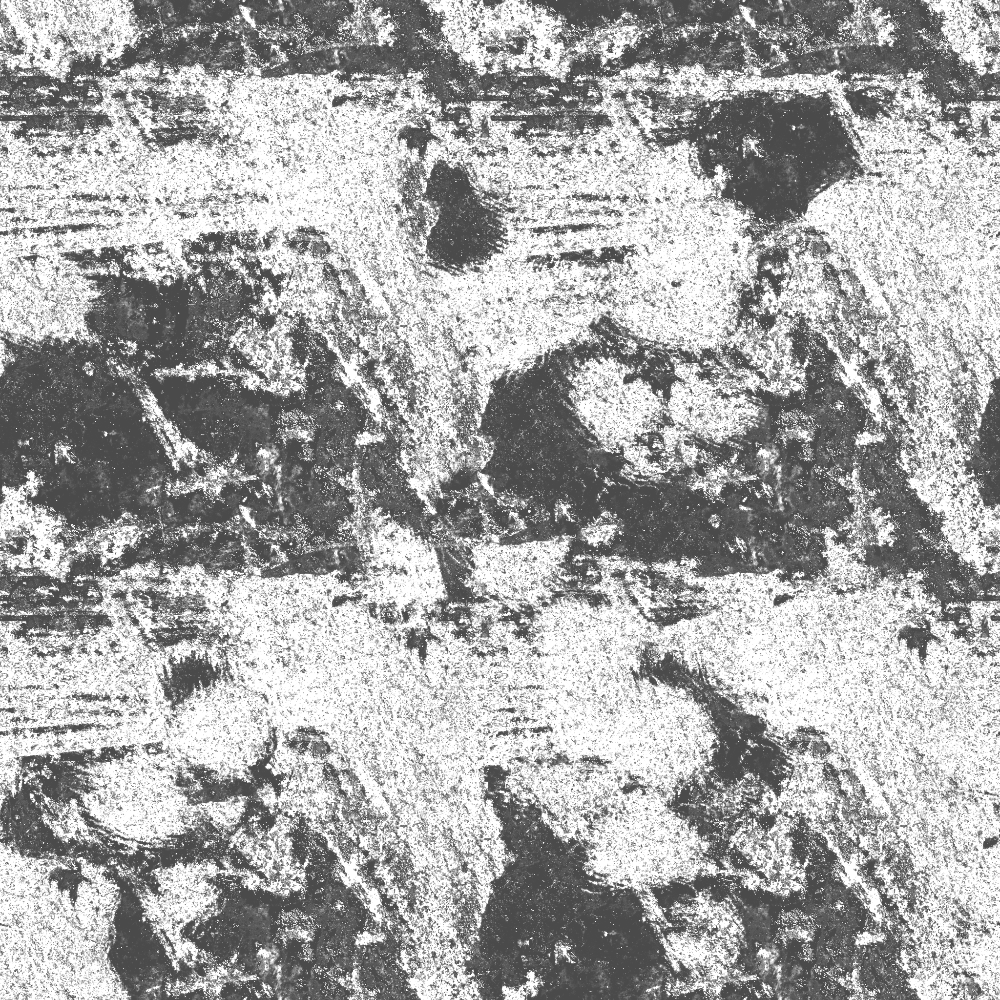

# Result


## Resource

### albedo


### ao


### metallic


### normal


### roughness



## Shader Codes

### Vertex Shader

```cpp
#version 330 core
layout (location = 0) in vec3 aPos;
layout (location = 1) in vec2 aTexCoords;
layout (location = 2) in vec3 aNormal;

out vec2 TexCoords;
out vec3 WorldPos;
out vec3 Normal;

uniform mat4 projection;
uniform mat4 view;
uniform mat4 model;

void main() {
    TexCoords = aTexCoords;
    WorldPos = vec3(model * vec4(aPos, 1.0));
    Normal = mat3(model) * aNormal;   

    gl_Position =  projection * view * vec4(WorldPos, 1.0);
}
```

### Fragment Shader

```cpp
#version 330 core
out vec4 FragColor;
in vec2 TexCoords;
in vec3 WorldPos;
in vec3 Normal;

// material parameters
uniform sampler2D albedoMap;
uniform sampler2D normalMap;
uniform sampler2D metallicMap;
uniform sampler2D roughnessMap;
uniform sampler2D aoMap;

// lights
uniform vec3 lightPositions[4];
uniform vec3 lightColors[4];

uniform vec3 camPos;

const float PI = 3.14159265359;
// TBN 좌표 기준 노멀벡터를 월드 좌표 기준으로 변환
// ----------------------------------------------------------------------------
vec3 getNormalFromMap() {
    vec3 tangentNormal = texture(normalMap, TexCoords).xyz * 2.0 - 1.0;

    vec3 Q1  = dFdx(WorldPos);
    vec3 Q2  = dFdy(WorldPos);
    vec2 st1 = dFdx(TexCoords);
    vec2 st2 = dFdy(TexCoords);

    vec3 N   = normalize(Normal);
    vec3 T  = normalize(Q1*st2.t - Q2*st1.t);
    vec3 B  = -normalize(cross(N, T));
    mat3 TBN = mat3(T, B, N);

    return normalize(TBN * tangentNormal);
}
// ----------------------------------------------------------------------------
float DistributionGGX(vec3 N, vec3 H, float roughness) {
    float a = roughness*roughness;
    float a2 = a*a;
    float NdotH = max(dot(N, H), 0.0);
    float NdotH2 = NdotH*NdotH;

    float nom   = a2;
    float denom = (NdotH2 * (a2 - 1.0) + 1.0);
    denom = PI * denom * denom;

    return nom / denom;
}
// ----------------------------------------------------------------------------
float GeometrySchlickGGX(float NdotV, float roughness) {
    float r = (roughness + 1.0);
    float k = (r*r) / 8.0;

    float nom   = NdotV;
    float denom = NdotV * (1.0 - k) + k;

    return nom / denom;
}
// ----------------------------------------------------------------------------
float GeometrySmith(vec3 N, vec3 V, vec3 L, float roughness) {
    float NdotV = max(dot(N, V), 0.0);
    float NdotL = max(dot(N, L), 0.0);
    float ggx2 = GeometrySchlickGGX(NdotV, roughness);
    float ggx1 = GeometrySchlickGGX(NdotL, roughness);

    return ggx1 * ggx2;
}
// ----------------------------------------------------------------------------
vec3 fresnelSchlick(float cosTheta, vec3 F0) {
    return F0 + (1.0 - F0) * pow(1.0 - cosTheta, 5.0);
}
// ----------------------------------------------------------------------------
void main() {		
    vec3 albedo     = pow(texture(albedoMap, TexCoords).rgb, vec3(2.2));    // 선형 공간으로 변환
    float metallic  = texture(metallicMap, TexCoords).r;
    float roughness = texture(roughnessMap, TexCoords).r;
    float ao        = texture(aoMap, TexCoords).r;

    vec3 N = getNormalFromMap();
    vec3 V = normalize(camPos - WorldPos);
  
    vec3 F0 = vec3(0.04); 
    F0 = mix(F0, albedo, metallic);

    // reflectance equation
    vec3 Lo = vec3(0.0);
    for(int i = 0; i < 4; ++i)  {
        // calculate per-light radiance
        vec3 L = normalize(lightPositions[i] - WorldPos);
        vec3 H = normalize(V + L);
        float distance = length(lightPositions[i] - WorldPos);
        float attenuation = 1.0 / (distance * distance);
        vec3 radiance = lightColors[i] * attenuation;

        // Cook-Torrance BRDF
        float NDF = DistributionGGX(N, H, roughness);   
        float G   = GeometrySmith(N, V, L, roughness);      
        vec3 F    = fresnelSchlick(max(dot(H, V), 0.0), F0);
           
        vec3 nominator    = NDF * G * F; 
        float denominator = 4 * max(dot(N, V), 0.0) * max(dot(N, L), 0.0) + 0.001; // 0.001 to prevent divide by zero.
        vec3 specular = nominator / denominator;
        
        vec3 kS = F;
        vec3 kD = vec3(1.0) - kS;
        kD *= 1.0 - metallic;	  

        // scale light by NdotL
        float NdotL = max(dot(N, L), 0.0);        

        // add to outgoing radiance Lo
        Lo += (kD * albedo / PI + specular) * radiance * NdotL;  
    }   
    
    vec3 ambient = vec3(0.03) * albedo * ao;
    
    vec3 color = ambient + Lo;

    // HDR tonemapping
    color = color / (color + vec3(1.0));
    // gamma correct
    color = pow(color, vec3(1.0/2.2)); 

    FragColor = vec4(color, 1.0);
}
```

## Source Codes

```cpp
#include <glad/glad.h>
#include <GLFW/glfw3.h>
#include <stb_image.h>

#include <glm/glm.hpp>
#include <glm/gtc/matrix_transform.hpp>
#include <glm/gtc/type_ptr.hpp>

#include <learnopengl/filesystem.h>
#include <learnopengl/shader.h>
#include <learnopengl/camera.h>
#include <learnopengl/model.h>

#include <iostream>

void framebuffer_size_callback(GLFWwindow* window, int width, int height);
void mouse_callback(GLFWwindow* window, double xpos, double ypos);
void scroll_callback(GLFWwindow* window, double xoffset, double yoffset);
void processInput(GLFWwindow *window);
unsigned int loadTexture(const char *path);
void renderSphere();

// settings
const unsigned int SCR_WIDTH = 1280;
const unsigned int SCR_HEIGHT = 720;

// camera
Camera camera(glm::vec3(0.0f, 0.0f, 3.0f));
float lastX = 800.0f / 2.0;
float lastY = 600.0 / 2.0;
bool firstMouse = true;

// timing
float deltaTime = 0.0f;
float lastFrame = 0.0f;

int main()
{
    // glfw: initialize and configure
    // ------------------------------
    glfwInit();
    glfwWindowHint(GLFW_CONTEXT_VERSION_MAJOR, 3);
    glfwWindowHint(GLFW_CONTEXT_VERSION_MINOR, 3);
    glfwWindowHint(GLFW_SAMPLES, 4);
    glfwWindowHint(GLFW_OPENGL_PROFILE, GLFW_OPENGL_CORE_PROFILE);

#ifdef __APPLE__
    glfwWindowHint(GLFW_OPENGL_FORWARD_COMPAT, GL_TRUE); // uncomment this statement to fix compilation on OS X
#endif

    // glfw window creation
    // --------------------
    GLFWwindow* window = glfwCreateWindow(SCR_WIDTH, SCR_HEIGHT, "LearnOpenGL", NULL, NULL);
    glfwMakeContextCurrent(window);
    if (window == NULL)
    {
        std::cout << "Failed to create GLFW window" << std::endl;
        glfwTerminate();
        return -1;
    }
    glfwSetFramebufferSizeCallback(window, framebuffer_size_callback);
    glfwSetCursorPosCallback(window, mouse_callback);
    glfwSetScrollCallback(window, scroll_callback);

    // tell GLFW to capture our mouse
    glfwSetInputMode(window, GLFW_CURSOR, GLFW_CURSOR_DISABLED);

    // glad: load all OpenGL function pointers
    // ---------------------------------------
    if (!gladLoadGLLoader((GLADloadproc)glfwGetProcAddress))
    {
        std::cout << "Failed to initialize GLAD" << std::endl;
        return -1;
    }

    // configure global opengl state
    // -----------------------------
    glEnable(GL_DEPTH_TEST);

    // build and compile shaders
    // -------------------------
    Shader shader("1.2.pbr.vs", "1.2.pbr.fs");

    shader.use();
    shader.setInt("albedoMap", 0);
    shader.setInt("normalMap", 1);
    shader.setInt("metallicMap", 2);
    shader.setInt("roughnessMap", 3);
    shader.setInt("aoMap", 4);

    // load PBR material textures
    // --------------------------
    unsigned int albedo    = loadTexture(FileSystem::getPath("resources/textures/pbr/rusted_iron/albedo.png").c_str());
    unsigned int normal    = loadTexture(FileSystem::getPath("resources/textures/pbr/rusted_iron/normal.png").c_str());
    unsigned int metallic  = loadTexture(FileSystem::getPath("resources/textures/pbr/rusted_iron/metallic.png").c_str());
    unsigned int roughness = loadTexture(FileSystem::getPath("resources/textures/pbr/rusted_iron/roughness.png").c_str());
    unsigned int ao        = loadTexture(FileSystem::getPath("resources/textures/pbr/rusted_iron/ao.png").c_str());

    // lights
    // ------
    glm::vec3 lightPositions[] = {
        glm::vec3(0.0f, 0.0f, 5.0f),
    };
    glm::vec3 lightColors[] = {
        glm::vec3(150.0f, 150.0f, 150.0f),
    };
    int nrRows = 7;
    int nrColumns = 7;
    float spacing = 2.5;

    // initialize static shader uniforms before rendering
    // --------------------------------------------------
    glm::mat4 projection = glm::perspective(glm::radians(camera.Zoom), (float)SCR_WIDTH / (float)SCR_HEIGHT, 0.1f, 100.0f);
    shader.use();
    shader.setMat4("projection", projection);

    // render loop
    // -----------
    while (!glfwWindowShouldClose(window))
    {
        // per-frame time logic
        // --------------------
        float currentFrame = glfwGetTime();
        deltaTime = currentFrame - lastFrame;
        lastFrame = currentFrame;

        // input
        // -----
        processInput(window);

        // render
        // ------
        glClearColor(0.1f, 0.1f, 0.1f, 1.0f);
        glClear(GL_COLOR_BUFFER_BIT | GL_DEPTH_BUFFER_BIT);

        shader.use();
        glm::mat4 view = camera.GetViewMatrix();
        shader.setMat4("view", view);
        shader.setVec3("camPos", camera.Position);

        glActiveTexture(GL_TEXTURE0);
        glBindTexture(GL_TEXTURE_2D, albedo);
        glActiveTexture(GL_TEXTURE1);
        glBindTexture(GL_TEXTURE_2D, normal);
        glActiveTexture(GL_TEXTURE2);
        glBindTexture(GL_TEXTURE_2D, metallic);
        glActiveTexture(GL_TEXTURE3);
        glBindTexture(GL_TEXTURE_2D, roughness);
        glActiveTexture(GL_TEXTURE4);
        glBindTexture(GL_TEXTURE_2D, ao);

        // render rows*column number of spheres with material properties defined by textures (they all have the same material properties)
        glm::mat4 model = glm::mat4(1.0f);
        for (int row = 0; row < nrRows; ++row)
        {
            for (int col = 0; col < nrColumns; ++col)
            {
                model = glm::mat4(1.0f);
                model = glm::translate(model, glm::vec3(
                    (float)(col - (nrColumns / 2)) * spacing,
                    (float)(row - (nrRows / 2)) * spacing,
                    0.0f
                ));
                shader.setMat4("model", model);
                renderSphere();
            }
        }

        // render light source (simply re-render sphere at light positions)
        // this looks a bit off as we use the same shader, but it'll make their positions obvious and 
        // keeps the codeprint small.
        for (unsigned int i = 0; i < sizeof(lightPositions) / sizeof(lightPositions[0]); ++i)
        {
            glm::vec3 newPos = lightPositions[i] + glm::vec3(sin(glfwGetTime() * 5.0) * 5.0, 0.0, 0.0);
            newPos = lightPositions[i];
            shader.setVec3("lightPositions[" + std::to_string(i) + "]", newPos);
            shader.setVec3("lightColors[" + std::to_string(i) + "]", lightColors[i]);

            model = glm::mat4(1.0f);
            model = glm::translate(model, newPos);
            model = glm::scale(model, glm::vec3(0.5f));
            shader.setMat4("model", model);
            renderSphere();
        }

        // glfw: swap buffers and poll IO events (keys pressed/released, mouse moved etc.)
        // -------------------------------------------------------------------------------
        glfwSwapBuffers(window);
        glfwPollEvents();
    }

    // glfw: terminate, clearing all previously allocated GLFW resources.
    // ------------------------------------------------------------------
    glfwTerminate();
    return 0;
}

// process all input: query GLFW whether relevant keys are pressed/released this frame and react accordingly
// ---------------------------------------------------------------------------------------------------------
void processInput(GLFWwindow *window)
{
    if (glfwGetKey(window, GLFW_KEY_ESCAPE) == GLFW_PRESS)
        glfwSetWindowShouldClose(window, true);

    float cameraSpeed = 2.5 * deltaTime;
    if (glfwGetKey(window, GLFW_KEY_W) == GLFW_PRESS)
        camera.ProcessKeyboard(FORWARD, deltaTime);
    if (glfwGetKey(window, GLFW_KEY_S) == GLFW_PRESS)
        camera.ProcessKeyboard(BACKWARD, deltaTime);
    if (glfwGetKey(window, GLFW_KEY_A) == GLFW_PRESS)
        camera.ProcessKeyboard(LEFT, deltaTime);
    if (glfwGetKey(window, GLFW_KEY_D) == GLFW_PRESS)
        camera.ProcessKeyboard(RIGHT, deltaTime);
}

// glfw: whenever the window size changed (by OS or user resize) this callback function executes
// ---------------------------------------------------------------------------------------------
void framebuffer_size_callback(GLFWwindow* window, int width, int height)
{
    // make sure the viewport matches the new window dimensions; note that width and 
    // height will be significantly larger than specified on retina displays.
    glViewport(0, 0, width, height);
}


// glfw: whenever the mouse moves, this callback is called
// -------------------------------------------------------
void mouse_callback(GLFWwindow* window, double xpos, double ypos)
{
    if (firstMouse)
    {
        lastX = xpos;
        lastY = ypos;
        firstMouse = false;
    }

    float xoffset = xpos - lastX;
    float yoffset = lastY - ypos; // reversed since y-coordinates go from bottom to top

    lastX = xpos;
    lastY = ypos;

    camera.ProcessMouseMovement(xoffset, yoffset);
}

// glfw: whenever the mouse scroll wheel scrolls, this callback is called
// ----------------------------------------------------------------------
void scroll_callback(GLFWwindow* window, double xoffset, double yoffset)
{
    camera.ProcessMouseScroll(yoffset);
}

// renders (and builds at first invocation) a sphere
// -------------------------------------------------
unsigned int sphereVAO = 0;
unsigned int indexCount;
void renderSphere()
{
    if (sphereVAO == 0)
    {
        glGenVertexArrays(1, &sphereVAO);

        unsigned int vbo, ebo;
        glGenBuffers(1, &vbo);
        glGenBuffers(1, &ebo);

        std::vector<glm::vec3> positions;
        std::vector<glm::vec2> uv;
        std::vector<glm::vec3> normals;
        std::vector<unsigned int> indices;

        const unsigned int X_SEGMENTS = 64;
        const unsigned int Y_SEGMENTS = 64;
        const float PI = 3.14159265359;
        for (unsigned int y = 0; y <= Y_SEGMENTS; ++y)
        {
            for (unsigned int x = 0; x <= X_SEGMENTS; ++x)
            {
                float xSegment = (float)x / (float)X_SEGMENTS;
                float ySegment = (float)y / (float)Y_SEGMENTS;
                float xPos = std::cos(xSegment * 2.0f * PI) * std::sin(ySegment * PI);
                float yPos = std::cos(ySegment * PI);
                float zPos = std::sin(xSegment * 2.0f * PI) * std::sin(ySegment * PI);

                positions.push_back(glm::vec3(xPos, yPos, zPos));
                uv.push_back(glm::vec2(xSegment, ySegment));
                normals.push_back(glm::vec3(xPos, yPos, zPos));
            }
        }

        bool oddRow = false;
        for (int y = 0; y < Y_SEGMENTS; ++y)
        {
            if (!oddRow) // even rows: y == 0, y == 2; and so on
            {
                for (int x = 0; x <= X_SEGMENTS; ++x)
                {
                    indices.push_back(y       * (X_SEGMENTS + 1) + x);
                    indices.push_back((y + 1) * (X_SEGMENTS + 1) + x);
                }
            }
            else
            {
                for (int x = X_SEGMENTS; x >= 0; --x)
                {
                    indices.push_back((y + 1) * (X_SEGMENTS + 1) + x);
                    indices.push_back(y       * (X_SEGMENTS + 1) + x);
                }
            }
            oddRow = !oddRow;
        }
        indexCount = indices.size();

        std::vector<float> data;
        for (int i = 0; i < positions.size(); ++i)
        {
            data.push_back(positions[i].x);
            data.push_back(positions[i].y);
            data.push_back(positions[i].z);
            if (uv.size() > 0)
            {
                data.push_back(uv[i].x);
                data.push_back(uv[i].y);
            }
            if (normals.size() > 0)
            {
                data.push_back(normals[i].x);
                data.push_back(normals[i].y);
                data.push_back(normals[i].z);
            }
        }
        glBindVertexArray(sphereVAO);
        glBindBuffer(GL_ARRAY_BUFFER, vbo);
        glBufferData(GL_ARRAY_BUFFER, data.size() * sizeof(float), &data[0], GL_STATIC_DRAW);
        glBindBuffer(GL_ELEMENT_ARRAY_BUFFER, ebo);
        glBufferData(GL_ELEMENT_ARRAY_BUFFER, indices.size() * sizeof(unsigned int), &indices[0], GL_STATIC_DRAW);
        float stride = (3 + 2 + 3) * sizeof(float);
        glEnableVertexAttribArray(0);
        glVertexAttribPointer(0, 3, GL_FLOAT, GL_FALSE, stride, (void*)0);
        glEnableVertexAttribArray(1);
        glVertexAttribPointer(1, 2, GL_FLOAT, GL_FALSE, stride, (void*)(3 * sizeof(float)));
        glEnableVertexAttribArray(2);
        glVertexAttribPointer(2, 3, GL_FLOAT, GL_FALSE, stride, (void*)(5 * sizeof(float)));
    }

    glBindVertexArray(sphereVAO);
    glDrawElements(GL_TRIANGLE_STRIP, indexCount, GL_UNSIGNED_INT, 0);
}

// utility function for loading a 2D texture from file
// ---------------------------------------------------
unsigned int loadTexture(char const * path)
{
    unsigned int textureID;
    glGenTextures(1, &textureID);

    int width, height, nrComponents;
    unsigned char *data = stbi_load(path, &width, &height, &nrComponents, 0);
    if (data)
    {
        GLenum format;
        if (nrComponents == 1)
            format = GL_RED;
        else if (nrComponents == 3)
            format = GL_RGB;
        else if (nrComponents == 4)
            format = GL_RGBA;

        glBindTexture(GL_TEXTURE_2D, textureID);
        glTexImage2D(GL_TEXTURE_2D, 0, format, width, height, 0, format, GL_UNSIGNED_BYTE, data);
        glGenerateMipmap(GL_TEXTURE_2D);

        glTexParameteri(GL_TEXTURE_2D, GL_TEXTURE_WRAP_S, GL_REPEAT);
        glTexParameteri(GL_TEXTURE_2D, GL_TEXTURE_WRAP_T, GL_REPEAT);
        glTexParameteri(GL_TEXTURE_2D, GL_TEXTURE_MIN_FILTER, GL_LINEAR_MIPMAP_LINEAR);
        glTexParameteri(GL_TEXTURE_2D, GL_TEXTURE_MAG_FILTER, GL_LINEAR);

        stbi_image_free(data);
    }
    else
    {
        std::cout << "Texture failed to load at path: " << path << std::endl;
        stbi_image_free(data);
    }

    return textureID;
}

```