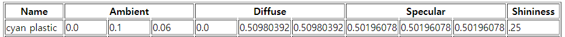
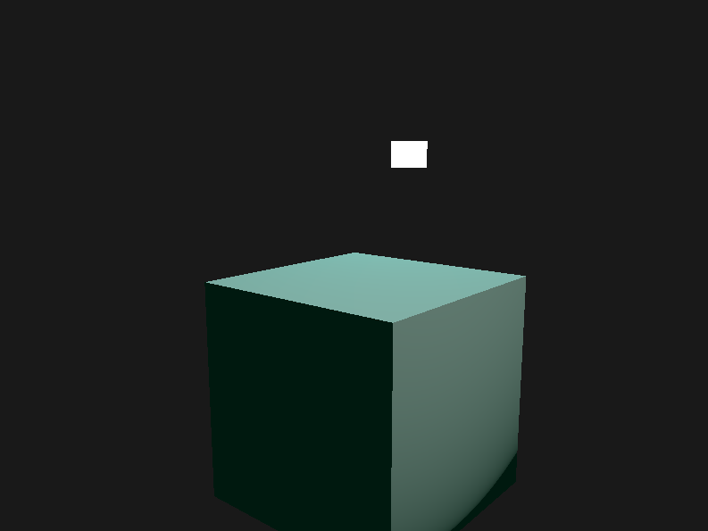

# Abstracts

* 실생활 수치에 맞춰 cyan plastic material 값을 적용해보자
  


* [meterial 수치 표](http://devernay.free.fr/cours/opengl/materials.html)

# Shader Codes

## Object Vertex Shader

```cpp
#version 330 core
layout (location = 0) in vec3 aPos;
layout (location = 1) in vec3 aNormal;

out vec3 FragPos;
out vec3 Normal;

uniform mat4 model;
uniform mat4 view;
uniform mat4 projection;

void main() {
    FragPos = vec3(model * vec4(aPos, 1.0));
    Normal = mat3(transpose(inverse(model))) * aNormal;  
    
    gl_Position = projection * view * vec4(FragPos, 1.0);
}
```

## Object Fragment Shader

```cpp
#version 330 core
out vec4 FragColor;

struct Material {
    vec3 ambient;
    vec3 diffuse;
    vec3 specular;    
    float shininess;
}; 

struct Light {
    vec3 position;

    vec3 ambient;
    vec3 diffuse;
    vec3 specular;
};

in vec3 FragPos;  
in vec3 Normal;  
  
uniform vec3 viewPos;
uniform Material material;
uniform Light light;

void main() {
    // ambient
    vec3 ambient = light.ambient * material.ambient;
  	
    // diffuse 
    vec3 norm = normalize(Normal);
    vec3 lightDir = normalize(light.position - FragPos);
    float diff = max(dot(norm, lightDir), 0.0);
    vec3 diffuse = light.diffuse * (diff * material.diffuse);
    
    // specular
    vec3 viewDir = normalize(viewPos - FragPos);
    vec3 reflectDir = reflect(-lightDir, norm);  
    float spec = pow(max(dot(viewDir, reflectDir), 0.0), material.shininess);
    vec3 specular = light.specular * (spec * material.specular);  
        
    vec3 result = ambient + diffuse + specular;
    FragColor = vec4(result, 1.0);
} 
```

# Source Codes

```cpp
#include <glad/glad.h>
#include <GLFW/glfw3.h>

#include <glm/glm.hpp>
#include <glm/gtc/matrix_transform.hpp>
#include <glm/gtc/type_ptr.hpp>

#include <learnopengl/filesystem.h>
#include <learnopengl/shader_m.h>
#include <learnopengl/camera.h>

#include <iostream>

void framebuffer_size_callback(GLFWwindow* window, int width, int height);
void mouse_callback(GLFWwindow* window, double xpos, double ypos);
void scroll_callback(GLFWwindow* window, double xoffset, double yoffset);
void processInput(GLFWwindow *window);

// settings
const unsigned int SCR_WIDTH = 800;
const unsigned int SCR_HEIGHT = 600;

// camera
Camera camera(glm::vec3(0.0f, 0.0f, 3.0f));
float lastX = SCR_WIDTH / 2.0f;
float lastY = SCR_HEIGHT / 2.0f;
bool firstMouse = true;

// timing
float deltaTime = 0.0f;
float lastFrame = 0.0f;

// lighting
glm::vec3 lightPos(1.2f, 1.0f, 2.0f);

int main()
{
    // glfw: initialize and configure
    // ------------------------------
    glfwInit();
    glfwWindowHint(GLFW_CONTEXT_VERSION_MAJOR, 3);
    glfwWindowHint(GLFW_CONTEXT_VERSION_MINOR, 3);
    glfwWindowHint(GLFW_OPENGL_PROFILE, GLFW_OPENGL_CORE_PROFILE);

#ifdef __APPLE__
    glfwWindowHint(GLFW_OPENGL_FORWARD_COMPAT, GL_TRUE); // uncomment this statement to fix compilation on OS X
#endif

    // glfw window creation
    // --------------------
    GLFWwindow* window = glfwCreateWindow(SCR_WIDTH, SCR_HEIGHT, "LearnOpenGL", NULL, NULL);
    if (window == NULL)
    {
        std::cout << "Failed to create GLFW window" << std::endl;
        glfwTerminate();
        return -1;
    }
    glfwMakeContextCurrent(window);
    glfwSetFramebufferSizeCallback(window, framebuffer_size_callback);
    glfwSetCursorPosCallback(window, mouse_callback);
    glfwSetScrollCallback(window, scroll_callback);

    // tell GLFW to capture our mouse
    glfwSetInputMode(window, GLFW_CURSOR, GLFW_CURSOR_DISABLED);

    // glad: load all OpenGL function pointers
    // ---------------------------------------
    if (!gladLoadGLLoader((GLADloadproc)glfwGetProcAddress))
    {
        std::cout << "Failed to initialize GLAD" << std::endl;
        return -1;
    }

    // configure global opengl state
    // -----------------------------
    glEnable(GL_DEPTH_TEST);

    // build and compile our shader zprogram
    // ------------------------------------
    Shader lightingShader("3.2.materials.vs", "3.2.materials.fs");
    Shader lampShader("3.2.lamp.vs", "3.2.lamp.fs");

    // set up vertex data (and buffer(s)) and configure vertex attributes
    // ------------------------------------------------------------------
    float vertices[] = {
        -0.5f, -0.5f, -0.5f,  0.0f,  0.0f, -1.0f,
         0.5f, -0.5f, -0.5f,  0.0f,  0.0f, -1.0f,
         0.5f,  0.5f, -0.5f,  0.0f,  0.0f, -1.0f,
         0.5f,  0.5f, -0.5f,  0.0f,  0.0f, -1.0f,
        -0.5f,  0.5f, -0.5f,  0.0f,  0.0f, -1.0f,
        -0.5f, -0.5f, -0.5f,  0.0f,  0.0f, -1.0f,

        -0.5f, -0.5f,  0.5f,  0.0f,  0.0f,  1.0f,
         0.5f, -0.5f,  0.5f,  0.0f,  0.0f,  1.0f,
         0.5f,  0.5f,  0.5f,  0.0f,  0.0f,  1.0f,
         0.5f,  0.5f,  0.5f,  0.0f,  0.0f,  1.0f,
        -0.5f,  0.5f,  0.5f,  0.0f,  0.0f,  1.0f,
        -0.5f, -0.5f,  0.5f,  0.0f,  0.0f,  1.0f,

        -0.5f,  0.5f,  0.5f, -1.0f,  0.0f,  0.0f,
        -0.5f,  0.5f, -0.5f, -1.0f,  0.0f,  0.0f,
        -0.5f, -0.5f, -0.5f, -1.0f,  0.0f,  0.0f,
        -0.5f, -0.5f, -0.5f, -1.0f,  0.0f,  0.0f,
        -0.5f, -0.5f,  0.5f, -1.0f,  0.0f,  0.0f,
        -0.5f,  0.5f,  0.5f, -1.0f,  0.0f,  0.0f,

         0.5f,  0.5f,  0.5f,  1.0f,  0.0f,  0.0f,
         0.5f,  0.5f, -0.5f,  1.0f,  0.0f,  0.0f,
         0.5f, -0.5f, -0.5f,  1.0f,  0.0f,  0.0f,
         0.5f, -0.5f, -0.5f,  1.0f,  0.0f,  0.0f,
         0.5f, -0.5f,  0.5f,  1.0f,  0.0f,  0.0f,
         0.5f,  0.5f,  0.5f,  1.0f,  0.0f,  0.0f,

        -0.5f, -0.5f, -0.5f,  0.0f, -1.0f,  0.0f,
         0.5f, -0.5f, -0.5f,  0.0f, -1.0f,  0.0f,
         0.5f, -0.5f,  0.5f,  0.0f, -1.0f,  0.0f,
         0.5f, -0.5f,  0.5f,  0.0f, -1.0f,  0.0f,
        -0.5f, -0.5f,  0.5f,  0.0f, -1.0f,  0.0f,
        -0.5f, -0.5f, -0.5f,  0.0f, -1.0f,  0.0f,

        -0.5f,  0.5f, -0.5f,  0.0f,  1.0f,  0.0f,
         0.5f,  0.5f, -0.5f,  0.0f,  1.0f,  0.0f,
         0.5f,  0.5f,  0.5f,  0.0f,  1.0f,  0.0f,
         0.5f,  0.5f,  0.5f,  0.0f,  1.0f,  0.0f,
        -0.5f,  0.5f,  0.5f,  0.0f,  1.0f,  0.0f,
        -0.5f,  0.5f, -0.5f,  0.0f,  1.0f,  0.0f
    };
    // first, configure the cube's VAO (and VBO)
    unsigned int VBO, cubeVAO;
    glGenVertexArrays(1, &cubeVAO);
    glGenBuffers(1, &VBO);

    glBindBuffer(GL_ARRAY_BUFFER, VBO);
    glBufferData(GL_ARRAY_BUFFER, sizeof(vertices), vertices, GL_STATIC_DRAW);

    glBindVertexArray(cubeVAO);

    // position attribute
    glVertexAttribPointer(0, 3, GL_FLOAT, GL_FALSE, 6 * sizeof(float), (void*)0);
    glEnableVertexAttribArray(0);
    // normal attribute
    glVertexAttribPointer(1, 3, GL_FLOAT, GL_FALSE, 6 * sizeof(float), (void*)(3 * sizeof(float)));
    glEnableVertexAttribArray(1);


    // second, configure the light's VAO (VBO stays the same; the vertices are the same for the light object which is also a 3D cube)
    unsigned int lightVAO;
    glGenVertexArrays(1, &lightVAO);
    glBindVertexArray(lightVAO);

    glBindBuffer(GL_ARRAY_BUFFER, VBO);
    // note that we update the lamp's position attribute's stride to reflect the updated buffer data
    glVertexAttribPointer(0, 3, GL_FLOAT, GL_FALSE, 6 * sizeof(float), (void*)0);
    glEnableVertexAttribArray(0);


    // render loop
    // -----------
    while (!glfwWindowShouldClose(window)) {
        // per-frame time logic
        // --------------------
        float currentFrame = glfwGetTime();
        deltaTime = currentFrame - lastFrame;
        lastFrame = currentFrame;

        // input
        // -----
        processInput(window);

        // render
        // ------
        glClearColor(0.1f, 0.1f, 0.1f, 1.0f);
        glClear(GL_COLOR_BUFFER_BIT | GL_DEPTH_BUFFER_BIT);

        // be sure to activate shader when setting uniforms/drawing objects
        lightingShader.use();
        lightingShader.setVec3("light.position", lightPos);
        lightingShader.setVec3("viewPos", camera.Position);

        // 광원 uniform 값 설정
        // 모든 빛의 세기는 1.0
        // --------------------------------------------------------------------
        lightingShader.setVec3("light.ambient", 1.0f, 1.0f, 1.0f); 
        lightingShader.setVec3("light.diffuse", 1.0f, 1.0f, 1.0f);
        lightingShader.setVec3("light.specular", 1.0f, 1.0f, 1.0f);

        // 머테리얼 uniform 값 설정 (cyan plastic)
        // --------------------------------------------------------------------
        lightingShader.setVec3("material.ambient", 0.0f, 0.1f, 0.06f);
        lightingShader.setVec3("material.diffuse", 0.0f, 0.50980392f, 0.50980392f);
        lightingShader.setVec3("material.specular", 0.50196078f, 0.50196078f, 0.50196078f);
        lightingShader.setFloat("material.shininess", 0.25f);

        // view/projection transformations
        glm::mat4 projection = glm::perspective(glm::radians(camera.Zoom), (float)SCR_WIDTH / (float)SCR_HEIGHT, 0.1f, 100.0f);
        glm::mat4 view = camera.GetViewMatrix();
        lightingShader.setMat4("projection", projection);
        lightingShader.setMat4("view", view);

        // world transformation
        glm::mat4 model = glm::mat4(1.0f);
        lightingShader.setMat4("model", model);

        // render the cube
        glBindVertexArray(cubeVAO);
        glDrawArrays(GL_TRIANGLES, 0, 36);


        // also draw the lamp object
        lampShader.use();
        lampShader.setMat4("projection", projection);
        lampShader.setMat4("view", view);
        model = glm::mat4(1.0f);
        model = glm::translate(model, lightPos);
        model = glm::scale(model, glm::vec3(0.2f)); // a smaller cube
        lampShader.setMat4("model", model);

        glBindVertexArray(lightVAO);
        glDrawArrays(GL_TRIANGLES, 0, 36);

        glfwSwapBuffers(window);
        glfwPollEvents();
    }

    glDeleteVertexArrays(1, &cubeVAO);
    glDeleteVertexArrays(1, &lightVAO);
    glDeleteBuffers(1, &VBO);

    glfwTerminate();
    return 0;
}

void processInput(GLFWwindow *window) {
    if (glfwGetKey(window, GLFW_KEY_ESCAPE) == GLFW_PRESS)
        glfwSetWindowShouldClose(window, true);

    if (glfwGetKey(window, GLFW_KEY_W) == GLFW_PRESS)
        camera.ProcessKeyboard(FORWARD, deltaTime);
    if (glfwGetKey(window, GLFW_KEY_S) == GLFW_PRESS)
        camera.ProcessKeyboard(BACKWARD, deltaTime);
    if (glfwGetKey(window, GLFW_KEY_A) == GLFW_PRESS)
        camera.ProcessKeyboard(LEFT, deltaTime);
    if (glfwGetKey(window, GLFW_KEY_D) == GLFW_PRESS)
        camera.ProcessKeyboard(RIGHT, deltaTime);
}

void framebuffer_size_callback(GLFWwindow* window, int width, int height) {
    glViewport(0, 0, width, height);
}

void mouse_callback(GLFWwindow* window, double xpos, double ypos) {
    if (firstMouse) {
        lastX = xpos;
        lastY = ypos;
        firstMouse = false;
    }

    float xoffset = xpos - lastX;
    float yoffset = lastY - ypos; // reversed since y-coordinates go from bottom to top

    lastX = xpos;
    lastY = ypos;

    camera.ProcessMouseMovement(xoffset, yoffset);
}

void scroll_callback(GLFWwindow* window, double xoffset, double yoffset) {
    camera.ProcessMouseScroll(yoffset);
}

```

# Result

