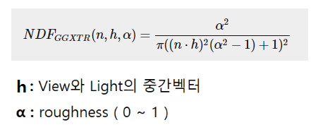
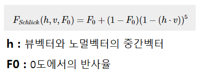
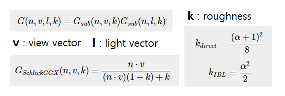
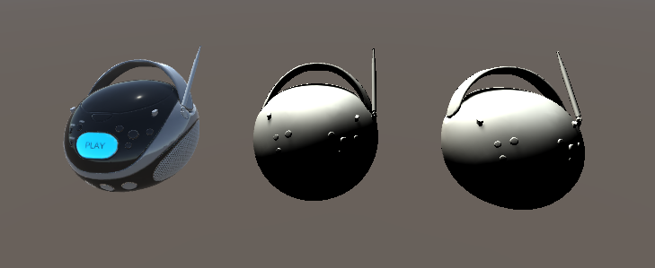

# DFG 관련 수식

## Cook-Torrance BRDF


## NDF 수식



```cpp
float DistributionGGX(vec3 N, vec3 H, float a) {
    float a2     = a*a;
    float NdotH  = max(dot(N, H), 0.0);
    float NdotH2 = NdotH*NdotH;
	
    float nom    = a2;
    float denom  = (NdotH2 * (a2 - 1.0) + 1.0);
    denom        = PI * denom * denom;
	
    return nom / denom;
}
```

## Fresnel 수식

* Schlick approximation 사용



```cpp
vec3 fresnelSchlick(float cosTheta, vec3 F0) {
    return F0 + (1.0 - F0) * pow(1.0 - cosTheta, 5.0);
}
```

## Geometry Function 수식

* Schlick-GGX 사용



```cpp
float GeometrySchlickGGX(float NdotV, float k) {
    float nom   = NdotV;
    float denom = NdotV * (1.0 - k) + k;
	
    return nom / denom;
}
  
float GeometrySmith(vec3 N, vec3 V, vec3 L, float k) {
    float NdotV = max(dot(N, V), 0.0);
    float NdotL = max(dot(N, L), 0.0);
    float ggx1 = GeometrySchlickGGX(NdotV, k);
    float ggx2 = GeometrySchlickGGX(NdotL, k);
	
    return ggx1 * ggx2;
}
```

# Unity PBR Shader

```cpp
Shader "Physically-Based-Lighting" {
	Properties{
	_Color("Main Color", Color) = (1,1,1,1)
	_SpecularColor("Specular Color", Color) = (1,1,1,1)
	_SpecularPower("Specular Power", Range(0,1)) = 1
	_SpecularRange("Specular Gloss",  Range(1,40)) = 0
	_Glossiness("Smoothness",Range(0,1)) = 1
	_Metallic("Metallicness",Range(0,1)) = 0
	_UnityLightingContribution("Unity Reflection Contribution", Range(0,1)) = 1
	}

	SubShader{
	Tags {
			"RenderType" = "Opaque"  "Queue" = "Geometry"
		}
	Pass {
		Name "FORWARD"
		Tags {
			"LightMode" = "ForwardBase"
		}
		CGPROGRAM
		#pragma vertex vert
		#pragma fragment frag
		#define UNITY_PASS_FORWARDBASE
		#include "UnityCG.cginc"
		#include "AutoLight.cginc"
		#include "Lighting.cginc"
		#pragma multi_compile_fwdbase_fullshadows
		#pragma target 3.0

		float4 _Color;
		float4 _SpecularColor;
		float _SpecularPower;
		float _SpecularRange;
		float _Glossiness;
		float _Metallic;
		float _NormalDistModel;
		float _GeoShadowModel;
		float _FresnelModel;
		float _UnityLightingContribution;

		struct VertexInput {
			float4 vertex : POSITION;       //local vertex position
			float3 normal : NORMAL;         //normal direction
			float4 tangent : TANGENT;       //tangent direction    
			float2 texcoord0 : TEXCOORD0;   //uv coordinates
			float2 texcoord1 : TEXCOORD1;   //lightmap uv coordinates
		};

		struct VertexOutput {
			float4 pos : SV_POSITION;              //screen clip space position and depth
			float2 uv0 : TEXCOORD0;                //uv coordinates
			float2 uv1 : TEXCOORD1;                //lightmap uv coordinates

		//below we create our own variables with the texcoord semantic. 
			float3 normalDir : TEXCOORD3;          //normal direction   
			float3 posWorld : TEXCOORD4;           //normal direction   
			float3 tangentDir : TEXCOORD5;
			float3 bitangentDir : TEXCOORD6;
			LIGHTING_COORDS(7,8)                   //this initializes the unity lighting and shadow
			UNITY_FOG_COORDS(9)                    //this initializes the unity fog
		};

		VertexOutput vert(VertexInput v) {
			VertexOutput o = (VertexOutput)0;
			o.uv0 = v.texcoord0;
			o.uv1 = v.texcoord1;
			o.normalDir = UnityObjectToWorldNormal(v.normal);
			o.tangentDir = normalize(mul(unity_ObjectToWorld, float4(v.tangent.xyz, 0.0)).xyz);
			o.bitangentDir = normalize(cross(o.normalDir, o.tangentDir) * v.tangent.w);
			o.pos = UnityObjectToClipPos(v.vertex);
			o.posWorld = mul(unity_ObjectToWorld, v.vertex);
			UNITY_TRANSFER_FOG(o,o.pos);
			TRANSFER_VERTEX_TO_FRAGMENT(o)
			return o;
		}

		UnityGI GetUnityGI(float3 lightColor, float3 lightDirection, float3 normalDirection,float3 viewDirection, float3 viewReflectDirection, float attenuation, float roughness, float3 worldPos) {
			//Unity light Setup ::
			UnityLight light;
			light.color = lightColor;
			light.dir = lightDirection;
			light.ndotl = max(0.0h,dot(normalDirection, lightDirection));
			UnityGIInput d;
			d.light = light;
			d.worldPos = worldPos;
			d.worldViewDir = viewDirection;
			d.atten = attenuation;
			d.ambient = 0.0h;
			d.boxMax[0] = unity_SpecCube0_BoxMax;
			d.boxMin[0] = unity_SpecCube0_BoxMin;
			d.probePosition[0] = unity_SpecCube0_ProbePosition;
			d.probeHDR[0] = unity_SpecCube0_HDR;
			d.boxMax[1] = unity_SpecCube1_BoxMax;
			d.boxMin[1] = unity_SpecCube1_BoxMin;
			d.probePosition[1] = unity_SpecCube1_ProbePosition;
			d.probeHDR[1] = unity_SpecCube1_HDR;
			Unity_GlossyEnvironmentData ugls_en_data;
			ugls_en_data.roughness = roughness;
			ugls_en_data.reflUVW = viewReflectDirection;
			UnityGI gi = UnityGlobalIllumination(d, 1.0h, normalDirection, ugls_en_data);
			return gi;
		}


		//---------------------------
		//helper functions
		float MixFunction(float i, float j, float x) {
			return  j * x + i * (1.0 - x);
		}
		float2 MixFunction(float2 i, float2 j, float x) {
			return  j * x + i * (1.0h - x);
		}
		float3 MixFunction(float3 i, float3 j, float x) {
			return  j * x + i * (1.0h - x);
		}
		float MixFunction(float4 i, float4 j, float x) {
			return  j * x + i * (1.0h - x);
		}
		float sqr(float x) {
			return x * x;
		}
		//------------------------------


		//------------------------------------------------
		//schlick functions
		float SchlickFresnel(float i) {
			float x = clamp(1.0 - i, 0.0, 1.0);
			float x2 = x * x;
			return x2 * x2*x;
		}
		float3 FresnelLerp(float3 x, float3 y, float d) {
			float t = SchlickFresnel(d);
			return lerp(x, y, t);
		}

		float3 SchlickFresnelFunction(float3 SpecularColor,float LdotH) {
			return SpecularColor + (1 - SpecularColor)* SchlickFresnel(LdotH);
		}

		//-----------------------------------------------

		//-----------------------------------------------
		//normal incidence reflection calculation
		float F0(float NdotL, float NdotV, float LdotH, float roughness) {
			// Diffuse fresnel
				float FresnelLight = SchlickFresnel(NdotL);
				float FresnelView = SchlickFresnel(NdotV);
				float FresnelDiffuse90 = 0.5 + 2.0 * LdotH*LdotH * roughness;
			return  MixFunction(1, FresnelDiffuse90, FresnelLight) * MixFunction(1, FresnelDiffuse90, FresnelView);
			}

		//-----------------------------------------------

		//-----------------------------------------------
		//Normal Distribution Functions
		float TrowbridgeReitzNormalDistribution(float NdotH, float roughness) {
			float roughnessSqr = roughness * roughness;
			float Distribution = NdotH * NdotH * (roughnessSqr - 1.0) + 1.0;
			return roughnessSqr / (3.1415926535 * Distribution*Distribution);
		}
		//--------------------------

		//-----------------------------------------------
		//Geometric Shadowing Functions
		float SchlickGGXGeometricShadowingFunction(float NdotL, float NdotV, float roughness) {
			float k = roughness / 2;
			float SmithL = (NdotL) / (NdotL * (1 - k) + k);
			float SmithV = (NdotV) / (NdotV * (1 - k) + k);
			float Gs = (SmithL * SmithV);
			return Gs;
		}

		//--------------------------


		float4 frag(VertexOutput i) : COLOR {

			//normal direction calculations
			float3 normalDirection = normalize(i.normalDir);
			float3 viewDirection = normalize(_WorldSpaceCameraPos.xyz - i.posWorld.xyz);
			float shiftAmount = dot(i.normalDir, viewDirection);
			normalDirection = shiftAmount < 0.0f ? normalDirection + viewDirection * (-shiftAmount + 1e-5f) : normalDirection;

			//light calculations
			float3 lightDirection = normalize(lerp(_WorldSpaceLightPos0.xyz, _WorldSpaceLightPos0.xyz - i.posWorld.xyz,_WorldSpaceLightPos0.w));
			float3 lightReflectDirection = reflect(-lightDirection, normalDirection);
			float3 viewReflectDirection = normalize(reflect(-viewDirection, normalDirection));
			float NdotL = max(0.0, dot(normalDirection, lightDirection));
			float3 halfDirection = normalize(viewDirection + lightDirection);
			float NdotH = max(0.0,dot(normalDirection, halfDirection));
			float NdotV = max(0.0,dot(normalDirection, viewDirection));
			float VdotH = max(0.0,dot(viewDirection, halfDirection));
			float LdotH = max(0.0,dot(lightDirection, halfDirection));
			float LdotV = max(0.0,dot(lightDirection, viewDirection));
			float RdotV = max(0.0, dot(lightReflectDirection, viewDirection));
			float attenuation = LIGHT_ATTENUATION(i);
			float3 attenColor = attenuation * _LightColor0.rgb;

			//get Unity Scene lighting data
			UnityGI gi = GetUnityGI(_LightColor0.rgb, lightDirection, normalDirection, viewDirection, viewReflectDirection, attenuation, 1 - _Glossiness, i.posWorld.xyz);
			float3 indirectDiffuse = gi.indirect.diffuse.rgb;
			float3 indirectSpecular = gi.indirect.specular.rgb;

			//diffuse color calculations
			float roughness = 1 - (_Glossiness * _Glossiness);
			roughness = roughness * roughness;
			float3 diffuseColor = _Color.rgb * (1.0 - _Metallic);
			float f0 = F0(NdotL, NdotV, LdotH, roughness);
			diffuseColor *= f0;
			diffuseColor += indirectDiffuse;

			//Specular calculations
			float3 specColor = lerp(_SpecularColor.rgb, _Color.rgb, _Metallic * 0.5);

			float3 SpecularDistribution = specColor;
			float GeometricShadow = 1;
			float3 FresnelFunction = specColor;

			//Normal Distribution Function/Specular Distribution-----------------------------------------------------
			// TrowbridgeReitz 적용	      
			SpecularDistribution *= TrowbridgeReitzNormalDistribution(NdotH, roughness);

			//Geometric Shadowing term----------------------------------------------------------------------------------
			// Schlick-GGX 적용
			GeometricShadow *= SchlickGGXGeometricShadowingFunction(NdotL, NdotV, roughness);

			//Fresnel Function-------------------------------------------------------------------------------------------------
			//Schlick approximation 사용
			FresnelFunction *= SchlickFresnelFunction(specColor, LdotH);

			//PBR
			float3 specularity = (SpecularDistribution * FresnelFunction * GeometricShadow) / (4 * (NdotL * NdotV));
			float grazingTerm = saturate(roughness + _Metallic);
			float3 unityIndirectSpecularity = indirectSpecular * FresnelLerp(specColor,grazingTerm,NdotV) * max(0.15,_Metallic) * (1 - roughness * roughness* roughness);

			float3 lightingModel = ((diffuseColor)+specularity + (unityIndirectSpecularity *_UnityLightingContribution));
			lightingModel *= NdotL;
			float4 finalDiffuse = float4(lightingModel * attenColor,1);
			UNITY_APPLY_FOG(i.fogCoord, finalDiffuse);
			return finalDiffuse;
		}
			ENDCG
		}
	}
		FallBack "Legacy Shaders/Diffuse"
}
```

