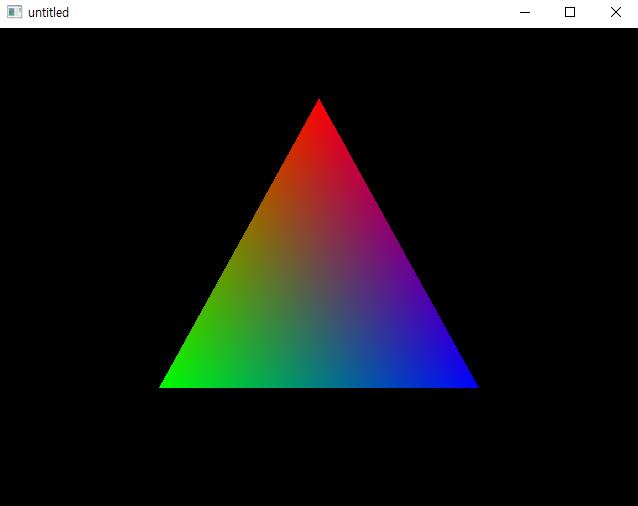

# Qt

* 컴퓨터 프로그래밍에서 GUI 프로그램 개발에 사용하는 크로스 플랫폼 프레임워크
* C++ 기반
* [opengl 관련 qt 샘플 코드](https://doc.qt.io/qt-5/qtgui-openglwindow-example.html)

# Result



# Source Codes

* [opengl shaders interpolation 코드 참고](https://gitlab.com/iamslash/train/blob/master/OpenGL/Eunji/shaders_interpolation.md)
  
## main.cpp

```cpp
#include "mainwindow.h"
#include <QApplication>
#include <mainwindow.h>

int main(int argc, char *argv[])
{
    QApplication a(argc, argv);

    MainWindow window;
    window.resize(640, 480);
    window.show();

    window.renderLater();   // RequestUpdate 호출

    return a.exec();        // main event loop start
}
```

## mainwindow.h

```cpp
#ifndef MAINWINDOW_H
#define MAINWINDOW_H

#include <qopenglfunctions.h>
#include <qwindow.h>
#include <qopenglpaintdevice.h>
#include <qopenglshaderprogram.h>

class MainWindow : public QWindow, protected QOpenGLFunctions
{
    Q_OBJECT    // 컴파일러에게 현재 클래스가 qt기반 클래스라는 것을 알려줌

public:
    explicit MainWindow(QWidget *parent = nullptr);
    ~MainWindow();

    void initialize();          // 초기화
    void renderTriangle();      // 삼각형 그리는 함수
public slots:
    void renderLater();         // request update 호출
    void renderNow();           // 렌더 함수 호출

protected:
    bool event(QEvent *event) override;     // 이벤트 처리

private:
    QOpenGLContext *m_context;
    QOpenGLPaintDevice *m_device;

    GLuint m_posAttr;
    GLuint m_colAttr;

    QOpenGLShaderProgram *m_program;
};

#endif // MAINWINDOW_H

```

## mainwindow.cpp

```cpp
#include "mainwindow.h"
#include "ui_mainwindow.h"

MainWindow::MainWindow(QWidget *parent) :
    m_context(0),
    m_device(0)
{
    setSurfaceType(QWindow::OpenGLSurface); // OpenGL 렌더링
}

MainWindow::~MainWindow()
{
}

static const char *vertexShaderSource =
    "attribute highp vec4 posAttr;\n"
    "attribute lowp vec4 colAttr;\n"
    "varying lowp vec4 col;\n"
    "void main() {\n"
        "   col = colAttr;\n"
        "   gl_Position = posAttr;\n"
        "}\n";

static const char *fragmentShaderSource =
    "varying lowp vec4 col;\n"
    "void main() {\n"
    "   gl_FragColor = col;\n"
    "}\n";

void MainWindow::initialize()
{
    // 쉐이더 관련 초기화
    m_program = new QOpenGLShaderProgram(this);
    m_program->addShaderFromSourceCode(QOpenGLShader::Vertex, vertexShaderSource);
    m_program->addShaderFromSourceCode(QOpenGLShader::Fragment, fragmentShaderSource);
    m_program->link();
    m_posAttr = m_program->attributeLocation("posAttr");
    m_colAttr = m_program->attributeLocation("colAttr");
}

void MainWindow::renderLater(){
    requestUpdate();
}

void MainWindow::renderTriangle(){
    if(!m_device)
        m_device = new QOpenGLPaintDevice;

    glClear(GL_COLOR_BUFFER_BIT | GL_DEPTH_BUFFER_BIT | GL_STENCIL_BUFFER_BIT);

    m_device->setSize(size() * devicePixelRatio()); // devicePixelRatio() : 창의 실제 픽셀과 장치의 픽셀 사이의 비율 반환 
    m_device->setDevicePixelRatio(devicePixelRatio());

    const qreal retinaScale = devicePixelRatio();
    glViewport(0, 0, width() * retinaScale, height() * retinaScale);

    glClear(GL_COLOR_BUFFER_BIT);

    m_program->bind();

    GLfloat vertices[] = {
        0.0f, 0.707f, 0.0f,
        -0.5f, -0.5f, 0.0f,
        0.5f, -0.5f, 0.0f
    };

    GLfloat colors[] = {
        1.0f, 0.0f, 0.0f,
        0.0f, 1.0f, 0.0f,
        0.0f, 0.0f, 1.0f
    };

    glVertexAttribPointer(m_posAttr, 3, GL_FLOAT, GL_FALSE, 0, vertices);
    glVertexAttribPointer(m_colAttr, 3, GL_FLOAT, GL_FALSE, 0, colors);

    glEnableVertexAttribArray(0);
    glEnableVertexAttribArray(1);

    glDrawArrays(GL_TRIANGLES, 0, 3);

    glDisableVertexAttribArray(1);
    glDisableVertexAttribArray(0);

    m_program->release();
}

// 이벤트 처리
bool MainWindow::event(QEvent *event) {
    switch (event->type()) {
    case QEvent::UpdateRequest:
        renderNow();
        return true;
    default:
        return QWindow::event(event);
    }
}

void MainWindow::renderNow()
{
    if (!isExposed())   // 창이 노출되어있는지 판단
        return;

    bool needsInitialize = false;

    if (!m_context) {
        m_context = new QOpenGLContext(this);
        m_context->create();

        needsInitialize = true;
    }

    m_context->makeCurrent(this);

    if (needsInitialize) {
        initializeOpenGLFunctions();
        initialize();
    }

    renderTriangle();

    m_context->swapBuffers(this);

   renderLater();
}

```

## Class

* `QApplication` : 응용프로그램 제어 및 기본 설정 관리
  * 모든 이벤트를 처리, 전달하는 메인 이벤트 루프를 포함
* `QWindow` : 시스템 창
* `QOpenGLFunctions` : OpenGL 2.0 API 클래스
* `QWidget` : 모든 인터페이스 개체의 기본 클래스
* `QOpenGLPaintDevice` : OpenGL 컨텍스트 페인팅 관련 클래스