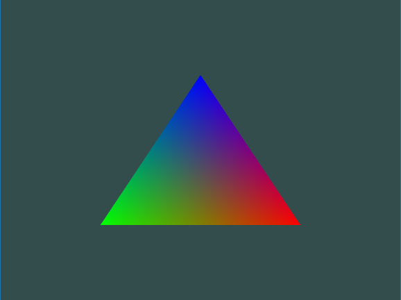

# Abstracts

* 파일로 작성된 셰이더 코드를 읽어서 셰이더 프로그램을 만드는 클래스를 작성해보자

# Source Codes

## 셰이더 프로그램 생성 클래스

1. 파일로부터 셰이더 코드를 가져옴
2. 셰이더 컴파일

```cpp
#ifndef SHADER_H
#define SHADER_H

// 필요한 모든 OpenGL의 헤더파일을 가져오기 위해 glad를 포함
#include <glad/glad.h>

#include <string>
#include <iostream>
#include <fstream>
#include <sstream>

using namespace std;

class Shader {
    public:
        unsigned int ID;

    // 생성자가 즉시 셰이더 생성
    Shader(const char* vertex_path, const char* fragment_path) {
		// 1. 파일로부터 셰이더 코드를 가져옴
        string vertex_code;
        string fragment_code;
		ifstream v_shader_file;
		ifstream f_shader_file;

		// 예외 설정
		v_shader_file.exceptions(ifstream::failbit | ifstream::badbit);
		f_shader_file.exceptions(ifstream::failbit | ifstream::badbit);

		try {
			// 파일 열기
			v_shader_file.open(vertex_path);
			f_shader_file.open(fragment_path);

			stringstream v_shader_stream, f_shader_stream;

			// 스트림 버퍼를 얻음
			v_shader_stream << v_shader_file.rdbuf();
			f_shader_stream << f_shader_file.rdbuf();

			v_shader_file.close();
			f_shader_file.close();

			// string으로 변환
			vertex_code = v_shader_stream.str();
			fragment_code = f_shader_stream.str();
		} catch (ifstream::failure e) {
			cout << "ERROR::SHADER::FILE_NOT_SUCCESFULLY_READ" << endl;
		}

		// 문자열로 변환
		const char* v_shader_code = vertex_code.c_str();
		const char* f_shader_code = fragment_code.c_str();

		// 2. 셰이더 컴파일
		unsigned int vertex, fragment;

		// vertex shader
		vertex = glCreateShader(GL_VERTEX_SHADER);
		glShaderSource(vertex, 1, &v_shader_code, NULL);
		glCompileShader(vertex);
		checkCompileErrors(vertex, "VERTEX");

		// fragment shader
		fragment = glCreateShader(GL_FRAGMENT_SHADER);
		glShaderSource(fragment, 1, &f_shader_code, NULL);
		glCompileShader(fragment);
		checkCompileErrors(fragment, "FRAGMENT");

		// shader program ( vertex와 fragment 쉐이더 연결 )
		ID = glCreateProgram();
		glAttachShader(ID, vertex);
		glAttachShader(ID, fragment);
		glLinkProgram(ID);
		checkCompileErrors(ID, "PROGRAM");

		glDeleteShader(vertex);
		glDeleteShader(fragment);
    }

	// 셰이더 활성화
	void use() {
		glUseProgram(ID);
	}

private:
	// 셰이더 컴파일/링크 에러 체크
	void checkCompileErrors(unsigned int shader, string type) {
		int success;
		char info_log[1024];
		if (type != "PROGRAM") {
			glGetShaderiv(shader, GL_COMPILE_STATUS, &success);
			if (!success) {
				glGetShaderInfoLog(shader, 1024, NULL, info_log);
				cout << "ERROR::SHADER_COMPILATION_ERROR of type: " << type << "\n" << info_log << "\n -- --------------------------------------------------- -- " << endl;
			}
		} else {
			glGetProgramiv(shader, GL_LINK_STATUS, &success);
			if (!success) {
				glGetProgramInfoLog(shader, 1024, NULL, info_log);
				cout << "ERROR::PROGRAM_LINKING_ERROR of type: " << type << "\n" << info_log << "\n -- --------------------------------------------------- -- " << endl;
			}
		}
	}
};
#endif
```

## 셰이더 파일
* 셰이더 파일 이름은 마음대로 정해도 상관 없지만 `.vs` / `.fs` 확장자가 직관적 
### vertex shader ( 3.3.shader.vs )
```cpp
#version 330 core
layout (location = 0) in vec3 aPos;
layout (location = 1) in vec3 aColor;

out vec3 ourColor;

void main()
{
    gl_Position = vec4(aPos, 1.0);
    ourColor = aColor;
}
```
### fragment shader ( 3.3.shader.fs )
```cpp
#version 330 core
out vec4 FragColor;

in vec3 ourColor;

void main()
{
    FragColor = vec4(ourColor, 1.0f);
}
```
## 활용 코드

```cpp
#include <glad/glad.h>
#include <GLFW/glfw3.h>

#include <learnopengl/shader_s.h>

#include <iostream>

void framebuffer_size_callback(GLFWwindow* window, int width, int height);
void processInput(GLFWwindow *window);

// settings
const unsigned int SCR_WIDTH = 800;
const unsigned int SCR_HEIGHT = 600;

int main() {
    glfwInit();
    glfwWindowHint(GLFW_CONTEXT_VERSION_MAJOR, 3);
    glfwWindowHint(GLFW_CONTEXT_VERSION_MINOR, 3);
    glfwWindowHint(GLFW_OPENGL_PROFILE, GLFW_OPENGL_CORE_PROFILE);

#ifdef __APPLE__
    glfwWindowHint(GLFW_OPENGL_FORWARD_COMPAT, GL_TRUE); // uncomment this statement to fix compilation on OS X
#endif

    GLFWwindow* window = glfwCreateWindow(SCR_WIDTH, SCR_HEIGHT, "LearnOpenGL", NULL, NULL);
    if (window == NULL) {
        std::cout << "Failed to create GLFW window" << std::endl;
        glfwTerminate();
        return -1;
    }
    glfwMakeContextCurrent(window);
    glfwSetFramebufferSizeCallback(window, framebuffer_size_callback);

    if (!gladLoadGLLoader((GLADloadproc)glfwGetProcAddress)) {
        std::cout << "Failed to initialize GLAD" << std::endl;
        return -1;
    }

    // 만들어 놓은 쉐이더 클래스를 이용해 빌드 및 컴파일
    // ---------------------------------------------------------------------
    Shader ourShader("3.3.shader.vs", "3.3.shader.fs"); // 쉐이더 파일 이름

    float vertices[] = {
        // positions         // colors
         0.5f, -0.5f, 0.0f,  1.0f, 0.0f, 0.0f,  // bottom right
        -0.5f, -0.5f, 0.0f,  0.0f, 1.0f, 0.0f,  // bottom left
         0.0f,  0.5f, 0.0f,  0.0f, 0.0f, 1.0f   // top 
    };

    unsigned int VBO, VAO;
    glGenVertexArrays(1, &VAO);
    glGenBuffers(1, &VBO);
    
    glBindVertexArray(VAO);

    glBindBuffer(GL_ARRAY_BUFFER, VBO);
    glBufferData(GL_ARRAY_BUFFER, sizeof(vertices), vertices, GL_STATIC_DRAW);

    // position attribute
    glVertexAttribPointer(0, 3, GL_FLOAT, GL_FALSE, 6 * sizeof(float), (void*)0);
    glEnableVertexAttribArray(0);
    // color attribute
    glVertexAttribPointer(1, 3, GL_FLOAT, GL_FALSE, 6 * sizeof(float), (void*)(3 * sizeof(float)));
    glEnableVertexAttribArray(1);

    while (!glfwWindowShouldClose(window)) {
        processInput(window);

        // render
        // ------
        glClearColor(0.2f, 0.3f, 0.3f, 1.0f);
        glClear(GL_COLOR_BUFFER_BIT);

        // 만들어 놓은 쉐이더 프로그램 사용
        // ---------------------------------------------------------------------
        ourShader.use();
        glBindVertexArray(VAO);
        glDrawArrays(GL_TRIANGLES, 0, 3);

        glfwSwapBuffers(window);
        glfwPollEvents();
    }

    glDeleteVertexArrays(1, &VAO);
    glDeleteBuffers(1, &VBO);

    glfwTerminate();
    return 0;
}

void processInput(GLFWwindow *window) {
    if (glfwGetKey(window, GLFW_KEY_ESCAPE) == GLFW_PRESS)
        glfwSetWindowShouldClose(window, true);
}

void framebuffer_size_callback(GLFWwindow* window, int width, int height) {
    glViewport(0, 0, width, height);
}

```

# Result



# 참고


