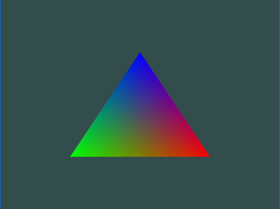
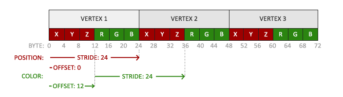

# Abstracts

Attribute를 컬러 데이터를 추가해 삼각형에 색을 칠해보자

# Result



* 결과는 보간(interpolation)된 값의 결과
* 삼각형을 렌더링할때 `rasterization` 단계에서 일반적으로 지정된 vertex들 보다 많은 fragment 생성
* `rasterizer`는 삼각형의 어느 부분을 맡고 있는지에 따라 각 fragment의 위치 결정
* 이 위치를 기반으로 fragment shader의 `모든 입력 변수를 보간`(interpolation)
  
* ex) 위의 점은 녹색이고 아래 점은 파란색인 선이 있음
  * fragment shader가 선의 70% 위치에서 실행되면 그 결과 생성되는 컬러 입력 attribute는 녹색과 파란색의 선형 조합
  * 30%의 파란색과 70%의 녹색


# Attributes
  
* 버텍스 데이터에 값 추가
```
float vertices[] = {
    // 위치              // 컬러
     0.5f, -0.5f, 0.0f,  1.0f, 0.0f, 0.0f,   // 우측 하단
    -0.5f, -0.5f, 0.0f,  0.0f, 1.0f, 0.0f,   // 좌측 하단
     0.0f,  0.5f, 0.0f,  0.0f, 0.0f, 1.0f    // 위 
};    
```

* `vertex attribute` 입력으로 컬러 값도 받을 수 있도록 `vertex shader` 수정
```cpp
#version 330 core
layout (location = 0) in vec3 aPos;   // 위치 변수는 attribute position 0
layout (location = 1) in vec3 aColor; // 컬러 변수는 attribute position 1
  
out vec3 ourColor; // 컬러를 fragment shader로 출력
void main() {
    gl_Position = vec4(aPos, 1.0);
    ourColor = aColor; // vertex data로부터 가져온 컬러 입력을 ourColor에 설정
}
```
* `vertex shader` 의 출력 값을 사용해 컬러값 적용
```cpp
#version 330 core
out vec4 FragColor;  
in vec3 ourColor;   // vertex shader에 선언된 값과 같은 타입, 같은 이름 ( varying )
  
void main() {
    FragColor = vec4(ourColor, 1.0);
}
```

* vertex attribute를 추가하고 VBO의 메모리를 수정하였으므로 포인터도 다시 구성
* VBO 메모리의 수정된 데이터


```cpp
// 위치 attribute
glVertexAttribPointer(0, 3, GL_FLOAT, GL_FALSE, 6 * sizeof(float), (void*)0);
glEnableVertexAttribArray(0);
// 컬러 attribute
glVertexAttribPointer(1, 3, GL_FLOAT, GL_FALSE, 6 * sizeof(float), (void*)(3* sizeof(float)));
glEnableVertexAttribArray(1);
```

# Source Codes

```cpp
#include <glad/glad.h>
#include <GLFW/glfw3.h>

#include <iostream>

void framebuffer_size_callback(GLFWwindow* window, int width, int height);
void processInput(GLFWwindow *window);

const unsigned int SCR_WIDTH = 800;
const unsigned int SCR_HEIGHT = 600;

const char *vertexShaderSource ="#version 330 core\n"
    "layout (location = 0) in vec3 aPos;\n"     // 위치 변수는 attribute position 0
    "layout (location = 1) in vec3 aColor;\n"   // 컬러 변수는 attribute position 1
    "out vec3 ourColor;\n"
    "void main()\n"
    "{\n"
    "   gl_Position = vec4(aPos, 1.0);\n"
    "   ourColor = aColor;\n"                  
    "}\0";

const char *fragmentShaderSource = "#version 330 core\n"
    "out vec4 FragColor;\n"
    "in vec3 ourColor;\n"
    "void main()\n"
    "{\n"
    "   FragColor = vec4(ourColor, 1.0f);\n"
    "}\n\0";

int main() {
    // glfw: initialize and configure
    // ------------------------------
    glfwInit();
    glfwWindowHint(GLFW_CONTEXT_VERSION_MAJOR, 3);
    glfwWindowHint(GLFW_CONTEXT_VERSION_MINOR, 3);
    glfwWindowHint(GLFW_OPENGL_PROFILE, GLFW_OPENGL_CORE_PROFILE);

#ifdef __APPLE__
    glfwWindowHint(GLFW_OPENGL_FORWARD_COMPAT, GL_TRUE); // uncomment this statement to fix compilation on OS X
#endif

    GLFWwindow* window = glfwCreateWindow(SCR_WIDTH, SCR_HEIGHT, "LearnOpenGL", NULL, NULL);
    if (window == NULL)
    {
        std::cout << "Failed to create GLFW window" << std::endl;
        glfwTerminate();
        return -1;
    }
    glfwMakeContextCurrent(window);
    glfwSetFramebufferSizeCallback(window, framebuffer_size_callback);

    if (!gladLoadGLLoader((GLADloadproc)glfwGetProcAddress))
    {
        std::cout << "Failed to initialize GLAD" << std::endl;
        return -1;
    }

    int vertexShader = glCreateShader(GL_VERTEX_SHADER);
    glShaderSource(vertexShader, 1, &vertexShaderSource, NULL);
    glCompileShader(vertexShader);

    int success;
    char infoLog[512];
    glGetShaderiv(vertexShader, GL_COMPILE_STATUS, &success);
    if (!success)
    {
        glGetShaderInfoLog(vertexShader, 512, NULL, infoLog);
        std::cout << "ERROR::SHADER::VERTEX::COMPILATION_FAILED\n" << infoLog << std::endl;
    }
   
    int fragmentShader = glCreateShader(GL_FRAGMENT_SHADER);
    glShaderSource(fragmentShader, 1, &fragmentShaderSource, NULL);
    glCompileShader(fragmentShader);
    // check for shader compile errors
    glGetShaderiv(fragmentShader, GL_COMPILE_STATUS, &success);
    if (!success)
    {
        glGetShaderInfoLog(fragmentShader, 512, NULL, infoLog);
        std::cout << "ERROR::SHADER::FRAGMENT::COMPILATION_FAILED\n" << infoLog << std::endl;
    }
    
    int shaderProgram = glCreateProgram();
    glAttachShader(shaderProgram, vertexShader);
    glAttachShader(shaderProgram, fragmentShader);
    glLinkProgram(shaderProgram);
    // check for linking errors
    glGetProgramiv(shaderProgram, GL_LINK_STATUS, &success);
    if (!success) {
        glGetProgramInfoLog(shaderProgram, 512, NULL, infoLog);
        std::cout << "ERROR::SHADER::PROGRAM::LINKING_FAILED\n" << infoLog << std::endl;
    }
    glDeleteShader(vertexShader);
    glDeleteShader(fragmentShader);

    // set up vertex data (and buffer(s)) and configure vertex attributes
    // ------------------------------------------------------------------
    float vertices[] = {
        // positions         // colors
         0.5f, -0.5f, 0.0f,  1.0f, 0.0f, 0.0f,  // bottom right
        -0.5f, -0.5f, 0.0f,  0.0f, 1.0f, 0.0f,  // bottom left
         0.0f,  0.5f, 0.0f,  0.0f, 0.0f, 1.0f   // top 

    };

    unsigned int VBO, VAO;
    glGenVertexArrays(1, &VAO);
    glGenBuffers(1, &VBO);

    glBindVertexArray(VAO);

    glBindBuffer(GL_ARRAY_BUFFER, VBO);
    glBufferData(GL_ARRAY_BUFFER, sizeof(vertices), vertices, GL_STATIC_DRAW);

    // position attribute
    glVertexAttribPointer(0, 3, GL_FLOAT, GL_FALSE, 6 * sizeof(float), (void*)0);
    glEnableVertexAttribArray(0);
    // color attribute
    glVertexAttribPointer(1, 3, GL_FLOAT, GL_FALSE, 6 * sizeof(float), (void*)(3 * sizeof(float)));
    glEnableVertexAttribArray(1);

    glUseProgram(shaderProgram);

    // render loop
    // -----------
    while (!glfwWindowShouldClose(window)) {
        processInput(window);

        glClearColor(0.2f, 0.3f, 0.3f, 1.0f);
        glClear(GL_COLOR_BUFFER_BIT);

        glBindVertexArray(VAO);
        glDrawArrays(GL_TRIANGLES, 0, 3);

        glfwSwapBuffers(window);
        glfwPollEvents();
    }

    glDeleteVertexArrays(1, &VAO);
    glDeleteBuffers(1, &VBO);

    glfwTerminate();
    return 0;
}

void processInput(GLFWwindow *window) {
    if (glfwGetKey(window, GLFW_KEY_ESCAPE) == GLFW_PRESS)
        glfwSetWindowShouldClose(window, true);
}

void framebuffer_size_callback(GLFWwindow* window, int width, int height) {
    glViewport(0, 0, width, height);
}
```