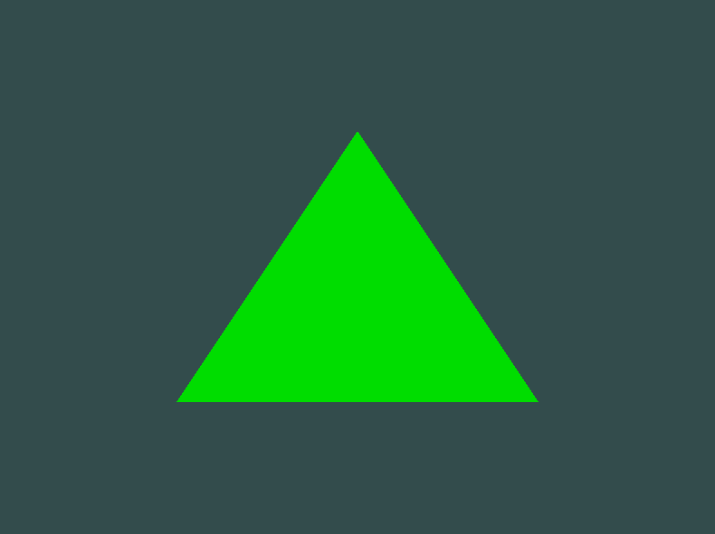

# Abstracts

uniform 변수를 사용해 삼각형의 색을 바꿔보자

# Shaders

* GPU에서 동작하는 그래픽 파이프라인의 특정 부분을 맡아서 실행하는 프로그램
* `GLSL` : OpenGL Shading Language
 
 ```cpp
 [Shader 구조]

#version version_number         // 항상 버전 선언부터 시작
in type in_variable_name;       // 입력 변수 선언
in type in_variable_name;

out type out_variable_name;     // 출력 변수 선언
  
uniform type uniform_name;      // uniform 변수 선언
  
void main() {
}
 ```

 * `vertex attribute` : vertex shader의 입력 변수
   * 하드웨어에 의해 제한되어 `vertex attribute`를 선언할 수 있는 최대 갯수가 정해져 있음
   * OpenGL은 4가지 요소를 가진 vertex attribute를 최소 16개까지 보장
   * `GL_MAX_VERTEX_ATTRIBS` 를 통해 하드웨어가 얼마나 허용하는지 알 수 있음
```cpp
int nrAttributes;
glGetIntegerv(GL_MAX_VERTEX_ATTRIBS, &nrAttributes);
std::cout << "Maximum nr of vertex attributes supported: " << nrAttributes << std::endl;

// 결과
Maximum nr of vertex attributes supported: 16
```

## Types

* C언어에서 볼 수 있는 기본적인 타입 대부분 가지고 있음
  * `int`, `float`, `double`, `unit`, `bool`
* 컨테이너 타입 : `vector`, `matrices`

## Vectors

* 1~4가지 요소(모든 기본적인 타입의 요소)를 가진 컨테이너

|vector|description|
|:---|:---|
|vecn|n개의 float 타입 요소를 가지는 기본적인 vector|
|bvecn|n개의 boolean 타입 요소를 가지는 vector|
|ivecn|n개의 integer 타입 요소를 가지는 vector|
|uvecn|n개의 unsigned integer 타입 요소를 가지는 vector|
|dvecn|n개의 double 타입 요소를 가지는 vector|

* `x,y,z,w`를 통해 벡터의 요소에 접근 할 수 있음
* `swizzling`
```cpp
vec2 someVec;
vec4 differentVec = someVec.xyxx;
vec3 anotherVec = differentVec.zyw;
vec4 otherVec = someVec.xxxx + anotherVec.yxzy;

vec4 someVec;
someVec.wzyx = vec4(1.0, 2.0, 3.0, 4.0);
someVec.zx = vec2(3.0, 5.0);
```
* vector를 다른 생성자의 파라미터로 사용 가능
```cpp
vec2 vect = vec2(0.5, 0.7);
vec4 result = vec4(vect, 0.0, 0.0);
vec4 otherResult = vec4(result.xyz, 1.0);
```

# Inputs and outputs

* `vertex shader`는 일정한 형태의 입력을 받아야함
  * vertex 데이터를 입력으로 받음
  * location 메타데이터와 함께 입력 변수를 지정해 `vertex attribute` 구성
  * `layout (location = 0)` 명시자를 사용하지 않고 `glGetAttribLocation`함수를 통해서도 알 수 있으나 직접 설정하는 것을 권장
* `fragment shader`는 `vec4` 타입의 컬러 출력 변수를 필요로 함

* 데이터를 한 shader에서 다른 shader로 넘기고 싶을 땐 보내는 곳과 받는 곳 모두 `타입`과 `이름`이 같은 변수를 선언해야 함

```cpp
[vertex shader]
#version 330 core
layout (location = 0) in vec3 aPos; // 위치 변수는 attribute position 0
  
out vec4 vertexColor; // fragment shader를 위한 컬러 출력을 지정

void main() {
    gl_Position = vec4(aPos, 1.0); 
    vertexColor = vec4(0.5, 0.0, 0.0, 1.0); 
}

[fragment shader]
#version 330 core
out vec4 FragColor;
  
in vec4 vertexColor; // Vertex Shader로 부터 받은 입력 변수(똑같은 이름, 똑같은 타입)

void main() {
    FragColor = vertexColor;
} 
```

## Uniforms

* CPU위의 응용프로그램에서 GPU위의 shader로 데이터를 전달하는 방법
* uniform은 `global` 변수
  * shader program 객체에서 고유하며, shader program의 모든 단계의 모든 shader에서 접근 가능
  * 어떤 값을 설정하든 리셋을 하거나 업데이트를 하기 전까지 값 계속 유지
  *  GLSL 코드에서 사용되지 않는 uniform을 선언했다면 컴파일러는 컴파일된 버전에서 자동으로 그 변수를 삭제함

```cpp
[fragment shader]
#version 330 core
out vec4 FragColor;
  
uniform vec4 ourColor; // OpenGL 코드에서 이 변수를 설정, 현재 비어 있음

void main() {
    FragColor = ourColor;
}  
```

  

```cpp
float timeValue = glfwGetTime();
float greenValue = (sin(timeValue) / 2.0f) + 0.5f; // 0.0f ~ 1.0f
int vertexColorLocation = glGetUniformLocation(shaderProgram, "ourColor");
glUseProgram(shaderProgram);
glUniform4f(vertexColorLocation, 0.0f, greenValue, 0.0f, 1.0f);
```

* uniform에 데이터를 삽입하기 위해서 `uniform attribute`의 `location`을 찾아야함
* `GLint glGetUniformLocation(GLuint program, const GLchar *name);` 
  * uniform의 location을 반환
  * program : shader program
  * name : 위치를 찾을 uniform 변수의 이름
  * -1을 리턴하면 location을 찾지 못한 것
* `glUniform` : uniform의 변수 값 설정
* uniform 변수의 위치를 찾을 때는 shader program을 사용하지 않지만 uniform 변수의 값을 수정할 때는 program을 사용해야함
  * 현재 활성화된 shader program의 uniform 값 설정

* OpenGL은 타입 오버로딩을 지원하지 않음
* `glUniform` 함수는 접미사를 사용해 설정할 uniform의 타입을 나타냄
* ex) `glUniform4f` : 4개의 float 타입의 값 설정

# Source codes

```cpp
#include <glad/glad.h>
#include <GLFW/glfw3.h>

#include <iostream>
#include <cmath>

void framebuffer_size_callback(GLFWwindow* window, int width, int height);
void processInput(GLFWwindow *window);

// settings
const unsigned int SCR_WIDTH = 800;
const unsigned int SCR_HEIGHT = 600;

const char *vertexShaderSource ="#version 330 core\n"
    "layout (location = 0) in vec3 aPos;\n"
    "void main()\n"
    "{\n"
    "   gl_Position = vec4(aPos, 1.0);\n"
    "}\0";

const char *fragmentShaderSource = "#version 330 core\n"
    "out vec4 FragColor;\n"
    // uniform 변수 선언
    // -----------------------------------			
    "uniform vec4 ourColor;\n"		
    "void main()\n"
    "{\n"
    "   FragColor = ourColor;\n"
    "}\n\0";

int main() {
    // glfw: initialize and configure
    // ------------------------------
    glfwInit();
    glfwWindowHint(GLFW_CONTEXT_VERSION_MAJOR, 3);
    glfwWindowHint(GLFW_CONTEXT_VERSION_MINOR, 3);
    glfwWindowHint(GLFW_OPENGL_PROFILE, GLFW_OPENGL_CORE_PROFILE);

#ifdef __APPLE__
    glfwWindowHint(GLFW_OPENGL_FORWARD_COMPAT, GL_TRUE); // uncomment this statement to fix compilation on OS X
#endif

    // glfw window creation
    // --------------------
    GLFWwindow* window = glfwCreateWindow(800, 600, "LearnOpenGL", NULL, NULL);
    if (window == NULL) {
        std::cout << "Failed to create GLFW window" << std::endl;
        glfwTerminate();
        return -1;
    }
    glfwMakeContextCurrent(window);
    glfwSetFramebufferSizeCallback(window, framebuffer_size_callback);

    // glad: load all OpenGL function pointers
    // ---------------------------------------
    if (!gladLoadGLLoader((GLADloadproc)glfwGetProcAddress))
    {
        std::cout << "Failed to initialize GLAD" << std::endl;
        return -1;
    }

	int nrAttributes;
	glGetIntegerv(GL_MAX_VERTEX_ATTRIBS, &nrAttributes);
	std::cout << "Maximum nr of vertex attributes supported: " << nrAttributes << std::endl;

    // build and compile our shader program
    // ------------------------------------
    // vertex shader
    int vertexShader = glCreateShader(GL_VERTEX_SHADER);
    glShaderSource(vertexShader, 1, &vertexShaderSource, NULL);
    glCompileShader(vertexShader);
    // check for shader compile errors
    int success;
    char infoLog[512];
    glGetShaderiv(vertexShader, GL_COMPILE_STATUS, &success);
    if (!success) {
        glGetShaderInfoLog(vertexShader, 512, NULL, infoLog);
        std::cout << "ERROR::SHADER::VERTEX::COMPILATION_FAILED\n" << infoLog << std::endl;
    }
    // fragment shader
    int fragmentShader = glCreateShader(GL_FRAGMENT_SHADER);
    glShaderSource(fragmentShader, 1, &fragmentShaderSource, NULL);
    glCompileShader(fragmentShader);
    // check for shader compile errors
    glGetShaderiv(fragmentShader, GL_COMPILE_STATUS, &success);
    if (!success) {
        glGetShaderInfoLog(fragmentShader, 512, NULL, infoLog);
        std::cout << "ERROR::SHADER::FRAGMENT::COMPILATION_FAILED\n" << infoLog << std::endl;
    }
    // link shaders
    int shaderProgram = glCreateProgram();
    glAttachShader(shaderProgram, vertexShader);
    glAttachShader(shaderProgram, fragmentShader);
    glLinkProgram(shaderProgram);
    // check for linking errors
    glGetProgramiv(shaderProgram, GL_LINK_STATUS, &success);
    if (!success) {
        glGetProgramInfoLog(shaderProgram, 512, NULL, infoLog);
        std::cout << "ERROR::SHADER::PROGRAM::LINKING_FAILED\n" << infoLog << std::endl;
    }
    glDeleteShader(vertexShader);
    glDeleteShader(fragmentShader);

    // set up vertex data (and buffer(s)) and configure vertex attributes
    // ------------------------------------------------------------------
    float vertices[] = {
         0.5f, -0.5f, 0.0f,  // bottom right
        -0.5f, -0.5f, 0.0f,  // bottom left
         0.0f,  0.5f, 0.0f   // top 
    };

    unsigned int VBO, VAO;
    glGenVertexArrays(1, &VAO);
    glGenBuffers(1, &VBO);

    glBindVertexArray(VAO);

    glBindBuffer(GL_ARRAY_BUFFER, VBO);
    glBufferData(GL_ARRAY_BUFFER, sizeof(vertices), vertices, GL_STATIC_DRAW);

    glVertexAttribPointer(0, 3, GL_FLOAT, GL_FALSE, 3 * sizeof(float), (void*)0);
    glEnableVertexAttribArray(0);

    glBindVertexArray(VAO);


    // render loop
    // -----------
    while (!glfwWindowShouldClose(window)) {
        // input
        // -----
        processInput(window);

        // render
        // ------
        glClearColor(0.2f, 0.3f, 0.3f, 1.0f);
        glClear(GL_COLOR_BUFFER_BIT);

        // glUniform을 호출하기 전에 shader를 활성화 시켜야함 
        glUseProgram(shaderProgram);

        // uniform 갱신
        // -----------------------------------
	// 시간에 따라 색깔값이 바뀜
        float timeValue = glfwGetTime();
        float greenValue = sin(timeValue) / 2.0f + 0.5f;
	// uniform 변수의 위치를 찾음
        int vertexColorLocation = glGetUniformLocation(shaderProgram, "ourColor");
	// uniform 변수 값 지정
        glUniform4f(vertexColorLocation, 0.0f, greenValue, 0.0f, 1.0f);
	// -----------------------------------

        // render the triangle
        glDrawArrays(GL_TRIANGLES, 0, 3);

        glfwSwapBuffers(window);
        glfwPollEvents();
    }

    glDeleteVertexArrays(1, &VAO);
    glDeleteBuffers(1, &VBO);

    glfwTerminate();
    return 0;
}

void processInput(GLFWwindow *window) {
    if (glfwGetKey(window, GLFW_KEY_ESCAPE) == GLFW_PRESS)
        glfwSetWindowShouldClose(window, true);
}

void framebuffer_size_callback(GLFWwindow* window, int width, int height) {
    glViewport(0, 0, width, height);
}
```

# Results

