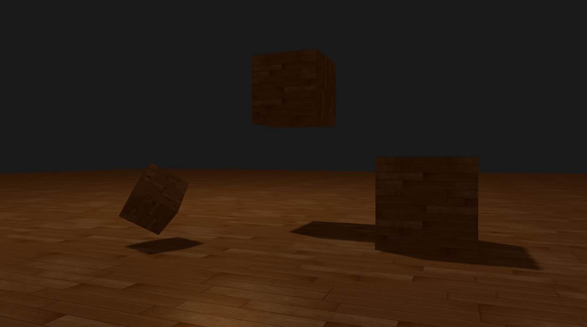

# Result



# Shadow Acne


* shadow map의 해상도는 제한적이기 때문에 여러개의 fragment가 같은 깊이값을 바라볼 수 있음
* d(p1)과 d(p2)는 둘다 s값과 비교되기 때문에 p1은 그림자로 표현됨


* `bias`값을 넣어 깊이를 오프셋함
* 대부분 acne가 사라질때까지 bias값을 증가시킴

## Peter panning


* `peter panning` : `bias`값을 너무 증가시키면 물체와 그림자가 분리되어 보이는 현상이 발생함

# Over Sampling

* 투영된 부분 좌표가 쉐도우맵 범위 내에 있지 않을 경우 처리하는 방법
  * 깊이 맵 범위를 벗어날 경우 그림자가 보이지 않게 처리

### over sampling 적용 전


## over sampling 적용

* 텍스처 랩 옵션을 `GL_CLAMP_TO_BORDER`로 변경해 쉐도우맵 범위 밖의 깊이값을 결정

```cpp
// 텍스처랩 옵션 변경
glTexParameteri(GL_TEXTURE_2D, GL_TEXTURE_WRAP_S, GL_CLAMP_TO_BORDER); 
glTexParameteri(GL_TEXTURE_2D, GL_TEXTURE_WRAP_T, GL_CLAMP_TO_BORDER);
// 경계값 설정 
float borderColor[] = { 1.0f, 1.0f, 1.0f, 1.0f }; 
glTexParameterfv(GL_TEXTURE_2D, GL_TEXTURE_BORDER_COLOR, borderColor); 
```

* 절두체의 범위를 벗어나는 좌표는 z값이 1보다 크고 이 값에 대해서는 그림자 값을 0으로 강제로 설정

```cpp
float ShadowCalculation(vec4 fragPosLightSpace) { 
    [...] 
    if(projCoords.z > 1.0) 
    shadow = 0.0; 
    return shadow; 
} 
```

### over sampling 결과


# PCF(Percentage-closer filtering)


* 깊이맵은 고정된 해상도를 가지고 있기 때문에 깊이값은 텍셀당 하나 이상의 fragment에 분포
* 여러 fragment가 깊이맵에서 동일한 깊이 값을 샘플링하기 때문에 들쑥날쑥한 가장자리가 생김


* PCF : 깊이맵의 주변 텍셀을 샘플링하고 결과를 평균화함

# Orthographic vs Projection


* 직교 투영 행렬은 원근감을 가지고 장면을 변형시키지 않으므로 모든 뷰/광선이 평행
  * 방향조명에 사용
* 원근 투영 행렬은 다른 결과를 제공하는 원근감에 따라 모든 꼭지점을 변형
  * 스포트라이트 및 포인트 광원에 많이 사용
  * 실제 위치가 있는 광원에 더 적합

# shader

## Shadowmap vertex shader

```cpp
#version 330 core
layout (location = 0) in vec3 aPos;

uniform mat4 lightSpaceMatrix;
uniform mat4 model;

void main() {
    gl_Position = lightSpaceMatrix * model * vec4(aPos, 1.0);
}
```

## Object vertex shader

```cpp
#version 330 core
layout (location = 0) in vec3 aPos;
layout (location = 1) in vec3 aNormal;
layout (location = 2) in vec2 aTexCoords;

out vec2 TexCoords;

out VS_OUT {
    vec3 FragPos;
    vec3 Normal;
    vec2 TexCoords;
    vec4 FragPosLightSpace;
} vs_out;

uniform mat4 projection;
uniform mat4 view;
uniform mat4 model;
uniform mat4 lightSpaceMatrix;

void main() {
    vs_out.FragPos = vec3(model * vec4(aPos, 1.0));
    vs_out.Normal = transpose(inverse(mat3(model))) * aNormal;
    vs_out.TexCoords = aTexCoords;
    vs_out.FragPosLightSpace = lightSpaceMatrix * vec4(vs_out.FragPos, 1.0);
    gl_Position = projection * view * model * vec4(aPos, 1.0);
}
```

## Object fragment shader

```cpp
#version 330 core
out vec4 FragColor;

in VS_OUT {
    vec3 FragPos;
    vec3 Normal;
    vec2 TexCoords;
    vec4 FragPosLightSpace;
} fs_in;

uniform sampler2D diffuseTexture;
uniform sampler2D shadowMap;

uniform vec3 lightPos;
uniform vec3 viewPos;

float ShadowCalculation(vec4 fragPosLightSpace) {
    // perform perspective divide
    vec3 projCoords = fragPosLightSpace.xyz / fragPosLightSpace.w;
    // transform to [0,1] range
    projCoords = projCoords * 0.5 + 0.5;
    // 쉐도우맵값 가져옴
    float closestDepth = texture(shadowMap, projCoords.xy).r; 
    // 정점의 깊이값 가져옴
    float currentDepth = projCoords.z;

    vec3 normal = normalize(fs_in.Normal);
    vec3 lightDir = normalize(lightPos - fs_in.FragPos);
    // 빛의 대한 표면 각을 기준으로 bias 구함
    float bias = max(0.05 * (1.0 - dot(normal, lightDir)), 0.005);
    // check whether current frag pos is in shadow
    // float shadow = currentDepth - bias > closestDepth  ? 1.0 : 0.0;
    // PCF
    float shadow = 0.0;
    // 밉맵 레벨 0에서 주어진 샘플러 텍스처
    vec2 texelSize = 1.0 / textureSize(shadowMap, 0);
    // 주변 9개의 깊이 값을 샘플링 후 평균
    for(int x = -1; x <= 1; ++x) {
        for(int y = -1; y <= 1; ++y) {
            float pcfDepth = texture(shadowMap, projCoords.xy + vec2(x, y) * texelSize).r; 
            shadow += currentDepth - bias > pcfDepth  ? 1.0 : 0.0;        
        }    
    }
    shadow /= 9.0;
    
    // 빛의 절두체의 far-plane 영역 바깥 쪽에서 0으로 그림자를 유지
    if(projCoords.z > 1.0)
        shadow = 0.0;
        
    return shadow;
}

void main() {           
    vec3 color = texture(diffuseTexture, fs_in.TexCoords).rgb;
    vec3 normal = normalize(fs_in.Normal);
    vec3 lightColor = vec3(0.3);
    // ambient
    vec3 ambient = 0.3 * color;
    // diffuse
    vec3 lightDir = normalize(lightPos - fs_in.FragPos);
    float diff = max(dot(lightDir, normal), 0.0);
    vec3 diffuse = diff * lightColor;
    // specular
    vec3 viewDir = normalize(viewPos - fs_in.FragPos);
    vec3 reflectDir = reflect(-lightDir, normal);
    float spec = 0.0;
    vec3 halfwayDir = normalize(lightDir + viewDir);  
    spec = pow(max(dot(normal, halfwayDir), 0.0), 64.0);
    vec3 specular = spec * lightColor;    
    // calculate shadow
    float shadow = ShadowCalculation(fs_in.FragPosLightSpace);                      
    vec3 lighting = (ambient + (1.0 - shadow) * (diffuse + specular)) * color;    
    
    FragColor = vec4(lighting, 1.0);
}
```

# Source Codes

```cpp
#include <glad/glad.h>
#include <GLFW/glfw3.h>
#include <stb_image.h>

#include <glm/glm.hpp>
#include <glm/gtc/matrix_transform.hpp>
#include <glm/gtc/type_ptr.hpp>

#include <learnopengl/filesystem.h>
#include <learnopengl/shader.h>
#include <learnopengl/camera.h>
#include <learnopengl/model.h>

#include <iostream>

void framebuffer_size_callback(GLFWwindow* window, int width, int height);
void mouse_callback(GLFWwindow* window, double xpos, double ypos);
void scroll_callback(GLFWwindow* window, double xoffset, double yoffset);
void processInput(GLFWwindow *window);
unsigned int loadTexture(const char *path);
void renderScene(const Shader &shader);
void renderCube();
void renderQuad();

// settings
const unsigned int SCR_WIDTH = 1280;
const unsigned int SCR_HEIGHT = 720;

// camera
Camera camera(glm::vec3(0.0f, 0.0f, 3.0f));
float lastX = (float)SCR_WIDTH / 2.0;
float lastY = (float)SCR_HEIGHT / 2.0;
bool firstMouse = true;

// timing
float deltaTime = 0.0f;
float lastFrame = 0.0f;

// meshes
unsigned int planeVAO;

int main()
{
    // glfw: initialize and configure
    // ------------------------------
    glfwInit();
    glfwWindowHint(GLFW_CONTEXT_VERSION_MAJOR, 3);
    glfwWindowHint(GLFW_CONTEXT_VERSION_MINOR, 3);
    glfwWindowHint(GLFW_OPENGL_PROFILE, GLFW_OPENGL_CORE_PROFILE);

#ifdef __APPLE__
    glfwWindowHint(GLFW_OPENGL_FORWARD_COMPAT, GL_TRUE); // uncomment this statement to fix compilation on OS X
#endif

    // glfw window creation
    // --------------------
    GLFWwindow* window = glfwCreateWindow(SCR_WIDTH, SCR_HEIGHT, "LearnOpenGL", NULL, NULL);
    if (window == NULL)
    {
        std::cout << "Failed to create GLFW window" << std::endl;
        glfwTerminate();
        return -1;
    }
    glfwMakeContextCurrent(window);
    glfwSetFramebufferSizeCallback(window, framebuffer_size_callback);
    glfwSetCursorPosCallback(window, mouse_callback);
    glfwSetScrollCallback(window, scroll_callback);

    // tell GLFW to capture our mouse
    glfwSetInputMode(window, GLFW_CURSOR, GLFW_CURSOR_DISABLED);

    // glad: load all OpenGL function pointers
    // ---------------------------------------
    if (!gladLoadGLLoader((GLADloadproc)glfwGetProcAddress))
    {
        std::cout << "Failed to initialize GLAD" << std::endl;
        return -1;
    }

    // configure global opengl state
    // -----------------------------
    glEnable(GL_DEPTH_TEST);

    // build and compile shaders
    // -------------------------
    Shader shader("3.1.3.shadow_mapping.vs", "3.1.3.shadow_mapping.fs");
    Shader simpleDepthShader("3.1.3.shadow_mapping_depth.vs", "3.1.3.shadow_mapping_depth.fs");

    // set up vertex data (and buffer(s)) and configure vertex attributes
    // ------------------------------------------------------------------
    float planeVertices[] = {
        // positions            // normals         // texcoords
         25.0f, -0.5f,  25.0f,  0.0f, 1.0f, 0.0f,  25.0f,  0.0f,
        -25.0f, -0.5f,  25.0f,  0.0f, 1.0f, 0.0f,   0.0f,  0.0f,
        -25.0f, -0.5f, -25.0f,  0.0f, 1.0f, 0.0f,   0.0f, 25.0f,

         25.0f, -0.5f,  25.0f,  0.0f, 1.0f, 0.0f,  25.0f,  0.0f,
        -25.0f, -0.5f, -25.0f,  0.0f, 1.0f, 0.0f,   0.0f, 25.0f,
         25.0f, -0.5f, -25.0f,  0.0f, 1.0f, 0.0f,  25.0f, 25.0f
    };
    // plane VAO
    unsigned int planeVBO;
    glGenVertexArrays(1, &planeVAO);
    glGenBuffers(1, &planeVBO);
    glBindVertexArray(planeVAO);
    glBindBuffer(GL_ARRAY_BUFFER, planeVBO);
    glBufferData(GL_ARRAY_BUFFER, sizeof(planeVertices), planeVertices, GL_STATIC_DRAW);
    glEnableVertexAttribArray(0);
    glVertexAttribPointer(0, 3, GL_FLOAT, GL_FALSE, 8 * sizeof(float), (void*)0);
    glEnableVertexAttribArray(1);
    glVertexAttribPointer(1, 3, GL_FLOAT, GL_FALSE, 8 * sizeof(float), (void*)(3 * sizeof(float)));
    glEnableVertexAttribArray(2);
    glVertexAttribPointer(2, 2, GL_FLOAT, GL_FALSE, 8 * sizeof(float), (void*)(6 * sizeof(float)));
    glBindVertexArray(0);

    // load textures
    // -------------
    unsigned int woodTexture = loadTexture(FileSystem::getPath("resources/textures/wood.png").c_str());

    // 깊이맵 생성
    // -----------------------
    const unsigned int SHADOW_WIDTH = 1024, SHADOW_HEIGHT = 1024;
    unsigned int depthMapFBO;
    glGenFramebuffers(1, &depthMapFBO);
    // create depth texture
    unsigned int depthMap;
    glGenTextures(1, &depthMap);
    glBindTexture(GL_TEXTURE_2D, depthMap);
    glTexImage2D(GL_TEXTURE_2D, 0, GL_DEPTH_COMPONENT, SHADOW_WIDTH, SHADOW_HEIGHT, 0, GL_DEPTH_COMPONENT, GL_FLOAT, NULL);
    glTexParameteri(GL_TEXTURE_2D, GL_TEXTURE_MIN_FILTER, GL_NEAREST);
    glTexParameteri(GL_TEXTURE_2D, GL_TEXTURE_MAG_FILTER, GL_NEAREST);
    // 텍스처랩 옵션을 GL_CLAMP_TO_BORDER로 설정
    glTexParameteri(GL_TEXTURE_2D, GL_TEXTURE_WRAP_S, GL_CLAMP_TO_BORDER);
    glTexParameteri(GL_TEXTURE_2D, GL_TEXTURE_WRAP_T, GL_CLAMP_TO_BORDER);
    // 깊이 맵에서 [0,1] 좌표 범위 밖에서 샘플링할 때 마다 텍스처 함수는 항상 1의 깊이를 반환
    float borderColor[] = { 1.0, 1.0, 1.0, 1.0 };
    glTexParameterfv(GL_TEXTURE_2D, GL_TEXTURE_BORDER_COLOR, borderColor);
    // attach depth texture as FBO's depth buffer
    glBindFramebuffer(GL_FRAMEBUFFER, depthMapFBO);
    glFramebufferTexture2D(GL_FRAMEBUFFER, GL_DEPTH_ATTACHMENT, GL_TEXTURE_2D, depthMap, 0);
    glDrawBuffer(GL_NONE);
    glReadBuffer(GL_NONE);
    glBindFramebuffer(GL_FRAMEBUFFER, 0);


    // shader configuration
    // --------------------
    shader.use();
    shader.setInt("diffuseTexture", 0);
    shader.setInt("shadowMap", 1);

    // lighting info
    // -------------
    glm::vec3 lightPos(-2.0f, 4.0f, -1.0f);

    // render loop
    // -----------
    while (!glfwWindowShouldClose(window)) {
        // per-frame time logic
        // --------------------
        float currentFrame = glfwGetTime();
        deltaTime = currentFrame - lastFrame;
        lastFrame = currentFrame;

        // input
        // -----
        processInput(window);

        // render
        // ------
        glClearColor(0.1f, 0.1f, 0.1f, 1.0f);
        glClear(GL_COLOR_BUFFER_BIT | GL_DEPTH_BUFFER_BIT);

        // 1. render depth of scene to texture (from light's perspective)
        // --------------------------------------------------------------
        glm::mat4 lightProjection, lightView;
        glm::mat4 lightSpaceMatrix;
        float near_plane = 1.0f, far_plane = 7.5f;
        lightProjection = glm::ortho(-10.0f, 10.0f, -10.0f, 10.0f, near_plane, far_plane);
        lightView = glm::lookAt(lightPos, glm::vec3(0.0f), glm::vec3(0.0, 1.0, 0.0));
        lightSpaceMatrix = lightProjection * lightView;
        // render scene from light's point of view
        simpleDepthShader.use();
        simpleDepthShader.setMat4("lightSpaceMatrix", lightSpaceMatrix);

        glViewport(0, 0, SHADOW_WIDTH, SHADOW_HEIGHT);
        glBindFramebuffer(GL_FRAMEBUFFER, depthMapFBO);
        glClear(GL_DEPTH_BUFFER_BIT);
        glActiveTexture(GL_TEXTURE0);
        glBindTexture(GL_TEXTURE_2D, woodTexture);
        renderScene(simpleDepthShader);
        glBindFramebuffer(GL_FRAMEBUFFER, 0);

        // reset viewport
        glViewport(0, 0, SCR_WIDTH, SCR_HEIGHT);
        glClear(GL_COLOR_BUFFER_BIT | GL_DEPTH_BUFFER_BIT);

        // 2. render scene as normal using the generated depth/shadow map  
        // --------------------------------------------------------------
        glViewport(0, 0, SCR_WIDTH, SCR_HEIGHT);
        glClear(GL_COLOR_BUFFER_BIT | GL_DEPTH_BUFFER_BIT);
        shader.use();
        glm::mat4 projection = glm::perspective(glm::radians(camera.Zoom), (float)SCR_WIDTH / (float)SCR_HEIGHT, 0.1f, 100.0f);
        glm::mat4 view = camera.GetViewMatrix();
        shader.setMat4("projection", projection);
        shader.setMat4("view", view);
        // set light uniforms
        shader.setVec3("viewPos", camera.Position);
        shader.setVec3("lightPos", lightPos);
        shader.setMat4("lightSpaceMatrix", lightSpaceMatrix);
        glActiveTexture(GL_TEXTURE0);
        glBindTexture(GL_TEXTURE_2D, woodTexture);
        glActiveTexture(GL_TEXTURE1);
        glBindTexture(GL_TEXTURE_2D, depthMap);
        renderScene(shader);

        // glfw: swap buffers and poll IO events (keys pressed/released, mouse moved etc.)
        // -------------------------------------------------------------------------------
        glfwSwapBuffers(window);
        glfwPollEvents();
    }

    // optional: de-allocate all resources once they've outlived their purpose:
    // ------------------------------------------------------------------------
    glDeleteVertexArrays(1, &planeVAO);
    glDeleteBuffers(1, &planeVBO);

    glfwTerminate();
    return 0;
}

// renders the 3D scene
// --------------------
void renderScene(const Shader &shader)
{
    // floor
    glm::mat4 model = glm::mat4(1.0f);
    shader.setMat4("model", model);
    glBindVertexArray(planeVAO);
    glDrawArrays(GL_TRIANGLES, 0, 6);
    // cubes
    model = glm::mat4(1.0f);
    model = glm::translate(model, glm::vec3(0.0f, 1.5f, 0.0));
    model = glm::scale(model, glm::vec3(0.5f));
    shader.setMat4("model", model);
    renderCube();
    model = glm::mat4(1.0f);
    model = glm::translate(model, glm::vec3(2.0f, 0.0f, 1.0));
    model = glm::scale(model, glm::vec3(0.5f));
    shader.setMat4("model", model);
    renderCube();
    model = glm::mat4(1.0f);
    model = glm::translate(model, glm::vec3(-1.0f, 0.0f, 2.0));
    model = glm::rotate(model, glm::radians(60.0f), glm::normalize(glm::vec3(1.0, 0.0, 1.0)));
    model = glm::scale(model, glm::vec3(0.25));
    shader.setMat4("model", model);
    renderCube();
}


// renderCube() renders a 1x1 3D cube in NDC.
// -------------------------------------------------
unsigned int cubeVAO = 0;
unsigned int cubeVBO = 0;
void renderCube()
{
    // initialize (if necessary)
    if (cubeVAO == 0)
    {
        float vertices[] = {
            // back face
            -1.0f, -1.0f, -1.0f,  0.0f,  0.0f, -1.0f, 0.0f, 0.0f, // bottom-left
             1.0f,  1.0f, -1.0f,  0.0f,  0.0f, -1.0f, 1.0f, 1.0f, // top-right
             1.0f, -1.0f, -1.0f,  0.0f,  0.0f, -1.0f, 1.0f, 0.0f, // bottom-right         
             1.0f,  1.0f, -1.0f,  0.0f,  0.0f, -1.0f, 1.0f, 1.0f, // top-right
            -1.0f, -1.0f, -1.0f,  0.0f,  0.0f, -1.0f, 0.0f, 0.0f, // bottom-left
            -1.0f,  1.0f, -1.0f,  0.0f,  0.0f, -1.0f, 0.0f, 1.0f, // top-left
            // front face
            -1.0f, -1.0f,  1.0f,  0.0f,  0.0f,  1.0f, 0.0f, 0.0f, // bottom-left
             1.0f, -1.0f,  1.0f,  0.0f,  0.0f,  1.0f, 1.0f, 0.0f, // bottom-right
             1.0f,  1.0f,  1.0f,  0.0f,  0.0f,  1.0f, 1.0f, 1.0f, // top-right
             1.0f,  1.0f,  1.0f,  0.0f,  0.0f,  1.0f, 1.0f, 1.0f, // top-right
            -1.0f,  1.0f,  1.0f,  0.0f,  0.0f,  1.0f, 0.0f, 1.0f, // top-left
            -1.0f, -1.0f,  1.0f,  0.0f,  0.0f,  1.0f, 0.0f, 0.0f, // bottom-left
            // left face
            -1.0f,  1.0f,  1.0f, -1.0f,  0.0f,  0.0f, 1.0f, 0.0f, // top-right
            -1.0f,  1.0f, -1.0f, -1.0f,  0.0f,  0.0f, 1.0f, 1.0f, // top-left
            -1.0f, -1.0f, -1.0f, -1.0f,  0.0f,  0.0f, 0.0f, 1.0f, // bottom-left
            -1.0f, -1.0f, -1.0f, -1.0f,  0.0f,  0.0f, 0.0f, 1.0f, // bottom-left
            -1.0f, -1.0f,  1.0f, -1.0f,  0.0f,  0.0f, 0.0f, 0.0f, // bottom-right
            -1.0f,  1.0f,  1.0f, -1.0f,  0.0f,  0.0f, 1.0f, 0.0f, // top-right
            // right face
             1.0f,  1.0f,  1.0f,  1.0f,  0.0f,  0.0f, 1.0f, 0.0f, // top-left
             1.0f, -1.0f, -1.0f,  1.0f,  0.0f,  0.0f, 0.0f, 1.0f, // bottom-right
             1.0f,  1.0f, -1.0f,  1.0f,  0.0f,  0.0f, 1.0f, 1.0f, // top-right         
             1.0f, -1.0f, -1.0f,  1.0f,  0.0f,  0.0f, 0.0f, 1.0f, // bottom-right
             1.0f,  1.0f,  1.0f,  1.0f,  0.0f,  0.0f, 1.0f, 0.0f, // top-left
             1.0f, -1.0f,  1.0f,  1.0f,  0.0f,  0.0f, 0.0f, 0.0f, // bottom-left     
            // bottom face
            -1.0f, -1.0f, -1.0f,  0.0f, -1.0f,  0.0f, 0.0f, 1.0f, // top-right
             1.0f, -1.0f, -1.0f,  0.0f, -1.0f,  0.0f, 1.0f, 1.0f, // top-left
             1.0f, -1.0f,  1.0f,  0.0f, -1.0f,  0.0f, 1.0f, 0.0f, // bottom-left
             1.0f, -1.0f,  1.0f,  0.0f, -1.0f,  0.0f, 1.0f, 0.0f, // bottom-left
            -1.0f, -1.0f,  1.0f,  0.0f, -1.0f,  0.0f, 0.0f, 0.0f, // bottom-right
            -1.0f, -1.0f, -1.0f,  0.0f, -1.0f,  0.0f, 0.0f, 1.0f, // top-right
            // top face
            -1.0f,  1.0f, -1.0f,  0.0f,  1.0f,  0.0f, 0.0f, 1.0f, // top-left
             1.0f,  1.0f , 1.0f,  0.0f,  1.0f,  0.0f, 1.0f, 0.0f, // bottom-right
             1.0f,  1.0f, -1.0f,  0.0f,  1.0f,  0.0f, 1.0f, 1.0f, // top-right     
             1.0f,  1.0f,  1.0f,  0.0f,  1.0f,  0.0f, 1.0f, 0.0f, // bottom-right
            -1.0f,  1.0f, -1.0f,  0.0f,  1.0f,  0.0f, 0.0f, 1.0f, // top-left
            -1.0f,  1.0f,  1.0f,  0.0f,  1.0f,  0.0f, 0.0f, 0.0f  // bottom-left        
        };
        glGenVertexArrays(1, &cubeVAO);
        glGenBuffers(1, &cubeVBO);
        // fill buffer
        glBindBuffer(GL_ARRAY_BUFFER, cubeVBO);
        glBufferData(GL_ARRAY_BUFFER, sizeof(vertices), vertices, GL_STATIC_DRAW);
        // link vertex attributes
        glBindVertexArray(cubeVAO);
        glEnableVertexAttribArray(0);
        glVertexAttribPointer(0, 3, GL_FLOAT, GL_FALSE, 8 * sizeof(float), (void*)0);
        glEnableVertexAttribArray(1);
        glVertexAttribPointer(1, 3, GL_FLOAT, GL_FALSE, 8 * sizeof(float), (void*)(3 * sizeof(float)));
        glEnableVertexAttribArray(2);
        glVertexAttribPointer(2, 2, GL_FLOAT, GL_FALSE, 8 * sizeof(float), (void*)(6 * sizeof(float)));
        glBindBuffer(GL_ARRAY_BUFFER, 0);
        glBindVertexArray(0);
    }
    // render Cube
    glBindVertexArray(cubeVAO);
    glDrawArrays(GL_TRIANGLES, 0, 36);
    glBindVertexArray(0);
}

// renderQuad() renders a 1x1 XY quad in NDC
// -----------------------------------------
unsigned int quadVAO = 0;
unsigned int quadVBO;
void renderQuad()
{
    if (quadVAO == 0)
    {
        float quadVertices[] = {
            // positions        // texture Coords
            -1.0f,  1.0f, 0.0f, 0.0f, 1.0f,
            -1.0f, -1.0f, 0.0f, 0.0f, 0.0f,
             1.0f,  1.0f, 0.0f, 1.0f, 1.0f,
             1.0f, -1.0f, 0.0f, 1.0f, 0.0f,
        };
        // setup plane VAO
        glGenVertexArrays(1, &quadVAO);
        glGenBuffers(1, &quadVBO);
        glBindVertexArray(quadVAO);
        glBindBuffer(GL_ARRAY_BUFFER, quadVBO);
        glBufferData(GL_ARRAY_BUFFER, sizeof(quadVertices), &quadVertices, GL_STATIC_DRAW);
        glEnableVertexAttribArray(0);
        glVertexAttribPointer(0, 3, GL_FLOAT, GL_FALSE, 5 * sizeof(float), (void*)0);
        glEnableVertexAttribArray(1);
        glVertexAttribPointer(1, 2, GL_FLOAT, GL_FALSE, 5 * sizeof(float), (void*)(3 * sizeof(float)));
    }
    glBindVertexArray(quadVAO);
    glDrawArrays(GL_TRIANGLE_STRIP, 0, 4);
    glBindVertexArray(0);
}

// process all input: query GLFW whether relevant keys are pressed/released this frame and react accordingly
// ---------------------------------------------------------------------------------------------------------
void processInput(GLFWwindow *window)
{
    if (glfwGetKey(window, GLFW_KEY_ESCAPE) == GLFW_PRESS)
        glfwSetWindowShouldClose(window, true);

    if (glfwGetKey(window, GLFW_KEY_W) == GLFW_PRESS)
        camera.ProcessKeyboard(FORWARD, deltaTime);
    if (glfwGetKey(window, GLFW_KEY_S) == GLFW_PRESS)
        camera.ProcessKeyboard(BACKWARD, deltaTime);
    if (glfwGetKey(window, GLFW_KEY_A) == GLFW_PRESS)
        camera.ProcessKeyboard(LEFT, deltaTime);
    if (glfwGetKey(window, GLFW_KEY_D) == GLFW_PRESS)
        camera.ProcessKeyboard(RIGHT, deltaTime);
}

// glfw: whenever the window size changed (by OS or user resize) this callback function executes
// ---------------------------------------------------------------------------------------------
void framebuffer_size_callback(GLFWwindow* window, int width, int height)
{
    // make sure the viewport matches the new window dimensions; note that width and 
    // height will be significantly larger than specified on retina displays.
    glViewport(0, 0, width, height);
}

// glfw: whenever the mouse moves, this callback is called
// -------------------------------------------------------
void mouse_callback(GLFWwindow* window, double xpos, double ypos)
{
    if (firstMouse)
    {
        lastX = xpos;
        lastY = ypos;
        firstMouse = false;
    }

    float xoffset = xpos - lastX;
    float yoffset = lastY - ypos; // reversed since y-coordinates go from bottom to top

    lastX = xpos;
    lastY = ypos;

    camera.ProcessMouseMovement(xoffset, yoffset);
}

// glfw: whenever the mouse scroll wheel scrolls, this callback is called
// ----------------------------------------------------------------------
void scroll_callback(GLFWwindow* window, double xoffset, double yoffset)
{
    camera.ProcessMouseScroll(yoffset);
}

// utility function for loading a 2D texture from file
// ---------------------------------------------------
unsigned int loadTexture(char const * path)
{
    unsigned int textureID;
    glGenTextures(1, &textureID);

    int width, height, nrComponents;
    unsigned char *data = stbi_load(path, &width, &height, &nrComponents, 0);
    if (data)
    {
        GLenum format;
        if (nrComponents == 1)
            format = GL_RED;
        else if (nrComponents == 3)
            format = GL_RGB;
        else if (nrComponents == 4)
            format = GL_RGBA;

        glBindTexture(GL_TEXTURE_2D, textureID);
        glTexImage2D(GL_TEXTURE_2D, 0, format, width, height, 0, format, GL_UNSIGNED_BYTE, data);
        glGenerateMipmap(GL_TEXTURE_2D);

        glTexParameteri(GL_TEXTURE_2D, GL_TEXTURE_WRAP_S, format == GL_RGBA ? GL_CLAMP_TO_EDGE : GL_REPEAT); // for this tutorial: use GL_CLAMP_TO_EDGE to prevent semi-transparent borders. Due to interpolation it takes texels from next repeat 
        glTexParameteri(GL_TEXTURE_2D, GL_TEXTURE_WRAP_T, format == GL_RGBA ? GL_CLAMP_TO_EDGE : GL_REPEAT);
        glTexParameteri(GL_TEXTURE_2D, GL_TEXTURE_MIN_FILTER, GL_LINEAR_MIPMAP_LINEAR);
        glTexParameteri(GL_TEXTURE_2D, GL_TEXTURE_MAG_FILTER, GL_LINEAR);

        stbi_image_free(data);
    }
    else
    {
        std::cout << "Texture failed to load at path: " << path << std::endl;
        stbi_image_free(data);
    }

    return textureID;
}

```