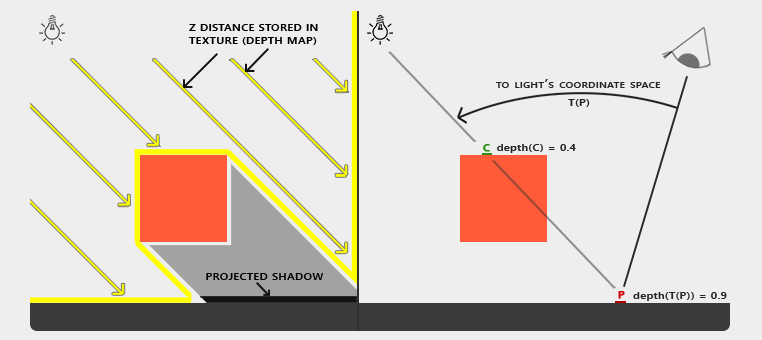
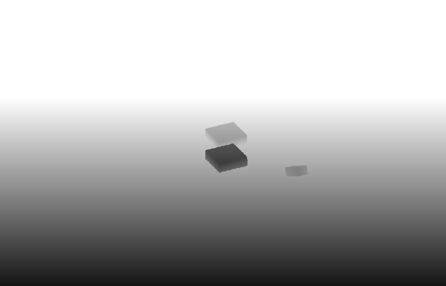

# Shadow Mapping



* 광원으로부터 물체까지의 깊이 값을 텍스처에 저장
* 뷰의 위치를 광원의 위치로 변환하는 행렬을 가지고 점의 깊이 값을 구함
* 구한 점의 깊이 값과 텍스처에 저장된 값을 비교해서 그림자를 판단

# Result



# Shader Codes

## Shadow Vertex Shader

```cpp
#version 330 core
layout (location = 0) in vec3 aPos;

uniform mat4 lightSpaceMatrix;      // light space 변환 행렬
uniform mat4 model;                 // world space 변환 행렬

void main() {
    // 정점을 light space로 변환
    gl_Position = lightSpaceMatrix * model * vec4(aPos, 1.0);
}
```

## Quad Vertex Shader

```cpp
#version 330 core
layout (location = 0) in vec3 aPos;
layout (location = 1) in vec2 aTexCoords;

out vec2 TexCoords;

void main() {
    TexCoords = aTexCoords;
    gl_Position = vec4(aPos, 1.0);
}
```

## Qued Fragment Shader

```cpp
#version 330 core
out vec4 FragColor;

in vec2 TexCoords;

uniform sampler2D depthMap;     // == shadow map
uniform float near_plane;
uniform float far_plane;

// 원근 투영 행렬에 사용
float LinearizeDepth(float depth) {
    float z = depth * 2.0 - 1.0; // Back to NDC 
    return (2.0 * near_plane * far_plane) / (far_plane + near_plane - z * (far_plane - near_plane));	
}

void main() {             
    float depthValue = texture(depthMap, TexCoords).r;
    // FragColor = vec4(vec3(LinearizeDepth(depthValue) / far_plane), 1.0); // perspective
    FragColor = vec4(vec3(depthValue), 1.0); // orthographic
}
```

# Source Codes

```cpp
#include <glad/glad.h>
#include <GLFW/glfw3.h>
#include <stb_image.h>

#include <glm/glm.hpp>
#include <glm/gtc/matrix_transform.hpp>
#include <glm/gtc/type_ptr.hpp>

#include <learnopengl/filesystem.h>
#include <learnopengl/shader.h>
#include <learnopengl/camera.h>
#include <learnopengl/model.h>

#include <iostream>

void framebuffer_size_callback(GLFWwindow* window, int width, int height);
void mouse_callback(GLFWwindow* window, double xpos, double ypos);
void scroll_callback(GLFWwindow* window, double xoffset, double yoffset);
void processInput(GLFWwindow *window);
unsigned int loadTexture(const char *path);
void renderScene(const Shader &shader);
void renderCube();
void renderQuad();

// settings
const unsigned int SCR_WIDTH = 1280;
const unsigned int SCR_HEIGHT = 720;

// camera
Camera camera(glm::vec3(0.0f, 0.0f, 3.0f));
float lastX = (float)SCR_WIDTH / 2.0;
float lastY = (float)SCR_HEIGHT / 2.0;
bool firstMouse = true;

// timing
float deltaTime = 0.0f;
float lastFrame = 0.0f;

// meshes
unsigned int planeVAO;

int main() {
    // glfw: initialize and configure
    // ------------------------------
    glfwInit();
    glfwWindowHint(GLFW_CONTEXT_VERSION_MAJOR, 3);
    glfwWindowHint(GLFW_CONTEXT_VERSION_MINOR, 3);
    glfwWindowHint(GLFW_OPENGL_PROFILE, GLFW_OPENGL_CORE_PROFILE);

#ifdef __APPLE__
    glfwWindowHint(GLFW_OPENGL_FORWARD_COMPAT, GL_TRUE); // uncomment this statement to fix compilation on OS X
#endif

    // glfw window creation
    // --------------------
    GLFWwindow* window = glfwCreateWindow(SCR_WIDTH, SCR_HEIGHT, "LearnOpenGL", NULL, NULL);
    if (window == NULL) {
        std::cout << "Failed to create GLFW window" << std::endl;
        glfwTerminate();
        return -1;
    }
    glfwMakeContextCurrent(window);
    glfwSetFramebufferSizeCallback(window, framebuffer_size_callback);
    glfwSetCursorPosCallback(window, mouse_callback);
    glfwSetScrollCallback(window, scroll_callback);

    // tell GLFW to capture our mouse
    glfwSetInputMode(window, GLFW_CURSOR, GLFW_CURSOR_DISABLED);

    // glad: load all OpenGL function pointers
    // ---------------------------------------
    if (!gladLoadGLLoader((GLADloadproc)glfwGetProcAddress)) {
        std::cout << "Failed to initialize GLAD" << std::endl;
        return -1;
    }

    // configure global opengl state
    // -----------------------------
    glEnable(GL_DEPTH_TEST);

    // build and compile shaders
    // -------------------------
    Shader simpleDepthShader("3.1.1.shadow_mapping_depth.vs", "3.1.1.shadow_mapping_depth.fs");
    Shader debugDepthQuad("3.1.1.debug_quad.vs", "3.1.1.debug_quad_depth.fs");

    // set up vertex data (and buffer(s)) and configure vertex attributes
    // ------------------------------------------------------------------
    float planeVertices[] = {
        // positions            // normals         // texcoords
         25.0f, -0.5f,  25.0f,  0.0f, 1.0f, 0.0f,  25.0f,  0.0f,
        -25.0f, -0.5f,  25.0f,  0.0f, 1.0f, 0.0f,   0.0f,  0.0f,
        -25.0f, -0.5f, -25.0f,  0.0f, 1.0f, 0.0f,   0.0f, 25.0f,

         25.0f, -0.5f,  25.0f,  0.0f, 1.0f, 0.0f,  25.0f,  0.0f,
        -25.0f, -0.5f, -25.0f,  0.0f, 1.0f, 0.0f,   0.0f, 25.0f,
         25.0f, -0.5f, -25.0f,  0.0f, 1.0f, 0.0f,  25.0f, 10.0f
    };
    // plane VAO
    unsigned int planeVBO;
    glGenVertexArrays(1, &planeVAO);
    glGenBuffers(1, &planeVBO);
    glBindVertexArray(planeVAO);
    glBindBuffer(GL_ARRAY_BUFFER, planeVBO);
    glBufferData(GL_ARRAY_BUFFER, sizeof(planeVertices), planeVertices, GL_STATIC_DRAW);
    glEnableVertexAttribArray(0);
    glVertexAttribPointer(0, 3, GL_FLOAT, GL_FALSE, 8 * sizeof(float), (void*)0);
    glEnableVertexAttribArray(1);
    glVertexAttribPointer(1, 3, GL_FLOAT, GL_FALSE, 8 * sizeof(float), (void*)(3 * sizeof(float)));
    glEnableVertexAttribArray(2);
    glVertexAttribPointer(2, 2, GL_FLOAT, GL_FALSE, 8 * sizeof(float), (void*)(6 * sizeof(float)));
    glBindVertexArray(0);

    // load textures
    // -------------
    unsigned int woodTexture = loadTexture(FileSystem::getPath("resources/textures/wood.png").c_str());

    // 광원으로부터의 깊이를 저장하기 위한 depth map 생성 (== shadow map)
    // ----------------------------------------------
    const unsigned int SHADOW_WIDTH = 1024, SHADOW_HEIGHT = 1024;
    unsigned int depthMapFBO;
    // 프레임 버퍼 생성
    glGenFramebuffers(1, &depthMapFBO);
    // depth texture 생성
    unsigned int depthMap;
    glGenTextures(1, &depthMap);
    glBindTexture(GL_TEXTURE_2D, depthMap);
    glTexImage2D(GL_TEXTURE_2D, 0, GL_DEPTH_COMPONENT, SHADOW_WIDTH, SHADOW_HEIGHT, 0, GL_DEPTH_COMPONENT, GL_FLOAT, NULL);
    glTexParameteri(GL_TEXTURE_2D, GL_TEXTURE_MIN_FILTER, GL_NEAREST);
    glTexParameteri(GL_TEXTURE_2D, GL_TEXTURE_MAG_FILTER, GL_NEAREST);
    glTexParameteri(GL_TEXTURE_2D, GL_TEXTURE_WRAP_S, GL_REPEAT);
    glTexParameteri(GL_TEXTURE_2D, GL_TEXTURE_WRAP_T, GL_REPEAT);
    // 프레임버퍼에 depth texture 붙임
    glBindFramebuffer(GL_FRAMEBUFFER, depthMapFBO);
    glFramebufferTexture2D(GL_FRAMEBUFFER, GL_DEPTH_ATTACHMENT, GL_TEXTURE_2D, depthMap, 0);
    glDrawBuffer(GL_NONE);
    glReadBuffer(GL_NONE);
    glBindFramebuffer(GL_FRAMEBUFFER, 0);


    // shader configuration
    // --------------------
    debugDepthQuad.use();
    debugDepthQuad.setInt("depthMap", 0);

    // lighting info
    // -------------
    glm::vec3 lightPos(-2.0f, 4.0f, -1.0f);

    // render loop
    // -----------
    while (!glfwWindowShouldClose(window)) {
        // per-frame time logic
        // --------------------
        float currentFrame = glfwGetTime();
        deltaTime = currentFrame - lastFrame;
        lastFrame = currentFrame;

        // input
        // -----
        processInput(window);

        // render
        // ------
        glClearColor(0.1f, 0.1f, 0.1f, 1.0f);
        glClear(GL_COLOR_BUFFER_BIT | GL_DEPTH_BUFFER_BIT);

        // 1. depth map에 깊이값 저장
        // --------------------------------------------------------------
        glm::mat4 lightProjection, lightView;
        glm::mat4 lightSpaceMatrix;
        float near_plane = 1.0f, far_plane = 7.5f;
        // light projection matrix
        lightProjection = glm::ortho(-10.0f, 10.0f, -10.0f, 10.0f, near_plane, far_plane);
        // light view matrix
        lightView = glm::lookAt(lightPos, glm::vec3(0.0f), glm::vec3(0.0, 1.0, 0.0));
        // light space matrix
        lightSpaceMatrix = lightProjection * lightView;
        // 셰이더에 lightSpaceMatrix 값 전달
        simpleDepthShader.use();
        simpleDepthShader.setMat4("lightSpaceMatrix", lightSpaceMatrix);

        // view 사이즈를 shadow map 사이즈로 변환
        glViewport(0, 0, SHADOW_WIDTH, SHADOW_HEIGHT);

        // depthMapFBO 로 설정 (depthMapFBO에 바인딩된 depth texture에 그려짐)
        glBindFramebuffer(GL_FRAMEBUFFER, depthMapFBO);
        glClear(GL_DEPTH_BUFFER_BIT);
        glActiveTexture(GL_TEXTURE0);
        glBindTexture(GL_TEXTURE_2D, woodTexture);
        // 그리고자 하는 물체들의 광원으로부터의 깊이값 저장
        // 바닥, 상자 3개
        renderScene(simpleDepthShader);

        // 디폴트 FBO 로 변환
        glBindFramebuffer(GL_FRAMEBUFFER, 0);

        // view 사이즈를 스크린 사이즈로 변환
        glViewport(0, 0, SCR_WIDTH, SCR_HEIGHT);
        glClear(GL_COLOR_BUFFER_BIT | GL_DEPTH_BUFFER_BIT);

        // depth map에 저장해놓은 값들 스크린에 출력
        // ---------------------------------------------
        debugDepthQuad.use();
        debugDepthQuad.setFloat("near_plane", near_plane);
        debugDepthQuad.setFloat("far_plane", far_plane);
        glActiveTexture(GL_TEXTURE0);
        glBindTexture(GL_TEXTURE_2D, depthMap);
        renderQuad();

        // glfw: swap buffers and poll IO events (keys pressed/released, mouse moved etc.)
        // -------------------------------------------------------------------------------
        glfwSwapBuffers(window);
        glfwPollEvents();
    }

    // optional: de-allocate all resources once they've outlived their purpose:
    // ------------------------------------------------------------------------
    glDeleteVertexArrays(1, &planeVAO);
    glDeleteBuffers(1, &planeVBO);

    glfwTerminate();
    return 0;
}

// renders the 3D scene
// --------------------
void renderScene(const Shader &shader)
{
    // floor
    glm::mat4 model = glm::mat4(1.0f);
    shader.setMat4("model", model);
    glBindVertexArray(planeVAO);
    glDrawArrays(GL_TRIANGLES, 0, 6);
    // cubes
    model = glm::mat4(1.0f);
    model = glm::translate(model, glm::vec3(0.0f, 1.5f, 0.0));
    model = glm::scale(model, glm::vec3(0.5f));
    shader.setMat4("model", model);
    renderCube();
    model = glm::mat4(1.0f);
    model = glm::translate(model, glm::vec3(2.0f, 0.0f, 1.0));
    model = glm::scale(model, glm::vec3(0.5f));
    shader.setMat4("model", model);
    renderCube();
    model = glm::mat4(1.0f);
    model = glm::translate(model, glm::vec3(-1.0f, 0.0f, 2.0));
    model = glm::rotate(model, glm::radians(60.0f), glm::normalize(glm::vec3(1.0, 0.0, 1.0)));
    model = glm::scale(model, glm::vec3(0.25));
    shader.setMat4("model", model);
    renderCube();
}


// renderCube() renders a 1x1 3D cube in NDC.
// -------------------------------------------------
unsigned int cubeVAO = 0;
unsigned int cubeVBO = 0;
void renderCube()
{
    // initialize (if necessary)
    if (cubeVAO == 0)
    {
        float vertices[] = {
            // back face
            -1.0f, -1.0f, -1.0f,  0.0f,  0.0f, -1.0f, 0.0f, 0.0f, // bottom-left
             1.0f,  1.0f, -1.0f,  0.0f,  0.0f, -1.0f, 1.0f, 1.0f, // top-right
             1.0f, -1.0f, -1.0f,  0.0f,  0.0f, -1.0f, 1.0f, 0.0f, // bottom-right         
             1.0f,  1.0f, -1.0f,  0.0f,  0.0f, -1.0f, 1.0f, 1.0f, // top-right
            -1.0f, -1.0f, -1.0f,  0.0f,  0.0f, -1.0f, 0.0f, 0.0f, // bottom-left
            -1.0f,  1.0f, -1.0f,  0.0f,  0.0f, -1.0f, 0.0f, 1.0f, // top-left
            // front face
            -1.0f, -1.0f,  1.0f,  0.0f,  0.0f,  1.0f, 0.0f, 0.0f, // bottom-left
             1.0f, -1.0f,  1.0f,  0.0f,  0.0f,  1.0f, 1.0f, 0.0f, // bottom-right
             1.0f,  1.0f,  1.0f,  0.0f,  0.0f,  1.0f, 1.0f, 1.0f, // top-right
             1.0f,  1.0f,  1.0f,  0.0f,  0.0f,  1.0f, 1.0f, 1.0f, // top-right
            -1.0f,  1.0f,  1.0f,  0.0f,  0.0f,  1.0f, 0.0f, 1.0f, // top-left
            -1.0f, -1.0f,  1.0f,  0.0f,  0.0f,  1.0f, 0.0f, 0.0f, // bottom-left
            // left face
            -1.0f,  1.0f,  1.0f, -1.0f,  0.0f,  0.0f, 1.0f, 0.0f, // top-right
            -1.0f,  1.0f, -1.0f, -1.0f,  0.0f,  0.0f, 1.0f, 1.0f, // top-left
            -1.0f, -1.0f, -1.0f, -1.0f,  0.0f,  0.0f, 0.0f, 1.0f, // bottom-left
            -1.0f, -1.0f, -1.0f, -1.0f,  0.0f,  0.0f, 0.0f, 1.0f, // bottom-left
            -1.0f, -1.0f,  1.0f, -1.0f,  0.0f,  0.0f, 0.0f, 0.0f, // bottom-right
            -1.0f,  1.0f,  1.0f, -1.0f,  0.0f,  0.0f, 1.0f, 0.0f, // top-right
            // right face
             1.0f,  1.0f,  1.0f,  1.0f,  0.0f,  0.0f, 1.0f, 0.0f, // top-left
             1.0f, -1.0f, -1.0f,  1.0f,  0.0f,  0.0f, 0.0f, 1.0f, // bottom-right
             1.0f,  1.0f, -1.0f,  1.0f,  0.0f,  0.0f, 1.0f, 1.0f, // top-right         
             1.0f, -1.0f, -1.0f,  1.0f,  0.0f,  0.0f, 0.0f, 1.0f, // bottom-right
             1.0f,  1.0f,  1.0f,  1.0f,  0.0f,  0.0f, 1.0f, 0.0f, // top-left
             1.0f, -1.0f,  1.0f,  1.0f,  0.0f,  0.0f, 0.0f, 0.0f, // bottom-left     
            // bottom face
            -1.0f, -1.0f, -1.0f,  0.0f, -1.0f,  0.0f, 0.0f, 1.0f, // top-right
             1.0f, -1.0f, -1.0f,  0.0f, -1.0f,  0.0f, 1.0f, 1.0f, // top-left
             1.0f, -1.0f,  1.0f,  0.0f, -1.0f,  0.0f, 1.0f, 0.0f, // bottom-left
             1.0f, -1.0f,  1.0f,  0.0f, -1.0f,  0.0f, 1.0f, 0.0f, // bottom-left
            -1.0f, -1.0f,  1.0f,  0.0f, -1.0f,  0.0f, 0.0f, 0.0f, // bottom-right
            -1.0f, -1.0f, -1.0f,  0.0f, -1.0f,  0.0f, 0.0f, 1.0f, // top-right
            // top face
            -1.0f,  1.0f, -1.0f,  0.0f,  1.0f,  0.0f, 0.0f, 1.0f, // top-left
             1.0f,  1.0f , 1.0f,  0.0f,  1.0f,  0.0f, 1.0f, 0.0f, // bottom-right
             1.0f,  1.0f, -1.0f,  0.0f,  1.0f,  0.0f, 1.0f, 1.0f, // top-right     
             1.0f,  1.0f,  1.0f,  0.0f,  1.0f,  0.0f, 1.0f, 0.0f, // bottom-right
            -1.0f,  1.0f, -1.0f,  0.0f,  1.0f,  0.0f, 0.0f, 1.0f, // top-left
            -1.0f,  1.0f,  1.0f,  0.0f,  1.0f,  0.0f, 0.0f, 0.0f  // bottom-left        
        };
        glGenVertexArrays(1, &cubeVAO);
        glGenBuffers(1, &cubeVBO);
        // fill buffer
        glBindBuffer(GL_ARRAY_BUFFER, cubeVBO);
        glBufferData(GL_ARRAY_BUFFER, sizeof(vertices), vertices, GL_STATIC_DRAW);
        // link vertex attributes
        glBindVertexArray(cubeVAO);
        glEnableVertexAttribArray(0);
        glVertexAttribPointer(0, 3, GL_FLOAT, GL_FALSE, 8 * sizeof(float), (void*)0);
        glEnableVertexAttribArray(1);
        glVertexAttribPointer(1, 3, GL_FLOAT, GL_FALSE, 8 * sizeof(float), (void*)(3 * sizeof(float)));
        glEnableVertexAttribArray(2);
        glVertexAttribPointer(2, 2, GL_FLOAT, GL_FALSE, 8 * sizeof(float), (void*)(6 * sizeof(float)));
        glBindBuffer(GL_ARRAY_BUFFER, 0);
        glBindVertexArray(0);
    }
    // render Cube
    glBindVertexArray(cubeVAO);
    glDrawArrays(GL_TRIANGLES, 0, 36);
    glBindVertexArray(0);
}

// renderQuad() renders a 1x1 XY quad in NDC
// -----------------------------------------
unsigned int quadVAO = 0;
unsigned int quadVBO;
void renderQuad()
{
    if (quadVAO == 0)
    {
        float quadVertices[] = {
            // positions        // texture Coords
            -1.0f,  1.0f, 0.0f, 0.0f, 1.0f,
            -1.0f, -1.0f, 0.0f, 0.0f, 0.0f,
             1.0f,  1.0f, 0.0f, 1.0f, 1.0f,
             1.0f, -1.0f, 0.0f, 1.0f, 0.0f,
        };
        // setup plane VAO
        glGenVertexArrays(1, &quadVAO);
        glGenBuffers(1, &quadVBO);
        glBindVertexArray(quadVAO);
        glBindBuffer(GL_ARRAY_BUFFER, quadVBO);
        glBufferData(GL_ARRAY_BUFFER, sizeof(quadVertices), &quadVertices, GL_STATIC_DRAW);
        glEnableVertexAttribArray(0);
        glVertexAttribPointer(0, 3, GL_FLOAT, GL_FALSE, 5 * sizeof(float), (void*)0);
        glEnableVertexAttribArray(1);
        glVertexAttribPointer(1, 2, GL_FLOAT, GL_FALSE, 5 * sizeof(float), (void*)(3 * sizeof(float)));
    }
    glBindVertexArray(quadVAO);
    glDrawArrays(GL_TRIANGLE_STRIP, 0, 4);
    glBindVertexArray(0);
}

// process all input: query GLFW whether relevant keys are pressed/released this frame and react accordingly
// ---------------------------------------------------------------------------------------------------------
void processInput(GLFWwindow *window)
{
    if (glfwGetKey(window, GLFW_KEY_ESCAPE) == GLFW_PRESS)
        glfwSetWindowShouldClose(window, true);

    if (glfwGetKey(window, GLFW_KEY_W) == GLFW_PRESS)
        camera.ProcessKeyboard(FORWARD, deltaTime);
    if (glfwGetKey(window, GLFW_KEY_S) == GLFW_PRESS)
        camera.ProcessKeyboard(BACKWARD, deltaTime);
    if (glfwGetKey(window, GLFW_KEY_A) == GLFW_PRESS)
        camera.ProcessKeyboard(LEFT, deltaTime);
    if (glfwGetKey(window, GLFW_KEY_D) == GLFW_PRESS)
        camera.ProcessKeyboard(RIGHT, deltaTime);
}

// glfw: whenever the window size changed (by OS or user resize) this callback function executes
// ---------------------------------------------------------------------------------------------
void framebuffer_size_callback(GLFWwindow* window, int width, int height)
{
    // make sure the viewport matches the new window dimensions; note that width and 
    // height will be significantly larger than specified on retina displays.
    glViewport(0, 0, width, height);
}

// glfw: whenever the mouse moves, this callback is called
// -------------------------------------------------------
void mouse_callback(GLFWwindow* window, double xpos, double ypos)
{
    if (firstMouse)
    {
        lastX = xpos;
        lastY = ypos;
        firstMouse = false;
    }

    float xoffset = xpos - lastX;
    float yoffset = lastY - ypos; // reversed since y-coordinates go from bottom to top

    lastX = xpos;
    lastY = ypos;

    camera.ProcessMouseMovement(xoffset, yoffset);
}

// glfw: whenever the mouse scroll wheel scrolls, this callback is called
// ----------------------------------------------------------------------
void scroll_callback(GLFWwindow* window, double xoffset, double yoffset)
{
    camera.ProcessMouseScroll(yoffset);
}

// utility function for loading a 2D texture from file
// ---------------------------------------------------
unsigned int loadTexture(char const * path)
{
    unsigned int textureID;
    glGenTextures(1, &textureID);

    int width, height, nrComponents;
    unsigned char *data = stbi_load(path, &width, &height, &nrComponents, 0);
    if (data)
    {
        GLenum format;
        if (nrComponents == 1)
            format = GL_RED;
        else if (nrComponents == 3)
            format = GL_RGB;
        else if (nrComponents == 4)
            format = GL_RGBA;

        glBindTexture(GL_TEXTURE_2D, textureID);
        glTexImage2D(GL_TEXTURE_2D, 0, format, width, height, 0, format, GL_UNSIGNED_BYTE, data);
        glGenerateMipmap(GL_TEXTURE_2D);

        glTexParameteri(GL_TEXTURE_2D, GL_TEXTURE_WRAP_S, format == GL_RGBA ? GL_CLAMP_TO_EDGE : GL_REPEAT); // for this tutorial: use GL_CLAMP_TO_EDGE to prevent semi-transparent borders. Due to interpolation it takes texels from next repeat 
        glTexParameteri(GL_TEXTURE_2D, GL_TEXTURE_WRAP_T, format == GL_RGBA ? GL_CLAMP_TO_EDGE : GL_REPEAT);
        glTexParameteri(GL_TEXTURE_2D, GL_TEXTURE_MIN_FILTER, GL_LINEAR_MIPMAP_LINEAR);
        glTexParameteri(GL_TEXTURE_2D, GL_TEXTURE_MAG_FILTER, GL_LINEAR);

        stbi_image_free(data);
    }
    else
    {
        std::cout << "Texture failed to load at path: " << path << std::endl;
        stbi_image_free(data);
    }

    return textureID;
}

```