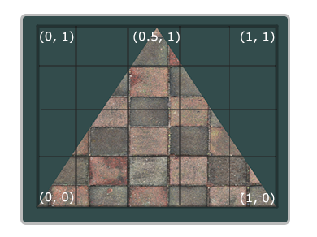
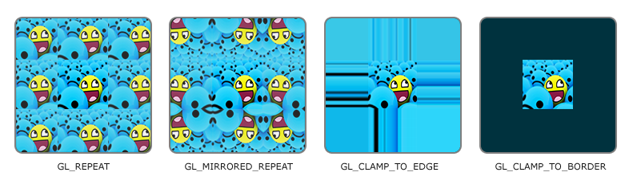
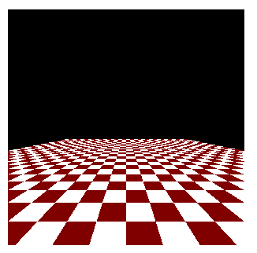
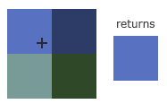
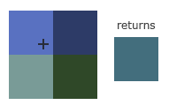
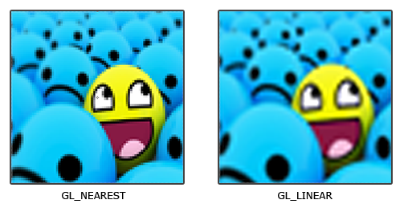
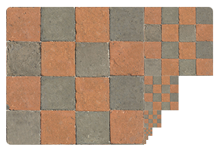
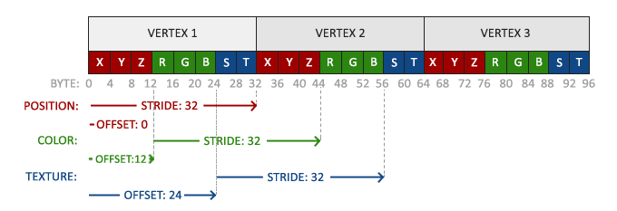
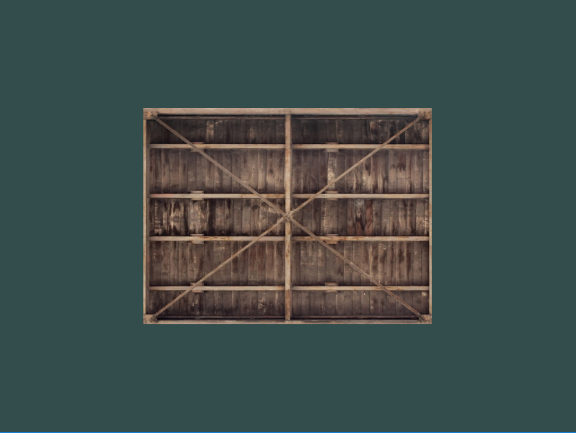

* 샘플링(sampling) : 텍스처 좌표를 사용해 텍스처 컬러를 가져옴
* 텍스처 좌표(texture coordinate) : 샘플링할 텍스처 이미지의 좌표
  * 범위 : 0 ~ 1



```cpp
float texCoords[] = {
    0.0f, 0.0f,  // 좌측 하단 모서리  
    1.0f, 0.0f,  // 우측 하단 모서리
    0.5f, 1.0f   // 꼭대기 모서리
};
```

# Texture Wrapping

* `GL_REPEAT` : 텍스처의 기본 동작, 이미지를 반복
* `GL_MIRRORED_REPEAT` : `GL_REPEAT`과 같지만 반복할때마다 이미지를 반대로 뒤집음
* `GL_CLAMP_TO_EDGE` : 0과 1 사이의 자표를 고정, 가장자리의 패턴이 늘어남
* `GL_CLAMP_TO_BORDER` : 범위 밖의 좌표에 사용자가 지정한 테두리색이 출력



* `glTexPrameter*` 함수를 사용해 옵션을 설정

```cpp
glTexParameteri(GL_TEXTURE_2D, GL_TEXTURE_WRAP_S, GL_MIRRORED_REPEAT);
glTexParameteri(GL_TEXTURE_2D, GL_TEXTURE_WRAP_T, GL_MIRRORED_REPEAT);
```

`void glTexParameteri(GLenum target, GLenum pname, GLint param);`
* `target` : 텍스처 타겟
* `pname` : 설정할 옵션과 어떤 축에 적용할 것인지 지정
* `param` : wrapping 모드

# Texture Filtering

* 텍스처 좌표는 해상도에 의존하지 않으나 물체를 표현할 때 텍스처 좌표를 매핑할 텍스처 픽셀(텍셀)을 찾아야함
* ex) 가까이 있는 물체나 멀리 있는 물체를 같은 텍스처를 사용해 나타낼 때



## Filtering options

* `GL_NEAREST` : 가운데가 텍스처 좌표에 가장 가까운 픽셀을 선택함
  


* 십자가는 정확한 텍스처 좌표를 나타내고, 좌측 상단의 텍셀의 중심이 텍스처 좌표와 가장 가깝기 때문에 샘플링 색상으로 선택

* `GL_LINEAR` : 텍스처 좌표의 이웃한 텍셀에서 보간된 값을 가져옴
  


* 십자가는 정확한 텍스터 좌표를 나타내고, 텍스처 좌표에서 텍셀의 중심까지의 거리가 가까울수록 해당 텍셀의 색상이 샘플링 색상에 더 많이 혼함됨
* 인접한 픽셀들의 컬러가 혼합된 색상이 반환



* 확대, 축소 작업에 대해 필터링을 설정할 수 있음
```cpp
glTexParameteri(GL_TEXTURE_2D, GL_TEXTURE_MIN_FILTER, GL_NEAREST);
glTexParameteri(GL_TEXTURE_2D, GL_TEXTURE_MAG_FILTER, GL_LINEAR);
```

# Mipmaps

* 특정 거리의 임계값을 넘으면 OpenGL은 오브젝트까지의 거리에 가장 적합한 Mipmap 텍스처를 사용함



* `glGenerateMipmap` 함수를 사용해 mipmap 생성 가능
* mipmap 레벨을 전환하기 위해 `NEAREST`,`LINEAR` 필터링을 사용해 레벨 사이를 필터링 할 수 있음
* `GL_NEAREST_MIPMAP_NEAREST` : nearest 보간법으로 mipmap을 필터링하고 텍스처도 nearest 보간법 사용
* `GL_LINEAR_MIPMAP_NEAREST` : nearest 보간법으로 mipmap을 필터링하고 텍스처는 linear 보간법 사용
* `GL_NEAREST_MIPMAP_LINEAR` : linear 보간법으로 mipmap을 필터링하고 텍스처는 nearest 보간법 사용
* `GL_LINEAR_MIPMAP_LINEAR` : linear 보간법으로 mipmap을 필터링하고 텍스처도 linear 보간법 사용

```cpp
glTexParameteri(GL_TEXTURE_2D, GL_TEXTURE_MIN_FILTER, GL_LINEAR_MIPMAP_LINEAR);
glTexParameteri(GL_TEXTURE_2D, GL_TEXTURE_MAG_FILTER, GL_LINEAR);
```

* 확대 필터에는 mipmap 필터링 옵션 사용할 필요 없음, 옵션으로 지정하면 `GL_INVALID_ENUM` 오류 생성

# 텍스처 로드 및 생성

* 이미지를 로딩하기 위해 이미지 로딩 라이브러리를 사용함 : `stb_image.h`
* `stb_image.h` : `Sean Barrett` 의 싱글 헤더 이미지 로드 라이브러리

```cpp
#define STB_IMAGE_IMPLEMENTATION
#include "stb_image.h"

unsigned int texture;
glGenTextures(1, &texture);  

// 바인딩
glBindTexture(GL_TEXTURE_2D, texture);

// 텍스처 wrapping/filtering 옵션 설정(현재 바인딩된 텍스처 객체에 대해)
glTexParameteri(GL_TEXTURE_2D, GL_TEXTURE_WRAP_S, GL_REPEAT);	
glTexParameteri(GL_TEXTURE_2D, GL_TEXTURE_WRAP_T, GL_REPEAT);
glTexParameteri(GL_TEXTURE_2D, GL_TEXTURE_MIN_FILTER, GL_LINEAR);
glTexParameteri(GL_TEXTURE_2D, GL_TEXTURE_MAG_FILTER, GL_LINEAR);

int width, height, nrChannels;
// 이미지 로드
unsigned char *data = stbi_load("container.jpg", &width, &height, &nrChannels, 0);

if (data) {
    // 텍스처 생성
    // GL_TEXTURE_2D로 바인딩된 텍스처 객체에
    // mipmap 레벨은 베이스 레벨로 두고
    // RGB 포맷인 너비가 width, 높이가 height를 가지는 텍스처 생성
    // 원본의 이미지는 RGB 포맷, chars(bytes) 타입
    glTexImage2D(GL_TEXTURE_2D, 0, GL_RGB, width, height, 0, GL_RGB, GL_UNSIGNED_BYTE, data);
    // 밉맵 사용
    glGenerateMipmap(GL_TEXTURE_2D);
} else {
    std::cout << "Failed to load texture" << std::endl;
}

// 이미지의 메모리 반환
stbi_image_free(data);
```

* `stbi_load(char const *filename, int *x, int *y, int *channels_in_file, int desired_channels)`
  * filename : 이미지 파일 경로
  * x : 너비
  * y : 높이
  * channels_in_file : 컬러의 채널 수
  * desired_channels : 원하는 채널 번호 ?

* `void glGenTextures(GLsizei n, GLuint * textures);`
  * n : 생성하려는 텍스처 갯수
  * textures : 텍스처를 저장

* `void glTexImage2D(GLenum target,	GLint level, GLint internalformat, GLsizei width, GLsizei height GLint border, GLenum format, GLenum type, const GLvoid* data);`
  * target : 텍스처 타겟
  * level : mipmap 레벨 수동으로 지정, 베이스 레벨 : 0
  * internalformat : 텍스처 포맷
  * width : 너비
  * height : 높이
  * border : 항상 0으로 지정, 텍스처에 테투리가 있는지 여부
  * format : 이미지의 포맷
  * type : 이미지의 데이터타입
  * data : 이미지 데이터

* 밉맵을 사용하고 싶다면 
  1. 이미지를 직접 지정(glTexImage2D의 2번째 파라미터를 계속 증가 시킴)
  2. 텍스처를 생성한 후 `glGenerateMipmap` 함수 사용 : 현재 바인딩된 텍스처에 대해 필요한 모든 밉맵 자동 생성

# 텍스처 적용

```cpp
float vertices[] = {
     // 위치              // 컬러             // 텍스처 좌표
     0.5f,  0.5f, 0.0f,   1.0f, 0.0f, 0.0f,   1.0f, 1.0f,   // 우측 상단
     0.5f, -0.5f, 0.0f,   0.0f, 1.0f, 0.0f,   1.0f, 0.0f,   // 우측 하단
    -0.5f, -0.5f, 0.0f,   0.0f, 0.0f, 1.0f,   0.0f, 0.0f,   // 좌측 하단
    -0.5f,  0.5f, 0.0f,   1.0f, 1.0f, 0.0f,   0.0f, 1.0f    // 좌측 상단
};
```



```cpp
[vertex shader]
#version 330 core
layout (location = 0) in vec3 aPos;
layout (location = 1) in vec3 aColor;
layout (location = 2) in vec2 aTexCoord;

out vec3 ourColor;
out vec2 TexCoord;

void main() {
    gl_Position = vec4(aPos, 1.0);
    ourColor = aColor;
    TexCoord = aTexCoord;
}

[fragment shader]
#version 330 core
out vec4 FragColor;
  
in vec3 ourColor;
in vec2 TexCoord;

uniform sampler2D ourTexture;

void main() {
    // 출력은 보간된 텍스처 좌표에서 필터링된 텍스처의 컬러
    FragColor = texture(ourTexture, TexCoord);
}


// attribute 셋팅
glVertexAttribPointer(2, 2, GL_FLOAT, GL_FALSE, 8 * sizeof(float), (void*)(6 * sizeof(float)));
glEnableVertexAttribArray(2);

while(!glfwWindowShouldClose(window)) {
    glBindTexture(GL_TEXTURE_2D, texture);
    glBindVertexArray(VAO);
    glDrawElements(GL_TRIANGLES, 6, GL_UNSIGNED_INT, 0);
}

```

* `sampler` : 텍스처 객체에 대한 데이터 타입
  * `sampler2D` : 2D 텍스처
* `glUniform` 함수를 사용하여 값을 할당하지 않아도 왜 sampler2D 변수는 `uniform`인가 ?
  * `glUniform1i` 함수를 사용하여 sampler에 위치값을 할당할 수 있음
  * `texture unit` 이라는 텍스처의 위치가 있음, 기본 텍스처 유닛은 0
  * 그래픽 드라이버가 기본 텍스처 유닛을 할당했음( 모든 그래픽 드라이버가 기본 텍스처 유닛을 할당하지는 않음 -> 렌더링안됨 )

# Source Codes

```cpp
[shader code]
// vertex shader
#version 330 core
layout (location = 0) in vec3 aPos;
layout (location = 1) in vec3 aColor;
layout (location = 2) in vec2 aTexCoord;

out vec3 ourColor;
out vec2 TexCoord;

void main() {
	gl_Position = vec4(aPos, 1.0);
	ourColor = aColor;
	TexCoord = vec2(aTexCoord.x, aTexCoord.y);
}

// fragment shader
#version 330 core
out vec4 FragColor;

in vec3 ourColor;
in vec2 TexCoord;

// texture sampler
uniform sampler2D texture1;

void main() {
	FragColor = texture(texture1, TexCoord);
}
```
```cpp
#include <glad/glad.h>
#include <GLFW/glfw3.h>
#include <stb_image.h>

#include <learnopengl/filesystem.h>
#include <learnopengl/shader_s.h>

#include <iostream>

void framebuffer_size_callback(GLFWwindow* window, int width, int height);
void processInput(GLFWwindow *window);

// settings
const unsigned int SCR_WIDTH = 800;
const unsigned int SCR_HEIGHT = 600;

int main() {
    glfwInit();
    glfwWindowHint(GLFW_CONTEXT_VERSION_MAJOR, 3);
    glfwWindowHint(GLFW_CONTEXT_VERSION_MINOR, 3);
    glfwWindowHint(GLFW_OPENGL_PROFILE, GLFW_OPENGL_CORE_PROFILE);

#ifdef __APPLE__
    glfwWindowHint(GLFW_OPENGL_FORWARD_COMPAT, GL_TRUE); // uncomment this statement to fix compilation on OS X
#endif

    GLFWwindow* window = glfwCreateWindow(SCR_WIDTH, SCR_HEIGHT, "LearnOpenGL", NULL, NULL);
    if (window == NULL) {
        std::cout << "Failed to create GLFW window" << std::endl;
        glfwTerminate();
        return -1;
    }
    glfwMakeContextCurrent(window);
    glfwSetFramebufferSizeCallback(window, framebuffer_size_callback);

    if (!gladLoadGLLoader((GLADloadproc)glfwGetProcAddress)) {
        std::cout << "Failed to initialize GLAD" << std::endl;
        return -1;
    }

    Shader ourShader("4.1.texture.vs", "4.1.texture.fs"); 

    float vertices[] = {
        // positions          // colors           // texture coords
         0.5f,  0.5f, 0.0f,   1.0f, 0.0f, 0.0f,   1.0f, 1.0f, // top right
         0.5f, -0.5f, 0.0f,   0.0f, 1.0f, 0.0f,   1.0f, 0.0f, // bottom right
        -0.5f, -0.5f, 0.0f,   0.0f, 0.0f, 1.0f,   0.0f, 0.0f, // bottom left
        -0.5f,  0.5f, 0.0f,   1.0f, 1.0f, 0.0f,   0.0f, 1.0f  // top left 
    };

    unsigned int indices[] = {  
        0, 1, 3, // first triangle
        1, 2, 3  // second triangle
    };

    unsigned int VBO, VAO, EBO;

    glGenVertexArrays(1, &VAO);
    glGenBuffers(1, &VBO);
    glGenBuffers(1, &EBO);

    glBindVertexArray(VAO);

    glBindBuffer(GL_ARRAY_BUFFER, VBO);
    glBufferData(GL_ARRAY_BUFFER, sizeof(vertices), vertices, GL_STATIC_DRAW);

    glBindBuffer(GL_ELEMENT_ARRAY_BUFFER, EBO);
    glBufferData(GL_ELEMENT_ARRAY_BUFFER, sizeof(indices), indices, GL_STATIC_DRAW);

    // position attribute
    glVertexAttribPointer(0, 3, GL_FLOAT, GL_FALSE, 8 * sizeof(float), (void*)0);
    glEnableVertexAttribArray(0);
    // color attribute
    glVertexAttribPointer(1, 3, GL_FLOAT, GL_FALSE, 8 * sizeof(float), (void*)(3 * sizeof(float)));
    glEnableVertexAttribArray(1);
    
    // texture coord attribute
    // -------------------------
    glVertexAttribPointer(2, 2, GL_FLOAT, GL_FALSE, 8 * sizeof(float), (void*)(6 * sizeof(float)));
    glEnableVertexAttribArray(2);


    // load and create a texture 
    // -------------------------
    unsigned int texture;
    glGenTextures(1, &texture);
    glBindTexture(GL_TEXTURE_2D, texture); 

    // 텍스처 wrapping/filtering 옵션 설정(현재 바인딩된 텍스처 객체에 대해)
    glTexParameteri(GL_TEXTURE_2D, GL_TEXTURE_WRAP_S, GL_REPEAT);	// set texture wrapping to GL_REPEAT (default wrapping method)
    glTexParameteri(GL_TEXTURE_2D, GL_TEXTURE_WRAP_T, GL_REPEAT);
    glTexParameteri(GL_TEXTURE_2D, GL_TEXTURE_MIN_FILTER, GL_LINEAR);
    glTexParameteri(GL_TEXTURE_2D, GL_TEXTURE_MAG_FILTER, GL_LINEAR);

    int width, height, nrChannels;
    
    // 이미지 로드
    unsigned char *data = stbi_load(FileSystem::getPath("resources/textures/container.jpg").c_str(), &width, &height, &nrChannels, 0);
    if (data) {
        glTexImage2D(GL_TEXTURE_2D, 0, GL_RGB, width, height, 0, GL_RGB, GL_UNSIGNED_BYTE, data);
        glGenerateMipmap(GL_TEXTURE_2D);
    } else {
        std::cout << "Failed to load texture" << std::endl;
    }
    stbi_image_free(data);


    // render loop
    // -----------
    while (!glfwWindowShouldClose(window)) {
        processInput(window);

        glClearColor(0.2f, 0.3f, 0.3f, 1.0f);
        glClear(GL_COLOR_BUFFER_BIT);

        // bind Texture
        glBindTexture(GL_TEXTURE_2D, texture);

        // render container
        ourShader.use();
        glBindVertexArray(VAO);
        glDrawElements(GL_TRIANGLES, 6, GL_UNSIGNED_INT, 0);

        glfwSwapBuffers(window);
        glfwPollEvents();
    }

    glDeleteVertexArrays(1, &VAO);
    glDeleteBuffers(1, &VBO);
    glDeleteBuffers(1, &EBO);

    glfwTerminate();
    return 0;
}

void processInput(GLFWwindow *window) {
    if (glfwGetKey(window, GLFW_KEY_ESCAPE) == GLFW_PRESS)
        glfwSetWindowShouldClose(window, true);
}

void framebuffer_size_callback(GLFWwindow* window, int width, int height) {
    // make sure the viewport matches the new window dimensions; note that width and 
    // height will be significantly larger than specified on retina displays.
    glViewport(0, 0, width, height);
}
```

# result

