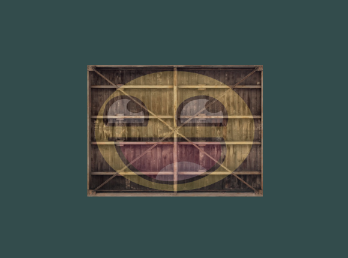

# Result



# Texture unit

* 텍스처의 위치
* `glUniform` 함수를 사용해 텍스처 sampler에 위치 값을 할당하여 텍스처 설정 가능
* 목적 : shader에서 하나 이상의 텍스처를 사용할 수 있도록 함

```cpp
glActiveTexture(GL_TEXTURE0); // 텍스처를 바인딩하기 전에 먼저 텍스처 유닛을 활성화
glBindTexture(GL_TEXTURE_2D, texture);  // 해당 텍스처를 현재 활성화된 텍스처 유닛에 바인딩함
```

* `GL_TEXTURE0` 텍스처 유닛은 항상 기본으로 활성화됨
* OpenGL은 최소 16개의 텍스처 유닛을 가지고 있음 : GL_TEXTURE0 ~ GL_TEXTURE15
* 순서대로 선언되어 있음 : GL_TEXTURE8 = GL_TEXTURE0 + 8

# Shader Codes

## Vertex Shader

```cpp
#version 330 core
layout (location = 0) in vec3 aPos;
layout (location = 1) in vec2 aTexCoord;

out vec2 TexCoord;

void main() {
	gl_Position = vec4(aPos, 1.0);
	TexCoord = vec2(aTexCoord.x, aTexCoord.y);
}
```

## Fragment Shader

```cpp
#version 330 core
out vec4 FragColor;

in vec2 TexCoord;

// texture samplers
uniform sampler2D texture1;
uniform sampler2D texture2;

void main() {
	// linearly interpolate between both textures (80% container, 20% awesomeface)
	FragColor = mix(texture(texture1, TexCoord), texture(texture2, TexCoord), 0.2);
}
```

# Source Codes

```cpp
#include <glad/glad.h>
#include <GLFW/glfw3.h>
#include <stb_image.h>

#include <learnopengl/filesystem.h>
#include <learnopengl/shader_s.h>

#include <iostream>

void framebuffer_size_callback(GLFWwindow* window, int width, int height);
void processInput(GLFWwindow *window);

// settings
const unsigned int SCR_WIDTH = 800;
const unsigned int SCR_HEIGHT = 600;

int main() {
    // glfw: initialize and configure
    // ------------------------------
    glfwInit();
    glfwWindowHint(GLFW_CONTEXT_VERSION_MAJOR, 3);
    glfwWindowHint(GLFW_CONTEXT_VERSION_MINOR, 3);
    glfwWindowHint(GLFW_OPENGL_PROFILE, GLFW_OPENGL_CORE_PROFILE);

#ifdef __APPLE__
    glfwWindowHint(GLFW_OPENGL_FORWARD_COMPAT, GL_TRUE); // uncomment this statement to fix compilation on OS X
#endif

    // glfw window creation
    // --------------------
    GLFWwindow* window = glfwCreateWindow(SCR_WIDTH, SCR_HEIGHT, "LearnOpenGL", NULL, NULL);
    if (window == NULL) {
        std::cout << "Failed to create GLFW window" << std::endl;
        glfwTerminate();
        return -1;
    }
    glfwMakeContextCurrent(window);
    glfwSetFramebufferSizeCallback(window, framebuffer_size_callback);

    // glad: load all OpenGL function pointers
    // ---------------------------------------
    if (!gladLoadGLLoader((GLADloadproc)glfwGetProcAddress)) {
        std::cout << "Failed to initialize GLAD" << std::endl;
        return -1;
    }

    // build and compile our shader zprogram
    // ------------------------------------
    Shader ourShader("4.2.texture.vs", "4.2.texture.fs");

    // set up vertex data (and buffer(s)) and configure vertex attributes
    // ------------------------------------------------------------------
    float vertices[] = {
        // positions             // texture coords
         0.5f,  0.5f, 0.0f,      1.0f, 1.0f, // top right
         0.5f, -0.5f, 0.0f,      1.0f, 0.0f, // bottom right
        -0.5f, -0.5f, 0.0f,      0.0f, 0.0f, // bottom left
        -0.5f,  0.5f, 0.0f,      0.0f, 1.0f  // top left 
    };
    unsigned int indices[] = {
        0, 1, 3, // first triangle
        1, 2, 3  // second triangle
    };
    unsigned int VBO, VAO, EBO;
    glGenVertexArrays(1, &VAO);
    glGenBuffers(1, &VBO);
    glGenBuffers(1, &EBO);

    glBindVertexArray(VAO);

    glBindBuffer(GL_ARRAY_BUFFER, VBO);
    glBufferData(GL_ARRAY_BUFFER, sizeof(vertices), vertices, GL_STATIC_DRAW);

    glBindBuffer(GL_ELEMENT_ARRAY_BUFFER, EBO);
    glBufferData(GL_ELEMENT_ARRAY_BUFFER, sizeof(indices), indices, GL_STATIC_DRAW);

    // position attribute
    glVertexAttribPointer(0, 3, GL_FLOAT, GL_FALSE, 5 * sizeof(float), (void*)0);
    glEnableVertexAttribArray(0);
    // texture coord attribute
    glVertexAttribPointer(1, 2, GL_FLOAT, GL_FALSE, 5 * sizeof(float), (void*)(3 * sizeof(float)));
    glEnableVertexAttribArray(1);


    // 텍스처 로드 및 생성
    // --------------------------------------------------
    unsigned int texture1, texture2;
    // texture 1
    // --------------------------------------------------
    glGenTextures(1, &texture1);
    glBindTexture(GL_TEXTURE_2D, texture1); 

     // 텍스처 wrapping 설정
    glTexParameteri(GL_TEXTURE_2D, GL_TEXTURE_WRAP_S, GL_REPEAT);	
    glTexParameteri(GL_TEXTURE_2D, GL_TEXTURE_WRAP_T, GL_REPEAT);

    // 텍스처 filtering 설정
    glTexParameteri(GL_TEXTURE_2D, GL_TEXTURE_MIN_FILTER, GL_LINEAR);
    glTexParameteri(GL_TEXTURE_2D, GL_TEXTURE_MAG_FILTER, GL_LINEAR);

    int width, height, nrChannels;
    // 대부분의 이미지는 0.0 좌표가 y축의 맨 위를 가리키지만
    // OpenGL은 y축의 0.0 좌표를 이미지의 아래쪽으로 인식하기 때문에
    // 텍스처가 거꾸로 뒤집힘
    // stbi_set_flip_vertically_on_load 함수를 사용해 이미지를 뒤집을 수 있음
    stbi_set_flip_vertically_on_load(true); 

    unsigned char *data = stbi_load(FileSystem::getPath("resources/textures/container.jpg").c_str(), &width, &height, &nrChannels, 0);
    if (data) {
        glTexImage2D(GL_TEXTURE_2D, 0, GL_RGB, width, height, 0, GL_RGB, GL_UNSIGNED_BYTE, data);
        glGenerateMipmap(GL_TEXTURE_2D);
    } else {
        std::cout << "Failed to load texture" << std::endl;
    }
    stbi_image_free(data);

    // texture 2
    // ---------
    glGenTextures(1, &texture2);
    glBindTexture(GL_TEXTURE_2D, texture2);
    
    // 텍스처 wrapping 설정
    glTexParameteri(GL_TEXTURE_2D, GL_TEXTURE_WRAP_S, GL_REPEAT);	// set texture wrapping to GL_REPEAT (default wrapping method)
    glTexParameteri(GL_TEXTURE_2D, GL_TEXTURE_WRAP_T, GL_REPEAT);
    
    // 텍스처 filtering 설정
    glTexParameteri(GL_TEXTURE_2D, GL_TEXTURE_MIN_FILTER, GL_LINEAR);
    glTexParameteri(GL_TEXTURE_2D, GL_TEXTURE_MAG_FILTER, GL_LINEAR);

    data = stbi_load(FileSystem::getPath("resources/textures/awesomeface.png").c_str(), &width, &height, &nrChannels, 0);
    if (data) {
        // alpha 채널을 가지고 있는 이미지이므로 GL_RGBA를 사용
        glTexImage2D(GL_TEXTURE_2D, 0, GL_RGBA, width, height, 0, GL_RGBA, GL_UNSIGNED_BYTE, data);
        glGenerateMipmap(GL_TEXTURE_2D);
    } else {
        std::cout << "Failed to load texture" << std::endl;
    }
    stbi_image_free(data);

    
    // OpenGL에게 각 shader sampler가 속한 텍스처 유닛이 어떤것인지 알려주기 위해 sampler 설정
    // 한번만 설정하면 됨
    // -------------------------------------------------------------------------------------------
    ourShader.use(); // uniform 변수 셋팅전엔 셰이더를 활성화시켜야함

    glUniform1i(glGetUniformLocation(ourShader.ID, "texture1"), 0);
    glUniform1i(glGetUniformLocation(ourShader.ID, "texture2"), 1);

    while (!glfwWindowShouldClose(window)) {
        // input
        // -----
        processInput(window);

        // render
        // ------
        glClearColor(0.2f, 0.3f, 0.3f, 1.0f);
        glClear(GL_COLOR_BUFFER_BIT);

        // 텍스처를 텍스처 유닛에 바인딩함
        glActiveTexture(GL_TEXTURE0);
        glBindTexture(GL_TEXTURE_2D, texture1);
        glActiveTexture(GL_TEXTURE1);
        glBindTexture(GL_TEXTURE_2D, texture2);

        ourShader.use();
        glBindVertexArray(VAO);
        glDrawElements(GL_TRIANGLES, 6, GL_UNSIGNED_INT, 0);

        glfwSwapBuffers(window);
        glfwPollEvents();
    }

    glDeleteVertexArrays(1, &VAO);
    glDeleteBuffers(1, &VBO);
    glDeleteBuffers(1, &EBO);

    glfwTerminate();
    return 0;
}

void processInput(GLFWwindow *window) {
    if (glfwGetKey(window, GLFW_KEY_ESCAPE) == GLFW_PRESS)
        glfwSetWindowShouldClose(window, true);
}

void framebuffer_size_callback(GLFWwindow* window, int width, int height) {
    // make sure the viewport matches the new window dimensions; note that width and 
    // height will be significantly larger than specified on retina displays.
    glViewport(0, 0, width, height);
}
```