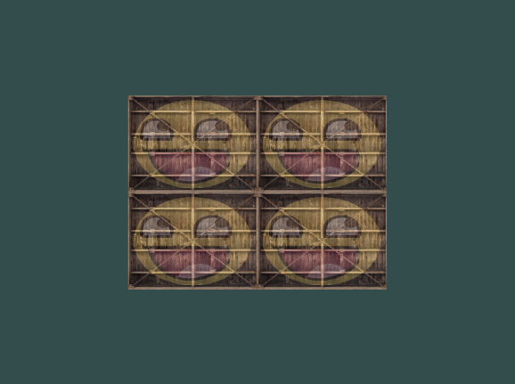
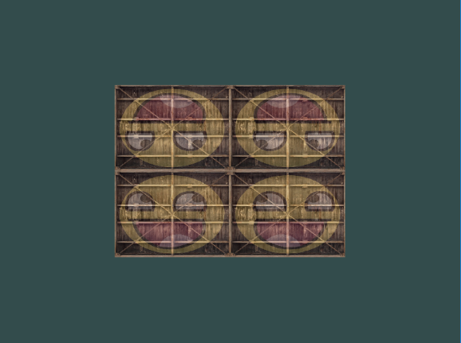
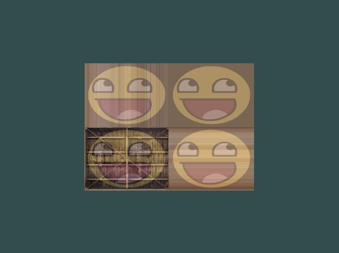
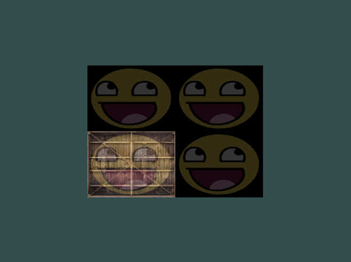

# Abstracts

* 텍스처 wrapping을 적용해보자

# Results

* GL_REPEAT

```cpp
    glTexParameteri(GL_TEXTURE_2D, GL_TEXTURE_WRAP_S, GL_REPEAT);
    glTexParameteri(GL_TEXTURE_2D, GL_TEXTURE_WRAP_T, GL_REPEAT);
```



* GL_MIRRORED_REPEAT

```cpp
    glTexParameteri(GL_TEXTURE_2D, GL_TEXTURE_WRAP_S, GL_MIRRORED_REPEAT);
    glTexParameteri(GL_TEXTURE_2D, GL_TEXTURE_WRAP_T, GL_MIRRORED_REPEAT);
```



* GL_CLAMP_TO_EDGE

```cpp
    glTexParameteri(GL_TEXTURE_2D, GL_TEXTURE_WRAP_S, GL_CLAMP_TO_EDGE);
    glTexParameteri(GL_TEXTURE_2D, GL_TEXTURE_WRAP_T, GL_CLAMP_TO_EDGE);
```



* GL_CLAMP_TO_BORDER

```cpp
    glTexParameteri(GL_TEXTURE_2D, GL_TEXTURE_WRAP_S, GL_CLAMP_TO_BORDER);
    glTexParameteri(GL_TEXTURE_2D, GL_TEXTURE_WRAP_T, GL_CLAMP_TO_BORDER);
```




# Source Codes

```cpp
#include <glad/glad.h>
#include <GLFW/glfw3.h>
#include <stb_image.h>

#include <learnopengl/filesystem.h>
#include <learnopengl/shader_s.h>

#include <iostream>

void framebuffer_size_callback(GLFWwindow* window, int width, int height);
void processInput(GLFWwindow *window);

// settings
const unsigned int SCR_WIDTH = 800;
const unsigned int SCR_HEIGHT = 600;

int main() {
    // glfw: initialize and configure
    // ------------------------------
    glfwInit();
    glfwWindowHint(GLFW_CONTEXT_VERSION_MAJOR, 3);
    glfwWindowHint(GLFW_CONTEXT_VERSION_MINOR, 3);
    glfwWindowHint(GLFW_OPENGL_PROFILE, GLFW_OPENGL_CORE_PROFILE);

#ifdef __APPLE__
    glfwWindowHint(GLFW_OPENGL_FORWARD_COMPAT, GL_TRUE); // uncomment this statement to fix compilation on OS X
#endif

    // glfw window creation
    // --------------------
    GLFWwindow* window = glfwCreateWindow(SCR_WIDTH, SCR_HEIGHT, "LearnOpenGL", NULL, NULL);
    if (window == NULL) {
        std::cout << "Failed to create GLFW window" << std::endl;
        glfwTerminate();
        return -1;
    }
    glfwMakeContextCurrent(window);
    glfwSetFramebufferSizeCallback(window, framebuffer_size_callback);

    // glad: load all OpenGL function pointers
    // ---------------------------------------
    if (!gladLoadGLLoader((GLADloadproc)glfwGetProcAddress)) {
        std::cout << "Failed to initialize GLAD" << std::endl;
        return -1;
    }

    // build and compile our shader zprogram
    // ------------------------------------
    Shader ourShader("4.3.texture.vs", "4.3.texture.fs");

    // set up vertex data (and buffer(s)) and configure vertex attributes
    // ------------------------------------------------------------------
    float vertices[] = {
        // positions             // texture coords (note that we changed them to 2.0f!)
         0.5f,  0.5f, 0.0f,      2.0f, 2.0f, // top right
         0.5f, -0.5f, 0.0f,      2.0f, 0.0f, // bottom right
        -0.5f, -0.5f, 0.0f,      0.0f, 0.0f, // bottom left
        -0.5f,  0.5f, 0.0f,      0.0f, 2.0f  // top left 
    };
    unsigned int indices[] = {
        0, 1, 3, // first triangle
        1, 2, 3  // second triangle
    };

    unsigned int VBO, VAO, EBO;
    glGenVertexArrays(1, &VAO);
    glGenBuffers(1, &VBO);
    glGenBuffers(1, &EBO);

    glBindVertexArray(VAO);

    glBindBuffer(GL_ARRAY_BUFFER, VBO);
    glBufferData(GL_ARRAY_BUFFER, sizeof(vertices), vertices, GL_STATIC_DRAW);

    glBindBuffer(GL_ELEMENT_ARRAY_BUFFER, EBO);
    glBufferData(GL_ELEMENT_ARRAY_BUFFER, sizeof(indices), indices, GL_STATIC_DRAW);

    // position attribute
    glVertexAttribPointer(0, 3, GL_FLOAT, GL_FALSE, 5 * sizeof(float), (void*)0);
    glEnableVertexAttribArray(0);
    // texture coord attribute
    glVertexAttribPointer(1, 2, GL_FLOAT, GL_FALSE, 5 * sizeof(float), (void*)(3 * sizeof(float)));
    glEnableVertexAttribArray(1);


    // load and create a texture 
    // -------------------------
    unsigned int texture1, texture2;
    // texture 1
    // ---------
    glGenTextures(1, &texture1);
    glBindTexture(GL_TEXTURE_2D, texture1);
    // set the texture wrapping parameters
    glTexParameteri(GL_TEXTURE_2D, GL_TEXTURE_WRAP_S, GL_CLAMP_TO_BORDER); // note that we set the container wrapping method to GL_CLAMP_TO_EDGE
    glTexParameteri(GL_TEXTURE_2D, GL_TEXTURE_WRAP_T, GL_CLAMP_TO_BORDER);
    // set texture filtering parameters
    glTexParameteri(GL_TEXTURE_2D, GL_TEXTURE_MIN_FILTER, GL_NEAREST);
    glTexParameteri(GL_TEXTURE_2D, GL_TEXTURE_MAG_FILTER, GL_NEAREST);
    // load image, create texture and generate mipmaps
    int width, height, nrChannels;
    stbi_set_flip_vertically_on_load(true); // tell stb_image.h to flip loaded texture's on the y-axis.
    // The FileSystem::getPath(...) is part of the GitHub repository so we can find files on any IDE/platform; replace it with your own image path.
    unsigned char *data = stbi_load(FileSystem::getPath("resources/textures/container.jpg").c_str(), &width, &height, &nrChannels, 0);
    if (data) {
        glTexImage2D(GL_TEXTURE_2D, 0, GL_RGB, width, height, 0, GL_RGB, GL_UNSIGNED_BYTE, data);
        glGenerateMipmap(GL_TEXTURE_2D);
    } else {
        std::cout << "Failed to load texture" << std::endl;
    }
    stbi_image_free(data);
    // texture 2
    // ---------
    glGenTextures(1, &texture2);
    glBindTexture(GL_TEXTURE_2D, texture2);
    // set the texture wrapping parameters
    glTexParameteri(GL_TEXTURE_2D, GL_TEXTURE_WRAP_S, GL_CLAMP_TO_BORDER);	// we want to repeat the awesomeface pattern so we kept it at GL_REPEAT
    glTexParameteri(GL_TEXTURE_2D, GL_TEXTURE_WRAP_T, GL_CLAMP_TO_BORDER);
    // set texture filtering parameters
    glTexParameteri(GL_TEXTURE_2D, GL_TEXTURE_MIN_FILTER, GL_LINEAR);
    glTexParameteri(GL_TEXTURE_2D, GL_TEXTURE_MAG_FILTER, GL_LINEAR);
    // load image, create texture and generate mipmaps
    data = stbi_load(FileSystem::getPath("resources/textures/awesomeface.png").c_str(), &width, &height, &nrChannels, 0);
    if (data) {
        // note that the awesomeface.png has transparency and thus an alpha channel, so make sure to tell OpenGL the data type is of GL_RGBA
        glTexImage2D(GL_TEXTURE_2D, 0, GL_RGB, width, height, 0, GL_RGBA, GL_UNSIGNED_BYTE, data);
        glGenerateMipmap(GL_TEXTURE_2D);
    } else {
        std::cout << "Failed to load texture" << std::endl;
    }
    stbi_image_free(data);

    // tell opengl for each sampler to which texture unit it belongs to (only has to be done once)
    // -------------------------------------------------------------------------------------------
    ourShader.use(); // don't forget to activate/use the shader before setting uniforms!
    // either set it manually like so:
    glUniform1i(glGetUniformLocation(ourShader.ID, "texture1"), 0);
    // or set it via the texture class
    ourShader.setInt("texture2", 1);


    // render loop
    // -----------
    while (!glfwWindowShouldClose(window)) {
        // input
        // -----
        processInput(window);

        // render
        // ------
        glClearColor(0.2f, 0.3f, 0.3f, 1.0f);
        glClear(GL_COLOR_BUFFER_BIT);

        // bind textures on corresponding texture units
        glActiveTexture(GL_TEXTURE0);
        glBindTexture(GL_TEXTURE_2D, texture1);
        glActiveTexture(GL_TEXTURE1);
        glBindTexture(GL_TEXTURE_2D, texture2);

        // render container
        ourShader.use();
        glBindVertexArray(VAO);
        glDrawElements(GL_TRIANGLES, 6, GL_UNSIGNED_INT, 0);

        // glfw: swap buffers and poll IO events (keys pressed/released, mouse moved etc.)
        // -------------------------------------------------------------------------------
        glfwSwapBuffers(window);
        glfwPollEvents();
    }

    // optional: de-allocate all resources once they've outlived their purpose:
    // ------------------------------------------------------------------------
    glDeleteVertexArrays(1, &VAO);
    glDeleteBuffers(1, &VBO);
    glDeleteBuffers(1, &EBO);

    // glfw: terminate, clearing all previously allocated GLFW resources.
    // ------------------------------------------------------------------
    glfwTerminate();
    return 0;
}

// process all input: query GLFW whether relevant keys are pressed/released this frame and react accordingly
// ---------------------------------------------------------------------------------------------------------
void processInput(GLFWwindow *window)
{
    if (glfwGetKey(window, GLFW_KEY_ESCAPE) == GLFW_PRESS)
        glfwSetWindowShouldClose(window, true);
}

// glfw: whenever the window size changed (by OS or user resize) this callback function executes
// ---------------------------------------------------------------------------------------------
void framebuffer_size_callback(GLFWwindow* window, int width, int height)
{
    // make sure the viewport matches the new window dimensions; note that width and 
    // height will be significantly larger than specified on retina displays.
    glViewport(0, 0, width, height);
}
```