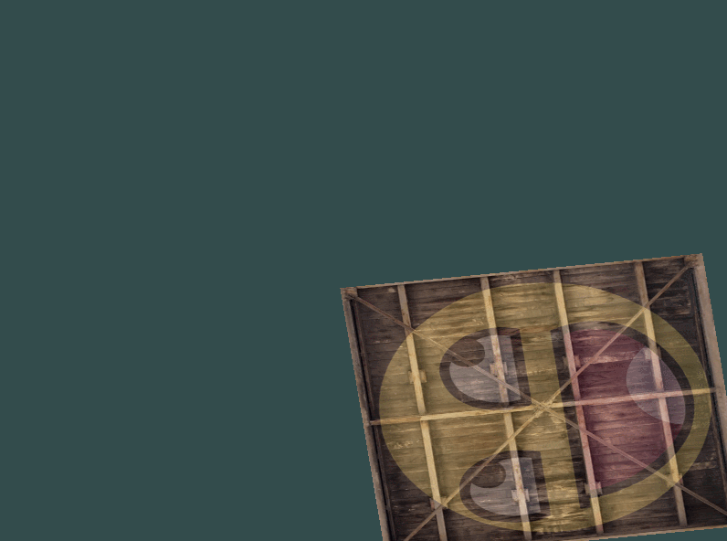

# Abstracts

* 이동과 회전

# Result



# GLM

* OpenGL Mathematics
* OpenGL과 호환되는 수학 라이브러리
* 헤더파일만 있는 라이브러리

# 행렬 조합

* 행렬 곱은 오른쪽에서 왼쪽으로 계산
* 연산의 경우 스케일, 회전, 이동 연산 순서로 하는 것을 권장
    * 이동 연산을 한 후 스케일 연산을 하면 이동 벡터 또한 스케일되어짐

# Shader Codes

## Vertex Shader

```cpp
#version 330 core
layout (location = 0) in vec3 aPos;
layout (location = 1) in vec2 aTexCoord;

out vec2 TexCoord;

uniform mat4 transform;     // 변환 행렬 값을 받을 변수

void main() {
	gl_Position = transform * vec4(aPos, 1.0);
	TexCoord = vec2(aTexCoord.x, aTexCoord.y);
}
```

# Source Codes

```cpp
#include <glad/glad.h>
#include <GLFW/glfw3.h>
#include <stb_image.h>

// GLM의 대부분의 기능은 아래 3개의 헤더파일에서 찾을 수 있음
// --------------------------------------------------------
#include <glm/glm.hpp>
#include <glm/gtc/matrix_transform.hpp>
#include <glm/gtc/type_ptr.hpp>

#include <learnopengl/filesystem.h>
#include <learnopengl/shader_s.h>

#include <iostream>

void framebuffer_size_callback(GLFWwindow* window, int width, int height);
void processInput(GLFWwindow *window);

// settings
const unsigned int SCR_WIDTH = 800;
const unsigned int SCR_HEIGHT = 600;

int main() {
    glfwInit();
    glfwWindowHint(GLFW_CONTEXT_VERSION_MAJOR, 3);
    glfwWindowHint(GLFW_CONTEXT_VERSION_MINOR, 3);
    glfwWindowHint(GLFW_OPENGL_PROFILE, GLFW_OPENGL_CORE_PROFILE);

#ifdef __APPLE__
    glfwWindowHint(GLFW_OPENGL_FORWARD_COMPAT, GL_TRUE); // uncomment this statement to fix compilation on OS X
#endif

    GLFWwindow* window = glfwCreateWindow(SCR_WIDTH, SCR_HEIGHT, "LearnOpenGL", NULL, NULL);
    if (window == NULL) {
        std::cout << "Failed to create GLFW window" << std::endl;
        glfwTerminate();
        return -1;
    }
    glfwMakeContextCurrent(window);
    glfwSetFramebufferSizeCallback(window, framebuffer_size_callback);

    if (!gladLoadGLLoader((GLADloadproc)glfwGetProcAddress)) {
        std::cout << "Failed to initialize GLAD" << std::endl;
        return -1;
    }

    Shader ourShader("5.1.transform.vs", "5.1.transform.fs");

    float vertices[] = {
        // positions          // texture coords
         0.5f,  0.5f, 0.0f,   1.0f, 1.0f, // top right
         0.5f, -0.5f, 0.0f,   1.0f, 0.0f, // bottom right
        -0.5f, -0.5f, 0.0f,   0.0f, 0.0f, // bottom left
        -0.5f,  0.5f, 0.0f,   0.0f, 1.0f  // top left 
    };
    unsigned int indices[] = {
        0, 1, 3, // first triangle
        1, 2, 3  // second triangle
    };
    unsigned int VBO, VAO, EBO;
    glGenVertexArrays(1, &VAO);
    glGenBuffers(1, &VBO);
    glGenBuffers(1, &EBO);

    glBindVertexArray(VAO);

    glBindBuffer(GL_ARRAY_BUFFER, VBO);
    glBufferData(GL_ARRAY_BUFFER, sizeof(vertices), vertices, GL_STATIC_DRAW);

    glBindBuffer(GL_ELEMENT_ARRAY_BUFFER, EBO);
    glBufferData(GL_ELEMENT_ARRAY_BUFFER, sizeof(indices), indices, GL_STATIC_DRAW);

    // position attribute
    glVertexAttribPointer(0, 3, GL_FLOAT, GL_FALSE, 5 * sizeof(float), (void*)0);
    glEnableVertexAttribArray(0);
    // texture coord attribute
    glVertexAttribPointer(1, 2, GL_FLOAT, GL_FALSE, 5 * sizeof(float), (void*)(3 * sizeof(float)));
    glEnableVertexAttribArray(1);


    // load and create a texture 
    // -------------------------
    unsigned int texture1, texture2;
    // texture 1
    // ---------
    glGenTextures(1, &texture1);
    glBindTexture(GL_TEXTURE_2D, texture1);
    // set the texture wrapping parameters
    glTexParameteri(GL_TEXTURE_2D, GL_TEXTURE_WRAP_S, GL_REPEAT);	
    glTexParameteri(GL_TEXTURE_2D, GL_TEXTURE_WRAP_T, GL_REPEAT);
    // set texture filtering parameters
    glTexParameteri(GL_TEXTURE_2D, GL_TEXTURE_MIN_FILTER, GL_LINEAR);
    glTexParameteri(GL_TEXTURE_2D, GL_TEXTURE_MAG_FILTER, GL_LINEAR);
    // load image, create texture and generate mipmaps
    int width, height, nrChannels;
    stbi_set_flip_vertically_on_load(true); // tell stb_image.h to flip loaded texture's on the y-axis.
    unsigned char *data = stbi_load(FileSystem::getPath("resources/textures/container.jpg").c_str(), &width, &height, &nrChannels, 0);
    if (data) {
        glTexImage2D(GL_TEXTURE_2D, 0, GL_RGB, width, height, 0, GL_RGB, GL_UNSIGNED_BYTE, data);
        glGenerateMipmap(GL_TEXTURE_2D);
    } else {
        std::cout << "Failed to load texture" << std::endl;
    }
    stbi_image_free(data);
    // texture 2
    // ---------
    glGenTextures(1, &texture2);
    glBindTexture(GL_TEXTURE_2D, texture2);
    // set the texture wrapping parameters
    glTexParameteri(GL_TEXTURE_2D, GL_TEXTURE_WRAP_S, GL_REPEAT);	
    glTexParameteri(GL_TEXTURE_2D, GL_TEXTURE_WRAP_T, GL_REPEAT);
    // set texture filtering parameters
    glTexParameteri(GL_TEXTURE_2D, GL_TEXTURE_MIN_FILTER, GL_LINEAR);
    glTexParameteri(GL_TEXTURE_2D, GL_TEXTURE_MAG_FILTER, GL_LINEAR);
    // load image, create texture and generate mipmaps
    data = stbi_load(FileSystem::getPath("resources/textures/awesomeface.png").c_str(), &width, &height, &nrChannels, 0);
    if (data) {
        // note that the awesomeface.png has transparency and thus an alpha channel, so make sure to tell OpenGL the data type is of GL_RGBA
        glTexImage2D(GL_TEXTURE_2D, 0, GL_RGB, width, height, 0, GL_RGBA, GL_UNSIGNED_BYTE, data);
        glGenerateMipmap(GL_TEXTURE_2D);
    } else {
        std::cout << "Failed to load texture" << std::endl;
    }
    stbi_image_free(data);

    ourShader.use(); 
    ourShader.setInt("texture1", 0);
    ourShader.setInt("texture2", 1);


    // render loop
    // -----------
    while (!glfwWindowShouldClose(window)) {
        // input
        // -----
        processInput(window);

        glClearColor(0.2f, 0.3f, 0.3f, 1.0f);
        glClear(GL_COLOR_BUFFER_BIT);

        glActiveTexture(GL_TEXTURE0);
        glBindTexture(GL_TEXTURE_2D, texture1);
        glActiveTexture(GL_TEXTURE1);
        glBindTexture(GL_TEXTURE_2D, texture2);

        // 변환 적용 ( 루프가 돌때마다 새로운 값으로 재생성된 변환 행렬 사용 )
        // 원점을 중심으로 회전시키고 우측 하단으로 이동
        // --------------------------------------------------------------------
        // GLM 0.9.9 버전부터는 기본행렬이 단위 행렬이 아닌 0으로 초기화된 행렬이므로 단위 행렬로 초기화
        glm::mat4 transform = glm::mat4(1.0f);
        // 코드와는 다르게 실제 변환은 회전을 적용시키고 그 후에 이동을 적용시킴
        transform = glm::translate(transform, glm::vec3(0.5f, -0.5f, 0.0f));
        // rotate(행렬, 각(라디안), 축(단위벡터))
        transform = glm::rotate(transform, (float)glfwGetTime(), glm::vec3(0.0f, 0.0f, 1.0f));

        ourShader.use();
        // uniform 변수 값 설정
        // --------------------------------------------------------------------
        unsigned int transformLoc = glGetUniformLocation(ourShader.ID, "transform");
        // glUniformMatrix4fv(uniform위치, 행렬 갯수, 행과 열을 바꿀 것인지 여부, value_ptr함수를 사용해 OpenGL이 원하는 형태의 행렬로 변환)
        glUniformMatrix4fv(transformLoc, 1, GL_FALSE, glm::value_ptr(transform));

        glBindVertexArray(VAO);
        glDrawElements(GL_TRIANGLES, 6, GL_UNSIGNED_INT, 0);

        glfwSwapBuffers(window);
        glfwPollEvents();
    }

    glDeleteVertexArrays(1, &VAO);
    glDeleteBuffers(1, &VBO);
    glDeleteBuffers(1, &EBO);

    glfwTerminate();
    return 0;
}

void processInput(GLFWwindow *window) {
    if (glfwGetKey(window, GLFW_KEY_ESCAPE) == GLFW_PRESS)
        glfwSetWindowShouldClose(window, true);
}

void framebuffer_size_callback(GLFWwindow* window, int width, int height) {
    glViewport(0, 0, width, height);
}
```