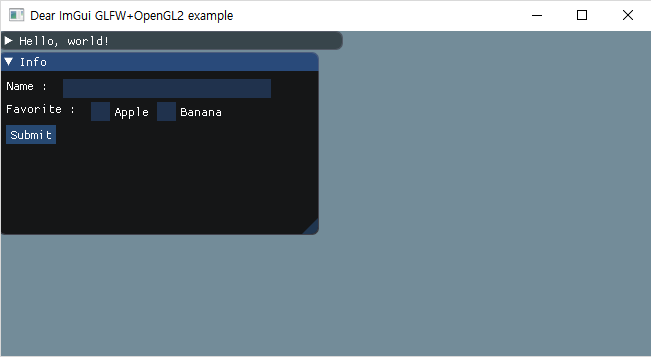
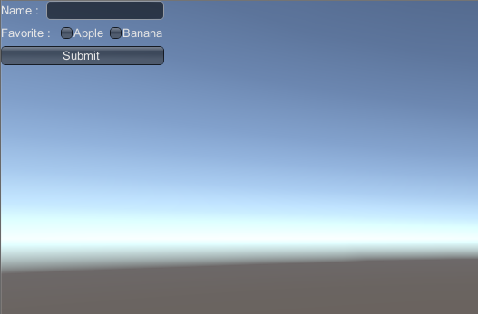

# Imgui

+ Imgui와 OnGUI를 비교해보자.
+ https://github.com/ocornut/imgui

## Imgui



+ Begin() ~ End() 사이에 사용하고자 하는 정보를 넣어 만든다.

```cpp
// 시작
ImGui::Begin("Info");

// 텍스트 사용
ImGui::Text("Name : ");
ImGui::SameLine();

static char name[10];
ImGui::InputText("", name, sizeof(name));

// 체크 박스 사용
ImGui::Text("Favorite : ");
ImGui::SameLine();
ImGui::Checkbox("Apple", &m_b_apple);
ImGui::SameLine();
ImGui::Checkbox("Banana", &m_b_banana);

// 버튼 사용
if (ImGui::Button("Submit")) {}

// 종료
ImGui::End();
```

## OnGui



+ BeginVertical() ~ EndVertical() / BeginHorizontal() ~ EndHorizontal() 사이에 사용하고자 하는 정보를 넣는다.

```csharp
string m_name = "";
bool m_b_apple = false;
bool m_b_banana = false;

void OnGUI() {
    // 시작
    GUILayout.BeginVertical();

    // 텍스트 사용
    GUILayout.BeginHorizontal();
    GUILayout.Label("Name : ");
    m_name = GUILayout.TextField(m_name, 100);
    GUILayout.EndHorizontal();

    // 체크 박스 사용
    GUILayout.BeginHorizontal();
    GUILayout.Label("Favorite : ");
    m_b_apple = GUILayout.Toggle(m_b_apple, "Apple");
    m_b_banana = GUILayout.Toggle(m_b_banana, "Banana");
    GUILayout.EndHorizontal();

    // 버튼 사용
    if (GUILayout.Button("Submit")) {}

    // 종료
    GUILayout.EndVertical ();
}
```

## Imgui 전체 코드

```cpp
// dear imgui: standalone example application for GLFW + OpenGL2, using legacy fixed pipeline
// If you are new to dear imgui, see examples/README.txt and documentation at the top of imgui.cpp.
// (GLFW is a cross-platform general purpose library for handling windows, inputs, OpenGL/Vulkan graphics context creation, etc.)

// **DO NOT USE THIS CODE IF YOUR CODE/ENGINE IS USING MODERN OPENGL (SHADERS, VBO, VAO, etc.)**
// **Prefer using the code in the example_glfw_opengl2/ folder**
// See imgui_impl_glfw.cpp for details.

#include "imgui.h"
#include "imgui_impl_glfw.h"
#include "imgui_impl_opengl2.h"
#include <stdio.h>
#ifdef __APPLE__
#define GL_SILENCE_DEPRECATION
#endif
#include <GLFW/glfw3.h>

// [Win32] Our example includes a copy of glfw3.lib pre-compiled with VS2010 to maximize ease of testing and compatibility with old VS compilers.
// To link with VS2010-era libraries, VS2015+ requires linking with legacy_stdio_definitions.lib, which we do using this pragma.
// Your own project should not be affected, as you are likely to link with a newer binary of GLFW that is adequate for your version of Visual Studio.
#if defined(_MSC_VER) && (_MSC_VER >= 1900) && !defined(IMGUI_DISABLE_WIN32_FUNCTIONS)
#pragma comment(lib, "legacy_stdio_definitions")
#endif

static void glfw_error_callback(int error, const char* description)
{
    fprintf(stderr, "Glfw Error %d: %s\n", error, description);
}

int main(int, char**)
{
    // Setup window
    glfwSetErrorCallback(glfw_error_callback);
    if (!glfwInit())
        return 1;
    GLFWwindow* window = glfwCreateWindow(1280, 720, "Dear ImGui GLFW+OpenGL2 example", NULL, NULL);
    if (window == NULL)
        return 1;
    glfwMakeContextCurrent(window);
    glfwSwapInterval(1); // Enable vsync

    // Setup Dear ImGui context
    ImGui::CreateContext();

    // Setup Platform/Renderer bindings
    ImGui_ImplGlfw_InitForOpenGL(window, true);
    ImGui_ImplOpenGL2_Init();

    // Our state
    bool m_b_apple = false;
    bool m_b_banana = false;
    bool show_another_window = false;
    ImVec4 clear_color = ImVec4(0.45f, 0.55f, 0.60f, 1.00f);

    // Main loop
    while (!glfwWindowShouldClose(window))
    {
        // Poll and handle events (inputs, window resize, etc.)
        // You can read the io.WantCaptureMouse, io.WantCaptureKeyboard flags to tell if dear imgui wants to use your inputs.
        // - When io.WantCaptureMouse is true, do not dispatch mouse input data to your main application.
        // - When io.WantCaptureKeyboard is true, do not dispatch keyboard input data to your main application.
        // Generally you may always pass all inputs to dear imgui, and hide them from your application based on those two flags.
        glfwPollEvents();

        // Start the Dear ImGui frame
        ImGui_ImplOpenGL2_NewFrame();
        ImGui_ImplGlfw_NewFrame();
        ImGui::NewFrame();

        // 1. Show a simple window that we create ourselves. We use a Begin/End pair to created a named window.
        {
            static float f = 0.0f;

            ImGui::Begin("Hello, world!");                          // Create a window called "Hello, world!" and append into it.

            ImGui::Text("This is some useful text.");               // Display some text (you can use a format strings too)
            ImGui::Checkbox("Another Window", &show_another_window);

            ImGui::SliderFloat("float", &f, 0.0f, 1.0f);            // Edit 1 float using a slider from 0.0f to 1.0f
            ImGui::ColorEdit3("clear color", (float*)&clear_color); // Edit 3 floats representing a color

            ImGui::Text("Application average %.3f ms/frame (%.1f FPS)", 1000.0f / ImGui::GetIO().Framerate, ImGui::GetIO().Framerate);
            ImGui::End();
        }

        {
            ImGui::Begin("Info");

            // 텍스트 사용
            ImGui::Text("Name : ");
            ImGui::SameLine();

            static char name[10];
            ImGui::InputText("", name, sizeof(name));

            // 체크 박스 사용
            ImGui::Text("Favorite : ");
            ImGui::SameLine();
            ImGui::Checkbox("Apple", &m_b_apple);
            ImGui::SameLine();
            ImGui::Checkbox("Banana", &m_b_banana);

            // 버튼 사용
            if (ImGui::Button("Submit")) {
            }
            ImGui::End();
        }

        // 2. Show another simple window.
        if (show_another_window)
        {
            ImGui::Begin("Another Window", &show_another_window);   // Pass a pointer to our bool variable (the window will have a closing button that will clear the bool when clicked)
            ImGui::Text("Hello from another window!");
            if (ImGui::Button("Close Me"))
                show_another_window = false;
            ImGui::End();
        }

        // Rendering
        ImGui::Render();
        glClearColor(clear_color.x, clear_color.y, clear_color.z, clear_color.w);
        glClear(GL_COLOR_BUFFER_BIT);

        // If you are using this code with non-legacy OpenGL header/contexts (which you should not, prefer using imgui_impl_opengl3.cpp!!), 
        // you may need to backup/reset/restore current shader using the commented lines below.
        //GLint last_program; 
        //glGetIntegerv(GL_CURRENT_PROGRAM, &last_program);
        //glUseProgram(0);
        ImGui_ImplOpenGL2_RenderDrawData(ImGui::GetDrawData());
        //glUseProgram(last_program);

        glfwMakeContextCurrent(window);
        glfwSwapBuffers(window);
    }

    // Cleanup
    ImGui_ImplOpenGL2_Shutdown();
    ImGui_ImplGlfw_Shutdown();
    ImGui::DestroyContext();

    glfwDestroyWindow(window);
    glfwTerminate();

    return 0;
}
```