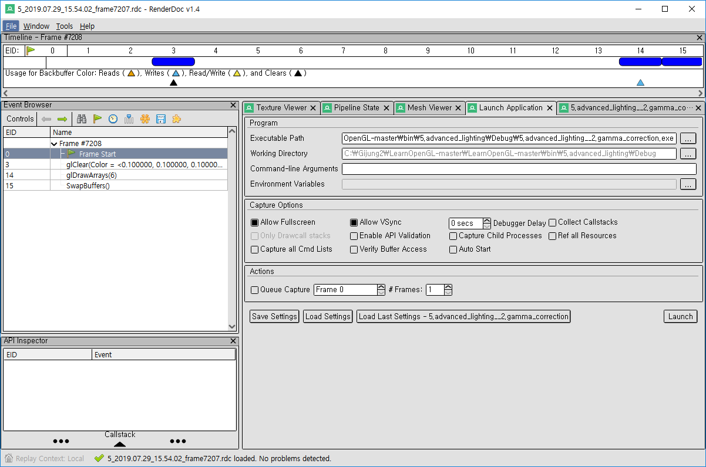
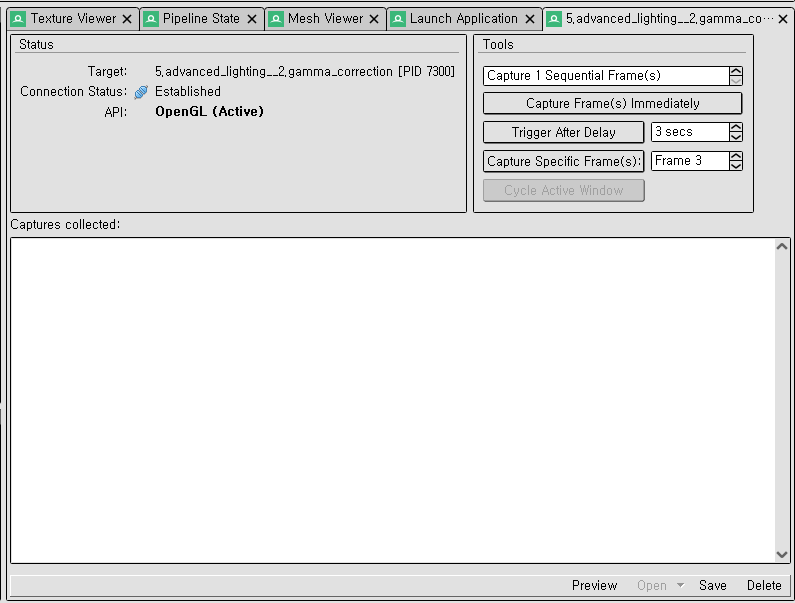
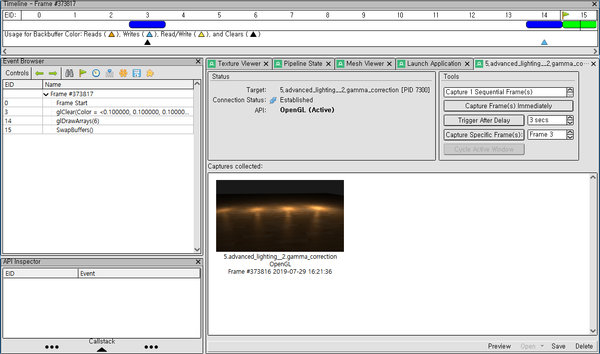
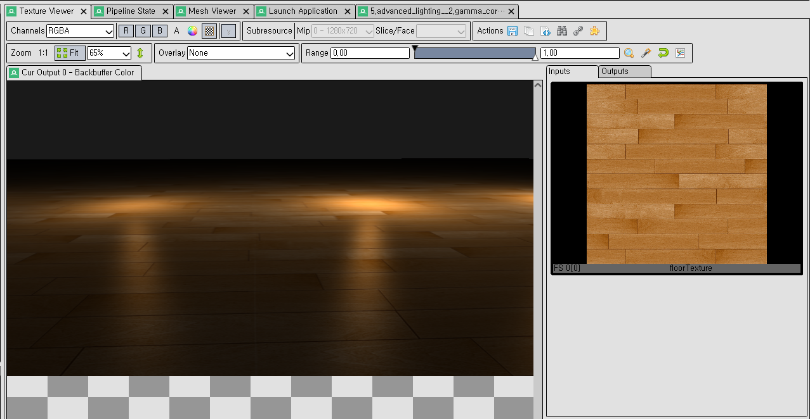
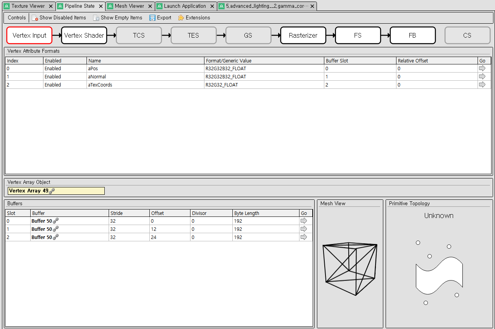
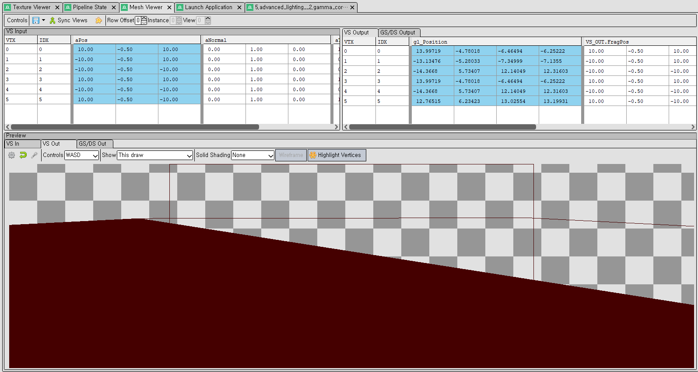

# RenderDoc

+ 캡처한 프레임에서 어떠한 행위들이 일어나는지를 볼 수 있는 디버거.

## Launch Application

+ 캡처하기 위한 프로그램을 실행시키는 탭.
+ 실행할 파일을 설정하고 "Launch"를 실행시키면 프로그램 실행.

## Capture

+ 실행된 프로그램에서 원하는 프레임을 캡처 할 수 있는 기능을 제공

## Frame Info

+ 캡처한 이미지를 더블클릭하면 해당 이미지가 완성되기까지의 Flow를 확인 할 수 있다.

## Texture Viwer

+ 사용된 텍스처의 정보를 보여준다.

## Pipeline State

+ 파이프라인의 단계별 처리를 보여준다.

## Mesh Viewer

+ 입력받은 정보를 기반으로 만들어진 메쉬를 보여준다.

