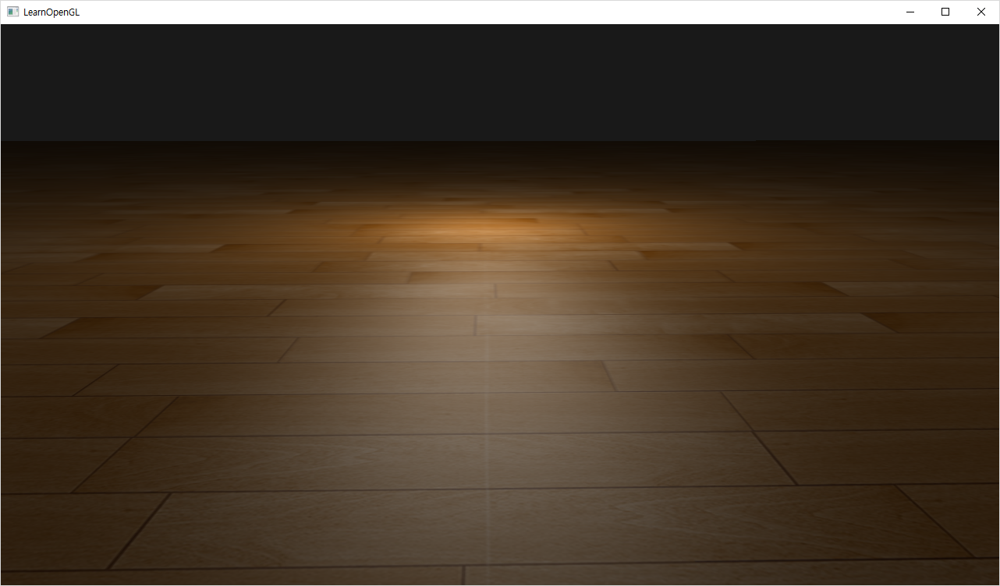
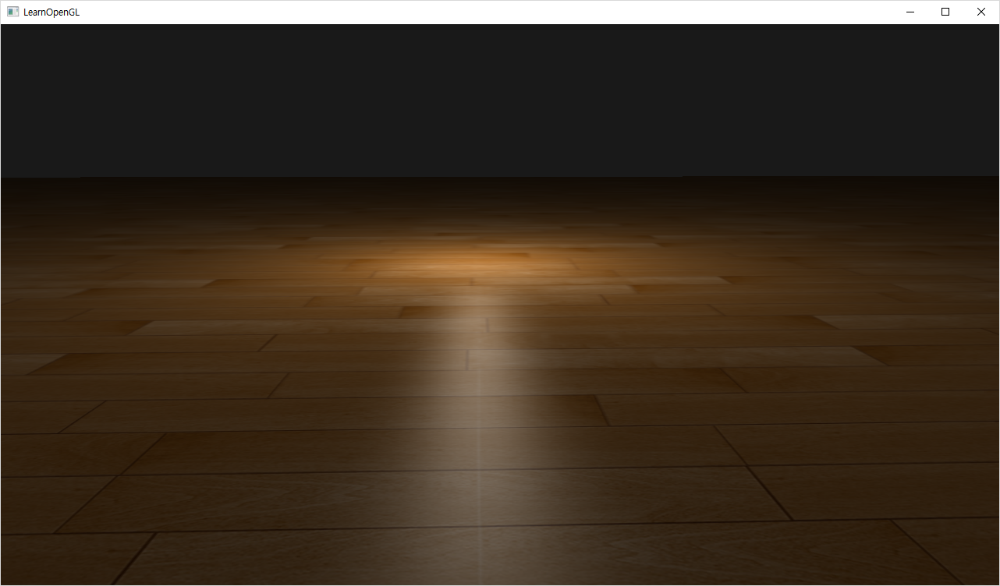
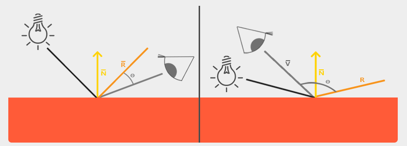
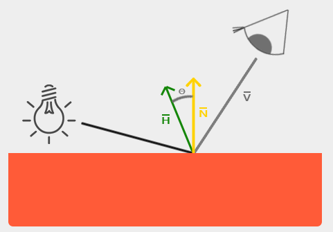

# Advanced Lighting

+ Phong / Blinn-Phong Model 을 사용해보자.

## Result

`Phong`


`Blinn-Phong`


## Vertex Shader

```cpp
#version 330 core
layout (location = 0) in vec3 aPos;
layout (location = 1) in vec3 aNormal;
layout (location = 2) in vec2 aTexCoords;

// declare an interface block; see 'Advanced GLSL' for what these are.
out VS_OUT {
    vec3 FragPos;
    vec3 Normal;
    vec2 TexCoords;
} vs_out;

uniform mat4 projection;
uniform mat4 view;

void main()
{
    vs_out.FragPos = aPos;
    vs_out.Normal = aNormal;
    vs_out.TexCoords = aTexCoords;
    gl_Position = projection * view * vec4(aPos, 1.0);
}
```

## Fragment Shader

`Phong의 반사벡터와 시선벡터의 내적`



+ Phong의 시선벡터와 반사벡터의 사이값이 `90도가 넘어가면 내적시에 음수`가 나와 0으로 처리된다.

`Blinn-Phong의 half 벡터와 법선벡터의 내적`



+ Blinn-Phong의 경우 빛의 벡터와 시선벡터 사이의 Half 벡터와 법선벡터의 사이값으로 계산하므로 `90도가
넘는 경우가 없어` 0이 되는 경우가 없다. 

```cpp
#version 330 core
out vec4 FragColor;

in VS_OUT {
    vec3 FragPos;
    vec3 Normal;
    vec2 TexCoords;
} fs_in;

uniform sampler2D floorTexture;
uniform vec3 lightPos;
uniform vec3 viewPos;
uniform bool blinn;

void main()
{           
    vec3 color = texture(floorTexture, fs_in.TexCoords).rgb;

    // ambient (주변광)
    vec3 ambient = 0.05 * color;

    // diffuse (분산광)
    vec3 lightDir = normalize(lightPos - fs_in.FragPos);    // 빛이 비추는 지점으로의 방향 벡터.
    vec3 normal = normalize(fs_in.Normal);                  // 지점의 법선 벡터.

    float diff = max(dot(lightDir, normal), 0.0);           // 두 벡터의 내적값을 이용하여 최대값을 구한다.
    vec3 diffuse = diff * color;

    // specular (하이라이트)
    vec3 viewDir = normalize(viewPos - fs_in.FragPos);      // 시선이 바라보는 지점으로의 방향 벡터.

    vec3 reflectDir = reflect(-lightDir, normal);           // 빛의 반사광의 벡터를 구한다.
    float spec = 0.0;
    if(blinn)
    {
        vec3 halfwayDir = normalize(lightDir + viewDir);
        spec = pow(max(dot(normal, halfwayDir), 0.0), 32.0);
    }
    else
    {
        vec3 reflectDir = reflect(-lightDir, normal);
        spec = pow(max(dot(viewDir, reflectDir), 0.0), 8.0);
    }
    vec3 specular = vec3(0.3) * spec; // assuming bright white light color
    FragColor = vec4(ambient + diffuse + specular, 1.0);
}
```

## Script

```cpp
#include <glad/glad.h>
#include <GLFW/glfw3.h>
#include <stb_image.h>

#include <glm/glm.hpp>
#include <glm/gtc/matrix_transform.hpp>
#include <glm/gtc/type_ptr.hpp>

#include <learnopengl/filesystem.h>
#include <learnopengl/shader_m.h>
#include <learnopengl/camera.h>
#include <learnopengl/model.h>

#include <iostream>

void framebuffer_size_callback(GLFWwindow* window, int width, int height);
void mouse_callback(GLFWwindow* window, double xpos, double ypos);
void scroll_callback(GLFWwindow* window, double xoffset, double yoffset);
void processInput(GLFWwindow *window);
unsigned int loadTexture(const char *path);

// settings
const unsigned int SCR_WIDTH = 1280;
const unsigned int SCR_HEIGHT = 720;
bool blinn = false;
bool blinnKeyPressed = false;

// camera
Camera camera(glm::vec3(0.0f, 0.0f, 3.0f));
float lastX = (float)SCR_WIDTH / 2.0;
float lastY = (float)SCR_HEIGHT / 2.0;
bool firstMouse = true;

// timing
float deltaTime = 0.0f;
float lastFrame = 0.0f;

int main()
{
    // glfw: initialize and configure
    // ------------------------------
    glfwInit();
    glfwWindowHint(GLFW_CONTEXT_VERSION_MAJOR, 3);
    glfwWindowHint(GLFW_CONTEXT_VERSION_MINOR, 3);
    glfwWindowHint(GLFW_OPENGL_PROFILE, GLFW_OPENGL_CORE_PROFILE);

#ifdef __APPLE__
    glfwWindowHint(GLFW_OPENGL_FORWARD_COMPAT, GL_TRUE); // uncomment this statement to fix compilation on OS X
#endif

    // glfw window creation
    // --------------------
    GLFWwindow* window = glfwCreateWindow(SCR_WIDTH, SCR_HEIGHT, "LearnOpenGL", NULL, NULL);
    if (window == NULL)
    {
        std::cout << "Failed to create GLFW window" << std::endl;
        glfwTerminate();
        return -1;
    }
    glfwMakeContextCurrent(window);
    glfwSetFramebufferSizeCallback(window, framebuffer_size_callback);
    glfwSetCursorPosCallback(window, mouse_callback);
    glfwSetScrollCallback(window, scroll_callback);

    // tell GLFW to capture our mouse
    glfwSetInputMode(window, GLFW_CURSOR, GLFW_CURSOR_DISABLED);

    // glad: load all OpenGL function pointers
    // ---------------------------------------
    if (!gladLoadGLLoader((GLADloadproc)glfwGetProcAddress))
    {
        std::cout << "Failed to initialize GLAD" << std::endl;
        return -1;
    }

    // configure global opengl state
    // -----------------------------
    glEnable(GL_DEPTH_TEST);
    glEnable(GL_BLEND);
    glBlendFunc(GL_SRC_ALPHA, GL_ONE_MINUS_SRC_ALPHA);

    // build and compile shaders
    // -------------------------
    Shader shader("1.advanced_lighting.vs", "1.advanced_lighting.fs");

    // set up vertex data (and buffer(s)) and configure vertex attributes
    // ------------------------------------------------------------------
    float planeVertices[] = {
        // positions            // normals         // texcoords
         10.0f, -0.5f,  10.0f,  0.0f, 1.0f, 0.0f,  10.0f,  0.0f,
        -10.0f, -0.5f,  10.0f,  0.0f, 1.0f, 0.0f,   0.0f,  0.0f,
        -10.0f, -0.5f, -10.0f,  0.0f, 1.0f, 0.0f,   0.0f, 10.0f,

         10.0f, -0.5f,  10.0f,  0.0f, 1.0f, 0.0f,  10.0f,  0.0f,
        -10.0f, -0.5f, -10.0f,  0.0f, 1.0f, 0.0f,   0.0f, 10.0f,
         10.0f, -0.5f, -10.0f,  0.0f, 1.0f, 0.0f,  10.0f, 10.0f
    };
    // plane VAO
    unsigned int planeVAO, planeVBO;
    glGenVertexArrays(1, &planeVAO);
    glGenBuffers(1, &planeVBO);
    glBindVertexArray(planeVAO);
    glBindBuffer(GL_ARRAY_BUFFER, planeVBO);
    glBufferData(GL_ARRAY_BUFFER, sizeof(planeVertices), planeVertices, GL_STATIC_DRAW);
    glEnableVertexAttribArray(0);
    glVertexAttribPointer(0, 3, GL_FLOAT, GL_FALSE, 8 * sizeof(float), (void*)0);
    glEnableVertexAttribArray(1);
    glVertexAttribPointer(1, 3, GL_FLOAT, GL_FALSE, 8 * sizeof(float), (void*)(3 * sizeof(float)));
    glEnableVertexAttribArray(2);
    glVertexAttribPointer(2, 2, GL_FLOAT, GL_FALSE, 8 * sizeof(float), (void*)(6 * sizeof(float)));
    glBindVertexArray(0);

    // load textures
    // -------------
    unsigned int floorTexture = loadTexture(FileSystem::getPath("resources/textures/wood.png").c_str());
    
    // shader configuration
    // --------------------
    shader.use();
    shader.setInt("texture1", 0);

    // lighting info
    // -------------
    glm::vec3 lightPos(0.0f, 0.0f, 0.0f);

    // render loop
    // -----------
    while (!glfwWindowShouldClose(window))
    {
        // per-frame time logic
        // --------------------
        float currentFrame = glfwGetTime();
        deltaTime = currentFrame - lastFrame;
        lastFrame = currentFrame;

        // input
        // -----
        processInput(window);

        // render
        // ------
        glClearColor(0.1f, 0.1f, 0.1f, 1.0f);
        glClear(GL_COLOR_BUFFER_BIT | GL_DEPTH_BUFFER_BIT);

        // draw objects
        shader.use();
        glm::mat4 projection = glm::perspective(glm::radians(camera.Zoom), (float)SCR_WIDTH / (float)SCR_HEIGHT, 0.1f, 100.0f);
        glm::mat4 view = camera.GetViewMatrix();
        shader.setMat4("projection", projection);
        shader.setMat4("view", view);
        // set light uniforms
        shader.setVec3("viewPos", camera.Position);
        shader.setVec3("lightPos", lightPos);
        shader.setInt("blinn", blinn);
        // floor
        glBindVertexArray(planeVAO);
        glActiveTexture(GL_TEXTURE0);
        glBindTexture(GL_TEXTURE_2D, floorTexture);
        glDrawArrays(GL_TRIANGLES, 0, 6);

        std::cout << (blinn ? "Blinn-Phong" : "Phong") << std::endl;

        // glfw: swap buffers and poll IO events (keys pressed/released, mouse moved etc.)
        // -------------------------------------------------------------------------------
        glfwSwapBuffers(window);
        glfwPollEvents();
    }

    // optional: de-allocate all resources once they've outlived their purpose:
    // ------------------------------------------------------------------------
    glDeleteVertexArrays(1, &planeVAO);
    glDeleteBuffers(1, &planeVBO);

    glfwTerminate();
    return 0;
}

// process all input: query GLFW whether relevant keys are pressed/released this frame and react accordingly
// ---------------------------------------------------------------------------------------------------------
void processInput(GLFWwindow *window)
{
    if (glfwGetKey(window, GLFW_KEY_ESCAPE) == GLFW_PRESS)
        glfwSetWindowShouldClose(window, true);

    if (glfwGetKey(window, GLFW_KEY_W) == GLFW_PRESS)
        camera.ProcessKeyboard(FORWARD, deltaTime);
    if (glfwGetKey(window, GLFW_KEY_S) == GLFW_PRESS)
        camera.ProcessKeyboard(BACKWARD, deltaTime);
    if (glfwGetKey(window, GLFW_KEY_A) == GLFW_PRESS)
        camera.ProcessKeyboard(LEFT, deltaTime);
    if (glfwGetKey(window, GLFW_KEY_D) == GLFW_PRESS)
        camera.ProcessKeyboard(RIGHT, deltaTime);

    if (glfwGetKey(window, GLFW_KEY_B) == GLFW_PRESS && !blinnKeyPressed) 
    {
        blinn = !blinn;
        blinnKeyPressed = true;
    }
    if (glfwGetKey(window, GLFW_KEY_B) == GLFW_RELEASE) 
    {
        blinnKeyPressed = false;
    }
}

// glfw: whenever the window size changed (by OS or user resize) this callback function executes
// ---------------------------------------------------------------------------------------------
void framebuffer_size_callback(GLFWwindow* window, int width, int height)
{
    // make sure the viewport matches the new window dimensions; note that width and 
    // height will be significantly larger than specified on retina displays.
    glViewport(0, 0, width, height);
}

// glfw: whenever the mouse moves, this callback is called
// -------------------------------------------------------
void mouse_callback(GLFWwindow* window, double xpos, double ypos)
{
    if (firstMouse)
    {
        lastX = xpos;
        lastY = ypos;
        firstMouse = false;
    }

    float xoffset = xpos - lastX;
    float yoffset = lastY - ypos; // reversed since y-coordinates go from bottom to top

    lastX = xpos;
    lastY = ypos;

    camera.ProcessMouseMovement(xoffset, yoffset);
}

// glfw: whenever the mouse scroll wheel scrolls, this callback is called
// ----------------------------------------------------------------------
void scroll_callback(GLFWwindow* window, double xoffset, double yoffset)
{
    camera.ProcessMouseScroll(yoffset);
}

// utility function for loading a 2D texture from file
// ---------------------------------------------------
unsigned int loadTexture(char const * path)
{
    unsigned int textureID;
    glGenTextures(1, &textureID);

    int width, height, nrComponents;
    unsigned char *data = stbi_load(path, &width, &height, &nrComponents, 0);
    if (data)
    {
        GLenum format;
        if (nrComponents == 1)
            format = GL_RED;
        else if (nrComponents == 3)
            format = GL_RGB;
        else if (nrComponents == 4)
            format = GL_RGBA;

        glBindTexture(GL_TEXTURE_2D, textureID);
        glTexImage2D(GL_TEXTURE_2D, 0, format, width, height, 0, format, GL_UNSIGNED_BYTE, data);
        glGenerateMipmap(GL_TEXTURE_2D);

        glTexParameteri(GL_TEXTURE_2D, GL_TEXTURE_WRAP_S, format == GL_RGBA ? GL_CLAMP_TO_EDGE : GL_REPEAT); // for this tutorial: use GL_CLAMP_TO_EDGE to prevent semi-transparent borders. Due to interpolation it takes texels from next repeat 
        glTexParameteri(GL_TEXTURE_2D, GL_TEXTURE_WRAP_T, format == GL_RGBA ? GL_CLAMP_TO_EDGE : GL_REPEAT);
        glTexParameteri(GL_TEXTURE_2D, GL_TEXTURE_MIN_FILTER, GL_LINEAR_MIPMAP_LINEAR);
        glTexParameteri(GL_TEXTURE_2D, GL_TEXTURE_MAG_FILTER, GL_LINEAR);

        stbi_image_free(data);
    }
    else
    {
        std::cout << "Texture failed to load at path: " << path << std::endl;
        stbi_image_free(data);
    }

    return textureID;
}
```