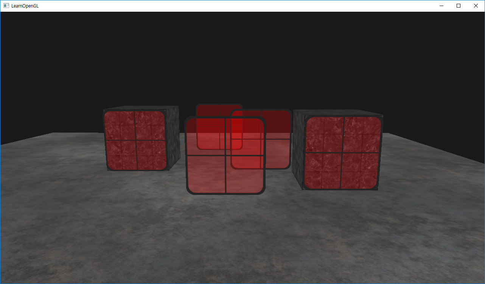

# Blending Sorted

+ 반투명을 표현하기 위해 렌더링 순서를 정한다.

## Result



## Function

`glBlendFunc(GLenum sfactor, GLenum dfactor)`

+ fragment의 컬러와 color buffer에 저장되어 있는 fragment 컬러를 혼합.
+ 공식 - (이제 나올 결과 색상값 * sfactor) + (이미 스크린 버퍼에 존재하는 색상값 * dfactor)

|옵션|값|
|:---|:---|
|GL_ZERO|0|
|GL_ONE|1|
|GL_SRC_COLOR|소스 컬러 값|
|GL_ONE_MINUS_SRC_COLOR|1 - 소스 컬러 값|
|GL_DST_COLOR|버퍼 컬러 값|
|GL_ONE_MINUS_DST_COLOR|1 - 버퍼 컬러 값|
|GL_SRC_ALPHA|소스 컬러의 알파값|
|GL_ONE_ONE_MINUS_SRC_ALPHA|1 - 소스 컬러의 알파값|
|GL_DST_ALPHA|버퍼 컬러의 알파 값|
|GL_ONE_MINUS_DST_ALPHA|1 - 버퍼 컬러의 알파 값|
|||

## Script

```c++
#include <glad/glad.h>
#include <GLFW/glfw3.h>
#include <stb_image.h>

#include <glm/glm.hpp>
#include <glm/gtc/matrix_transform.hpp>
#include <glm/gtc/type_ptr.hpp>

#include <learnopengl/filesystem.h>
#include <learnopengl/shader_m.h>
#include <learnopengl/camera.h>
#include <learnopengl/model.h>

#include <iostream>

void framebuffer_size_callback(GLFWwindow* window, int width, int height);
void mouse_callback(GLFWwindow* window, double xpos, double ypos);
void scroll_callback(GLFWwindow* window, double xoffset, double yoffset);
void processInput(GLFWwindow *window);
unsigned int loadTexture(const char *path);

// settings
const unsigned int SCR_WIDTH = 1280;
const unsigned int SCR_HEIGHT = 720;

// camera
Camera camera(glm::vec3(0.0f, 0.0f, 3.0f));
float lastX = (float)SCR_WIDTH / 2.0;
float lastY = (float)SCR_HEIGHT / 2.0;
bool firstMouse = true;

// timing
float deltaTime = 0.0f;
float lastFrame = 0.0f;

int main()
{
    // glfw: initialize and configure
    // ------------------------------
    glfwInit();
    glfwWindowHint(GLFW_CONTEXT_VERSION_MAJOR, 3);
    glfwWindowHint(GLFW_CONTEXT_VERSION_MINOR, 3);
    glfwWindowHint(GLFW_OPENGL_PROFILE, GLFW_OPENGL_CORE_PROFILE);

#ifdef __APPLE__
    glfwWindowHint(GLFW_OPENGL_FORWARD_COMPAT, GL_TRUE); // uncomment this statement to fix compilation on OS X
#endif

    // glfw window creation
    // --------------------
    GLFWwindow* window = glfwCreateWindow(SCR_WIDTH, SCR_HEIGHT, "LearnOpenGL", NULL, NULL);
    if (window == NULL)
    {
        std::cout << "Failed to create GLFW window" << std::endl;
        glfwTerminate();
        return -1;
    }
    glfwMakeContextCurrent(window);
    glfwSetFramebufferSizeCallback(window, framebuffer_size_callback);
    glfwSetCursorPosCallback(window, mouse_callback);
    glfwSetScrollCallback(window, scroll_callback);

    // tell GLFW to capture our mouse
    glfwSetInputMode(window, GLFW_CURSOR, GLFW_CURSOR_DISABLED);

    // glad: load all OpenGL function pointers
    // ---------------------------------------
    if (!gladLoadGLLoader((GLADloadproc)glfwGetProcAddress))
    {
        std::cout << "Failed to initialize GLAD" << std::endl;
        return -1;
    }

    // configure global opengl state
    // -----------------------------
    glEnable(GL_DEPTH_TEST);

    // 블랜딩 활성화.
    glEnable(GL_BLEND);

    // 원본 알파값과 1 - 원본 알파값을 블랜딩.
    glBlendFunc(GL_SRC_ALPHA, GL_ONE_MINUS_SRC_ALPHA);

    // build and compile shaders
    // -------------------------
    Shader shader("3.2.blending.vs", "3.2.blending.fs");

    // set up vertex data (and buffer(s)) and configure vertex attributes
    // ------------------------------------------------------------------
    float cubeVertices[] = {
        // positions          // texture Coords
        -0.5f, -0.5f, -0.5f,  0.0f, 0.0f,
         0.5f, -0.5f, -0.5f,  1.0f, 0.0f,
         0.5f,  0.5f, -0.5f,  1.0f, 1.0f,
         0.5f,  0.5f, -0.5f,  1.0f, 1.0f,
        -0.5f,  0.5f, -0.5f,  0.0f, 1.0f,
        -0.5f, -0.5f, -0.5f,  0.0f, 0.0f,

        -0.5f, -0.5f,  0.5f,  0.0f, 0.0f,
         0.5f, -0.5f,  0.5f,  1.0f, 0.0f,
         0.5f,  0.5f,  0.5f,  1.0f, 1.0f,
         0.5f,  0.5f,  0.5f,  1.0f, 1.0f,
        -0.5f,  0.5f,  0.5f,  0.0f, 1.0f,
        -0.5f, -0.5f,  0.5f,  0.0f, 0.0f,

        -0.5f,  0.5f,  0.5f,  1.0f, 0.0f,
        -0.5f,  0.5f, -0.5f,  1.0f, 1.0f,
        -0.5f, -0.5f, -0.5f,  0.0f, 1.0f,
        -0.5f, -0.5f, -0.5f,  0.0f, 1.0f,
        -0.5f, -0.5f,  0.5f,  0.0f, 0.0f,
        -0.5f,  0.5f,  0.5f,  1.0f, 0.0f,

         0.5f,  0.5f,  0.5f,  1.0f, 0.0f,
         0.5f,  0.5f, -0.5f,  1.0f, 1.0f,
         0.5f, -0.5f, -0.5f,  0.0f, 1.0f,
         0.5f, -0.5f, -0.5f,  0.0f, 1.0f,
         0.5f, -0.5f,  0.5f,  0.0f, 0.0f,
         0.5f,  0.5f,  0.5f,  1.0f, 0.0f,

        -0.5f, -0.5f, -0.5f,  0.0f, 1.0f,
         0.5f, -0.5f, -0.5f,  1.0f, 1.0f,
         0.5f, -0.5f,  0.5f,  1.0f, 0.0f,
         0.5f, -0.5f,  0.5f,  1.0f, 0.0f,
        -0.5f, -0.5f,  0.5f,  0.0f, 0.0f,
        -0.5f, -0.5f, -0.5f,  0.0f, 1.0f,

        -0.5f,  0.5f, -0.5f,  0.0f, 1.0f,
         0.5f,  0.5f, -0.5f,  1.0f, 1.0f,
         0.5f,  0.5f,  0.5f,  1.0f, 0.0f,
         0.5f,  0.5f,  0.5f,  1.0f, 0.0f,
        -0.5f,  0.5f,  0.5f,  0.0f, 0.0f,
        -0.5f,  0.5f, -0.5f,  0.0f, 1.0f
    };
    float planeVertices[] = {
        // positions          // texture Coords 
         5.0f, -0.5f,  5.0f,  2.0f, 0.0f,
        -5.0f, -0.5f,  5.0f,  0.0f, 0.0f,
        -5.0f, -0.5f, -5.0f,  0.0f, 2.0f,

         5.0f, -0.5f,  5.0f,  2.0f, 0.0f,
        -5.0f, -0.5f, -5.0f,  0.0f, 2.0f,
         5.0f, -0.5f, -5.0f,  2.0f, 2.0f
    };
    float transparentVertices[] = {
        // positions         // texture Coords (swapped y coordinates because texture is flipped upside down)
        0.0f,  0.5f,  0.0f,  0.0f,  0.0f,
        0.0f, -0.5f,  0.0f,  0.0f,  1.0f,
        1.0f, -0.5f,  0.0f,  1.0f,  1.0f,

        0.0f,  0.5f,  0.0f,  0.0f,  0.0f,
        1.0f, -0.5f,  0.0f,  1.0f,  1.0f,
        1.0f,  0.5f,  0.0f,  1.0f,  0.0f
    };
    // cube VAO
    unsigned int cubeVAO, cubeVBO;
    glGenVertexArrays(1, &cubeVAO);
    glGenBuffers(1, &cubeVBO);
    glBindVertexArray(cubeVAO);
    glBindBuffer(GL_ARRAY_BUFFER, cubeVBO);
    glBufferData(GL_ARRAY_BUFFER, sizeof(cubeVertices), &cubeVertices, GL_STATIC_DRAW);
    glEnableVertexAttribArray(0);
    glVertexAttribPointer(0, 3, GL_FLOAT, GL_FALSE, 5 * sizeof(float), (void*)0);
    glEnableVertexAttribArray(1);
    glVertexAttribPointer(1, 2, GL_FLOAT, GL_FALSE, 5 * sizeof(float), (void*)(3 * sizeof(float)));
    // plane VAO
    unsigned int planeVAO, planeVBO;
    glGenVertexArrays(1, &planeVAO);
    glGenBuffers(1, &planeVBO);
    glBindVertexArray(planeVAO);
    glBindBuffer(GL_ARRAY_BUFFER, planeVBO);
    glBufferData(GL_ARRAY_BUFFER, sizeof(planeVertices), &planeVertices, GL_STATIC_DRAW);
    glEnableVertexAttribArray(0);
    glVertexAttribPointer(0, 3, GL_FLOAT, GL_FALSE, 5 * sizeof(float), (void*)0);
    glEnableVertexAttribArray(1);
    glVertexAttribPointer(1, 2, GL_FLOAT, GL_FALSE, 5 * sizeof(float), (void*)(3 * sizeof(float)));
    // transparent VAO
    unsigned int transparentVAO, transparentVBO;
    glGenVertexArrays(1, &transparentVAO);
    glGenBuffers(1, &transparentVBO);
    glBindVertexArray(transparentVAO);
    glBindBuffer(GL_ARRAY_BUFFER, transparentVBO);
    glBufferData(GL_ARRAY_BUFFER, sizeof(transparentVertices), transparentVertices, GL_STATIC_DRAW);
    glEnableVertexAttribArray(0);
    glVertexAttribPointer(0, 3, GL_FLOAT, GL_FALSE, 5 * sizeof(float), (void*)0);
    glEnableVertexAttribArray(1);
    glVertexAttribPointer(1, 2, GL_FLOAT, GL_FALSE, 5 * sizeof(float), (void*)(3 * sizeof(float)));
    glBindVertexArray(0);

    // load textures
    // -------------
    unsigned int cubeTexture = loadTexture(FileSystem::getPath("resources/textures/marble.jpg").c_str());
    unsigned int floorTexture = loadTexture(FileSystem::getPath("resources/textures/metal.png").c_str());
    unsigned int transparentTexture = loadTexture(FileSystem::getPath("resources/textures/window.png").c_str());

    // 창문 위치 벡터들
    // --------------------------------
    vector<glm::vec3> windows
    {
        glm::vec3(-1.5f, 0.0f, -0.48f),
        glm::vec3( 1.5f, 0.0f, 0.51f),
        glm::vec3( 0.0f, 0.0f, 0.7f),
        glm::vec3(-0.3f, 0.0f, -2.3f),
        glm::vec3( 0.5f, 0.0f, -0.6f)
    };

    // shader configuration
    // --------------------
    shader.use();
    shader.setInt("texture1", 0);

    // render loop
    // -----------
    while (!glfwWindowShouldClose(window))
    {
        // per-frame time logic
        // --------------------
        float currentFrame = glfwGetTime();
        deltaTime = currentFrame - lastFrame;
        lastFrame = currentFrame;

        // input
        // -----
        processInput(window);

        // 카메라로 부터 물체까지의 거리를 계산하여 가깝고 먼 정보를 map으로 저장해둔다.
        // ---------------------------------------------
        std::map<float, glm::vec3> sorted;
        for (unsigned int i = 0; i < windows.size(); i++)
        {
            float distance = glm::length(camera.Position - windows[i]);
            sorted[distance] = windows[i];
        }

        // render
        // ------
        glClearColor(0.1f, 0.1f, 0.1f, 1.0f);
        glClear(GL_COLOR_BUFFER_BIT | GL_DEPTH_BUFFER_BIT);

        // draw objects
        shader.use();
        glm::mat4 projection = glm::perspective(glm::radians(camera.Zoom), (float)SCR_WIDTH / (float)SCR_HEIGHT, 0.1f, 100.0f);
        glm::mat4 view = camera.GetViewMatrix();
        glm::mat4 model = glm::mat4(1.0f);
        shader.setMat4("projection", projection);
        shader.setMat4("view", view);
        // cubes
        glBindVertexArray(cubeVAO);
        glActiveTexture(GL_TEXTURE0);
        glBindTexture(GL_TEXTURE_2D, cubeTexture);
        model = glm::translate(model, glm::vec3(-1.0f, 0.0f, -1.0f));
        shader.setMat4("model", model);
        glDrawArrays(GL_TRIANGLES, 0, 36);
        model = glm::mat4(1.0f);
        model = glm::translate(model, glm::vec3(2.0f, 0.0f, 0.0f));
        shader.setMat4("model", model);
        glDrawArrays(GL_TRIANGLES, 0, 36);
        // floor
        glBindVertexArray(planeVAO);
        glBindTexture(GL_TEXTURE_2D, floorTexture);
        model = glm::mat4(1.0f);
        shader.setMat4("model", model);
        glDrawArrays(GL_TRIANGLES, 0, 6);
        // windows (from furthest to nearest)
        glBindVertexArray(transparentVAO);
        glBindTexture(GL_TEXTURE_2D, transparentTexture);

        // Depth Test는 반투명, 투명에 관하여 고려하지 않기때문에 앞에 있는 물체부터 그리면 
        // 뒤의 나오는 물체의 겹치는 부분에 대해서는 반투명하더라도 그려지지 않게 된다.
        // 그러한 이유로 카메라로 부터 먼 물체부터 그려주어 반투명할때 뒤에 물체가 보이는 것처럼 느낄 수 있다.
        for (std::map<float, glm::vec3>::reverse_iterator it = sorted.rbegin(); it != sorted.rend(); ++it)
        {
            model = glm::mat4(1.0f);
            model = glm::translate(model, it->second);
            shader.setMat4("model", model);
            glDrawArrays(GL_TRIANGLES, 0, 6);
        }


        // glfw: swap buffers and poll IO events (keys pressed/released, mouse moved etc.)
        // -------------------------------------------------------------------------------
        glfwSwapBuffers(window);
        glfwPollEvents();
    }

    // optional: de-allocate all resources once they've outlived their purpose:
    // ------------------------------------------------------------------------
    glDeleteVertexArrays(1, &cubeVAO);
    glDeleteVertexArrays(1, &planeVAO);
    glDeleteBuffers(1, &cubeVBO);
    glDeleteBuffers(1, &planeVBO);

    glfwTerminate();
    return 0;
}

// process all input: query GLFW whether relevant keys are pressed/released this frame and react accordingly
// ---------------------------------------------------------------------------------------------------------
void processInput(GLFWwindow *window)
{
    if (glfwGetKey(window, GLFW_KEY_ESCAPE) == GLFW_PRESS)
        glfwSetWindowShouldClose(window, true);

    if (glfwGetKey(window, GLFW_KEY_W) == GLFW_PRESS)
        camera.ProcessKeyboard(FORWARD, deltaTime);
    if (glfwGetKey(window, GLFW_KEY_S) == GLFW_PRESS)
        camera.ProcessKeyboard(BACKWARD, deltaTime);
    if (glfwGetKey(window, GLFW_KEY_A) == GLFW_PRESS)
        camera.ProcessKeyboard(LEFT, deltaTime);
    if (glfwGetKey(window, GLFW_KEY_D) == GLFW_PRESS)
        camera.ProcessKeyboard(RIGHT, deltaTime);
}

// glfw: whenever the window size changed (by OS or user resize) this callback function executes
// ---------------------------------------------------------------------------------------------
void framebuffer_size_callback(GLFWwindow* window, int width, int height)
{
    // make sure the viewport matches the new window dimensions; note that width and 
    // height will be significantly larger than specified on retina displays.
    glViewport(0, 0, width, height);
}

// glfw: whenever the mouse moves, this callback is called
// -------------------------------------------------------
void mouse_callback(GLFWwindow* window, double xpos, double ypos)
{
    if (firstMouse)
    {
        lastX = xpos;
        lastY = ypos;
        firstMouse = false;
    }

    float xoffset = xpos - lastX;
    float yoffset = lastY - ypos; // reversed since y-coordinates go from bottom to top

    lastX = xpos;
    lastY = ypos;

    camera.ProcessMouseMovement(xoffset, yoffset);
}

// glfw: whenever the mouse scroll wheel scrolls, this callback is called
// ----------------------------------------------------------------------
void scroll_callback(GLFWwindow* window, double xoffset, double yoffset)
{
    camera.ProcessMouseScroll(yoffset);
}

// utility function for loading a 2D texture from file
// ---------------------------------------------------
unsigned int loadTexture(char const * path)
{
    unsigned int textureID;
    glGenTextures(1, &textureID);

    int width, height, nrComponents;
    unsigned char *data = stbi_load(path, &width, &height, &nrComponents, 0);
    if (data)
    {
        GLenum format;
        if (nrComponents == 1)
            format = GL_RED;
        else if (nrComponents == 3)
            format = GL_RGB;
        else if (nrComponents == 4)
            format = GL_RGBA;

        glBindTexture(GL_TEXTURE_2D, textureID);
        glTexImage2D(GL_TEXTURE_2D, 0, format, width, height, 0, format, GL_UNSIGNED_BYTE, data);
        glGenerateMipmap(GL_TEXTURE_2D);

        glTexParameteri(GL_TEXTURE_2D, GL_TEXTURE_WRAP_S, format == GL_RGBA ? GL_CLAMP_TO_EDGE : GL_REPEAT); // for this tutorial: use GL_CLAMP_TO_EDGE to prevent semi-transparent borders. Due to interpolation it takes texels from next repeat 
        glTexParameteri(GL_TEXTURE_2D, GL_TEXTURE_WRAP_T, format == GL_RGBA ? GL_CLAMP_TO_EDGE : GL_REPEAT);
        glTexParameteri(GL_TEXTURE_2D, GL_TEXTURE_MIN_FILTER, GL_LINEAR_MIPMAP_LINEAR);
        glTexParameteri(GL_TEXTURE_2D, GL_TEXTURE_MAG_FILTER, GL_LINEAR);

        stbi_image_free(data);
    }
    else
    {
        std::cout << "Texture failed to load at path: " << path << std::endl;
        stbi_image_free(data);
    }

    return textureID;
}
```