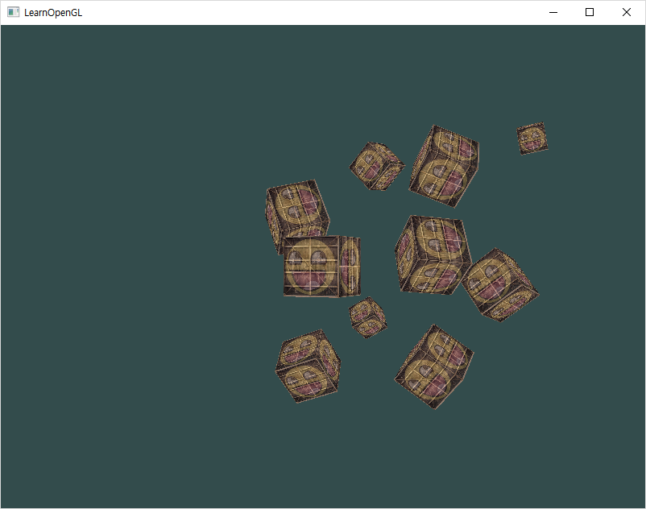
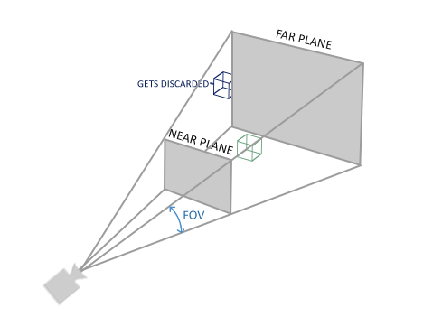

# Camera_Circle

+ 카메라가 원을 돌며 타겟을 보여주는 기능을 구현.

## Result




## glm::lookAt

`glm::lookAt(glm::vec3 position, glm::vec3 target, glm::vec3 up)`

+ position - 카메라 위치.
+ target - 타켓의 위치.
+ up - 카메라의 노말벡터 값. (0, 1, 0) / (0, -1, 0)

## Perspective

`glm::perspective(float fovy, float aspect, float, float)`

+ 원근법을 적용한 행렬.
+ 시야각, 화면 비율, 가까운 거리, 먼거리 순



## Script

```c++
#include <glad/glad.h>
#include <GLFW/glfw3.h>
#include <stb_image.h>

#include <glm/glm.hpp>
#include <glm/gtc/matrix_transform.hpp>
#include <glm/gtc/type_ptr.hpp>

#include <learnopengl/filesystem.h>
#include <learnopengl/shader_m.h>

#include <iostream>

void framebuffer_size_callback(GLFWwindow* window, int width, int height);
void processInput(GLFWwindow *window);

// settings
const unsigned int SCR_WIDTH = 800;
const unsigned int SCR_HEIGHT = 600;

int main()
{
    // glfw: initialize and configure
    // ------------------------------
    glfwInit();
    glfwWindowHint(GLFW_CONTEXT_VERSION_MAJOR, 3);
    glfwWindowHint(GLFW_CONTEXT_VERSION_MINOR, 3);
    glfwWindowHint(GLFW_OPENGL_PROFILE, GLFW_OPENGL_CORE_PROFILE);

#ifdef __APPLE__
    glfwWindowHint(GLFW_OPENGL_FORWARD_COMPAT, GL_TRUE); // uncomment this statement to fix compilation on OS X
#endif

    // glfw window creation
    // --------------------
    GLFWwindow* window = glfwCreateWindow(SCR_WIDTH, SCR_HEIGHT, "LearnOpenGL", NULL, NULL);
    if (window == NULL)
    {
        std::cout << "Failed to create GLFW window" << std::endl;
        glfwTerminate();
        return -1;
    }
    glfwMakeContextCurrent(window);
    glfwSetFramebufferSizeCallback(window, framebuffer_size_callback);

    // glad: load all OpenGL function pointers
    // ---------------------------------------
    if (!gladLoadGLLoader((GLADloadproc)glfwGetProcAddress))
    {
        std::cout << "Failed to initialize GLAD" << std::endl;
        return -1;
    }

    // configure global opengl state
    // -----------------------------
    glEnable(GL_DEPTH_TEST);

    // build and compile our shader zprogram
    // ------------------------------------
    Shader ourShader("7.1.camera.vs", "7.1.camera.fs");

    // set up vertex data (and buffer(s)) and configure vertex attributes
    // ------------------------------------------------------------------
    // 정육면체를 나타내는 위치값 및 UV값
    float vertices[] = {
        -0.5f, -0.5f, -0.5f,  0.0f, 0.0f,
         0.5f, -0.5f, -0.5f,  1.0f, 0.0f,
         0.5f,  0.5f, -0.5f,  1.0f, 1.0f,
         0.5f,  0.5f, -0.5f,  1.0f, 1.0f,
        -0.5f,  0.5f, -0.5f,  0.0f, 1.0f,
        -0.5f, -0.5f, -0.5f,  0.0f, 0.0f,

        -0.5f, -0.5f,  0.5f,  0.0f, 0.0f,
         0.5f, -0.5f,  0.5f,  1.0f, 0.0f,
         0.5f,  0.5f,  0.5f,  1.0f, 1.0f,
         0.5f,  0.5f,  0.5f,  1.0f, 1.0f,
        -0.5f,  0.5f,  0.5f,  0.0f, 1.0f,
        -0.5f, -0.5f,  0.5f,  0.0f, 0.0f,

        -0.5f,  0.5f,  0.5f,  1.0f, 0.0f,
        -0.5f,  0.5f, -0.5f,  1.0f, 1.0f,
        -0.5f, -0.5f, -0.5f,  0.0f, 1.0f,
        -0.5f, -0.5f, -0.5f,  0.0f, 1.0f,
        -0.5f, -0.5f,  0.5f,  0.0f, 0.0f,
        -0.5f,  0.5f,  0.5f,  1.0f, 0.0f,

         0.5f,  0.5f,  0.5f,  1.0f, 0.0f,
         0.5f,  0.5f, -0.5f,  1.0f, 1.0f,
         0.5f, -0.5f, -0.5f,  0.0f, 1.0f,
         0.5f, -0.5f, -0.5f,  0.0f, 1.0f,
         0.5f, -0.5f,  0.5f,  0.0f, 0.0f,
         0.5f,  0.5f,  0.5f,  1.0f, 0.0f,

        -0.5f, -0.5f, -0.5f,  0.0f, 1.0f,
         0.5f, -0.5f, -0.5f,  1.0f, 1.0f,
         0.5f, -0.5f,  0.5f,  1.0f, 0.0f,
         0.5f, -0.5f,  0.5f,  1.0f, 0.0f,
        -0.5f, -0.5f,  0.5f,  0.0f, 0.0f,
        -0.5f, -0.5f, -0.5f,  0.0f, 1.0f,

        -0.5f,  0.5f, -0.5f,  0.0f, 1.0f,
         0.5f,  0.5f, -0.5f,  1.0f, 1.0f,
         0.5f,  0.5f,  0.5f,  1.0f, 0.0f,
         0.5f,  0.5f,  0.5f,  1.0f, 0.0f,
        -0.5f,  0.5f,  0.5f,  0.0f, 0.0f,
        -0.5f,  0.5f, -0.5f,  0.0f, 1.0f
    };
    // world space positions of our cubes
    glm::vec3 cubePositions[] = {
        glm::vec3( 0.0f,  0.0f,  0.0f),
        glm::vec3( 2.0f,  5.0f, -15.0f),
        glm::vec3(-1.5f, -2.2f, -2.5f),
        glm::vec3(-3.8f, -2.0f, -12.3f),
        glm::vec3 (2.4f, -0.4f, -3.5f),
        glm::vec3(-1.7f,  3.0f, -7.5f),
        glm::vec3( 1.3f, -2.0f, -2.5f),
        glm::vec3( 1.5f,  2.0f, -2.5f),
        glm::vec3( 1.5f,  0.2f, -1.5f),
        glm::vec3(-1.3f,  1.0f, -1.5f)
    };
    unsigned int VBO, VAO;
    glGenVertexArrays(1, &VAO);
    glGenBuffers(1, &VBO);

    glBindVertexArray(VAO);

    glBindBuffer(GL_ARRAY_BUFFER, VBO);
    glBufferData(GL_ARRAY_BUFFER, sizeof(vertices), vertices, GL_STATIC_DRAW);

    // position attribute
    glVertexAttribPointer(0, 3, GL_FLOAT, GL_FALSE, 5 * sizeof(float), (void*)0);
    glEnableVertexAttribArray(0);
    // texture coord attribute
    glVertexAttribPointer(1, 2, GL_FLOAT, GL_FALSE, 5 * sizeof(float), (void*)(3 * sizeof(float)));
    glEnableVertexAttribArray(1);


    // load and create a texture 
    // -------------------------
    unsigned int texture1, texture2;
    // texture 1
    // ---------
    glGenTextures(1, &texture1);
    glBindTexture(GL_TEXTURE_2D, texture1);
    // set the texture wrapping parameters
    glTexParameteri(GL_TEXTURE_2D, GL_TEXTURE_WRAP_S, GL_REPEAT);
    glTexParameteri(GL_TEXTURE_2D, GL_TEXTURE_WRAP_T, GL_REPEAT);
    // set texture filtering parameters
    glTexParameteri(GL_TEXTURE_2D, GL_TEXTURE_MIN_FILTER, GL_LINEAR);
    glTexParameteri(GL_TEXTURE_2D, GL_TEXTURE_MAG_FILTER, GL_LINEAR);
    // load image, create texture and generate mipmaps
    int width, height, nrChannels;
    stbi_set_flip_vertically_on_load(true); // tell stb_image.h to flip loaded texture's on the y-axis.
    unsigned char *data = stbi_load(FileSystem::getPath("resources/textures/container.jpg").c_str(), &width, &height, &nrChannels, 0);
    if (data)
    {
        glTexImage2D(GL_TEXTURE_2D, 0, GL_RGB, width, height, 0, GL_RGB, GL_UNSIGNED_BYTE, data);
        glGenerateMipmap(GL_TEXTURE_2D);
    }
    else
    {
        std::cout << "Failed to load texture" << std::endl;
    }
    stbi_image_free(data);
    // texture 2
    // ---------
    glGenTextures(1, &texture2);
    glBindTexture(GL_TEXTURE_2D, texture2);
    // set the texture wrapping parameters
    glTexParameteri(GL_TEXTURE_2D, GL_TEXTURE_WRAP_S, GL_REPEAT);
    glTexParameteri(GL_TEXTURE_2D, GL_TEXTURE_WRAP_T, GL_REPEAT);
    // set texture filtering parameters
    glTexParameteri(GL_TEXTURE_2D, GL_TEXTURE_MIN_FILTER, GL_LINEAR);
    glTexParameteri(GL_TEXTURE_2D, GL_TEXTURE_MAG_FILTER, GL_LINEAR);
    // load image, create texture and generate mipmaps
    data = stbi_load(FileSystem::getPath("resources/textures/awesomeface.png").c_str(), &width, &height, &nrChannels, 0);
    if (data)
    {
        // note that the awesomeface.png has transparency and thus an alpha channel, so make sure to tell OpenGL the data type is of GL_RGBA
        glTexImage2D(GL_TEXTURE_2D, 0, GL_RGB, width, height, 0, GL_RGBA, GL_UNSIGNED_BYTE, data);
        glGenerateMipmap(GL_TEXTURE_2D);
    }
    else
    {
        std::cout << "Failed to load texture" << std::endl;
    }
    stbi_image_free(data);

    // tell opengl for each sampler to which texture unit it belongs to (only has to be done once)
    // -------------------------------------------------------------------------------------------
    ourShader.use();
    ourShader.setInt("texture1", 0);
    ourShader.setInt("texture2", 1);

    // pass projection matrix to shader (as projection matrix rarely changes there's no need to do this per frame)
    // -----------------------------------------------------------------------------------------------------------
    glm::mat4 projection = glm::perspective(glm::radians(45.0f), (float)SCR_WIDTH / (float)SCR_HEIGHT, 0.1f, 100.0f);
    ourShader.setMat4("projection", projection); 


    // render loop
    // -----------
    while (!glfwWindowShouldClose(window))
    {
        // input
        // -----
        processInput(window);

        // render
        // ------
        glClearColor(0.2f, 0.3f, 0.3f, 1.0f);
        glClear(GL_COLOR_BUFFER_BIT | GL_DEPTH_BUFFER_BIT); 

        // bind textures on corresponding texture units
        glActiveTexture(GL_TEXTURE0);
        glBindTexture(GL_TEXTURE_2D, texture1);
        glActiveTexture(GL_TEXTURE1);
        glBindTexture(GL_TEXTURE_2D, texture2);

        // activate shader
        ourShader.use();

        // 카메라가 돌면서 보는것처럼 적용된 행렬 변경.
        // camera/view transformation
        glm::mat4 view = glm::mat4(1.0f); // make sure to initialize matrix to identity matrix first
        float radius = 10.0f;
        float camX   = sin(glfwGetTime()) * radius;
        float camZ   = cos(glfwGetTime()) * radius;
        view = glm::lookAt(glm::vec3(camX, 0.0f, camZ), glm::vec3(0.0f, 0.0f, 0.0f), glm::vec3(0.0f, 1.0f, 0.0f));

        // 새로운 행렬 적용.
        ourShader.setMat4("view", view);

        // render boxes
        glBindVertexArray(VAO);
        for (unsigned int i = 0; i < 10; i++)
        {
            // 위치 및 회전값 변경.
            // calculate the model matrix for each object and pass it to shader before drawing
            glm::mat4 model = glm::mat4(1.0f);
            model = glm::translate(model, cubePositions[i]);
            float angle = 20.0f * i;
            model = glm::rotate(model, glm::radians(angle), glm::vec3(1.0f, 0.3f, 0.5f));

            // 새로운 행렬 적용.
            ourShader.setMat4("model", model);

            // 정육면체를 다시 그린다.
            glDrawArrays(GL_TRIANGLES, 0, 36);
        }

        // glfw: swap buffers and poll IO events (keys pressed/released, mouse moved etc.)
        // -------------------------------------------------------------------------------
        glfwSwapBuffers(window);
        glfwPollEvents();
    }

    // optional: de-allocate all resources once they've outlived their purpose:
    // ------------------------------------------------------------------------
    glDeleteVertexArrays(1, &VAO);
    glDeleteBuffers(1, &VBO);

    // glfw: terminate, clearing all previously allocated GLFW resources.
    // ------------------------------------------------------------------
    glfwTerminate();
    return 0;
}

// process all input: query GLFW whether relevant keys are pressed/released this frame and react accordingly
// ---------------------------------------------------------------------------------------------------------
void processInput(GLFWwindow *window)
{
    if (glfwGetKey(window, GLFW_KEY_ESCAPE) == GLFW_PRESS)
        glfwSetWindowShouldClose(window, true);
}

// glfw: whenever the window size changed (by OS or user resize) this callback function executes
// ---------------------------------------------------------------------------------------------
void framebuffer_size_callback(GLFWwindow* window, int width, int height)
{
    // make sure the viewport matches the new window dimensions; note that width and 
    // height will be significantly larger than specified on retina displays.
    glViewport(0, 0, width, height);
}
```