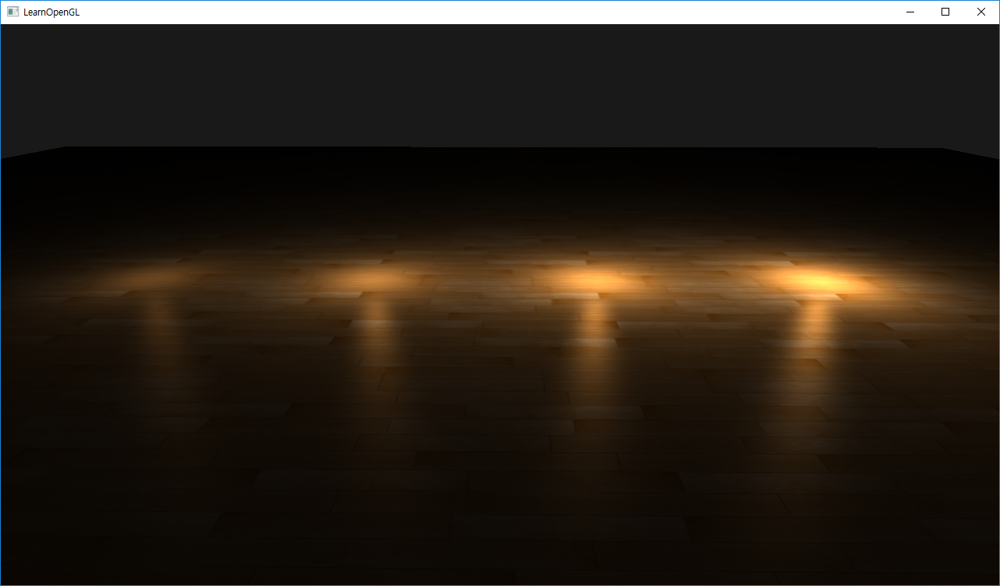
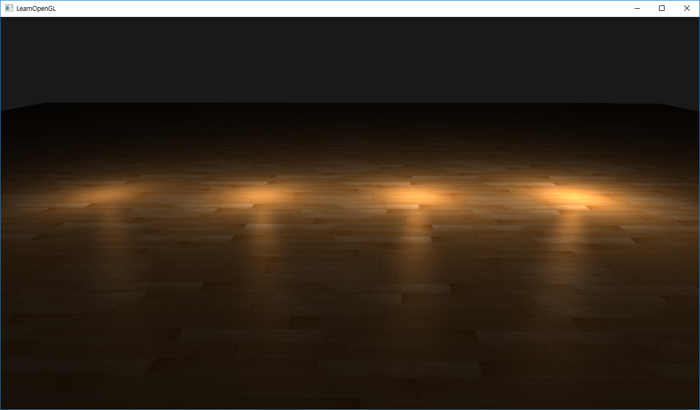
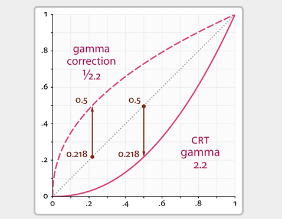

# Gamma Correction

+ 모니터에 이미지를 표시하기 전에 감마의 역수를 곱해주는 과정을 말한다.

## Result

`감마 미적용`



`감마 적용`



## Info

`sRGB`

+ 감마 인코딩(사람의 눈은 어두움을 더 잘 감지하기 때문에 이 값을 적용)된 값을 저장한 공간.

## Function

`GLint glGetUniformLocation(GLuint program, const GLchar* name)`

+ program - 쉐이더의 id.
+ name - Uniform 변수의 이름.

`glUniform3fv(GLint location, GLsizei count, const GLfloat* v)`

+ location - Uniform 변수의 위치.
+ count - 크기.
+ v - 할당하려는 값의 시작 위치.

## Vertex Shader

```cpp
#version 330 core
layout (location = 0) in vec3 aPos;
layout (location = 1) in vec3 aNormal;
layout (location = 2) in vec2 aTexCoords;

out VS_OUT {
    vec3 FragPos;
    vec3 Normal;
    vec2 TexCoords;
} vs_out;

uniform mat4 projection;
uniform mat4 view;

void main()
{
    vs_out.FragPos = aPos;
    vs_out.Normal = aNormal;
    vs_out.TexCoords = aTexCoords;
    gl_Position = projection * view * vec4(aPos, 1.0);
}
```

## Fragment Shader



+ 대부분의 디스플레이의 평균 감마를 대략적으로 추정하는 기본 감마 값 = 2.2
+ 디스플레이로 출력하기 위해 2.2로 다시 나누어 감마를 상쇄.

```cpp
#version 330 core
out vec4 FragColor;

in VS_OUT {
    vec3 FragPos;
    vec3 Normal;
    vec2 TexCoords;
} fs_in;

uniform sampler2D floorTexture;

uniform vec3 lightPositions[4];
uniform vec3 lightColors[4];
uniform vec3 viewPos;
uniform bool gamma;

vec3 BlinnPhong(vec3 normal, vec3 fragPos, vec3 lightPos, vec3 lightColor)
{
    // diffuse
    vec3 lightDir = normalize(lightPos - fragPos);
    float diff = max(dot(lightDir, normal), 0.0);
    vec3 diffuse = diff * lightColor;
    // specular
    vec3 viewDir = normalize(viewPos - fragPos);
    vec3 reflectDir = reflect(-lightDir, normal);
    float spec = 0.0;
    vec3 halfwayDir = normalize(lightDir + viewDir);  
    spec = pow(max(dot(normal, halfwayDir), 0.0), 64.0);
    vec3 specular = spec * lightColor;    
    
    // simple attenuation
    float max_distance = 1.5;
    float distance = length(lightPos - fragPos);

    // 감마 보정이 적용될 경우 감쇠량을 줄여준다.
    float attenuation = 1.0 / (gamma ? distance * distance : distance);
    
    diffuse *= attenuation;
    specular *= attenuation;
    
    return diffuse + specular;
}

void main()
{           
    vec3 color = texture(floorTexture, fs_in.TexCoords).rgb;
    vec3 lighting = vec3(0.0);

    for(int i = 0; i < 4; ++i)
        lighting += BlinnPhong(normalize(fs_in.Normal), fs_in.FragPos, lightPositions[i], lightColors[i]);

    color *= lighting;

    if(gamma)
        color = pow(color, vec3(1.0/2.2));

    FragColor = vec4(color, 1.0);
}
```

## Script

```cpp
#include <glad/glad.h>
#include <GLFW/glfw3.h>
#include <stb_image.h>

#include <glm/glm.hpp>
#include <glm/gtc/matrix_transform.hpp>
#include <glm/gtc/type_ptr.hpp>

#include <learnopengl/filesystem.h>
#include <learnopengl/shader.h>
#include <learnopengl/camera.h>
#include <learnopengl/model.h>

#include <iostream>

void framebuffer_size_callback(GLFWwindow* window, int width, int height);
void mouse_callback(GLFWwindow* window, double xpos, double ypos);
void scroll_callback(GLFWwindow* window, double xoffset, double yoffset);
void processInput(GLFWwindow *window);
unsigned int loadTexture(const char *path, bool gammaCorrection);

// settings
const unsigned int SCR_WIDTH = 1280;
const unsigned int SCR_HEIGHT = 720;
bool gammaEnabled = false;
bool gammaKeyPressed = false;

// camera
Camera camera(glm::vec3(0.0f, 0.0f, 3.0f));
float lastX = (float)SCR_WIDTH / 2.0;
float lastY = (float)SCR_HEIGHT / 2.0;
bool firstMouse = true;

// timing
float deltaTime = 0.0f;
float lastFrame = 0.0f;

int main()
{
    // glfw: initialize and configure
    // ------------------------------
    glfwInit();
    glfwWindowHint(GLFW_CONTEXT_VERSION_MAJOR, 3);
    glfwWindowHint(GLFW_CONTEXT_VERSION_MINOR, 3);
    glfwWindowHint(GLFW_OPENGL_PROFILE, GLFW_OPENGL_CORE_PROFILE);

#ifdef __APPLE__
    glfwWindowHint(GLFW_OPENGL_FORWARD_COMPAT, GL_TRUE); // uncomment this statement to fix compilation on OS X
#endif

    // glfw window creation
    // --------------------
    GLFWwindow* window = glfwCreateWindow(SCR_WIDTH, SCR_HEIGHT, "LearnOpenGL", NULL, NULL);
    if (window == NULL)
    {
        std::cout << "Failed to create GLFW window" << std::endl;
        glfwTerminate();
        return -1;
    }
    glfwMakeContextCurrent(window);
    glfwSetFramebufferSizeCallback(window, framebuffer_size_callback);
    glfwSetCursorPosCallback(window, mouse_callback);
    glfwSetScrollCallback(window, scroll_callback);

    // tell GLFW to capture our mouse
    glfwSetInputMode(window, GLFW_CURSOR, GLFW_CURSOR_DISABLED);

    // glad: load all OpenGL function pointers
    // ---------------------------------------
    if (!gladLoadGLLoader((GLADloadproc)glfwGetProcAddress))
    {
        std::cout << "Failed to initialize GLAD" << std::endl;
        return -1;
    }

    // configure global opengl state
    // -----------------------------
    glEnable(GL_DEPTH_TEST);
    glEnable(GL_BLEND);
    glBlendFunc(GL_SRC_ALPHA, GL_ONE_MINUS_SRC_ALPHA);

    // build and compile shaders
    // -------------------------
    Shader shader("2.gamma_correction.vs", "2.gamma_correction.fs");

    // set up vertex data (and buffer(s)) and configure vertex attributes
    // ------------------------------------------------------------------
    float planeVertices[] = {
        // positions            // normals         // texcoords
         10.0f, -0.5f,  10.0f,  0.0f, 1.0f, 0.0f,  10.0f,  0.0f,
        -10.0f, -0.5f,  10.0f,  0.0f, 1.0f, 0.0f,   0.0f,  0.0f,
        -10.0f, -0.5f, -10.0f,  0.0f, 1.0f, 0.0f,   0.0f, 10.0f,

         10.0f, -0.5f,  10.0f,  0.0f, 1.0f, 0.0f,  10.0f,  0.0f,
        -10.0f, -0.5f, -10.0f,  0.0f, 1.0f, 0.0f,   0.0f, 10.0f,
         10.0f, -0.5f, -10.0f,  0.0f, 1.0f, 0.0f,  10.0f, 10.0f
    };
    // plane VAO
    unsigned int planeVAO, planeVBO;
    glGenVertexArrays(1, &planeVAO);
    glGenBuffers(1, &planeVBO);
    glBindVertexArray(planeVAO);
    glBindBuffer(GL_ARRAY_BUFFER, planeVBO);
    glBufferData(GL_ARRAY_BUFFER, sizeof(planeVertices), planeVertices, GL_STATIC_DRAW);
    glEnableVertexAttribArray(0);
    glVertexAttribPointer(0, 3, GL_FLOAT, GL_FALSE, 8 * sizeof(float), (void*)0);
    glEnableVertexAttribArray(1);
    glVertexAttribPointer(1, 3, GL_FLOAT, GL_FALSE, 8 * sizeof(float), (void*)(3 * sizeof(float)));
    glEnableVertexAttribArray(2);
    glVertexAttribPointer(2, 2, GL_FLOAT, GL_FALSE, 8 * sizeof(float), (void*)(6 * sizeof(float)));
    glBindVertexArray(0);

    // 이미지를 로드할때 감마의 사용 여부에 따라 이미지 포맷을 다르게 한다.
    unsigned int floorTexture               = loadTexture(FileSystem::getPath("resources/textures/wood.png").c_str(), false);
    unsigned int floorTextureGammaCorrected = loadTexture(FileSystem::getPath("resources/textures/wood.png").c_str(), true);

    // shader configuration
    // --------------------
    shader.use();
    shader.setInt("floorTexture", 0);

    // lighting info
    // -------------
    glm::vec3 lightPositions[] = {
        glm::vec3(-3.0f, 0.0f, 0.0f),
        glm::vec3(-1.0f, 0.0f, 0.0f),
        glm::vec3 (1.0f, 0.0f, 0.0f),
        glm::vec3 (3.0f, 0.0f, 0.0f)
    };
    glm::vec3 lightColors[] = {
        glm::vec3(0.25),
        glm::vec3(0.50),
        glm::vec3(0.75),
        glm::vec3(1.00)
    };

    // render loop
    // -----------
    while (!glfwWindowShouldClose(window))
    {
        // per-frame time logic
        // --------------------
        float currentFrame = glfwGetTime();
        deltaTime = currentFrame - lastFrame;
        lastFrame = currentFrame;

        // input
        // -----
        processInput(window);

        // render
        // ------
        glClearColor(0.1f, 0.1f, 0.1f, 1.0f);
        glClear(GL_COLOR_BUFFER_BIT | GL_DEPTH_BUFFER_BIT);

        // draw objects
        shader.use();
        glm::mat4 projection = glm::perspective(glm::radians(camera.Zoom), (float)SCR_WIDTH / (float)SCR_HEIGHT, 0.1f, 100.0f);
        glm::mat4 view = camera.GetViewMatrix();
        shader.setMat4("projection", projection);
        shader.setMat4("view", view);
        // set light uniforms
        glUniform3fv(glGetUniformLocation(shader.ID, "lightPositions"), 4, &lightPositions[0][0]);
        glUniform3fv(glGetUniformLocation(shader.ID, "lightColors"), 4, &lightColors[0][0]);
        shader.setVec3("viewPos", camera.Position);
        shader.setInt("gamma", gammaEnabled);
        // floor
        glBindVertexArray(planeVAO);
        glActiveTexture(GL_TEXTURE0);
        glBindTexture(GL_TEXTURE_2D, gammaEnabled ? floorTextureGammaCorrected : floorTexture);
        glDrawArrays(GL_TRIANGLES, 0, 6);

        std::cout << (gammaEnabled ? "Gamma enabled" : "Gamma disabled") << std::endl;

        // glfw: swap buffers and poll IO events (keys pressed/released, mouse moved etc.)
        // -------------------------------------------------------------------------------
        glfwSwapBuffers(window);
        glfwPollEvents();
    }

    // optional: de-allocate all resources once they've outlived their purpose:
    // ------------------------------------------------------------------------
    glDeleteVertexArrays(1, &planeVAO);
    glDeleteBuffers(1, &planeVBO);

    glfwTerminate();
    return 0;
}

// process all input: query GLFW whether relevant keys are pressed/released this frame and react accordingly
// ---------------------------------------------------------------------------------------------------------
void processInput(GLFWwindow *window)
{
    if (glfwGetKey(window, GLFW_KEY_ESCAPE) == GLFW_PRESS)
        glfwSetWindowShouldClose(window, true);

    if (glfwGetKey(window, GLFW_KEY_W) == GLFW_PRESS)
        camera.ProcessKeyboard(FORWARD, deltaTime);
    if (glfwGetKey(window, GLFW_KEY_S) == GLFW_PRESS)
        camera.ProcessKeyboard(BACKWARD, deltaTime);
    if (glfwGetKey(window, GLFW_KEY_A) == GLFW_PRESS)
        camera.ProcessKeyboard(LEFT, deltaTime);
    if (glfwGetKey(window, GLFW_KEY_D) == GLFW_PRESS)
        camera.ProcessKeyboard(RIGHT, deltaTime);

    if (glfwGetKey(window, GLFW_KEY_SPACE) == GLFW_PRESS && !gammaKeyPressed)
    {
        gammaEnabled = !gammaEnabled;
        gammaKeyPressed = true;
    }
    if (glfwGetKey(window, GLFW_KEY_SPACE) == GLFW_RELEASE)
    {
        gammaKeyPressed = false;
    }
}

// glfw: whenever the window size changed (by OS or user resize) this callback function executes
// ---------------------------------------------------------------------------------------------
void framebuffer_size_callback(GLFWwindow* window, int width, int height)
{
    // make sure the viewport matches the new window dimensions; note that width and 
    // height will be significantly larger than specified on retina displays.
    glViewport(0, 0, width, height);
}

// glfw: whenever the mouse moves, this callback is called
// -------------------------------------------------------
void mouse_callback(GLFWwindow* window, double xpos, double ypos)
{
    if (firstMouse)
    {
        lastX = xpos;
        lastY = ypos;
        firstMouse = false;
    }

    float xoffset = xpos - lastX;
    float yoffset = lastY - ypos; // reversed since y-coordinates go from bottom to top

    lastX = xpos;
    lastY = ypos;

    camera.ProcessMouseMovement(xoffset, yoffset);
}

// glfw: whenever the mouse scroll wheel scrolls, this callback is called
// ----------------------------------------------------------------------
void scroll_callback(GLFWwindow* window, double xoffset, double yoffset)
{
    camera.ProcessMouseScroll(yoffset);
}

// utility function for loading a 2D texture from file
// ---------------------------------------------------
unsigned int loadTexture(char const * path, bool gammaCorrection)
{
    unsigned int textureID;
    glGenTextures(1, &textureID);

    int width, height, nrComponents;
    unsigned char *data = stbi_load(path, &width, &height, &nrComponents, 0);
    if (data)
    {
        GLenum internalFormat;
        GLenum dataFormat;
        if (nrComponents == 1)
        {
            internalFormat = dataFormat = GL_RED;
        }
        else if (nrComponents == 3)
        {
            internalFormat = gammaCorrection ? GL_SRGB : GL_RGB;
            dataFormat = GL_RGB;
        }
        else if (nrComponents == 4)
        {
            internalFormat = gammaCorrection ? GL_SRGB_ALPHA : GL_RGBA;
            dataFormat = GL_RGBA;
        }

        glBindTexture(GL_TEXTURE_2D, textureID);
        glTexImage2D(GL_TEXTURE_2D, 0, internalFormat, width, height, 0, dataFormat, GL_UNSIGNED_BYTE, data);
        glGenerateMipmap(GL_TEXTURE_2D);

        glTexParameteri(GL_TEXTURE_2D, GL_TEXTURE_WRAP_S, GL_REPEAT); 
        glTexParameteri(GL_TEXTURE_2D, GL_TEXTURE_WRAP_T, GL_REPEAT);
        glTexParameteri(GL_TEXTURE_2D, GL_TEXTURE_MIN_FILTER, GL_LINEAR_MIPMAP_LINEAR);
        glTexParameteri(GL_TEXTURE_2D, GL_TEXTURE_MAG_FILTER, GL_LINEAR);

        stbi_image_free(data);
    }
    else
    {
        std::cout << "Texture failed to load at path: " << path << std::endl;
        stbi_image_free(data);
    }

    return textureID;
}
```

## Q&A

### gamma correction 은 꼭 해야 하는가???

+ 영상을 모니터에 재생시킬때 왜곡으로 인해 감마곡선이 생기게 된다.
  감마곡선이 생겼다는 의미는 밝은 부분은 더 밝게, 어두운 부분은 더 어둡게 보인다는 의미이다.
  이러한 이유로 정상적으로 보이기 위해서는 감마보정이 필수적이다.