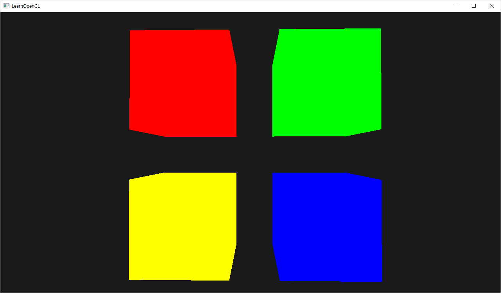
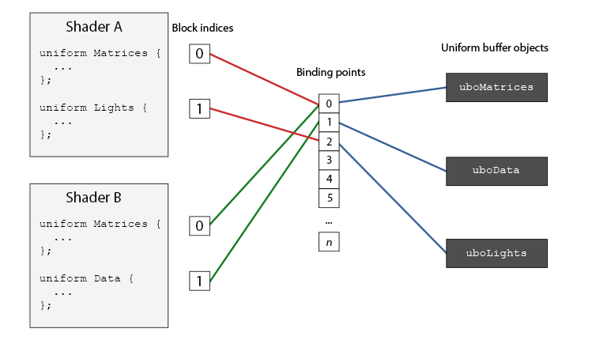

# Uniform Buffer Object

+ Uniform Buffer Object를 사용해보자.

## Result



## Uniform Buffer Object

+ 모든 연관된 uniform들을 buffer에 저장 할 수 있다.



## Function

`glGetUniformBlockIndex(Gluint program, cost Glchar *uniformBlockName)`

+ Shader의 Uniform이 위치한 Block Index를 반환하는 함수.

`glUniformBlockBinding(GLuint program, GLuint uniformBlockIndex, GLuint uniformBlockBinding)`

+ Binding Point에 Uniform Block을 연결하기 위한 함수.

`glBindBufferRange(GLenum target, GLuint index, GLuint buffer, GLintptr offset, GLsizeiptr size)`
+ 특정 버퍼를 Binding Point에 연결하기 위한 함수.

`glBufferSubData(GLenum target, GLintptr offset, GLsizeiptr size, const void *data)`

+ 버퍼에 정보를 저장하기 위한 함수.

## Vertex Shader

```cpp
#version 330 core
layout (location = 0) in vec3 aPos;

// std140 - 메모리를 할당하는 방법중의 하나.
layout (std140) uniform Matrices
{
    mat4 projection;
    mat4 view;
};
uniform mat4 model;

void main()
{
    gl_Position = projection * view * model * vec4(aPos, 1.0);
}  
```

## Script

```cpp
#include <glad/glad.h>
#include <GLFW/glfw3.h>
#include <stb_image.h>

#include <glm/glm.hpp>
#include <glm/gtc/matrix_transform.hpp>
#include <glm/gtc/type_ptr.hpp>

#include <learnopengl/filesystem.h>
#include <learnopengl/shader_m.h>
#include <learnopengl/camera.h>
#include <learnopengl/model.h>

#include <iostream>

void framebuffer_size_callback(GLFWwindow* window, int width, int height);
void mouse_callback(GLFWwindow* window, double xpos, double ypos);
void processInput(GLFWwindow *window);

// settings
const unsigned int SCR_WIDTH = 1280;
const unsigned int SCR_HEIGHT = 720;

// camera
Camera camera(glm::vec3(0.0f, 0.0f, 3.0f));
float lastX = (float)SCR_WIDTH / 2.0;
float lastY = (float)SCR_HEIGHT / 2.0;
bool firstMouse = true;

// timing
float deltaTime = 0.0f;
float lastFrame = 0.0f;

int main()
{
    // glfw: initialize and configure
    // ------------------------------
    glfwInit();
    glfwWindowHint(GLFW_CONTEXT_VERSION_MAJOR, 3);
    glfwWindowHint(GLFW_CONTEXT_VERSION_MINOR, 3);
    glfwWindowHint(GLFW_OPENGL_PROFILE, GLFW_OPENGL_CORE_PROFILE);

#ifdef __APPLE__
    glfwWindowHint(GLFW_OPENGL_FORWARD_COMPAT, GL_TRUE); // uncomment this statement to fix compilation on OS X
#endif

    // glfw window creation
    // --------------------
    GLFWwindow* window = glfwCreateWindow(SCR_WIDTH, SCR_HEIGHT, "LearnOpenGL", NULL, NULL);
    if (window == NULL)
    {
        std::cout << "Failed to create GLFW window" << std::endl;
        glfwTerminate();
        return -1;
    }
    glfwMakeContextCurrent(window);
    glfwSetFramebufferSizeCallback(window, framebuffer_size_callback);
    glfwSetCursorPosCallback(window, mouse_callback);

    // tell GLFW to capture our mouse
    glfwSetInputMode(window, GLFW_CURSOR, GLFW_CURSOR_DISABLED);

    // glad: load all OpenGL function pointers
    // ---------------------------------------
    if (!gladLoadGLLoader((GLADloadproc)glfwGetProcAddress))
    {
        std::cout << "Failed to initialize GLAD" << std::endl;
        return -1;
    }

    // configure global opengl state
    // -----------------------------
    glEnable(GL_DEPTH_TEST);

    // 동일한 Vertex Shader, 색이 다른  Fragment Shader를 적용한다.
    Shader shaderRed("8.advanced_glsl.vs", "8.red.fs");
    Shader shaderGreen("8.advanced_glsl.vs", "8.green.fs");
    Shader shaderBlue("8.advanced_glsl.vs", "8.blue.fs");
    Shader shaderYellow("8.advanced_glsl.vs", "8.yellow.fs");
    
    // set up vertex data (and buffer(s)) and configure vertex attributes
    // ------------------------------------------------------------------
    float cubeVertices[] = {
        // positions         
        -0.5f, -0.5f, -0.5f, 
         0.5f, -0.5f, -0.5f,  
         0.5f,  0.5f, -0.5f,  
         0.5f,  0.5f, -0.5f,  
        -0.5f,  0.5f, -0.5f, 
        -0.5f, -0.5f, -0.5f, 

        -0.5f, -0.5f,  0.5f, 
         0.5f, -0.5f,  0.5f,  
         0.5f,  0.5f,  0.5f,  
         0.5f,  0.5f,  0.5f,  
        -0.5f,  0.5f,  0.5f, 
        -0.5f, -0.5f,  0.5f, 

        -0.5f,  0.5f,  0.5f, 
        -0.5f,  0.5f, -0.5f, 
        -0.5f, -0.5f, -0.5f, 
        -0.5f, -0.5f, -0.5f, 
        -0.5f, -0.5f,  0.5f, 
        -0.5f,  0.5f,  0.5f, 

         0.5f,  0.5f,  0.5f,  
         0.5f,  0.5f, -0.5f,  
         0.5f, -0.5f, -0.5f,  
         0.5f, -0.5f, -0.5f,  
         0.5f, -0.5f,  0.5f,  
         0.5f,  0.5f,  0.5f,  

        -0.5f, -0.5f, -0.5f, 
         0.5f, -0.5f, -0.5f,  
         0.5f, -0.5f,  0.5f,  
         0.5f, -0.5f,  0.5f,  
        -0.5f, -0.5f,  0.5f, 
        -0.5f, -0.5f, -0.5f, 

        -0.5f,  0.5f, -0.5f, 
         0.5f,  0.5f, -0.5f,  
         0.5f,  0.5f,  0.5f,  
         0.5f,  0.5f,  0.5f,  
        -0.5f,  0.5f,  0.5f, 
        -0.5f,  0.5f, -0.5f, 
    };
    // cube VAO
    unsigned int cubeVAO, cubeVBO;
    glGenVertexArrays(1, &cubeVAO);
    glGenBuffers(1, &cubeVBO);
    glBindVertexArray(cubeVAO);
    glBindBuffer(GL_ARRAY_BUFFER, cubeVBO);
    glBufferData(GL_ARRAY_BUFFER, sizeof(cubeVertices), &cubeVertices, GL_STATIC_DRAW);
    glEnableVertexAttribArray(0);
    glVertexAttribPointer(0, 3, GL_FLOAT, GL_FALSE, 3 * sizeof(float), (void*)0);

    // Shader의 Matrices Block에 Index를 받아온다.
    unsigned int uniformBlockIndexRed = glGetUniformBlockIndex(shaderRed.ID, "Matrices");
    unsigned int uniformBlockIndexGreen = glGetUniformBlockIndex(shaderGreen.ID, "Matrices");
    unsigned int uniformBlockIndexBlue = glGetUniformBlockIndex(shaderBlue.ID, "Matrices");
    unsigned int uniformBlockIndexYellow = glGetUniformBlockIndex(shaderYellow.ID, "Matrices");
    
    // Shader의 Block Index를 0번 Binding Point에 연결한다.
    glUniformBlockBinding(shaderRed.ID, uniformBlockIndexRed, 0);
    glUniformBlockBinding(shaderGreen.ID, uniformBlockIndexGreen, 0);
    glUniformBlockBinding(shaderBlue.ID, uniformBlockIndexBlue, 0);
    glUniformBlockBinding(shaderYellow.ID, uniformBlockIndexYellow, 0);
    
    // Projcetion, View 행렬을 저장 할 버퍼를 할당한다.
    unsigned int uboMatrices;
    glGenBuffers(1, &uboMatrices);
    glBindBuffer(GL_UNIFORM_BUFFER, uboMatrices);
    glBufferData(GL_UNIFORM_BUFFER, 2 * sizeof(glm::mat4), NULL, GL_STATIC_DRAW);
    glBindBuffer(GL_UNIFORM_BUFFER, 0);

    // 만들어진 Buffer를 0번 Binding Point에 연결한다.
    glBindBufferRange(GL_UNIFORM_BUFFER, 0, uboMatrices, 0, 2 * sizeof(glm::mat4));

    // Projection 행렬을 UniformBuffer에 저장한다.
    glm::mat4 projection = glm::perspective(45.0f, (float)SCR_WIDTH / (float)SCR_HEIGHT, 0.1f, 100.0f);
    glBindBuffer(GL_UNIFORM_BUFFER, uboMatrices);
    glBufferSubData(GL_UNIFORM_BUFFER, 0, sizeof(glm::mat4), glm::value_ptr(projection));
    glBindBuffer(GL_UNIFORM_BUFFER, 0);
  
    // render loop
    // -----------
    while (!glfwWindowShouldClose(window))
    {
        // per-frame time logic
        // --------------------
        float currentFrame = glfwGetTime();
        deltaTime = currentFrame - lastFrame;
        lastFrame = currentFrame;

        // input
        // -----
        processInput(window);

        // render
        // ------
        glClearColor(0.1f, 0.1f, 0.1f, 1.0f);
        glClear(GL_COLOR_BUFFER_BIT | GL_DEPTH_BUFFER_BIT);

        // View 행렬을 UniformBuffer에 저장한다.
        glm::mat4 view = camera.GetViewMatrix();
        glBindBuffer(GL_UNIFORM_BUFFER, uboMatrices);
        glBufferSubData(GL_UNIFORM_BUFFER, sizeof(glm::mat4), sizeof(glm::mat4), glm::value_ptr(view));
        glBindBuffer(GL_UNIFORM_BUFFER, 0);

        // draw 4 cubes 
        // RED
        glBindVertexArray(cubeVAO);
        shaderRed.use();
        glm::mat4 model = glm::mat4(1.0f);
        model = glm::translate(model, glm::vec3(-0.75f, 0.75f, 0.0f)); // move top-left
        shaderRed.setMat4("model", model);
        glDrawArrays(GL_TRIANGLES, 0, 36);
        // GREEN
        shaderGreen.use();
        model = glm::mat4(1.0f);
        model = glm::translate(model, glm::vec3(0.75f, 0.75f, 0.0f)); // move top-right
        shaderGreen.setMat4("model", model);
        glDrawArrays(GL_TRIANGLES, 0, 36);
        // YELLOW
        shaderYellow.use();
        model = glm::mat4(1.0f);
        model = glm::translate(model, glm::vec3(-0.75f, -0.75f, 0.0f)); // move bottom-left
        shaderYellow.setMat4("model", model);
        glDrawArrays(GL_TRIANGLES, 0, 36);
        // BLUE
        shaderBlue.use();
        model = glm::mat4(1.0f);
        model = glm::translate(model, glm::vec3(0.75f, -0.75f, 0.0f)); // move bottom-right
        shaderBlue.setMat4("model", model);
        glDrawArrays(GL_TRIANGLES, 0, 36);

        // glfw: swap buffers and poll IO events (keys pressed/released, mouse moved etc.)
        // -------------------------------------------------------------------------------
        glfwSwapBuffers(window);
        glfwPollEvents();
    }

    // optional: de-allocate all resources once they've outlived their purpose:
    // ------------------------------------------------------------------------
    glDeleteVertexArrays(1, &cubeVAO);
    glDeleteBuffers(1, &cubeVBO);

    glfwTerminate();
    return 0;
}

// process all input: query GLFW whether relevant keys are pressed/released this frame and react accordingly
// ---------------------------------------------------------------------------------------------------------
void processInput(GLFWwindow *window)
{
    if (glfwGetKey(window, GLFW_KEY_ESCAPE) == GLFW_PRESS)
        glfwSetWindowShouldClose(window, true);

    if (glfwGetKey(window, GLFW_KEY_W) == GLFW_PRESS)
        camera.ProcessKeyboard(FORWARD, deltaTime);
    if (glfwGetKey(window, GLFW_KEY_S) == GLFW_PRESS)
        camera.ProcessKeyboard(BACKWARD, deltaTime);
    if (glfwGetKey(window, GLFW_KEY_A) == GLFW_PRESS)
        camera.ProcessKeyboard(LEFT, deltaTime);
    if (glfwGetKey(window, GLFW_KEY_D) == GLFW_PRESS)
        camera.ProcessKeyboard(RIGHT, deltaTime);
}

// glfw: whenever the window size changed (by OS or user resize) this callback function executes
// ---------------------------------------------------------------------------------------------
void framebuffer_size_callback(GLFWwindow* window, int width, int height)
{
    // make sure the viewport matches the new window dimensions; note that width and 
    // height will be significantly larger than specified on retina displays.
    glViewport(0, 0, width, height);
}

// glfw: whenever the mouse moves, this callback is called
// -------------------------------------------------------
void mouse_callback(GLFWwindow* window, double xpos, double ypos)
{
    if (firstMouse)
    {
        lastX = xpos;
        lastY = ypos;
        firstMouse = false;
    }

    float xoffset = xpos - lastX;
    float yoffset = lastY - ypos; // reversed since y-coordinates go from bottom to top

    lastX = xpos;
    lastY = ypos;

    camera.ProcessMouseMovement(xoffset, yoffset);
}

```

## Q&A

+ Uniform Variable는 같은 쉐이더를 사용하는 객체들에 동일하게 적용되므로 사용 할 경우 그려줄때마다 setMat4("","")을 이용해서 매번 설정해줘야 한다. 
+ Uniform Buffer Object를 사용 할 경우 동일한 UniformBlock을 갖는 Shader들이 미리 Buffer에 설정해놓은 값을 공용으로 사용 하여 매번 설정해줄 필요가 없다.
+ Attribute는 쉐이더를 사용하는 객체마다 버퍼에 새로 설정한다.
+ 
+ Uniform Buffer Object
+ 1. Vertex, Fragmet 쉐이더에서 접근 가능.
+ 2. 버퍼에 저장된 Uniform 값을 공유하고자 할때 사용.
+ Uniform Variable는 Vertex, Fragment 쉐이더에서 접근이 필요할때 사용.
+ Attribute는 Vertext 쉐이더에서만 접근이 필요할때 사용.