# Godot

+ godot의 사용법을 익혀보자.

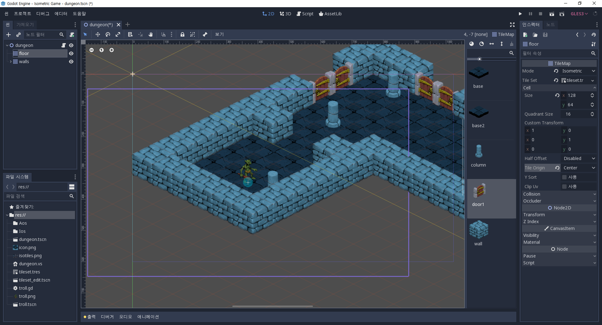

## Scene

+ 새로 씬을 만들게되면 2D, 3D 와 같은 기본루트 노드를 만들어야한다.

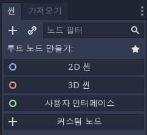

`2D 씬`
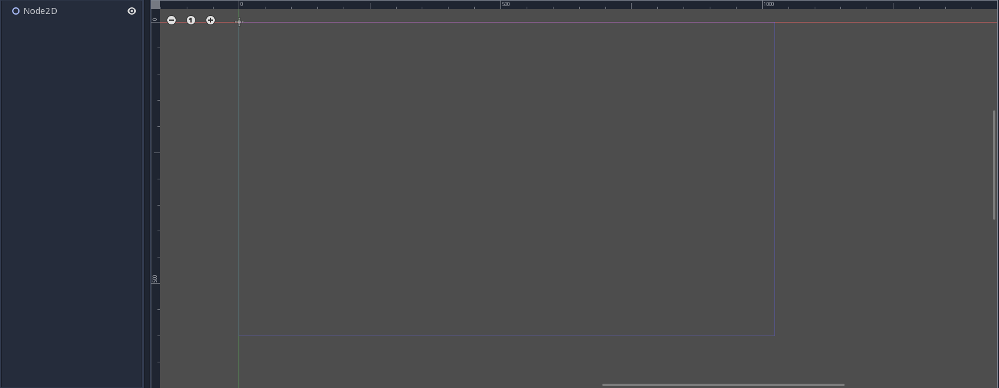

`3D 씬`
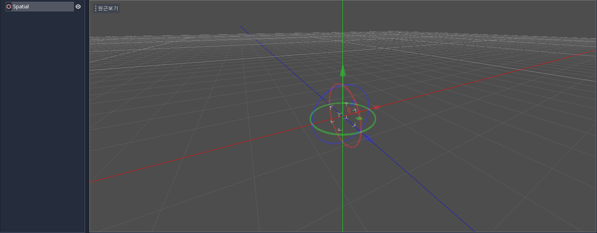

## Node

+ 부모 또는 자식으로 필요한 Node를 만들어 사용할 수 있다.

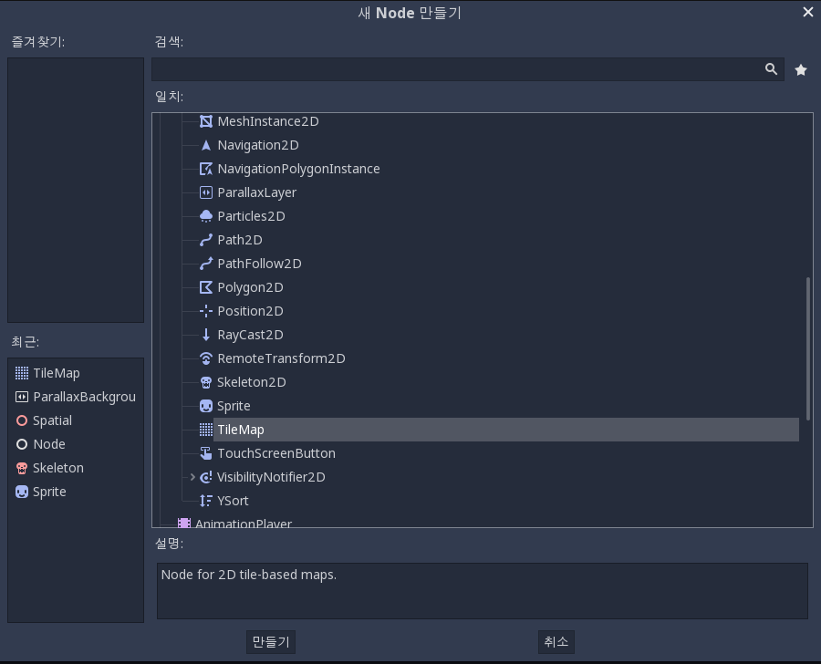

`TileMap 사용`
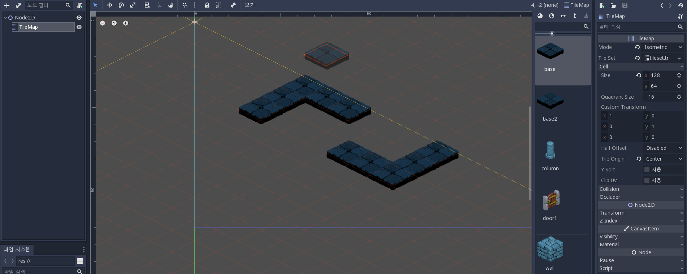

## Build

`프로젝트 > 내보내기 > 프리셋 설정`

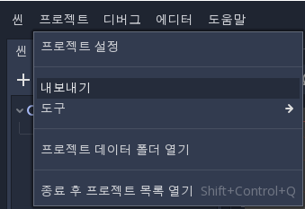

### Windows

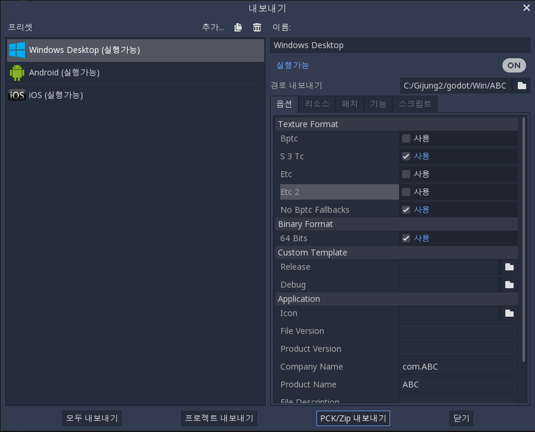

### Andorid

+ `경로 : 에디터 > 에디터 설정 > Export > Android`
+ 안드로이드 빌드를 하기위해서는 `Adb, Jarsigner, Debug Keystore를 설정`해줘야 한다.

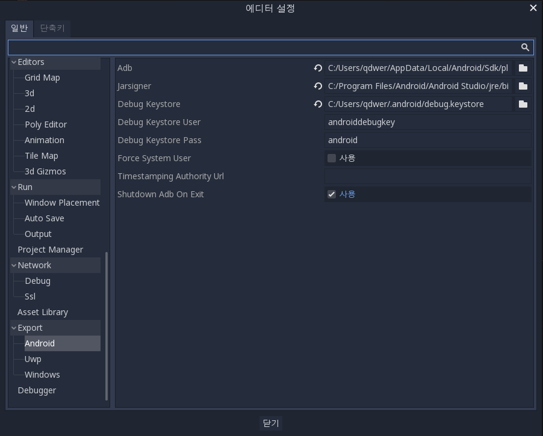

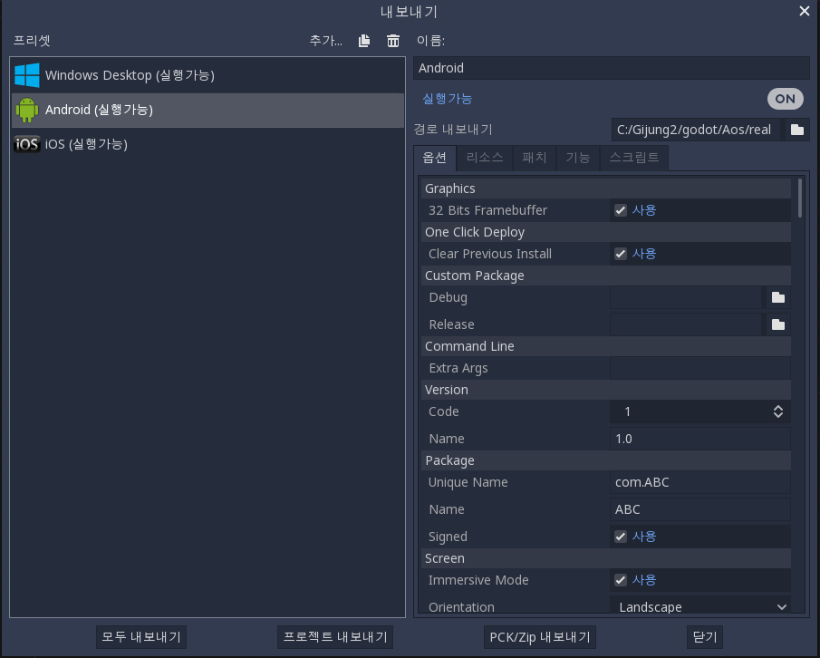

`프로젝트 내보내기`
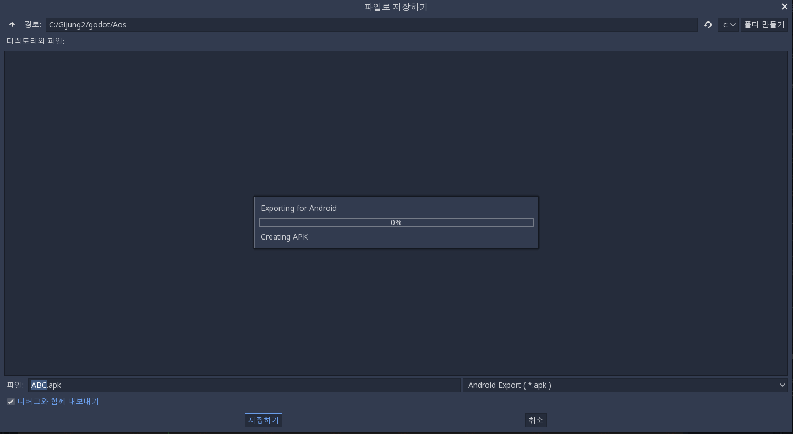

`추출된 .apk`
