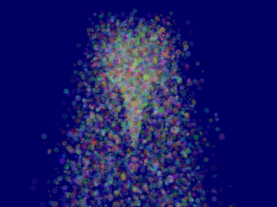

# Particle

+ 파티클을 출력해보자.

## Result



## Vertex Shader

```cpp
#version 330 core

layout(location = 0) in vec3 squareVertices;
layout(location = 1) in vec4 xyzs;
layout(location = 2) in vec4 color;

out vec2 UV;
out vec4 particlecolor;

uniform vec3 CameraRight_worldspace;
uniform vec3 CameraUp_worldspace;
uniform mat4 VP;    // View-Projection matrix

void main()
{
	float particleSize = xyzs.w;
	vec3 particleCenter_wordspace = xyzs.xyz;
	
	vec3 vertexPosition_worldspace = particleCenter_wordspace
		+ CameraRight_worldspace * squareVertices.x * particleSize
		+ CameraUp_worldspace * squareVertices.y * particleSize;

	gl_Position = VP * vec4(vertexPosition_worldspace, 1.0f);

	UV = squareVertices.xy + vec2(0.5, 0.5);
	particlecolor = color;
}
```

## Fragment Shader

```cpp
#version 330 core

in vec2 UV;
in vec4 particlecolor;

out vec4 color;

uniform sampler2D myTextureSampler;

void main(){
	color = texture( myTextureSampler, UV ) * particlecolor;
}
```

## Script

```cpp
#include <stdio.h>
#include <stdlib.h>

#include <vector>
#include <algorithm>

#include <GL/glew.h>

#include <glfw3.h>
GLFWwindow* window;

#include <glm/glm.hpp>
#include <glm/gtc/matrix_transform.hpp>
#include <glm/gtx/norm.hpp>
using namespace glm;


#include <common/shader.hpp>
#include <common/texture.hpp>
#include <common/controls.hpp>

// 파티클 구조체
struct Particle{
	glm::vec3 pos, speed;
	unsigned char r,g,b,a; // Color
	float size, angle, weight;
	float life; // Remaining life of the particle. if <0 : dead and unused.
	float cameradistance; // *Squared* distance to the camera. if dead : -1.0f

	bool operator<(const Particle& that) const {
		// Sort in reverse order : far particles drawn first.
		return this->cameradistance > that.cameradistance;
	}
};

const int MaxParticles = 100000;                // 파티클 최대 개수
Particle ParticlesContainer[MaxParticles];      // 파티클 배열
int LastUsedParticle = 0;                       // 마지막으로 사용한 파티클 인덱스

// 아직 사용되지 않은 파티클을 찾는 함수
int FindUnusedParticle(){
	for(int i=LastUsedParticle; i<MaxParticles; i++){
		if (ParticlesContainer[i].life < 0){
			LastUsedParticle = i;
			return i;
		}
	}

	for(int i=0; i<LastUsedParticle; i++){
		if (ParticlesContainer[i].life < 0){
			LastUsedParticle = i;
			return i;
		}
	}

	return 0; // All particles are taken, override the first one
}

// 파티클 정렬 함수
void SortParticles(){
	std::sort(&ParticlesContainer[0], &ParticlesContainer[MaxParticles]);
}

int main( void )
{
	// Initialise GLFW
	if( !glfwInit() )
	{
		fprintf( stderr, "Failed to initialize GLFW\n" );
		getchar();
		return -1;
	}

	glfwWindowHint(GLFW_SAMPLES, 4);
	glfwWindowHint(GLFW_RESIZABLE,GL_FALSE);
	glfwWindowHint(GLFW_CONTEXT_VERSION_MAJOR, 3);
	glfwWindowHint(GLFW_CONTEXT_VERSION_MINOR, 3);
	glfwWindowHint(GLFW_OPENGL_FORWARD_COMPAT, GL_TRUE); // To make MacOS happy; should not be needed
	glfwWindowHint(GLFW_OPENGL_PROFILE, GLFW_OPENGL_CORE_PROFILE);

	// Open a window and create its OpenGL context
	window = glfwCreateWindow( 1024, 768, "Tutorial 18 - Particules", NULL, NULL);
	if( window == NULL ){
		fprintf( stderr, "Failed to open GLFW window. If you have an Intel GPU, they are not 3.3 compatible. Try the 2.1 version of the tutorials.\n" );
		getchar();
		glfwTerminate();
		return -1;
	}
	glfwMakeContextCurrent(window);

	// Initialize GLEW
	glewExperimental = true; // Needed for core profile
	if (glewInit() != GLEW_OK) {
		fprintf(stderr, "Failed to initialize GLEW\n");
		getchar();
		glfwTerminate();
		return -1;
	}

	// Ensure we can capture the escape key being pressed below
	glfwSetInputMode(window, GLFW_STICKY_KEYS, GL_TRUE);
    // Hide the mouse and enable unlimited mouvement
    glfwSetInputMode(window, GLFW_CURSOR, GLFW_CURSOR_DISABLED);
    
    // Set the mouse at the center of the screen
    glfwPollEvents();
    glfwSetCursorPos(window, 1024/2, 768/2);

	// Dark blue background
	glClearColor(0.0f, 0.0f, 0.4f, 0.0f);

	// Enable depth test
	glEnable(GL_DEPTH_TEST);
	// Accept fragment if it closer to the camera than the former one
	glDepthFunc(GL_LESS);

	GLuint VertexArrayID;
	glGenVertexArrays(1, &VertexArrayID);
	glBindVertexArray(VertexArrayID);

	// Create and compile our GLSL program from the shaders
	GLuint programID = LoadShaders( "Particle.vertexshader", "Particle.fragmentshader" );

	// Vertex shader
	GLuint CameraRight_worldspace_ID  = glGetUniformLocation(programID, "CameraRight_worldspace");
	GLuint CameraUp_worldspace_ID  = glGetUniformLocation(programID, "CameraUp_worldspace");
	GLuint ViewProjMatrixID = glGetUniformLocation(programID, "VP");

	// fragment shader
	GLuint TextureID  = glGetUniformLocation(programID, "myTextureSampler");

    // 배열 초기화
	static GLfloat* g_particule_position_size_data = new GLfloat[MaxParticles * 4];
	static GLubyte* g_particule_color_data         = new GLubyte[MaxParticles * 4];
	for(int i=0; i<MaxParticles; i++){
		ParticlesContainer[i].life = -1.0f;
		ParticlesContainer[i].cameradistance = -1.0f;
	}

	GLuint Texture = loadDDS("particle.DDS");

	// The VBO containing the 4 vertices of the particles.
	// Thanks to instancing, they will be shared by all particles.
	static const GLfloat g_vertex_buffer_data[] = { 
		 -0.5f, -0.5f, 0.0f,
		  0.5f, -0.5f, 0.0f,
		 -0.5f,  0.5f, 0.0f,
		  0.5f,  0.5f, 0.0f,
	};

    // 버퍼 초기화
	GLuint billboard_vertex_buffer;
	glGenBuffers(1, &billboard_vertex_buffer);
	glBindBuffer(GL_ARRAY_BUFFER, billboard_vertex_buffer);
	glBufferData(GL_ARRAY_BUFFER, sizeof(g_vertex_buffer_data), g_vertex_buffer_data, GL_STATIC_DRAW);

	// The VBO containing the positions and sizes of the particles
	GLuint particles_position_buffer;
	glGenBuffers(1, &particles_position_buffer);
	glBindBuffer(GL_ARRAY_BUFFER, particles_position_buffer);
	glBufferData(GL_ARRAY_BUFFER, MaxParticles * 4 * sizeof(GLfloat), NULL, GL_STREAM_DRAW);

	// The VBO containing the colors of the particles
	GLuint particles_color_buffer;
	glGenBuffers(1, &particles_color_buffer);
	glBindBuffer(GL_ARRAY_BUFFER, particles_color_buffer);
	glBufferData(GL_ARRAY_BUFFER, MaxParticles * 4 * sizeof(GLubyte), NULL, GL_STREAM_DRAW);

	double lastTime = glfwGetTime();
	do
	{
		// Clear the screen
		glClear(GL_COLOR_BUFFER_BIT | GL_DEPTH_BUFFER_BIT);

		double currentTime = glfwGetTime();
		double delta = currentTime - lastTime;
		lastTime = currentTime;

		computeMatricesFromInputs();
		glm::mat4 ProjectionMatrix = getProjectionMatrix();
		glm::mat4 ViewMatrix = getViewMatrix();

		glm::vec3 CameraPosition(glm::inverse(ViewMatrix)[3]);

		glm::mat4 ViewProjectionMatrix = ProjectionMatrix * ViewMatrix;

        // 파티클 초기화
		// Generate 10 new particule each millisecond,
		// but limit this to 16 ms (60 fps), or if you have 1 long frame (1sec),
		// newparticles will be huge and the next frame even longer.
		int newparticles = (int)(delta*10000.0);
		if (newparticles > (int)(0.016f*10000.0))
			newparticles = (int)(0.016f*10000.0);
		
		for(int i=0; i<newparticles; i++){
			int particleIndex = FindUnusedParticle();
			ParticlesContainer[particleIndex].life = 5.0f; // 생존 주기

            // 위치
			ParticlesContainer[particleIndex].pos = glm::vec3(0,0,-20.0f);

            // 퍼지는 방향
			float spread = 1.5f;
			glm::vec3 maindir = glm::vec3(0.0f, 10.0f, 0.0f);
			glm::vec3 randomdir = glm::vec3(
				(rand()%2000 - 1000.0f)/1000.0f,
				(rand()%2000 - 1000.0f)/1000.0f,
				(rand()%2000 - 1000.0f)/1000.0f
			);
			ParticlesContainer[particleIndex].speed = maindir + randomdir*spread;

			// 색상
			ParticlesContainer[particleIndex].r = rand() % 256;
			ParticlesContainer[particleIndex].g = rand() % 256;
			ParticlesContainer[particleIndex].b = rand() % 256;
			ParticlesContainer[particleIndex].a = (rand() % 256) / 3;

            // 크기
			ParticlesContainer[particleIndex].size = (rand()%1000)/2000.0f + 0.1f;
		}

		// Simulate all particles
		int ParticlesCount = 0;
		for(int i=0; i<MaxParticles; i++){
			Particle& p = ParticlesContainer[i]; // shortcut

			if(p.life > 0.0f){
				// Decrease life
				p.life -= delta;
				if (p.life > 0.0f){
					// Simulate simple physics : gravity only, no collisions
					p.speed += glm::vec3(0.0f,-9.81f, 0.0f) * (float)delta * 0.5f;
					p.pos += p.speed * (float)delta;
					p.cameradistance = glm::length2( p.pos - CameraPosition );

					// Fill the GPU buffer
					g_particule_position_size_data[4*ParticlesCount+0] = p.pos.x;
					g_particule_position_size_data[4*ParticlesCount+1] = p.pos.y;
					g_particule_position_size_data[4*ParticlesCount+2] = p.pos.z;
					g_particule_position_size_data[4*ParticlesCount+3] = p.size;
												   
					g_particule_color_data[4*ParticlesCount+0] = p.r;
					g_particule_color_data[4*ParticlesCount+1] = p.g;
					g_particule_color_data[4*ParticlesCount+2] = p.b;
					g_particule_color_data[4*ParticlesCount+3] = p.a;

				}else{
                    // 정렬시 작은 값은 마지막 위치로 설정한다.
					p.cameradistance = -1.0f;
				}

				ParticlesCount++;

			}
		}

		SortParticles();

		glBindBuffer(GL_ARRAY_BUFFER, particles_position_buffer);
		glBufferData(GL_ARRAY_BUFFER, MaxParticles * 4 * sizeof(GLfloat), NULL, GL_STREAM_DRAW); // Buffer orphaning, a common way to improve streaming perf. See above link for details.
		glBufferSubData(GL_ARRAY_BUFFER, 0, ParticlesCount * sizeof(GLfloat) * 4, g_particule_position_size_data);

		glBindBuffer(GL_ARRAY_BUFFER, particles_color_buffer);
		glBufferData(GL_ARRAY_BUFFER, MaxParticles * 4 * sizeof(GLubyte), NULL, GL_STREAM_DRAW); // Buffer orphaning, a common way to improve streaming perf. See above link for details.
		glBufferSubData(GL_ARRAY_BUFFER, 0, ParticlesCount * sizeof(GLubyte) * 4, g_particule_color_data);

		glEnable(GL_BLEND);
		glBlendFunc(GL_SRC_ALPHA, GL_ONE_MINUS_SRC_ALPHA);

		// Use our shader
		glUseProgram(programID);

		// Bind our texture in Texture Unit 0
		glActiveTexture(GL_TEXTURE0);
		glBindTexture(GL_TEXTURE_2D, Texture);
		// Set our "myTextureSampler" sampler to user Texture Unit 0
		glUniform1i(TextureID, 0);

		// Same as the billboards tutorial
		glUniform3f(CameraRight_worldspace_ID, ViewMatrix[0][0], ViewMatrix[1][0], ViewMatrix[2][0]);
		glUniform3f(CameraUp_worldspace_ID, ViewMatrix[0][1], ViewMatrix[1][1], ViewMatrix[2][1]);

		glUniformMatrix4fv(ViewProjMatrixID, 1, GL_FALSE, &ViewProjectionMatrix[0][0]);

		// 1rst attribute buffer : vertices
		glEnableVertexAttribArray(0);
		glBindBuffer(GL_ARRAY_BUFFER, billboard_vertex_buffer);
		glVertexAttribPointer(0, 3, GL_FLOAT, GL_FALSE, 0, (void*)0);
		
		// 2nd attribute buffer : positions of particles' centers
		glEnableVertexAttribArray(1);
		glBindBuffer(GL_ARRAY_BUFFER, particles_position_buffer);
		glVertexAttribPointer(1, 4, GL_FLOAT, GL_FALSE, 0, (void*)0);

		// 3rd attribute buffer : particles' colors
		glEnableVertexAttribArray(2);
		glBindBuffer(GL_ARRAY_BUFFER, particles_color_buffer);
		glVertexAttribPointer(2, 4, GL_UNSIGNED_BYTE, GL_TRUE, 0, (void*)0);

		// Attribute 재설정
		glVertexAttribDivisor(0, 0); // particles vertices : always reuse the same 4 vertices -> 0
		glVertexAttribDivisor(1, 1); // positions : one per quad (its center)                 -> 1
		glVertexAttribDivisor(2, 1); // color : one per quad                                  -> 1

		// Draw the particules !
		// This draws many times a small triangle_strip (which looks like a quad).
		// This is equivalent to :
		// for(i in ParticlesCount) : glDrawArrays(GL_TRIANGLE_STRIP, 0, 4), 
		// but faster.
		glDrawArraysInstanced(GL_TRIANGLE_STRIP, 0, 4, ParticlesCount);

		glDisableVertexAttribArray(0);
		glDisableVertexAttribArray(1);
		glDisableVertexAttribArray(2);

		// Swap buffers
		glfwSwapBuffers(window);
		glfwPollEvents();

	} // Check if the ESC key was pressed or the window was closed
	while( glfwGetKey(window, GLFW_KEY_ESCAPE ) != GLFW_PRESS &&
		   glfwWindowShouldClose(window) == 0 );


	delete[] g_particule_position_size_data;

	// Cleanup VBO and shader
	glDeleteBuffers(1, &particles_color_buffer);
	glDeleteBuffers(1, &particles_position_buffer);
	glDeleteBuffers(1, &billboard_vertex_buffer);
	glDeleteProgram(programID);
	glDeleteTextures(1, &TextureID);
	glDeleteVertexArrays(1, &VertexArrayID);
	

	// Close OpenGL window and terminate GLFW
	glfwTerminate();

	return 0;
}
```